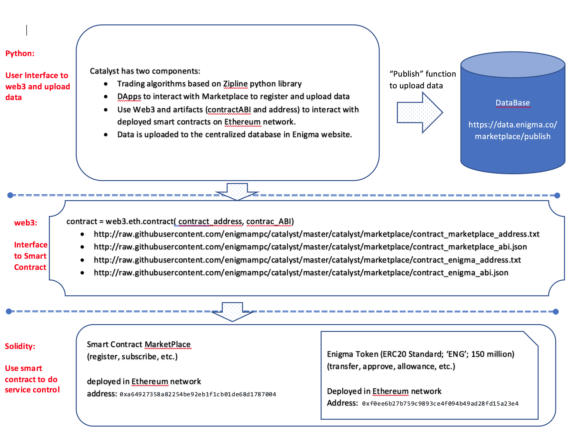
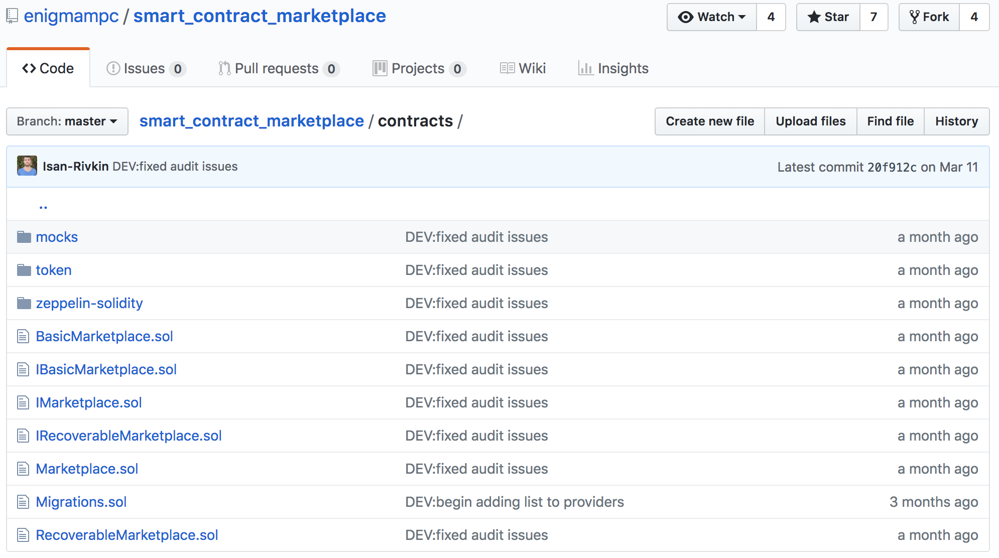
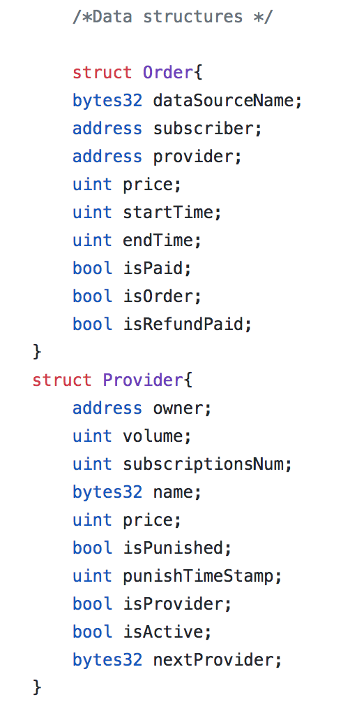

# Study of Smart Contract Marketplace


```
name: investigate the smart contract marketplace by Enigma 
type: research
status: initial draft
editor: Fang Gong <fang@oceanprotocol.com>
date: 04/15/2018
```

## 1. Objective
Data marketplace is the core functionality of Ocean Protocol, where data providers and consumers can interact with each other without authority. 

Enigma implementes a data marketplace [1][2] using smart contract and built a Catalyst application [3][4] on top of it. It is worthwhile to investigate their work and explore the capability of the developed marketplace.

## 2. Architecutre

First, Enigma build a marketplace using Solidity smart contracts, where users can register and subscribe the dataset. It has been deployed in Ethereum network with contract address. The marketplace does not hold data by itself. 

Second, Catalyst implements a trading algorithms using Python and makes use of `Zipline`[5] which is a Pythonic algorithmic trading library. It uses web3 library to interact with the smart contracts. 

At this time, Catalyst uploads the CSV data files to their website (centralized databse) at [https://data.enigma.co/marketplace/publish](https://data.enigma.co/marketplace/publish)[6]. In theory, Catalyst shall supports IPFS and other storage approaches.

The overall architecture can be illustrated using following figure:



## 3. Modules

### 3.1 Marketplace

The marketplace contracts are implemented in [here](https://github.com/enigmampc/smart_contract_marketplace/tree/master/contracts). It use interface contracts to define basic interface functions which are implemented in the marketplace contracts. The structure looks like:



The interface contracts start with "I" in the filename. 

It has two categories of contracts:

* **Token**: [solidity file](https://github.com/enigmampc/smart_contract_marketplace/blob/master/contracts/token/EnigmaToken.sol)

It inherits the ERC20 Standard token contract to implement *ENG* tokens used in Enigma Marketplace.

```
  string public constant name = 'Enigma';  // Set the token name for display
  string public constant symbol = 'ENG'; // Set the token symbol for display
  uint8 public constant decimals = 8; // Set the number of decimals for display
  uint256 public constant INITIAL_SUPPLY = 150000000 * 10**8;  // 150 million ENG specified in Grains

```

* **Marketplace**: [solidity file](https://github.com/enigmampc/smart_contract_marketplace/blob/master/contracts/Marketplace.sol)

The marketplace contract details can be found in `Marketplace.sol`, which implementes the functions as `register`, `subscribe`, `safeToMarketPlaceTransfer` and etc.

It maintains two key data structures: `Provider` and `Order`



```
	// all providers
    mapping(bytes32=>Provider) public mProviders;
    // provider name = > all orders 
    mapping(bytes32=>Order[]) public mOrders;
```

### 3.2 Catalyst 

Catalyst is implemented using Python. It uses web3 and contract ABI+address to interact with Marketplace deployed on Ethereum network:

* **Constant Information**: [python source file](https://github.com/enigmampc/catalyst/blob/master/catalyst/constants.py)

The Marketplace smart contracts had been deployed to Ethereum network. It includes contract address and ABI information into Catalys as follows. The same information has been stored in local for backup at [here](https://github.com/enigmampc/catalyst/tree/master/catalyst/marketplace)

```python
MARKETPLACE_CONTRACT = 'https://raw.githubusercontent.com/enigmampc/' \
                       'catalyst/master/catalyst/marketplace/' \
                       'contract_marketplace_address.txt'

MARKETPLACE_CONTRACT_ABI = 'https://raw.githubusercontent.com/enigmampc/' \
                           'catalyst/master/catalyst/marketplace/' \
                           'contract_marketplace_abi.json'

ENIGMA_CONTRACT = 'https://raw.githubusercontent.com/enigmampc/' \
                  'catalyst/master/catalyst/marketplace/' \
                  'contract_enigma_address.txt'

ENIGMA_CONTRACT_ABI = 'https://raw.githubusercontent.com/enigmampc/' \
                      'catalyst/master/catalyst/marketplace/' \
                      'contract_enigma_abi.json'
```

* **Trading library**: the trading algorithms are centralized applications which retrieve real-time crypto-market data stream and compute indicators for trading. This module is based on Zipline[5]. This module is out of the scope of our investigation. 

* **Maretplace**: [python source file](https://github.com/enigmampc/catalyst/blob/master/catalyst/constants.py) it uses web3 to interact with smart contract for registering and subscribing the services. 

```python
# use infura.io to access Ethereum network
ETH_REMOTE_NODE = 'https://mainnet.infura.io'
self.web3 = Web3(HTTPProvider(ETH_REMOTE_NODE))
...
# Enigma Token contract instance
abi_url = urllib.urlopen(ENIGMA_CONTRACT_ABI)
abi = json.loads(abi_url)
self.eng_contract = self.web3.eth.contract(
            self.eng_contract_address,
            abi=abi,
        )
...
# Marketplace contract instance 
abi_url = urllib.urlopen(MARKETPLACE_CONTRACT_ABI)  
abi = json.loads(abi_url)  
self.mkt_contract = self.web3.eth.contract(
            self.mkt_contract_address,
            abi=abi,
        )
```

Then python program can call the functions in Marketplace smart contracts:

```python
# retrieve the provider information from smart contracts
provider_info = self.mkt_contract.functions.getDataProviderInfo
...
# obtain the list of all data providers
data_sources = self.mkt_contract.functions.getAllProviders().call()
...
# check the subscription of specific provider address
subscribed = self.mkt_contract.functions.checkAddressSubscription
...
# consumer subscribe the service of data provider
tx = self.mkt_contract.functions.subscribe
...
# data provider register account in Marketplace
tx = self.mkt_contract.functions.register
...

```

* **Data Storage**: In current implementation Enigma did not use IPFS or other storage solutions. The Marketplace accepts CSV files and uploads data to their website database [6] as following:

```python
def publish(self, dataset, datadir, watch):
	...
	# search for csv files under given path
	filenames = glob.glob(os.path.join(datadir, '*.csv'))
	files = []
    for idx, file in enumerate(filenames):
        # combine all csv files into one file
        files.append(('file', open(file, 'rb')))
        
		# upload data file using requests interface 
		# AUTH_SERVER = 'https://data.enigma.co'
        headers = get_signed_headers(dataset, key, secret)
        r = requests.post('{}/marketplace/publish'.format(AUTH_SERVER),
                          files=files,
                          headers=headers)
```


## Conclusion

The first version of Enigma's Marketplace has been deployed on Ethereum network, which has basic transaction functions in marketplace. Catalyst is a Pythonic application that interacts with the deployed smart contracts using Web3 interface.

Enigma's Marketplace can be integrated into Ocean Protocol project which need to modify the schema of the data set. In addition, it is highly possible to develop our own Marketplace using Smart Contracts simialr to Enigma's work.


## Reference

* [1] [Enigma Marketplace Github](https://github.com/enigmampc/smart_contract_marketplace)
* [2] [Marketplace Document](https://enigma.co/marketplace/index.html)
* [3] [Enigma Catalyst Github](https://github.com/enigmampc/catalyst/)
* [4] [Catalyst Document](https://enigma.co/catalyst/index.html)
* [5] [Zipline](http://www.zipline.io/index.html)
* [6] [Catalyst Data Storage](https://data.enigma.co/marketplace/publish)