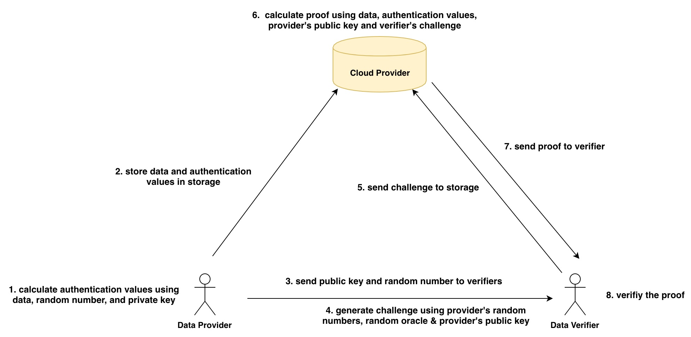
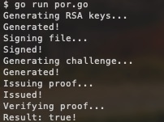

[](https://oceanprotocol.com)

# Proof of Data Retrievability (PoR)
```
name: proof of data retrievability
type: research
status: updated draft
editor: Fang Gong <fang@oceanprotocol.com>
date: 05/01/2019
```

## 1. Introduction

The solution to a key question remains unclear to us: how to verify data retrievability? That means the storage provider must provide the continued availability of user's data and be able to prove to a verifier that the data is stored and available for access. 

The essential challenge is to build an efficient, provably secure, and publicly verifiable Poof-of-Retrievability scheme, which implies:

* **efficient**: both computational cost, storage overhead and communication complexity should be as small as possible;
* **unbounded**: verifiers should be able to request the proof from the storage provider as many times as needed. A priori bound on the number of verifications should not exist;
* **stateless**: verifiers do not need to maintain and update state between verifications. Each verification result should be independently verified. 

PoR is a hot research topic in the academia for the past 10+ years and there are tons of academic papers discussing about it. A simple google search can find quite a few of them. However, there is no widely-adopted solution exist.

In this research, we investigate some research work and explore the possibility of integrating it into Ocean. 


## 2. Compact Proof of Data Retrievability


This approach is presented in "Compact Proofs of Retrievability", Hovav Shacham, Brent Waters, *Journal of Cryptology* (July 2013), Volume 26, Issue 3, pp 442–483. The paper can be found in [paper.pdf](./paper.pdf)

### 2.1 Workflow

PoR can be publicly verified as shown in the below. Theory explanation can be found in the **Section 1.1** of the [research paper](./paper.pdf).  

* **Provider**: 
	* provider has own RSA key pair in the local;
	* calculates the "authentication values" using data, random number and private key;
	* upload data along with authentication values to the storage;
	* publish his public key and random number to all verifiers;
* **Verifier**:
	* generate the challenge using provider's random numbers, own random number and provider's public key;
	* send challenge to storage provider;
	* receive the proof from storage and verify the PoR. 
* **Storage**:
	* store the data and authentication values (which is storage overhead);
	* receive challenge from the verifier;
	* calculate proof using data, authentication values and provider's public key;
	* return the proof to the verifier;



### 2.2 Operation Structure

The main function to execute the verification workflow looks like below:

```go
func main() {
	// 1. provider creates RSA keys
	fmt.Printf("Generating RSA keys...\n")
	spk, ssk := Keygen()
	fmt.Printf("Generated!\n")

	// 2. provider signs data and calculates authentication values
	fmt.Printf("Signing file...\n")
	file, err := os.Open("./data.txt")
	if err != nil {
		panic(err)
	}
	tau, authenticators := St(ssk, file)
	fmt.Printf("Signed!\n")

	// 3. verifier generates the challenge
	fmt.Printf("Generating challenge...\n")
	q := Verify_one(tau, spk)
	fmt.Printf("Generated!\n")

	// 4. storage provider calculates a proof corresponding to the challenge
	fmt.Printf("Issuing proof...\n")
	mu, sigma := Prove(q, authenticators, spk, file)
	fmt.Printf("Issued!\n")

	// 5. verifier checks the proof to verify PoR
	fmt.Printf("Verifying proof...\n")
	yes := Verify_two(tau, q, mu, sigma, spk)
	fmt.Printf("Result: %t!\n", yes)
	if yes {
		os.Exit(0)
	} else {
		os.Exit(1)
	}
}
```

### 2.3 Experiment

The code can be found in [por github](https://github.com/CapacitorSet/por), whcih can be successfully tested with dataset file:




## 3. Dynamic Proofs of Retrievability from Chameleon-Hashes


## 4. Integration with Ocean


## 5. Reference

* [1] "[Compact Proofs of Retrievability](./paper.pdf)", Hovav Shacham, Brent Waters, July 2013, Volume 26, Issue 3, pp 442–483.
* [2] An implementation of publicly verifiable proofs of retrievability: [github](https://github.com/CapacitorSet/por)
* [3] Proof of data possession in Lambda project: [github](https://github.com/LambdaIM/proofDP)
* [4] S. Rass, "Dynamic proofs of retrievability from Chameleon-Hashes," 2013 International Conference on Security and Cryptography (SECRYPT), Reykjavik, Iceland, 2013, pp. 1-9. 
* [5] an implementation of  "Dynamic proofs of retrievability from Chameleon-Hashes": [Github](https://github.com/tgrafena/proof_of_retrievability)

## 6. License

```
Copyright 2018 Ocean Protocol Foundation

Licensed under the Apache License, Version 2.0 (the "License");
you may not use this file except in compliance with the License.
You may obtain a copy of the License at

   http://www.apache.org/licenses/LICENSE-2.0

Unless required by applicable law or agreed to in writing, software
distributed under the License is distributed on an "AS IS" BASIS,
WITHOUT WARRANTIES OR CONDITIONS OF ANY KIND, either express or implied.
See the License for the specific language governing permissions and
limitations under the License.
```

