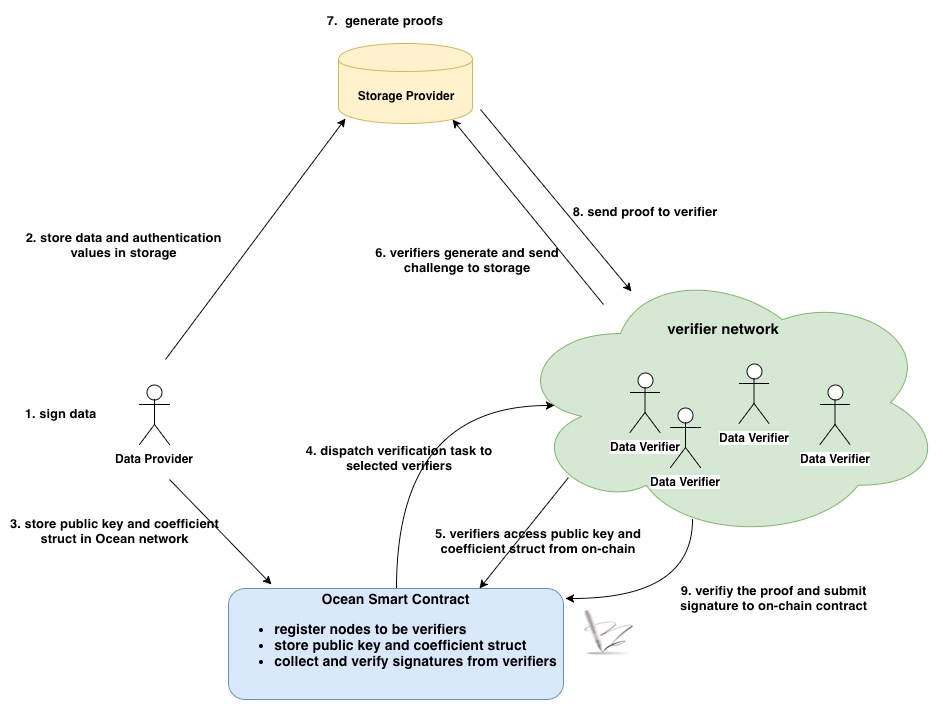

[](https://oceanprotocol.com)

# Proof of Data Retrievability (PoR)
```
name: proof of data retrievability
type: research
status: updated draft
editor: Fang Gong <fang@oceanprotocol.com>
date: 05/06/2019
```

## 1. Introduction

The solution to a key question remains unclear to us: how to verify data retrievability? That means the storage provider must provide the continued availability of user's data and be able to prove to a verifier that the data is stored and available for access. 

The essential challenge is to build an efficient, provably secure, and publicly verifiable Poof-of-Retrievability scheme, which implies [1]:

* **efficient**: both computational cost, storage overhead and communication complexity should be as small as possible;
* **unbounded**: verifiers should be able to request the proof from the storage provider as many times as needed. A priori bound on the number of verifications should not exist;
* **stateless**: verifiers do not need to maintain and update state between verifications. Each verification result should be independently verified. 

PoR is a hot research topic in the academia for the past 10+ years and there are tons of academic papers discussing about it. A simple google search can find quite a few of them. However, there is no widely-adopted solution exist.

In this research, we investigate some research work and explore the possibility of integrating it into Ocean. 

## 2. Compact Proof of Data Retrievability

This approach is presented in "Compact Proofs of Retrievability", Hovav Shacham, Brent Waters, *Journal of Cryptology* (July 2013), Volume 26, Issue 3, pp 442–483. The paper can be found in [paper.pdf](./paper.pdf)

### 2.1 Workflow

PoR can be publicly verified as shown in the below. Theory explanation can be found in the **Section 1.1** of the [research paper](./paper.pdf).  

* **Provider**: 
	* provider has own RSA key pair in the local;
	* calculates the "authentication values" using data, random number and private key;
	* upload data along with authentication values to the storage;
	* publish his public key and random number to all verifiers;
* **Verifier**:
	* generate the challenge using provider's random numbers, own random number and provider's public key;
	* send challenge to storage provider;
	* receive the proof from storage and verify the PoR. 
* **Storage**:
	* store the data and authentication values (which is storage overhead);
	* receive challenge from the verifier;
	* calculate proof using data, authentication values and provider's public key;
	* return the proof to the verifier;


### 2.2 Operation Structure

The main function to execute the verification workflow looks like below:

```go
func main() {
	// 1. provider creates RSA keys
	fmt.Printf("Generating RSA keys...\n")
	spk, ssk := Keygen()
	fmt.Printf("Generated!\n")

	// 2. provider signs data and calculates authentication values
	fmt.Printf("Signing file...\n")
	file, err := os.Open("./data.txt")
	if err != nil {
		panic(err)
	}
	tau, authenticators := St(ssk, file)
	fmt.Printf("Signed!\n")

	// 3. verifier generates the challenge
	fmt.Printf("Generating challenge...\n")
	q := Verify_one(tau, spk)
	fmt.Printf("Generated!\n")

	// 4. storage provider calculates a proof corresponding to the challenge
	fmt.Printf("Issuing proof...\n")
	mu, sigma := Prove(q, authenticators, spk, file)
	fmt.Printf("Issued!\n")

	// 5. verifier checks the proof to verify PoR
	fmt.Printf("Verifying proof...\n")
	yes := Verify_two(tau, q, mu, sigma, spk)
	fmt.Printf("Result: %t!\n", yes)
	if yes {
		os.Exit(0)
	} else {
		os.Exit(1)
	}
}
```

### 2.3 Algorithm Details

In this section, we provide more detailed information on the calculations behind this scheme.

#### 2.3.1 Authentication values calculation

The data file is first splitted into `n` blocks such as m<sub>1</sub>, m<sub>2</sub>, ..., m<sub>n</sub>, where each block has size of `s`. Then data provider can authenticate each block and generate the `authentication value` &sigma; for each block as follows.

*1. Input*: private key, data file

*2. Output*: coefficient struct &alpha;, authentication values &sigma;<sub>i</sub> (i=0, ..., n-1);

*3. Steps*:

* calculate &alpha; which is an coefficient struct including:
	* random name string ([]byte)
	* random number array ({&tau;<sub>i</sub>}, i &in; [0, `s-1`])
	* total block number `n`
	* each block size `s`
	* BLS signature of above information using private key (sign using RSA PKCS1 v1.5)
* calculate &sigma; for each block of data file in parallel:
	* *Input*: block index `i`, block size `s`, random coefficient &alpha;, block raw data m<sub>i</sub>, private key `pk`
	* *Output*: an array of authentication values &sigma;<sub>i</sub> (i=0, ..., n-1) for all blocks
	* *Steps*:
		* for j-th byte in this block, calculate &alpha;<sub>j</sub><sup>m<sub>i</sub></sup>
		* calculate product over the entire block as: &Pi;&alpha;<sub>j</sub><sup>m<sub>i</sub></sup>
		* compute `hash` using hashing function over `random name string` in &alpha; and the block index `i`
		* calculate product `p`= &langle;`hash`, &Pi;&alpha;<sub>j</sub><sup>m<sub>i</sub></sup>&rangle;
		* calculate &sigma;<sub>i</sub> = p<sup>D</sup> mod N
			* D: the [private exponent](https://golang.org/pkg/crypto/rsa/#PrivateKey) of RSA private key
			* N: the [modulus](https://golang.org/pkg/crypto/rsa/#PublicKey) of RSA public key
	

#### 2.3.2 Challenges generation

The challenge `q` can be generated on verifier side using coefficient struct &alpha; (calculated in Section 2.3.1) and data provider's public key. 

Note that `q` is an array of challenges for randomly selected blocks of the data file. Each challenge is a index-coefficient pair including two integers (I, V), where `I` is the index of selected block and `V` is coefficient for verificaiton of this block.


*1. Input*: coefficient struct &alpha; and data provider's public key `pubKey`

*2. Output*: an array of challenges `q` = {q<sub>i</sub>} (i = 0, ...)

*3. Steps*:

* verify the signature in &alpha; to validate the authenticity of &alpha; using public key `pubKey`
* generate each challenge q<sub>i</sub> = &langle; I, V &rangle;:
	* find a **positive** random number `I` &in; [0, `n-1`]
	* find another **positive** random number `V`
* the challenge `q` can be passed to storage for verification purpose.
	
#### 2.3.3 Proof generation

After storage receives the challenge `q`, the proof &langle; &mu;, &sigma; &rangle; can be built in the storage side.

*1. Input*: authentication values &sigma;<sub>i</sub>, data file, data provider's public key `pubKey` and challenge `q` = &langle; I, V &rangle;

*2. Output*: poof as &langle; &mu;, &sigma; &rangle;

*3. Steps*:

* Split data file into `n` blocks as m<sub>1</sub>, m<sub>2</sub>, ..., m<sub>n</sub>, where each block has size of `s`. (the same as data provider)
* Calculate &mu; for all challenges q<sub>i</sub> = &langle; I<sub>i</sub>, V<sub>i</sub> &rangle; :
	* pick `j`-th byte in selected block: &theta;<sub>(I<sub>i</sub>, j)</sub> is the `j`-th byte inside I<sub>i</sub> block.
	* multiply the byte with random number V<sub>i</sub> in the challenge q<sub>i</sub> = &langle; I<sub>i</sub>, V<sub>i</sub> &rangle;
	* repeat it for all challenges on the same byte and add products together as &mu;<sub>j</sub>
	* repeat above computation for all bytes to generate an array &mu; = { &mu;<sub>j</sub> }  ( j = 0, ..., `s-1`)
* Calculate &sigma;
	* for each challenge q<sub>i</sub> = &langle; I<sub>i</sub>, V<sub>i</sub> &rangle;, compute  &sigma;<sub>i</sub> = &sigma;<sub>I<sub>i</sub></sub><sup>V<sub>i</sub></sup> mod `N`
		* &sigma;<sub>I<sub>i</sub></sub> is the authentication value for I<sub>i</sub> block
		* V<sub>i</sub> is the coefficient in the challenge q<sub>i</sub>
		* `N`: the [modulus](https://golang.org/pkg/crypto/rsa/#PublicKey) of RSA public key
	* repeat it for all challenges and compute product as &Pi; &sigma;<sub>i</sub> 
	* calculate &sigma; = &Pi; &sigma;<sub>i</sub> mod `N`

	
#### 2.3.4 Proof verification

The verifier receives the proofs &langle; &mu;, &sigma; &rangle; from the storage and verify the data retrievability as follows:

*1. Input*: coefficient struct &alpha;, challenge `q` = &langle; I, V &rangle;, data provider's public key `pubKey` and proof &langle; &mu;, &sigma; &rangle;

*2. Output*: `boolean` result

*3. Steps*:

* calculate the first term &lambda;<sub>0</sub> as:
	* for each challenge q<sub>i</sub> = &langle; I<sub>i</sub>, V<sub>i</sub> &rangle;:
		* compute `hash` = hashing function over `random name string` in &alpha; and the block index I<sub>i</sub> in the challenge q<sub>i</sub>
		* compute &gamma;<sub>i</sub> = `hash`<sup>V<sub>i</sub></sup> mod `N`, where `N` is the [modulus](https://golang.org/pkg/crypto/rsa/#PublicKey) of RSA public key
	* repeat it for all challenges and compute &lambda;<sub>0</sub> = &Pi; &gamma;<sub>i</sub> mode `N`
* calculate the second term &lambda;<sub>1</sub> as:
	* for each element in the random number array ({&tau;<sub>j</sub>}, j &in; [0, `s-1`]) of &alpha; struct, compute &Pi; (&tau;<sub>j</sub><sup>&mu;<sub>j</sub></sup> mod `N`)
		* &mu;<sub>j</sub> is the element in vector &mu; from the challenge
		* `N` is the [modulus](https://golang.org/pkg/crypto/rsa/#PublicKey) of RSA public key
	* compute &lambda;<sub>1</sub> = (&Pi; (&tau;<sub>j</sub><sup>&mu;<sub>j</sub></sup> mod `N`)) mode `N`
* compare ((&lambda;<sub>0</sub> * &lambda;<sub>1</sub>) mod `N`) == (&sigma;<sup>E</sup> mod `N`)
	* &sigma; is second part of the proof pair &langle; &mu;, &sigma; &rangle;
	* `E` is the [public exponent](https://golang.org/pkg/crypto/rsa/#PublicKey) of public key
	* `N` is the [modulus](https://golang.org/pkg/crypto/rsa/#PublicKey) of RSA public key
* if both sides in the comparision are equal, the proof is verified successfully.


### 2.4 Experiment

The Go implementation of this scheme can be found in [por github](https://github.com/CapacitorSet/por), whcih can be successfully tested with data file:


In my experiment, the "signing" step is the performance bottleneck which takes 1 minute for 200KB data file. But the good thing is this is one-time computation on the data provider side. Other steps such as verification are super fast.


Moreover, verifiers do NOT need the raw data file to generate challenges and verify proofs, therefore, there is no risk to leak the raw data file. This verification scheme is suitable for both public and private data. 

## 3. Integration with Ocean

This scheme is a great fit into Ocean's architecture based on previous analysis. Here we investigate how to integrate this scheme into Ocean.

In fact, Ocean can build a verifier network and any node can join and register as a verifier, since the proof can be publicly verifiable in this POR scheme.

* **Data Provider**:
	* sign the data to generate the coefficient struct &alpha; and authentication values &sigma;<sub>i</sub> (i=0, ..., n-1);
	* send data file and authentication values &sigma;<sub>i</sub> to storage
	* store the coefficient struct &alpha; and public key `pubKey` in smart contract if the information size is small. Otherwise, these information can be sent to verifiers off-chain.
* **Data Verifier**:
	* generate the challenges `q` using coefficient struct &alpha; and data provider's public key `pubKey`
	* send challenges to the storage
	* receive the proofs &langle; &mu;, &sigma; &rangle; from the storage and verify it
	* if success, submit his signature to the smart contract in Ocean network
* **Data Storage**:
	* receive the challenge `q` from verifier and generate the proofs &langle; &mu;, &sigma; &rangle;
	* send proofs to the verifiers
* **Ocean Smart Contract**:
	* register a node as a verifier and grant permission of verification
	* for each PoR verification request:
		* dispatch the verification task to selected verifiers
		* verifiers access the coefficient struct &alpha; and provider's public key `pubKey` from smart contract to generate challenges
		* collect signatures from the selected verifiers and verify them
		* if more than required signatures are received, the POR can be verified successfully




## 4. Reference

* [1] "[Compact Proofs of Retrievability](./paper.pdf)", Hovav Shacham, Brent Waters, July 2013, Volume 26, Issue 3, pp 442–483.
* [2] An implementation of publicly verifiable proofs of retrievability: [github](https://github.com/CapacitorSet/por) 
* [3] Proof of data possession in Lambda project: [github](https://github.com/LambdaIM/proofDP)
* [4] S. Rass, "Dynamic proofs of retrievability from Chameleon-Hashes," 2013 International Conference on Security and Cryptography (SECRYPT), Reykjavik, Iceland, 2013, pp. 1-9. 
* [5] an implementation of  "Dynamic proofs of retrievability from Chameleon-Hashes": [Github](https://github.com/tgrafena/proof_of_retrievability)

## 6. License

```
Copyright 2018 Ocean Protocol Foundation

Licensed under the Apache License, Version 2.0 (the "License");
you may not use this file except in compliance with the License.
You may obtain a copy of the License at

   http://www.apache.org/licenses/LICENSE-2.0

Unless required by applicable law or agreed to in writing, software
distributed under the License is distributed on an "AS IS" BASIS,
WITHOUT WARRANTIES OR CONDITIONS OF ANY KIND, either express or implied.
See the License for the specific language governing permissions and
limitations under the License.
```

