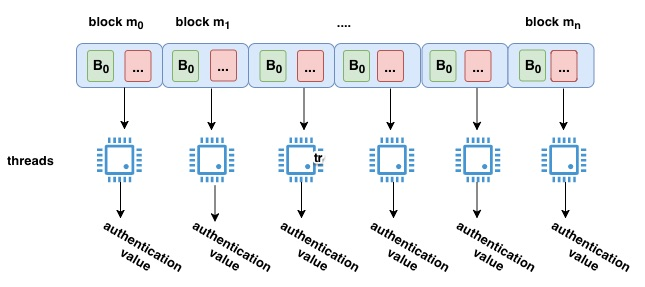
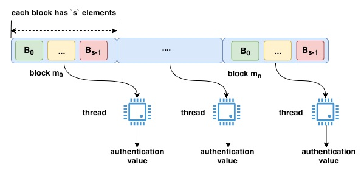
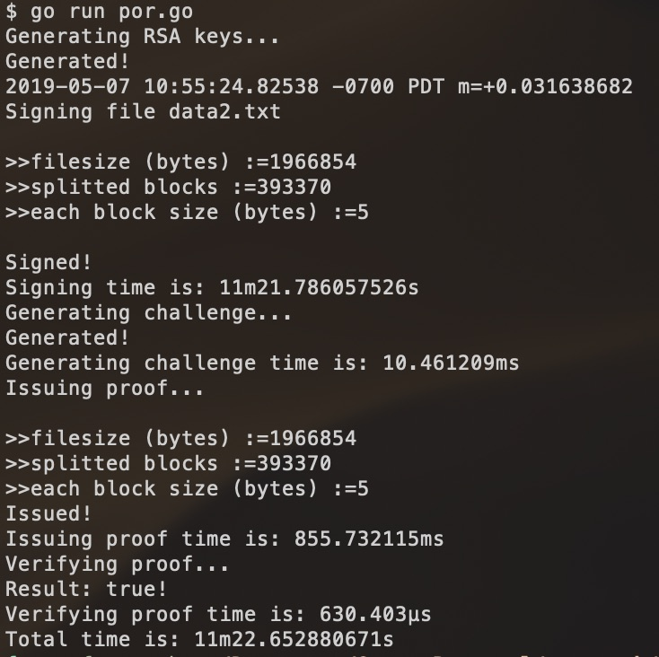
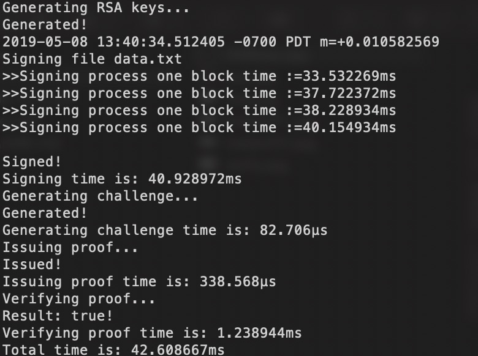
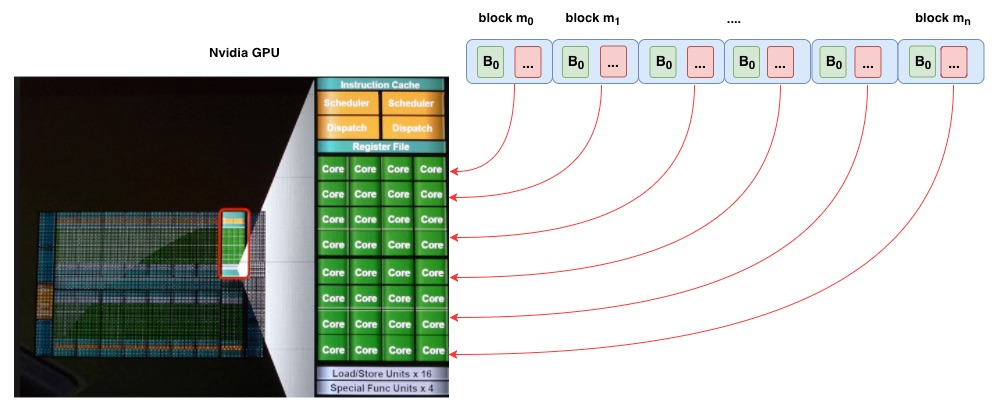
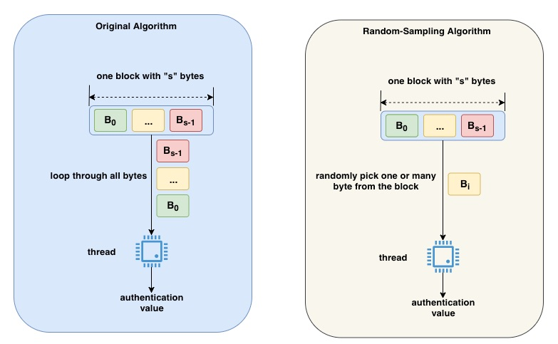
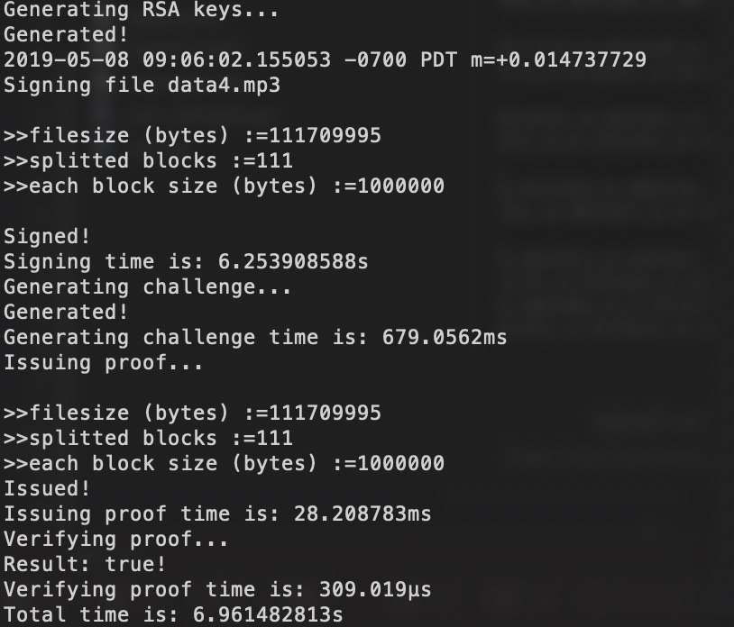
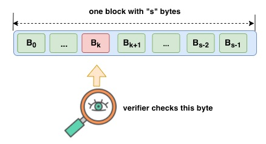
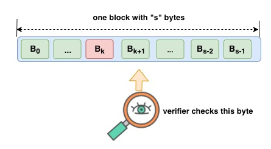
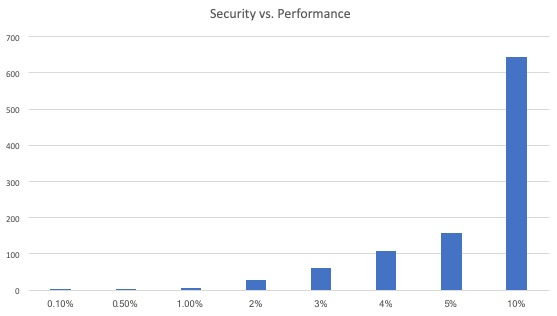

[](https://oceanprotocol.com)

# Proof of Data Retrievability (PoR)
```
name: proof of data retrievability
type: research
status: updated draft
editor: Fang Gong <fang@oceanprotocol.com>
date: 05/06/2019
```

* [1. Introduction](#1-introduction)
* [2. Compact Proof of Data Retrievability](#2-compact-proof-of-data-retrievability)
	+ [2.1 Workflow](#21-workflow)
	+ [2.2 Operation Structure](#22-operation-structure)
	+ [2.3 Algorithm Details](#23-algorithm-details)
	  - [2.3.1 Authentication values calculation](#231-authentication-values-calculation)
	  - [2.3.2 Challenges generation](#232-challenges-generation)
	  - [2.3.3 Proof generation](#233-proof-generation)
	  - [2.3.4 Proof verification](#234-proof-verification)
	+ [2.4 Experiment](#24-experiment)
* [3. Integration with Ocean](#3-integration-with-ocean)
* [4. Performance Enhancement](#4-performance-enhancement)
  - [4.1  Performance Tuning](#41--performance-tuning)
	  - [4.1.1 Runtime Breakdown](#411-runtime-breakdown)
	  - [4.1.2 Parameter Optimization](#412-parameter-optimization)
  - [4.2 Parallel Computing](#42-parallel-computing)
	  - [4.2.1 Multi-threading](#421-multi-threading)
	  - [4.2.2 Hardware Acceleration](#422-hardware-acceleration)
  - [4.3 Random Sampling Approach](#43-random-sampling-approach)
* [5. Security vs. Performance](#5-security-vs-performance)
	+ [5.1 Attack Vectors](#51-attack-vectors)
	+ [5.2 Security Level](#52-security-level)
	+ [5.3 Tradeoff](#53-tradeoff)
* [6. Implementation](#6-implementation)
* [7. Reference](#7-reference)
* [6. License](#6-license)

## 1. Introduction

The solution to a key question remains unclear to us: how to verify data retrievability? That means the storage provider must provide the continued availability of user's data and be able to prove to a verifier that the data is stored and available for access. 

The essential challenge is to build an efficient, provably secure, and publicly verifiable Poof-of-Retrievability scheme, which implies [1]:

* **efficient**: both computational cost, storage overhead and communication complexity should be as small as possible;
* **unbounded**: verifiers should be able to request the proof from the storage provider as many times as needed. A priori bound on the number of verifications should not exist;
* **stateless**: verifiers do not need to maintain and update state between verifications. Each verification result should be independently verified. 

PoR is a hot research topic in the academia for the past 10+ years and there are tons of academic papers discussing about it. A simple google search can find quite a few of them. However, there is no widely-adopted solution exist.

In this research, we investigate some research work and explore the possibility of integrating it into Ocean. 

## 2. Compact Proof of Data Retrievability

This approach is presented in "Compact Proofs of Retrievability", Hovav Shacham, Brent Waters, *Journal of Cryptology* (July 2013), Volume 26, Issue 3, pp 442–483. The paper can be found in [paper.pdf](./paper.pdf)

### 2.1 Workflow

PoR can be publicly verified as shown in the below. Theory explanation can be found in the **Section 1.1** of the [research paper](./paper.pdf).  

* **Provider**: 
	* provider has own RSA key pair in the local;
	* calculates the "authentication values" using data, random number and private key;
	* upload data along with authentication values to the storage;
	* publish his public key and random number to all verifiers;
* **Verifier**:
	* generate the challenge using provider's random numbers, own random number and provider's public key;
	* send challenge to storage provider;
	* receive the proof from storage and verify the PoR. 
* **Storage**:
	* store the data and authentication values (which is storage overhead);
	* receive challenge from the verifier;
	* calculate proof using data, authentication values and provider's public key;
	* return the proof to the verifier;


### 2.2 Operation Structure

The main function to execute the verification workflow looks like below:

```go
func main() {
	// 1. provider creates RSA keys
	fmt.Printf("Generating RSA keys...\n")
	spk, ssk := Keygen()
	fmt.Printf("Generated!\n")

	// 2. provider signs data and calculates authentication values
	fmt.Printf("Signing file...\n")
	file, err := os.Open("./data.txt")
	if err != nil {
		panic(err)
	}
	tau, authenticators := St(ssk, file)
	fmt.Printf("Signed!\n")

	// 3. verifier generates the challenge
	fmt.Printf("Generating challenge...\n")
	q := Verify_one(tau, spk)
	fmt.Printf("Generated!\n")

	// 4. storage provider calculates a proof corresponding to the challenge
	fmt.Printf("Issuing proof...\n")
	mu, sigma := Prove(q, authenticators, spk, file)
	fmt.Printf("Issued!\n")

	// 5. verifier checks the proof to verify PoR
	fmt.Printf("Verifying proof...\n")
	yes := Verify_two(tau, q, mu, sigma, spk)
	fmt.Printf("Result: %t!\n", yes)
	if yes {
		os.Exit(0)
	} else {
		os.Exit(1)
	}
}
```

### 2.3 Algorithm Details

In this section, we provide more detailed information on the calculations behind this scheme.

#### 2.3.1 Authentication values calculation

The data file is first splitted into `n` blocks such as m<sub>1</sub>, m<sub>2</sub>, ..., m<sub>n</sub>, where each block has size of `s`. Then data provider can authenticate each block and generate the `authentication value` &sigma; for each block as follows.

*1. Input*: private key, data file

*2. Output*: coefficient struct &alpha;, authentication values &sigma;<sub>i</sub> (i=0, ..., n-1);

*3. Steps*:

* calculate &alpha; which is an coefficient struct including:
	* random name string ([]byte)
	* random number array ({&tau;<sub>i</sub>}, i &in; [0, `s-1`])
	* total block number `n`
	* each block size `s`
	* BLS signature of above information using private key (sign using RSA PKCS1 v1.5)
* calculate &sigma; for each block of data file in parallel:
	* *Input*: block index `i`, block size `s`, random coefficient &alpha;, block raw data m<sub>i</sub>, private key `pk`
	* *Output*: an array of authentication values &sigma;<sub>i</sub> (i=0, ..., n-1) for all blocks
	* *Steps*:
		* for j-th byte in this block, calculate &alpha;<sub>j</sub><sup>m<sub>i</sub></sup>
		* calculate product over the entire block as: &Pi;&alpha;<sub>j</sub><sup>m<sub>i</sub></sup>
		* compute `hash` using hashing function over `random name string` in &alpha; and the block index `i`
		* calculate product `p`= &langle;`hash`, &Pi;&alpha;<sub>j</sub><sup>m<sub>i</sub></sup>&rangle;
		* calculate &sigma;<sub>i</sub> = p<sup>D</sup> mod N
			* D: the [private exponent](https://golang.org/pkg/crypto/rsa/#PrivateKey) of RSA private key
			* N: the [modulus](https://golang.org/pkg/crypto/rsa/#PublicKey) of RSA public key
	

#### 2.3.2 Challenges generation

The challenge `q` can be generated on verifier side using coefficient struct &alpha; (calculated in Section 2.3.1) and data provider's public key. 

Note that `q` is an array of challenges for randomly selected blocks of the data file. Each challenge is a index-coefficient pair including two integers (I, V), where `I` is the index of selected block and `V` is coefficient for verificaiton of this block.


*1. Input*: coefficient struct &alpha; and data provider's public key `pubKey`

*2. Output*: an array of challenges `q` = {q<sub>i</sub>} (i = 0, ...)

*3. Steps*:

* verify the signature in &alpha; to validate the authenticity of &alpha; using public key `pubKey`
* generate each challenge q<sub>i</sub> = &langle; I, V &rangle;:
	* find a **positive** random number `I` &in; [0, `n-1`]
	* find another **positive** random number `V`
* the challenge `q` can be passed to storage for verification purpose.
	
#### 2.3.3 Proof generation

After storage receives the challenge `q`, the proof &langle; &mu;, &sigma; &rangle; can be built in the storage side.

*1. Input*: authentication values &sigma;<sub>i</sub>, data file, data provider's public key `pubKey` and challenge `q` = &langle; I, V &rangle;

*2. Output*: poof as &langle; &mu;, &sigma; &rangle;

*3. Steps*:

* Split data file into `n` blocks as m<sub>1</sub>, m<sub>2</sub>, ..., m<sub>n</sub>, where each block has size of `s`. (the same as data provider)
* Calculate &mu; for all challenges q<sub>i</sub> = &langle; I<sub>i</sub>, V<sub>i</sub> &rangle; :
	* pick `j`-th byte in selected block: &theta;<sub>(I<sub>i</sub>, j)</sub> is the `j`-th byte inside I<sub>i</sub> block.
	* multiply the byte with random number V<sub>i</sub> in the challenge q<sub>i</sub> = &langle; I<sub>i</sub>, V<sub>i</sub> &rangle;
	* repeat it for all challenges on the same byte and add products together as &mu;<sub>j</sub>
	* repeat above computation for all bytes to generate an array &mu; = { &mu;<sub>j</sub> }  ( j = 0, ..., `s-1`)
* Calculate &sigma;
	* for each challenge q<sub>i</sub> = &langle; I<sub>i</sub>, V<sub>i</sub> &rangle;, compute  &sigma;<sub>i</sub> = &sigma;<sub>I<sub>i</sub></sub><sup>V<sub>i</sub></sup> mod `N`
		* &sigma;<sub>I<sub>i</sub></sub> is the authentication value for I<sub>i</sub> block
		* V<sub>i</sub> is the coefficient in the challenge q<sub>i</sub>
		* `N`: the [modulus](https://golang.org/pkg/crypto/rsa/#PublicKey) of RSA public key
	* repeat it for all challenges and compute product as &Pi; &sigma;<sub>i</sub> 
	* calculate &sigma; = &Pi; &sigma;<sub>i</sub> mod `N`

	
#### 2.3.4 Proof verification

The verifier receives the proofs &langle; &mu;, &sigma; &rangle; from the storage and verify the data retrievability as follows:

*1. Input*: coefficient struct &alpha;, challenge `q` = &langle; I, V &rangle;, data provider's public key `pubKey` and proof &langle; &mu;, &sigma; &rangle;

*2. Output*: `boolean` result

*3. Steps*:

* calculate the first term &lambda;<sub>0</sub> as:
	* for each challenge q<sub>i</sub> = &langle; I<sub>i</sub>, V<sub>i</sub> &rangle;:
		* compute `hash` = hashing function over `random name string` in &alpha; and the block index I<sub>i</sub> in the challenge q<sub>i</sub>
		* compute &gamma;<sub>i</sub> = `hash`<sup>V<sub>i</sub></sup> mod `N`, where `N` is the [modulus](https://golang.org/pkg/crypto/rsa/#PublicKey) of RSA public key
	* repeat it for all challenges and compute &lambda;<sub>0</sub> = &Pi; &gamma;<sub>i</sub> mode `N`
* calculate the second term &lambda;<sub>1</sub> as:
	* for each element in the random number array ({&tau;<sub>j</sub>}, j &in; [0, `s-1`]) of &alpha; struct, compute &Pi; (&tau;<sub>j</sub><sup>&mu;<sub>j</sub></sup> mod `N`)
		* &mu;<sub>j</sub> is the element in vector &mu; from the challenge
		* `N` is the [modulus](https://golang.org/pkg/crypto/rsa/#PublicKey) of RSA public key
	* compute &lambda;<sub>1</sub> = (&Pi; (&tau;<sub>j</sub><sup>&mu;<sub>j</sub></sup> mod `N`)) mode `N`
* compare ((&lambda;<sub>0</sub> * &lambda;<sub>1</sub>) mod `N`) == (&sigma;<sup>E</sup> mod `N`)
	* &sigma; is second part of the proof pair &langle; &mu;, &sigma; &rangle;
	* `E` is the [public exponent](https://golang.org/pkg/crypto/rsa/#PublicKey) of public key
	* `N` is the [modulus](https://golang.org/pkg/crypto/rsa/#PublicKey) of RSA public key
* if both sides in the comparision are equal, the proof is verified successfully.


### 2.4 Experiment

The Go implementation of this scheme can be found in [por github](https://github.com/CapacitorSet/por), whcih can be successfully tested with data file:


In my experiment, the "signing" step is the performance bottleneck which takes 1 minute for 200KB data file. But the good thing is this is one-time computation on the data provider side. Other steps such as verification are super fast.


Moreover, verifiers do NOT need the raw data file to generate challenges and verify proofs, therefore, there is no risk to leak the raw data file. This verification scheme is suitable for both public and private data. 

## 3. Integration with Ocean

This scheme is a great fit into Ocean's architecture based on previous analysis. Here we investigate how to integrate this scheme into Ocean.

In fact, Ocean can build a verifier network and any node can join and register as a verifier, since the proof can be publicly verifiable in this POR scheme.

* **Data Provider**:
	* sign the data to generate the coefficient struct &alpha; and authentication values &sigma;<sub>i</sub> (i=0, ..., n-1);
	* send data file and authentication values &sigma;<sub>i</sub> to storage
	* store the coefficient struct &alpha; and public key `pubKey` in smart contract if the information size is small. Otherwise, these information can be sent to verifiers off-chain.
* **Data Verifier**:
	* generate the challenges `q` using coefficient struct &alpha; and data provider's public key `pubKey`
	* send challenges to the storage
	* receive the proofs &langle; &mu;, &sigma; &rangle; from the storage and verify it
	* if success, submit his signature to the smart contract in Ocean network
* **Data Storage**:
	* receive the challenge `q` from verifier and generate the proofs &langle; &mu;, &sigma; &rangle;
	* send proofs to the verifiers
* **Ocean Smart Contract**:
	* register a node as a verifier and grant permission of verification
	* for each PoR verification request:
		* dispatch the verification task to selected verifiers
		* verifiers access the coefficient struct &alpha; and provider's public key `pubKey` from smart contract to generate challenges
		* collect signatures from the selected verifiers and verify them
		* if more than required signatures are received, the POR can be verified successfully


## 4. Performance Enhancement

### 4.1  Performance Tuning

#### 4.1.1 Runtime Breakdown

As we pointed in the experiment (Section 2.4), the bottleneck of runtime performance is the **signing** step, because it computes exponential values over the entire data file and demands a large amount of computing resource.

Here is the profiling of the algorithm runtime using a 700KB data file:

Operation | Runtime | Percentage |
---|---|---|
Sign file | 2m 51s | 99.7% |
Generate challenge | 87.9us | < 0.1% |
Issue proof | 269.76 ms | 0.156% |
Verify proof | 721.2 us | < 0.1% |
Total: | 2m 51.5s |

Clearly, the **signing** step is the most time-consuming part due to the expensive `for-loop` operation (shown in the below) that computes the authentication value for each block.

In details, it calculates the exponential &alpha;<sub>j</sub><sup>B<sub>j</sub></sup> where &alpha;<sub>j</sub> is the random number chosen by data provider and B<sub>j</sub> is the byte in this data block. In the process, all exponentials are multiplied together to be a product: &Pi;&alpha;<sub>j</sub><sup>B<sub>j</sub></sup> ( j = 0, ..., `s-1`)

```go
func GenerateAuthenticator(i int64, s int64, tau_zero Tau_zero, piece []byte, ssk *rsa.PrivateKey) *big.Int {
	hash_bigint := hashNameI(tau_zero.name, i + 1)

	productory := big.NewInt(1)
	for j := int64 (0); j < s; j++ {
		piece_bigint := new(big.Int).SetBytes([]byte{piece[j]})
		productory.Mul(productory, new(big.Int).Exp(&tau_zero.U[j], piece_bigint, nil))
	}

	innerProduct := new(big.Int).Mul(hash_bigint, productory)
	return new(big.Int).Exp(innerProduct, ssk.D, ssk.PublicKey.N)
}
```

#### 4.1.2 Parameter Optimization

One factor that has a critical impact on the performance is **block-size** `s`: remember the data file is divided into `n` blocks as m<sub>1</sub>, m<sub>2</sub>, ..., m<sub>n</sub> so that each block has `s` bytes. 

To determie the optimal block-size, we need to tradeoff between two scenarios:

* **if block-size `s` is small**, the data file is splitted into a large number of blocks, which causes many issues:
	* the size of authentication values becomes large because each block has its own authentication value. Therefore, the cost of communication is increased significantly.
	* each block will be processed by a thread. As such, a small `s` results in a large number of threads and further requires frequent resource allocation/release, which slows down the runtime performance.
	
* **if block-size `s` is large**, there are less number of block but each block has very large size:
	* for each block, the algorithm calculates the product of exponential values over all data inside the block: &Pi;&alpha;<sub>j</sub><sup>B<sub>j</sub></sup> ( j = 0, ..., `s-1`);
	* the calculation becomes very slow with a large number of bytes in the same block, since the exponential value grows exponentially;
	*  moreover, the calculation may cause overflow issue due to exponential growth.
	
	

Let us compare the impact of `s` on the performance using a small data file (file size := 214,138 bytes):

* Case 1: each block has 1 byte 
* Case 2: each block has 5 bytes
* Case 3: each block has 10 bytes

parameters | Case 1  | Case 2 | Case 3 |
---|---|---|---|
block-size | s=1 | s=5 | s=10 |
number-of-block | n=214138 | n=42827 | n=21413 |
Sign file | 1m 9.85s | 53.50s | 1m16.60s | 
Generate challenge | 113.35µs | 106.64µs | 107.71µs |
Issue proof | 369.83ms | 74.11ms | 35.00ms |
Verify proof | 297.58µs | 669.98µs | 1.19ms |
Total: | 1m 10.22s | 53.57s | 1m16.64s | 
Speedup: | 1X (**baseline**) | 31% faster | 9% slower |

Clearly, there exists **an optimal block-size** that delivers the best performance runtime. It is not possible to reach the best performance with either very small or very large block-size. 

Using **blocksize = 5 bytes**, we run an experiment on a **2MB data file**, which finished with **11.5 mins**. In practice, it enables a lot of use cases in Ocean framework.



### 4.2 Parallel Computing

Another low hanging fruit to improve the performance is **parallel computing**. In theory, the algorithm breaks the data file into small blocks and each block can be independently processed. It is a great fit to most of parallel computing frameworks.

#### 4.2.1 Multi-threading 

The Go implementation enables the multi-threading using Go routines, therefore, it can utilize all processing cores and threads in the same time.

 In below experiment, the algorithm spawns four threads (one thread for one block) which are running in the same time. The parallelization cuts the total runtime by 4 times, since the runtime of each thread approximates the total runtime.
 
 
 
#### 4.2.2 Hardware Acceleration
 
 When combined with more powerful hardware such as GPU, the performance can be significantly improved by hundreds of times or even more, since each block can be processed in one GPU core and all GPU cores perform the same operations on different blocks.
 
 

### 4.3 Random Sampling Approach

Let us consider a larger case with 1GB data file: remember 2MB data file needs 11.5 mins to finish using blocksize=5. A simple extrapolation can tell us that 1GB data file needs 1000 MB / 2 MB * 11.5 mins = 4 days! Obviously, it is not acceptable in practice.

To improve the performance, we can relax our trustworthy requirement for the proof of retrievability but achieve better scalability. The key idea is to **randomly sample the block** rather than looping through the entire block. It saves us a huge amount of time. 



It literally removes the for-loop in the authentication calculation and randomly pick one or a few bytes instead looping through every single byte, which eliminates the performance bottleneck for us. 

Moreover, we can further change the block-size to improve the performance, because we only pick a few bytes from a block no matter how many bytes in one block. As such, less number of blocks is better for performance, althrough it is bad for trustworthy of proofs.

Here is the experiment of different approaches running on the same 2MB data file (file size := 1,966,854 bytes):

* Case 1: original algorithm + each block has 5 bytes
* Case 2: random-sampling algorithm + each block has 5 bytes
* Case 3: random-sampling alogrithm + each block has 1000 bytes (**extreme case for demo purpose**)

parameters | Case 1 (original) | Case 2 (random) | Case 3 (random) |
---|---|---|---|
block-size | s=5 | s=5 | s=1000 |
number-of-block | n=393370 | n=393370 | n=1966 | 
Sign file | 11m 21s | 3m 11.55s | 542.29ms | 
Generate challenge | 131.57µs | 106.64µs | 1.25ms |
Issue proof | 855.73ms | 1.07s | 8.18ms |
Verify proof | 630.40µs | 312.56µs | 501.15µs |
Total: | 11m 22.65s | 3m 12s | 552.23ms | 
Speedup: | 1X (**baseline**) | 3.55X faster | 1236X faster |

It shows the random-sampling algorithm is much faster than the original approach. Moreover, the performance can be significantly improved with large blocksize. 

It is worth mentioning that the performance gain is accomplished at the cost of **trustworthy loss**, since we only check a few bytes rather every one byte in one block. 

Lastly, let us try it on a larger file 111MB (size := 111,709,995 bytes) with super aggressive setting :) 

Block size is set to be 1 MB, therefore, we only has 111 blocks and 111 authenticationn values. The total runtime can be reduced to 7s.

Of course, this is an extreme settings for demo purpose, but you get the idea :) We can definitely set the block-size to be a more reasonable value for higher trustworthy level and achieve affordable runtime in the same time.




## 5. Security vs. Performance

In this section, we analyze the potential attack vectors for random sampling algorithm and analyze the tradeoff between security and performance. 

### 5.1 Attack Vectors

* **inaccessible data files:** storage provider fails to make the data files available due to various reasons (e.g., network off-line, power outage, earthquake, or deliberately remove files to free more space)
	* none of the bytes in blocks can be verified;
	* our scheme can efficiently detect this storage failure and alert verifiers;

* **tampered bytes in blocks:** storage provider may unintentionally or intentionally modify the bytes in blocks of data files (e.g., bit flipping, hardware error, hacker attack, or modify bytes on purpose)
	* **Case 1: modify the bytes that under checking**
		* the good scenario is the tampered bytes are checked by verfiers, therefore, the change of data file will be found and storage provider will be penalized.
		* our scheme can effectively detect this data file changes. 
		
		
	
	* **Case 2: modify the bytes that are not checked**
		* the bad scenario is the tampered bytes are not checked by verifiers, therefore, the change of data file will not be found by our scheme;
		* however, storage provider has no incentive to do so, because the data file occupies the same amount of storage space and provider cannot get extra storage space in this way. 
		* on the contrary, providers can receive network rewards by being honest;
		* moreover, providers cannot delete any bytes in blocks to release storage space, as it changes the way of splitting data files and our scheme will capture this change. 
		
		


### 5.2 Security Level

Obviously, more bytes verifiers can check, more security the scheme can have. The most important parameter is the **number of bytes** that the scheme randomly chooses from each block to check.

To measure the security impact from the parameter, we can define `Security Level` &gamma; for this purpose:


&gamma; =  &alpha; / &beta;

* &alpha; - number of bytes randomly chosen from the block;
* &beta; - total number of bytes in the same block

Higher percentage of bytes randomly chosen from the block indicates higher security level, as the scheme has higher probability to catch any change to the data file. 

As such, the original algorithm that checks every byte in blocks has the highest 
security level, however, its performance is not acceptable for production.

Note that &gamma; is the **security level for one-time checking**, and the overall security level can be significantly improved when verifiers repeat the checking for many times over the time.


### 5.3 Tradeoff 

Our random sampling algorithm sacrifices certain security level for better performance and scalability. Now, let us take a look at the tradeoff between them.

We use the **2 MB** data file for the experiment and **block-size = 1000 bytes**. 

Note that smaller blocksize works better for original algorithm that checks each byte due to the overflow issue, while larger blocksize is better for ramdom sampling algorithm. However, when more bytes need to be checked in the random sampling algorithm, its performance may become even worse than the original with smaller blocksize due to the computing of exponential values.

Here is the performance vs. security comparision for **one-time checking** using random sampling algorithm:

* &gamma; - security level
* &alpha; - number of bytes randomly chosen from the block;
* &beta; - total number of bytes in the same block
 
&gamma; | 0.1% | 0.5% | 1% | 2% | 3% | 4% | 5% | 10% |
---|---|---|---|---|---| ---| ---| ---|
&alpha; (unit: bytes) |  1 | 5 | 10 |  20 | 30 | 40 | 50 | 100 |
&beta; (unit: bytes )| 1000 | 1000 | 1000 | 1000 | 1000 | 1000 | 1000 | 1000 |
Runtime | 568.45ms | 2.33s | 6.97s | 27.45s | 1m |  1m 47s | 2m 38s | 10m 44s |
Slowdown | 1X (base) | 4X | 12X | 48X | 105X | 188X | 278X | 1133X |

Let us plot runtime vs. security level in the diagram. It shows the growth of runtime is **super-linear** w.r.t. the increase of security level. 


 

## 6. Implementation

All the codes can be found in the same directory under `code` folder:

* [`por.go`](./code/por.go):  the original algorithm
* [`por-sample.go`](./code/por-sample.go): the random sampling algorithm; it has two critical parameters to tune the performance and security:
	* line 45: `s := int64 (1000)` is the block-size
	* line 123: `num := int64(100)` is the number bytes randomly chosen from one block

In both program, the input file is set in the `main` function inside the program:

```go
fileName := "data2.txt"
file, err := os.Open(fileName)
```
Simply change it to be your testing data file. 

To run the code, use the command in the terminal:

```
$ go run por-sample.go
```

Have fun! :)

## 7. Reference

* [1] "[Compact Proofs of Retrievability](./paper.pdf)", Hovav Shacham, Brent Waters, July 2013, Volume 26, Issue 3, pp 442–483.
* [2] An implementation of publicly verifiable proofs of retrievability: [github](https://github.com/CapacitorSet/por) 
* [3] Proof of data possession in Lambda project: [github](https://github.com/LambdaIM/proofDP)
* [4] S. Rass, "Dynamic proofs of retrievability from Chameleon-Hashes," 2013 International Conference on Security and Cryptography (SECRYPT), Reykjavik, Iceland, 2013, pp. 1-9. 
* [5] an implementation of  "Dynamic proofs of retrievability from Chameleon-Hashes": [Github](https://github.com/tgrafena/proof_of_retrievability)

## 6. License

```
Copyright 2018 Ocean Protocol Foundation

Licensed under the Apache License, Version 2.0 (the "License");
you may not use this file except in compliance with the License.
You may obtain a copy of the License at

   http://www.apache.org/licenses/LICENSE-2.0

Unless required by applicable law or agreed to in writing, software
distributed under the License is distributed on an "AS IS" BASIS,
WITHOUT WARRANTIES OR CONDITIONS OF ANY KIND, either express or implied.
See the License for the specific language governing permissions and
limitations under the License.
```

