[](https://oceanprotocol.com)

#  Research Uniswap-Chainlink Integration

```
name: research on integration of Uniswap-Chainlink for RNG.
type: research
status: initial draft
editor: Fang Gong <fang@oceanprotocol.com>
date: 03/21/2019
```

* [1. Introduction](#1-introduction)
* [2. Uniswap](#2-uniswap)
	+ [2.1 deploy Ocean token contract to Rinkeby testnet](#21-deploy-ocean-token-contract-to-rinkeby-testnet)
	+ [2.2 create exchange for OCEAN](#22-create-exchange-for-ocean)
	+ [2.3 add initial liquidity for LINK tokens](#23-add-initial-liquidity-for-link-tokens)
	+ [2.4 exchange OCEAN for LINK tokens](#24-exchange-ocean-for-link-tokens)
* [3. Chainlink](#3-chainlink)
	+ [3.1 Request from online Quantum Random Number Generator](#31-request-from-online-quantum-random-number-generator)
	+ [3.2 Deploy the requester contract](#32-deploy-the-requester-contract)
	+ [3.3 Request random numbers](#33-request-random-numbers)
* [License](#license)

## 1. Introduction

Previous research has investigated the [Uniswap](../4-uniswap/README.md) and [Chainlink](../3-data-availability/web-3.0-chainlink/README.md) separately. In this research, we aim to combine Uniswap and Chainlink to import off-chain random numbers to Ocean smart contract. 

In particular:

* **Uniswap**: exchange OCEAN tokens for LINK tokens;
* **Chainlink**: accept LINK tokens from Ocean to fulfill its requests.

It demonstrates a closed loop of workflow including both components. This helps Ocean to resolve the request to access external information sources.

Note: all POC work is done on **Rinkeby testnet** for demo purpose using Node.js v8.11.1 and Truffle v5.0.3.

The folder structure is following:

folder name | description |
---| ---|
uniswap-token | scripts to add OCEAN<>LINK pair |
chainlink | scripts to submit request to Chainlink in Rinkeby network |
kovan-receiver | smart contract that receives request results in POA network |
img | image files for README.md |

## 2. Uniswap

We need to exchange OCEAN tokens with LINK tokens. 

The workflow of token-to-token swap is shown as below:

* Ocean exchange contract withdraw OCEAN tokens from user's wallet;
* the exchange converts OCEAN tokens into ETH;
* ETH is sent to Chainlink exchange contract for purchase;
* ETH is converted into LINK tokens;
* LINK tokens are sent to user's wallet.

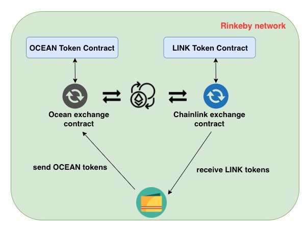


### 2.1 deploy Ocean token contract to Rinkeby testnet

First we need to deploy the [OCEAN token contract](uniswap-token/contracts/OceanToken.sol) as:

```
$ truffle migrate --network rinkeby
...
10_ocean_token.js
=================

   Replacing 'OceanToken'
   ----------------------
   > transaction hash:    0x07beaeb6979a8beda0544af0dd499ea260a8f72b411a9f9d12ec40dda5c8225c
   > Blocks: 1            Seconds: 24
   > contract address:    0x56F598cF576d923d7723781cB90BfBF41d81089f
   > account:             0x0E364EB0Ad6EB5a4fC30FC3D2C2aE8EBe75F245c
   > balance:             2.20082358
   > gas used:            1214459
   > gas price:           10 gwei
   > value sent:          0 ETH
   > total cost:          0.01214459 ETH

   > Saving artifacts
   -------------------------------------
   > Total cost:          0.01214459 ETH
```

Note: LINK token for Chainlink has been deployed to Rinkeby at `0x01BE23585060835E02B77ef475b0Cc51aA1e0709`

### 2.2 create exchange for OCEAN

1. Use script `uniswap-token/script/1.create.ocean.exchange.js` to create an exchange contract for Ocean token. The tx log on [Etherscan](https://rinkeby.etherscan.io/tx/0xd86e743f00574308e3a360c1b11d9b1cf6048dbd6add0cceddc926ec8b5c04f0)

	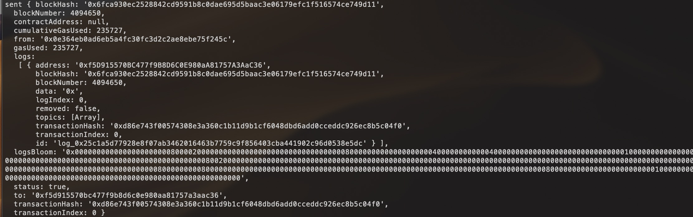

2. Use script `uniswap-token/script/2.get.ocean.exchange.address.js` to retreive the exchange contract address for OCEAN token:

	```
	$ node script/2.get.ocean.exchange.address.js
	the exchange address for Ocean token is:0xaFD52EF3Cb0eE6673cA5EbE0A25686313fF0C283
	```

3. Use script `uniswap-token/script/3.get.link.exchange.address.js` to retreive the exchange contract address for LINK token at `0x01BE23585060835E02B77ef475b0Cc51aA1e0709`:

	```
	$ node script/3.get.link.exchange.address.js
	the exchange address for LINK token is:0x094AeF967D361E2aE3Af472718e231DC9134724F
	```

### 2.3 add initial liquidity for Ocean tokens

Before we can deposit initial tokens to the Ocean exchange contract, we need to first approve the exchange contract to withdraw OCEAN tokens from the sender's wallet. Use the script `uniswap-token/script/4.approve.ocean.deposit.js` for this purpose:

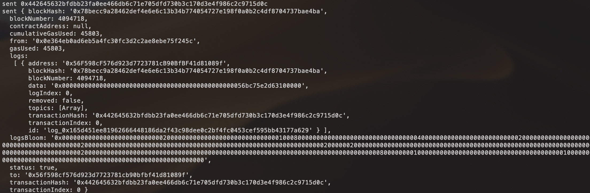

After, we can use `uniswap-token/script/5.add.ocean.exchange.liqudity.js` to add initial token liquidity to the exchange contract.

From the Etherscan explorer, it is clear that the Ocean exchange contract has initial balance: 0.1 Ether and 15 Ocean tokens:

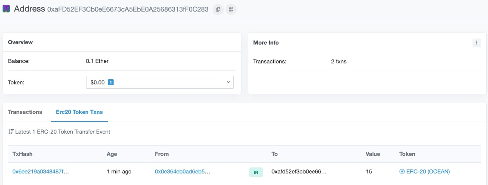

### 2.4 exchange OCEAN for LINK tokens

Next, we are ready to swap OCEAN token for LINK tokens through Uniswap exchange. 

In particular, we need to call function `tokenToTokenTransferOutput`, which convert input tokens to output tokens and transfer to receiver address. 

Use the script `uniswap-token/script/6.convert.ocean2link.js` to perform the swap:

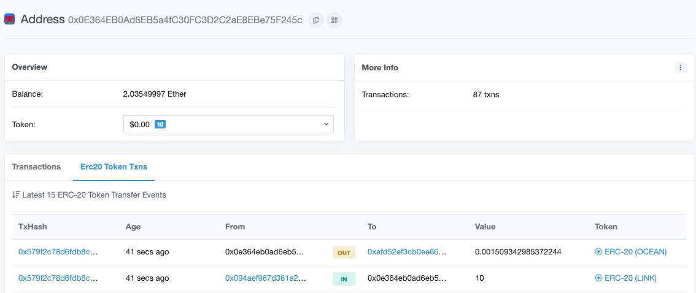

Clearly, 0.0015 OCEAN tokens are transferred out to the exchange to receive 10 LINK tokens.

The same balance can be verified in Metamask wallet:

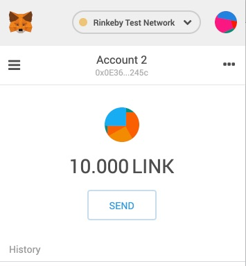

## 3. Chainlink 

Now, we have LINK tokens in our wallet and are ready to send request to Chainlink network.

As a specified application, we use Chainlink to request a random number from the off-chain data source such as [random.org](https://www.random.org/clients/http/) or [online Quantum Random Number Generator](https://qrng.anu.edu.au/API/api-demo.php).

Moreover, Chainlink has setup an adapter for Random.org at [randomorg-chainlink-testnet](https://docs.chain.link/docs/randomorg-chainlink-testnet). Here, we will leverage this adapter to access off-chain random numbers:

**Rinkeby**

* **LINK token address**: 0x01BE23585060835E02B77ef475b0Cc51aA1e0709
* **Oracle address**: 0x7AFe1118Ea78C1eae84ca8feE5C65Bc76CcF879e
* **JobID**: 75e0a756bbcc48678c498802a7c5929b

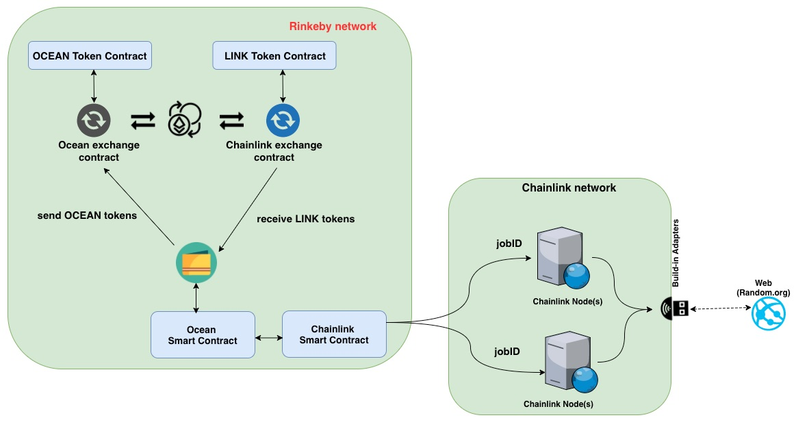

### 3.1 Create the Requester Contract

See contract `chainlink/contracts/OceanRequester.sol` for details. The key function is:

```solidity
/*
   * Create a request and send it to default Oracle contract
   */
  function getRandom(
    uint256 _min,
    uint256 _max
  )
    public
    onlyOwner
    returns (bytes32 requestId)
  {
    // create request instance
    Chainlink.Request memory req = newRequest(JOB_ID, this, this.fulfill.selector);
    // fill in the pass-in parameters
    req.addUint("min", _min);
    req.addUint("max", _max);
    // send request & payment to Chainlink oracle (Requester Contract sends the payment)
    requestId = chainlinkRequest(req, ORACLE_PAYMENT);
    // emit event message
    emit requestCreated(msg.sender, JOB_ID, requestId);
  }
```

### 3.2 Deploy the requester contract

```
$ truffle migrate --network rinkeby
...
2_oceanrequester_migration.js
=============================

   Replacing 'OceanRequester'
   --------------------------
   > transaction hash:    0x060c7208a85c7d4786577de3703ffad223a9675d562ab6126beda51ccc3fe1ed
   > Blocks: 0            Seconds: 8
   > contract address:    0x81C8A4BE1bf2491D3c90BdE4615EE4672F13E63b
   > account:             0x0E364EB0Ad6EB5a4fC30FC3D2C2aE8EBe75F245c
   > balance:             1.89272674
   > gas used:            1289807
   > gas price:           10 gwei
   > value sent:          0 ETH
   > total cost:          0.01289807 ETH

   > Saving artifacts
   -------------------------------------
   > Total cost:          0.01289807 ETH
```

### 3.3 Request random numbers

A Javascript file `chainlink/test/OceanRequester.Test.js` is used to interact with Ocean Requester contract and submit a request to Chainlink network. 

```Javascript
contract("OceanRequester", (accounts) => {
  const LinkToken = artifacts.require("LinkToken.sol");
  const OceanRequester = artifacts.require("OceanRequester.sol");
  const defaultAccount =0x0e364eb0ad6eb5a4fc30fc3d2c2ae8ebe75f245c;
  const LINK_FEE = web3.utils.toHex(1*10**18)
  const LB = web3.utils.toHex(100)
  const UB = web3.utils.toHex(1000)
  let link, ocean;

  beforeEach(async () => {
    link = await LinkToken.at("0x01BE23585060835E02B77ef475b0Cc51aA1e0709");
    ocean = await OceanRequester.at("0x81C8A4BE1bf2491D3c90BdE4615EE4672F13E63b");
  });

  describe("should request data and receive callback", () => {
    let request;

    it("transfer 1 LINK token to Ocean requester contract if there is no any", async () => {
      let balance = await link.balanceOf(ocean.address)
      if (balance == 0) {
        await link.transfer(ocean.address, LINK_FEE)
      }
    });


    it("LINK balance", async () => {
      let initBalance = await link.balanceOf(ocean.address)
      console.log("Ocean contract has :=" + initBalance / scale + " LINK tokens")
    });

    it("create a request and send to Chainlink", async () => {
      let tx = await ocean.getRandom(LB, UB);
      request = h.decodeRunRequest(tx.receipt.rawLogs[3]);
      console.log("request has been sent. request id :=" + request.id)

      let data = 0
      let timer = 0
      while(data == 0){
        data = await ocean.getRequestResult()
        if(data != 0) {
          console.log("Request is fulfilled. data := " + data)
        }
        wait(1000)
        timer = timer + 1
        console.log("waiting for " + timer + " second")
      }

    });
  });
});
```

The integration testing on Rinkeby takes 1s to fulfill the random number request (i.e., generate a random number between 100 and 1000):

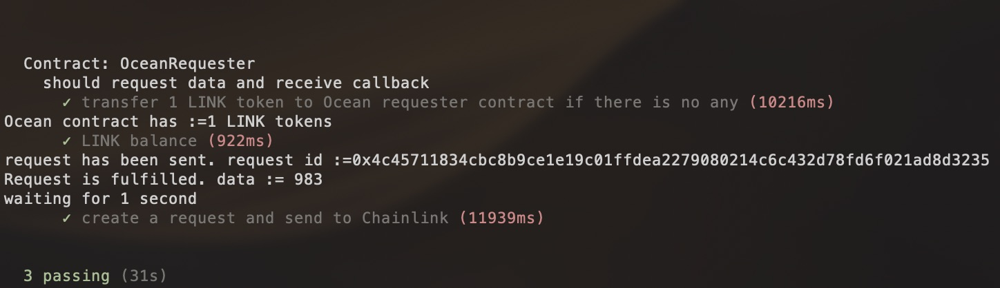

## 4. Transfer Data into Kovan testnet network

In Ocean's scenario, we deploy Keeper contract in our own POA network, therefore, it is needed to port the result of Chainlink requests into the POA network. In the meantime, we need to leverage the existing Chainlink network and pay real LINK tokens for the service. 

The most lightweight approach is following:

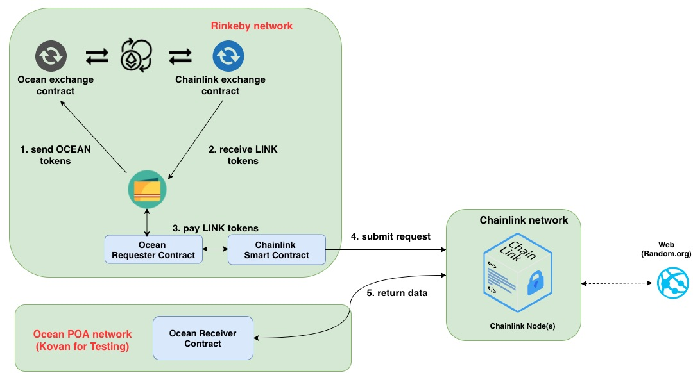

The Chainlink network will need to regiter a new job specification, which triggers the transaction to transfer data into Ocean POA network. 

As a Proof-of-Concept, we deploy the `requester` contract in **Rinkeby** as previous step, while deploy the `receiver` contract in **Kovan** testnet to receive the request result.

When migrating to Ocean POA network, we need to privde:

* URL endpoint of POA network that accepts transactions of JSON-RPC calls;
* account information with private key in POA networth with available funds.

Chainlink team has implemented several adapeters for data transfer across networks:

* With Random.org (these jobs will write a random number to your target contract)
	* Ropsten -> Rinkeby: 4e8e60145fb94f09a0d95aac74a87589
	* Ropsten -> Kovan: ed6b1573208b40f78837edc181129687
	* Rinkeby -> Ropsten: 221c72c504b049f38ab9f9acf4f03767
	* Rinkeby -> Kovan: 683dcbab01cd49ec96d6d706f9df2381
	* Kovan -> Ropsten: 9238483edeaf4a6eab139a4863d7131d
	* Kovan -> Rinkeby: 9e47053762a04405a27378ea33b5850e

* Arbitrary data (these jobs will allow you to specify a value for your target contract)
	* Ropsten -> Rinkeby: ff7f37495ead4d3fa615f73a012cdf02
	* Ropsten -> Kovan: be5978c7c3924a509e0957b13c953b3a
	* Rinkeby -> Ropsten: b1f1fe311b9240918ea6d4312e2024ea
	* Rinkeby -> Kovan: bac4bb4c92f04f70a691e00f3737b022
	* Kovan -> Ropsten: d8b5f169c5aa4e20bad60bff180f813b
	* Kovan -> Rinkeby: f3f7886ecdba45e4b74e0e687a3da125

### 4.1 Requester Contract 

It was deployed in Rinkeby. Source file is [here](chainlink/contracts/OceanRequester.sol)

```solidity
  // Rinkeby -> Kovan jobId for random.org
  bytes32 constant JOB_ID = bytes32("683dcbab01cd49ec96d6d706f9df2381");
  ...
  /*
   * Create a request and send it to default Oracle contract
   */
  function getRandom(
    uint256 _min,
    uint256 _max,
    string _exAddr,
    string _funcId
  )
    public
    onlyOwner
    returns (bytes32 requestId)
  {
    // create request instance
    Chainlink.Request memory req = newRequest(JOB_ID, this, this.fulfill.selector);
    // fill in the pass-in parameters
    req.addUint("min", _min);
    req.addUint("max", _max);
    req.add("exAddr", _exAddr);
    req.add("funcId", _funcId);
    // send request & payment to Chainlink oracle (Requester Contract sends the payment)
    requestId = chainlinkRequest(req, ORACLE_PAYMENT);
    // emit event message
    emit requestCreated(msg.sender, JOB_ID, requestId);
  }

  /*
   * callback function to keep the returned value from Oracle contract
   */
  function fulfill(bytes32 _requestId, bytes32 _hash)
    public
    recordChainlinkFulfillment(_requestId)
  {
    data = _hash;
    emit requestFulfilled(_requestId, _data);
  }
```

To get the function selector, web3.js can be used to generate as:

```bash
$ truffle develop

truffle(develop)> web3.eth.abi.encodeFunctionSignature('receiveData(uint256)')
'0xde947c85'
```

This contract can be deployed to Rinkeby:
```
$ truffle migrate --network rinkeby
...
2_oceanrequester_migration.js
=============================

   Deploying 'OceanRequester'
   --------------------------
   > transaction hash:    0xa8765389bb02df98866c1f7030bb8339eb42e16259ba8a0bb2f3fd863664944c
   > Blocks: 0            Seconds: 12
   > contract address:    0x5e7883be4529C6c0cEc27A5Fa5e5D62F81a41ACf
   > account:             0x0E364EB0Ad6EB5a4fC30FC3D2C2aE8EBe75F245c
   > balance:             19.990124610356518596
   > gas used:            1387466
   > gas price:           10 gwei
   > value sent:          0 ETH
   > total cost:          0.01387466 ETH

   > Saving artifacts
   -------------------------------------
   > Total cost:          0.01387466 ETH
```


### 4.2 Create and Deploy Receiver Contract

The source file of OceanReceiver smart contract is [here](kovan-receiver/contracts/OceanReceiver.sol)

```solidity
  /*
   * function to keep the returned value from Chainlink network
   */
  function receiveData(uint256 _data)
    public
  {
    data = _data;
    emit requestFulfilled(_data);
  }
```

We deploy it into Kovan testnet at `0x0aBDB2bB26A4A34e16D146639FDE5b530AC86cFf`:

```
$ truffle migrate --network kovan
2_oceanreceiver_migration.js
============================

   Deploying 'OceanReceiver'
   -------------------------
   > transaction hash:    0xe3a0f10ccdd83248eea50b2b0a3000af7afcd5dc021c75f9a6ac980d94e65ddc
   > Blocks: 0            Seconds: 12
   > contract address:    0xc6E2640a3963365341959508Ac0b62813637d8BD
   > account:             0x0E364EB0Ad6EB5a4fC30FC3D2C2aE8EBe75F245c
   > balance:             2.113981525853937168
   > gas used:            262822
   > gas price:           10 gwei
   > value sent:          0 ETH
   > total cost:          0.00262822 ETH

   > Saving artifacts
   -------------------------------------
   > Total cost:          0.00262822 ETH
```


### 4.3 Request Random Numbers

We create a testing javascript to run the workflow `chainlink/test/RequestRandPOA.Test.js`

It will transfer 1 LINK token to the Ocean requester contract and submit the request to Chainlink network in Rinkeby. 

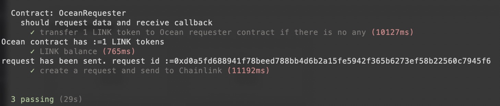

After a while, we can check the receiver contract in Kovan network and see the random number:

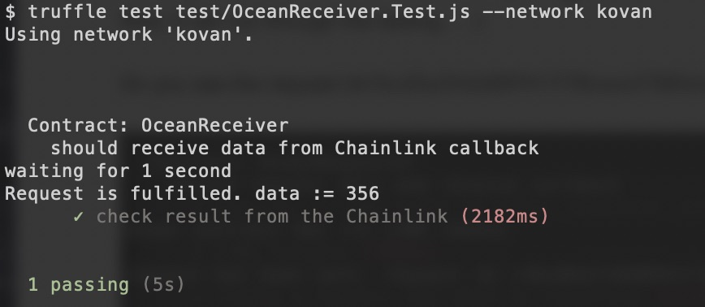

It demonstrates that the request is submitted from Rinkeby but the data is returned to Kovan network.

## 5. Transfer Data into Ocean Nile POA network

Now, we can test between Rinkeby testnet and Ocean POA testnet (https://nile.dev-ocean.com)

Chainlink team builds new Jobs as:

* With Random.org
	* Ropsten -> Ocean Testnet: af4f80269e354c88823b862e359824d2
	* Rinkeby -> Ocean Testnet: f1282af8d71d4049aae0d44d8a750c11
	* Kovan -> Ocean Testnet: 907b1f07345448f18be63745d93ded64

* Arbitrary data
	* Ropsten -> Ocean Testnet: 09d689645cfc4a2ca932e5f14d212603
	* Rinkeby -> Ocean Testnet: 802d8d2385c347788547d81d1a19d8b9
	* Kovan -> Ocean Testnet: 7d84e447252d4f52bb3b0db072b2a469

	
We only need to modify the job ID in the OceanRequester.sol and redeploy it to Rinkeby network. In addition, we need to deploy OceanReceiver contract to Ocean testnet.

### 5.1 Requester Contract in Rinkeby testnet

```bash
$ truffle migrate --network rinkeby
...
2_oceanrequester_migration.js
=============================

   Replacing 'OceanRequester'
   --------------------------
   > transaction hash:    0x1eec97db90ae95b4837273370ce360067a5bb5fb0117a02352e4b3daf5c455c6
   > Blocks: 0            Seconds: 8
   > contract address:    0xCD2d163F2a2F48d3aF604F746983c54111CCBda5
   > account:             0x0E364EB0Ad6EB5a4fC30FC3D2C2aE8EBe75F245c
   > balance:             19.793494650356518596
   > gas used:            1387466
   > gas price:           10 gwei
   > value sent:          0 ETH
   > total cost:          0.01387466 ETH
```

### 5.2 Receiver Contract in Ocean POA network

We need to deploy the receiver contract to Ocean tesetnet `nile`. Add the network information as:

```
nile: {
            provider: function() {
              return new HDWalletProvider(process.env.NMEMORIC, "https://nile.dev-ocean.com")
            },
            network_id: 0x2323, // 8995
            gas: 6000000,
            gasPrice: 10000000000,
            from: '0x0e364eb0ad6eb5a4fc30fc3d2c2ae8ebe75f245c'
        },
```

The deployment is successful:

```bash
$ truffle migrate --network nile
Starting migrations...
======================
> Network name:    'nile'
> Network id:      8995
> Block gas limit: 6666666
...
2_oceanreceiver_migration.js
============================

   Deploying 'OceanReceiver'
   -------------------------
   > transaction hash:    0x8014cc5c98e11a40d9e8180719b4def5b4c7b1b457970bba513194c45b7cfc6d
   > Blocks: 0            Seconds: 0
   > contract address:    0x46e81953D09Ba4D670cF73304DAD8808E8cd03a7
   > account:             0x0E364EB0Ad6EB5a4fC30FC3D2C2aE8EBe75F245c
   > balance:             9799.93602774500680106
   > gas used:            262822
   > gas price:           10 gwei
   > value sent:          0 ETH
   > total cost:          0.00262822 ETH
```

### 5.3 Request Random Number

First, we submit an request to Chainlink network from Rinkeby testnet, which pays LINK token as  well:

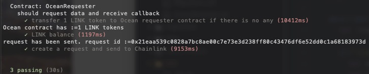

Then, we can check the data result in the Ocean's Nile tesetnet:

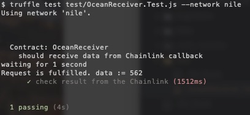

It successfully be fulfilled by the Chainlink network, because the off-chain random number 562 is passed into Ocean smart contract.

## License

```
Copyright 2018 Ocean Protocol Foundation

Licensed under the Apache License, Version 2.0 (the "License");
you may not use this file except in compliance with the License.
You may obtain a copy of the License at

   http://www.apache.org/licenses/LICENSE-2.0

Unless required by applicable law or agreed to in writing, software
distributed under the License is distributed on an "AS IS" BASIS,
WITHOUT WARRANTIES OR CONDITIONS OF ANY KIND, either express or implied.
See the License for the specific language governing permissions and
limitations under the License.
```

