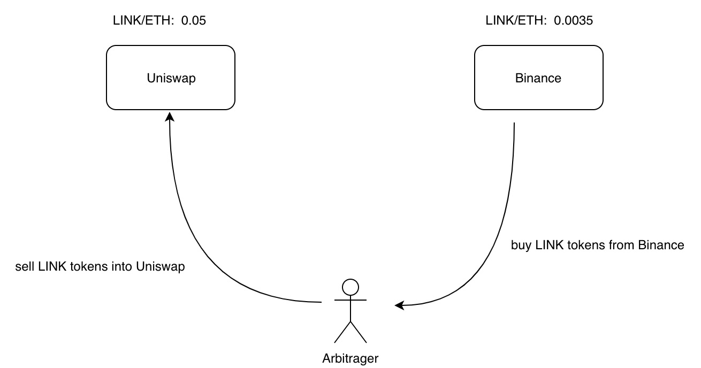
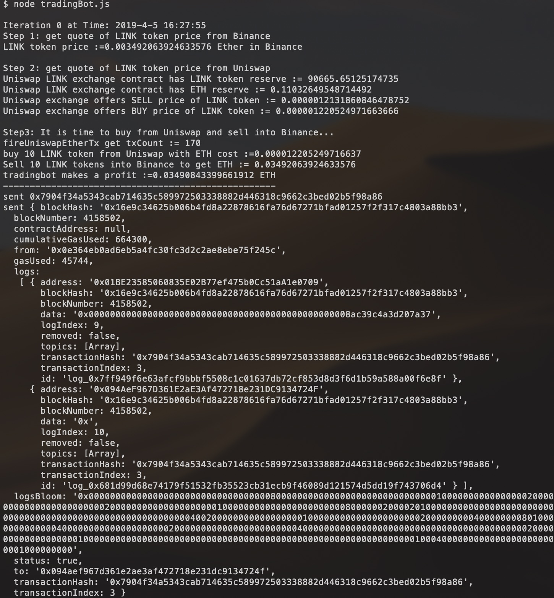
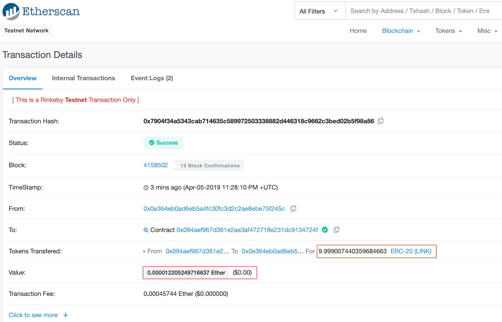

[](https://oceanprotocol.com)

#  Arbitrage Bot

```
name: research on prototype of Arbitrage Bot using Uniswap.
type: research
status: initial draft
editor: Fang Gong <fang@oceanprotocol.com>
date: 04/05/2019
```

# 1. Introduction

Uniswap is a decentralized exchange in Ethereum blockchain network and separated from the external exchanges such as Binance, Bittrex, etc. As such, it is possible that Uniswap offers different buy & sell prices that those from external exchanges. 

It creates an opportunity of arbitrage: people can buy tokens with lower price in one exchange, and sell them at higher price in the other exchange. They can do so continuously 24x7 over the year to make a huge profit. 



This is an **INTERNAL** research on trading-bot which perfoms the arbitrage between Uniswap and Binance. The POC implements a simple prototype in **Rinkeby** testnet using **ETH-LINK** token pair as an example, which can be found in `arbitrage` folder in current directory.

# 2. Key Component

## 2.1 Binance API

In order to connect to Binance, it is required to install the API wrapper from Binance: 

```
$ npm install binance-api-node
```

Import Binance API into Javascript source code as:

```Javascript
const Binance = require('binance-api-node').default

const client = Binance()

// Authenticated client, can make signed calls
const client2 = Binance({
  apiKey: 'vmPUZE6mv9SD5VNHk4HlWFsOr6aKE2zvsw0MuIgwCIPy6utIco14y7Ju91duEh8A',
  apiSecret: 'NhqPtmdSJYdKjVHjA7PZj4Mge3R5YNiP1e3UZjInClVN65XAbvqqM6A7H5fATj0j',
})
```

It offers two different connection mode:

* **Public REST Endpoints**: it does not need credentials and it is used to access public information such as token price, trading volume, etc.
* **Authenticated REST Endpoints**: any trading operation related with orders must provide the credentials (i.e., apiKey, apiSecret) to log in personal account in Binance.

Some operations are used in this POC. For example:

```Javascript
// 1. get deposit address of LINK token in Binance
let depositAddress = await client.depositAddress({ asset: 'LINK' })

// 2. create a sell order
await client2.order({symbol: 'LINKUSDT', side: 'SELL', quantity: 10})

// 3. create a buy order
await client2.order({symbol: 'USDTETH', side: 'BUY', quantity: eth_bought,})

// 4. withdraw tokens back in personal wallet
await client2.withdraw({ asset: 'ETH', address: addressFrom, amount: eth_bought })
```

## 2.2 LINK token contract

It is needed to check the LINK token balance and transfer tokens. 

First, it is needed to create an instance of deployed LINK token contract in Rinkeby:

```Javascript
var linkABI = '[{"constant":true,"inputs":[],"name":"name","outputs":[{"name":"","type":"string"}],"payable":false,"stateMutability":"view","type":"function"},{"constant":false,"inputs":[{"name":"_spender","type":"address"},{"name":"_value","type":"uint256"}],"name":"approve","outputs":[{"name":"","type":"bool"}],"payable":false,"stateMutability":"nonpayable","type":"function"},{"constant":true,"inputs":[],"name":"totalSupply","outputs":[{"name":"","type":"uint256"}],"payable":false,"stateMutability":"view","type":"function"},{"constant":false,"inputs":[{"name":"_from","type":"address"},{"name":"_to","type":"address"},{"name":"_value","type":"uint256"}],"name":"transferFrom","outputs":[{"name":"","type":"bool"}],"payable":false,"stateMutability":"nonpayable","type":"function"},{"constant":true,"inputs":[],"name":"decimals","outputs":[{"name":"","type":"uint8"}],"payable":false,"stateMutability":"view","type":"function"},{"constant":false,"inputs":[{"name":"_to","type":"address"},{"name":"_value","type":"uint256"},{"name":"_data","type":"bytes"}],"name":"transferAndCall","outputs":[{"name":"success","type":"bool"}],"payable":false,"stateMutability":"nonpayable","type":"function"},{"constant":false,"inputs":[{"name":"_spender","type":"address"},{"name":"_subtractedValue","type":"uint256"}],"name":"decreaseApproval","outputs":[{"name":"success","type":"bool"}],"payable":false,"stateMutability":"nonpayable","type":"function"},{"constant":true,"inputs":[{"name":"_owner","type":"address"}],"name":"balanceOf","outputs":[{"name":"balance","type":"uint256"}],"payable":false,"stateMutability":"view","type":"function"},{"constant":true,"inputs":[],"name":"symbol","outputs":[{"name":"","type":"string"}],"payable":false,"stateMutability":"view","type":"function"},{"constant":false,"inputs":[{"name":"_to","type":"address"},{"name":"_value","type":"uint256"}],"name":"transfer","outputs":[{"name":"success","type":"bool"}],"payable":false,"stateMutability":"nonpayable","type":"function"},{"constant":false,"inputs":[{"name":"_spender","type":"address"},{"name":"_addedValue","type":"uint256"}],"name":"increaseApproval","outputs":[{"name":"success","type":"bool"}],"payable":false,"stateMutability":"nonpayable","type":"function"},{"constant":true,"inputs":[{"name":"_owner","type":"address"},{"name":"_spender","type":"address"}],"name":"allowance","outputs":[{"name":"remaining","type":"uint256"}],"payable":false,"stateMutability":"view","type":"function"},{"inputs":[],"payable":false,"stateMutability":"nonpayable","type":"constructor"},{"anonymous":false,"inputs":[{"indexed":true,"name":"from","type":"address"},{"indexed":true,"name":"to","type":"address"},{"indexed":false,"name":"value","type":"uint256"},{"indexed":false,"name":"data","type":"bytes"}],"name":"Transfer","type":"event"},{"anonymous":false,"inputs":[{"indexed":true,"name":"owner","type":"address"},{"indexed":true,"name":"spender","type":"address"},{"indexed":false,"name":"value","type":"uint256"}],"name":"Approval","type":"event"}]'

const linkTokenAddr ='0x01BE23585060835E02B77ef475b0Cc51aA1e0709'
const linkContract = new web3.eth.Contract(JSON.parse(linkABI), linkTokenAddr);
```

As such we can transact with LINK token contract in Rinkeby as:

```Javascript
// 1. get account balance
let balance = await linkContract.methods.balanceOf(address).call()

// 2. transfer LINK tokens
let tx = linkContract.methods.transfer(address, amount);
await fireTx(tx.encodeABI(), linkContract.address)
```

## 2.3 Uniswap exchange contract 

It is must to interact with Uniswap exchange contract:

```Javascript
var uniswapABI = '[{"name": "TokenPurchase", "inputs": [{"type": "address", "name": "buyer", "indexed": true}, {"type": "uint256", "name": "eth_sold", "indexed": true}, {"type": "uint256", "name": "tokens_bought", "indexed": true}], "anonymous": false, "type": "event"}, {"name": "EthPurchase", "inputs": [{"type": "address", "name": "buyer", "indexed": true}, {"type": "uint256", "name": "tokens_sold", "indexed": true}, {"type": "uint256", "name": "eth_bought", "indexed": true}], "anonymous": false, "type": "event"}, {"name": "AddLiquidity", "inputs": [{"type": "address", "name": "provider", "indexed": true}, {"type": "uint256", "name": "eth_amount", "indexed": true}, {"type": "uint256", "name": "token_amount", "indexed": true}], "anonymous": false, "type": "event"}, {"name": "RemoveLiquidity", "inputs": [{"type": "address", "name": "provider", "indexed": true}, {"type": "uint256", "name": "eth_amount", "indexed": true}, {"type": "uint256", "name": "token_amount", "indexed": true}], "anonymous": false, "type": "event"}, {"name": "Transfer", "inputs": [{"type": "address", "name": "_from", "indexed": true}, {"type": "address", "name": "_to", "indexed": true}, {"type": "uint256", "name": "_value", "indexed": false}], "anonymous": false, "type": "event"}, {"name": "Approval", "inputs": [{"type": "address", "name": "_owner", "indexed": true}, {"type": "address", "name": "_spender", "indexed": true}, {"type": "uint256", "name": "_value", "indexed": false}], "anonymous": false, "type": "event"}, {"name": "setup", "outputs": [], "inputs": [{"type": "address", "name": "token_addr"}], "constant": false, "payable": false, "type": "function", "gas": 175875}, {"name": "addLiquidity", "outputs": [{"type": "uint256", "name": "out"}], "inputs": [{"type": "uint256", "name": "min_liquidity"}, {"type": "uint256", "name": "max_tokens"}, {"type": "uint256", "name": "deadline"}], "constant": false, "payable": true, "type": "function", "gas": 82605}, {"name": "removeLiquidity", "outputs": [{"type": "uint256", "name": "out"}, {"type": "uint256", "name": "out"}], "inputs": [{"type": "uint256", "name": "amount"}, {"type": "uint256", "name": "min_eth"}, {"type": "uint256", "name": "min_tokens"}, {"type": "uint256", "name": "deadline"}], "constant": false, "payable": false, "type": "function", "gas": 116814}, {"name": "__default__", "outputs": [], "inputs": [], "constant": false, "payable": true, "type": "function"}, {"name": "ethToTokenSwapInput", "outputs": [{"type": "uint256", "name": "out"}], "inputs": [{"type": "uint256", "name": "min_tokens"}, {"type": "uint256", "name": "deadline"}], "constant": false, "payable": true, "type": "function", "gas": 12757}, {"name": "ethToTokenTransferInput", "outputs": [{"type": "uint256", "name": "out"}], "inputs": [{"type": "uint256", "name": "min_tokens"}, {"type": "uint256", "name": "deadline"}, {"type": "address", "name": "recipient"}], "constant": false, "payable": true, "type": "function", "gas": 12965}, {"name": "ethToTokenSwapOutput", "outputs": [{"type": "uint256", "name": "out"}], "inputs": [{"type": "uint256", "name": "tokens_bought"}, {"type": "uint256", "name": "deadline"}], "constant": false, "payable": true, "type": "function", "gas": 50463}, {"name": "ethToTokenTransferOutput", "outputs": [{"type": "uint256", "name": "out"}], "inputs": [{"type": "uint256", "name": "tokens_bought"}, {"type": "uint256", "name": "deadline"}, {"type": "address", "name": "recipient"}], "constant": false, "payable": true, "type": "function", "gas": 50671}, {"name": "tokenToEthSwapInput", "outputs": [{"type": "uint256", "name": "out"}], "inputs": [{"type": "uint256", "name": "tokens_sold"}, {"type": "uint256", "name": "min_eth"}, {"type": "uint256", "name": "deadline"}], "constant": false, "payable": false, "type": "function", "gas": 47503}, {"name": "tokenToEthTransferInput", "outputs": [{"type": "uint256", "name": "out"}], "inputs": [{"type": "uint256", "name": "tokens_sold"}, {"type": "uint256", "name": "min_eth"}, {"type": "uint256", "name": "deadline"}, {"type": "address", "name": "recipient"}], "constant": false, "payable": false, "type": "function", "gas": 47712}, {"name": "tokenToEthSwapOutput", "outputs": [{"type": "uint256", "name": "out"}], "inputs": [{"type": "uint256", "name": "eth_bought"}, {"type": "uint256", "name": "max_tokens"}, {"type": "uint256", "name": "deadline"}], "constant": false, "payable": false, "type": "function", "gas": 50175}, {"name": "tokenToEthTransferOutput", "outputs": [{"type": "uint256", "name": "out"}], "inputs": [{"type": "uint256", "name": "eth_bought"}, {"type": "uint256", "name": "max_tokens"}, {"type": "uint256", "name": "deadline"}, {"type": "address", "name": "recipient"}], "constant": false, "payable": false, "type": "function", "gas": 50384}, {"name": "tokenToTokenSwapInput", "outputs": [{"type": "uint256", "name": "out"}], "inputs": [{"type": "uint256", "name": "tokens_sold"}, {"type": "uint256", "name": "min_tokens_bought"}, {"type": "uint256", "name": "min_eth_bought"}, {"type": "uint256", "name": "deadline"}, {"type": "address", "name": "token_addr"}], "constant": false, "payable": false, "type": "function", "gas": 51007}, {"name": "tokenToTokenTransferInput", "outputs": [{"type": "uint256", "name": "out"}], "inputs": [{"type": "uint256", "name": "tokens_sold"}, {"type": "uint256", "name": "min_tokens_bought"}, {"type": "uint256", "name": "min_eth_bought"}, {"type": "uint256", "name": "deadline"}, {"type": "address", "name": "recipient"}, {"type": "address", "name": "token_addr"}], "constant": false, "payable": false, "type": "function", "gas": 51098}, {"name": "tokenToTokenSwapOutput", "outputs": [{"type": "uint256", "name": "out"}], "inputs": [{"type": "uint256", "name": "tokens_bought"}, {"type": "uint256", "name": "max_tokens_sold"}, {"type": "uint256", "name": "max_eth_sold"}, {"type": "uint256", "name": "deadline"}, {"type": "address", "name": "token_addr"}], "constant": false, "payable": false, "type": "function", "gas": 54928}, {"name": "tokenToTokenTransferOutput", "outputs": [{"type": "uint256", "name": "out"}], "inputs": [{"type": "uint256", "name": "tokens_bought"}, {"type": "uint256", "name": "max_tokens_sold"}, {"type": "uint256", "name": "max_eth_sold"}, {"type": "uint256", "name": "deadline"}, {"type": "address", "name": "recipient"}, {"type": "address", "name": "token_addr"}], "constant": false, "payable": false, "type": "function", "gas": 55019}, {"name": "tokenToExchangeSwapInput", "outputs": [{"type": "uint256", "name": "out"}], "inputs": [{"type": "uint256", "name": "tokens_sold"}, {"type": "uint256", "name": "min_tokens_bought"}, {"type": "uint256", "name": "min_eth_bought"}, {"type": "uint256", "name": "deadline"}, {"type": "address", "name": "exchange_addr"}], "constant": false, "payable": false, "type": "function", "gas": 49342}, {"name": "tokenToExchangeTransferInput", "outputs": [{"type": "uint256", "name": "out"}], "inputs": [{"type": "uint256", "name": "tokens_sold"}, {"type": "uint256", "name": "min_tokens_bought"}, {"type": "uint256", "name": "min_eth_bought"}, {"type": "uint256", "name": "deadline"}, {"type": "address", "name": "recipient"}, {"type": "address", "name": "exchange_addr"}], "constant": false, "payable": false, "type": "function", "gas": 49532}, {"name": "tokenToExchangeSwapOutput", "outputs": [{"type": "uint256", "name": "out"}], "inputs": [{"type": "uint256", "name": "tokens_bought"}, {"type": "uint256", "name": "max_tokens_sold"}, {"type": "uint256", "name": "max_eth_sold"}, {"type": "uint256", "name": "deadline"}, {"type": "address", "name": "exchange_addr"}], "constant": false, "payable": false, "type": "function", "gas": 53233}, {"name": "tokenToExchangeTransferOutput", "outputs": [{"type": "uint256", "name": "out"}], "inputs": [{"type": "uint256", "name": "tokens_bought"}, {"type": "uint256", "name": "max_tokens_sold"}, {"type": "uint256", "name": "max_eth_sold"}, {"type": "uint256", "name": "deadline"}, {"type": "address", "name": "recipient"}, {"type": "address", "name": "exchange_addr"}], "constant": false, "payable": false, "type": "function", "gas": 53423}, {"name": "getEthToTokenInputPrice", "outputs": [{"type": "uint256", "name": "out"}], "inputs": [{"type": "uint256", "name": "eth_sold"}], "constant": true, "payable": false, "type": "function", "gas": 5542}, {"name": "getEthToTokenOutputPrice", "outputs": [{"type": "uint256", "name": "out"}], "inputs": [{"type": "uint256", "name": "tokens_bought"}], "constant": true, "payable": false, "type": "function", "gas": 6872}, {"name": "getTokenToEthInputPrice", "outputs": [{"type": "uint256", "name": "out"}], "inputs": [{"type": "uint256", "name": "tokens_sold"}], "constant": true, "payable": false, "type": "function", "gas": 5637}, {"name": "getTokenToEthOutputPrice", "outputs": [{"type": "uint256", "name": "out"}], "inputs": [{"type": "uint256", "name": "eth_bought"}], "constant": true, "payable": false, "type": "function", "gas": 6897}, {"name": "tokenAddress", "outputs": [{"type": "address", "name": "out"}], "inputs": [], "constant": true, "payable": false, "type": "function", "gas": 1413}, {"name": "factoryAddress", "outputs": [{"type": "address", "name": "out"}], "inputs": [], "constant": true, "payable": false, "type": "function", "gas": 1443}, {"name": "balanceOf", "outputs": [{"type": "uint256", "name": "out"}], "inputs": [{"type": "address", "name": "_owner"}], "constant": true, "payable": false, "type": "function", "gas": 1645}, {"name": "transfer", "outputs": [{"type": "bool", "name": "out"}], "inputs": [{"type": "address", "name": "_to"}, {"type": "uint256", "name": "_value"}], "constant": false, "payable": false, "type": "function", "gas": 75034}, {"name": "transferFrom", "outputs": [{"type": "bool", "name": "out"}], "inputs": [{"type": "address", "name": "_from"}, {"type": "address", "name": "_to"}, {"type": "uint256", "name": "_value"}], "constant": false, "payable": false, "type": "function", "gas": 110907}, {"name": "approve", "outputs": [{"type": "bool", "name": "out"}], "inputs": [{"type": "address", "name": "_spender"}, {"type": "uint256", "name": "_value"}], "constant": false, "payable": false, "type": "function", "gas": 38769}, {"name": "allowance", "outputs": [{"type": "uint256", "name": "out"}], "inputs": [{"type": "address", "name": "_owner"}, {"type": "address", "name": "_spender"}], "constant": true, "payable": false, "type": "function", "gas": 1925}, {"name": "name", "outputs": [{"type": "bytes32", "name": "out"}], "inputs": [], "constant": true, "payable": false, "type": "function", "gas": 1623}, {"name": "symbol", "outputs": [{"type": "bytes32", "name": "out"}], "inputs": [], "constant": true, "payable": false, "type": "function", "gas": 1653}, {"name": "decimals", "outputs": [{"type": "uint256", "name": "out"}], "inputs": [], "constant": true, "payable": false, "type": "function", "gas": 1683}, {"name": "totalSupply", "outputs": [{"type": "uint256", "name": "out"}], "inputs": [], "constant": true, "payable": false, "type": "function", "gas": 1713}]'

let web3 = new Web3(new Web3.providers.HttpProvider("https://rinkeby.infura.io/Kuo1lxDBsFtMnaw6GiN2"));
// the exchange contract address of LINK token
const uniswapAddr = '0x094AeF967D361E2aE3Af472718e231DC9134724F'
const uniswapContract = new web3.eth.Contract(JSON.parse(uniswapABI), uniswapAddr);
```

We can buy and sell LINK tokens with Uniswap exchange contract:

```Javascript
/*
 @notice Convert ETH to Tokens.
 @dev User specifies exact input (msg.value) and minimum output.
 @param min_tokens Minimum Tokens bought.
 @param deadline Time after which this transaction can no longer be executed.
 @return Amount of Tokens bought.
*/
function ethToTokenSwapInputTx(minTokenOut){
  let tx = uniswapContract.methods.ethToTokenSwapInput(minTokenOut, DEADLINE)
  let encodedABI = tx.encodeABI();
  return encodedABI
}

/*
# @notice Convert ETH to Tokens.
# @dev User specifies maximum input (msg.value) and exact output.
# @param tokens_bought Amount of tokens bought.
# @param deadline Time after which this transaction can no longer be executed.
# @return Amount of ETH sold.
*/
function ethToTokenSwapOutput(tokens_bought){
  let tx = uniswapContract.methods.ethToTokenSwapOutput(tokens_bought, DEADLINE)
  let encodedABI = tx.encodeABI();
  return encodedABI
}

/*
# @notice Convert Tokens to ETH.
# @dev User specifies exact input and minimum output.
# @param tokens_sold Amount of Tokens sold.
# @param min_eth Minimum ETH purchased.
# @param deadline Time after which this transaction can no longer be executed.
# @return Amount of ETH bought.
*/
function tokenToEthSwapInput(tokens_sold, min_eth){
  let tx = uniswapContract.methods.tokenToEthSwapInput(tokens_sold, min_eth, DEADLINE)
  let encodedABI = tx.encodeABI();
  return encodedABI
}

/*
# @notice Convert Tokens to ETH.
# @dev User specifies maximum input and exact output.
# @param eth_bought Amount of ETH purchased.
# @param max_tokens Maximum Tokens sold.
# @param deadline Time after which this transaction can no longer be executed.
# @return Amount of Tokens sold.
*/
function tokenToEthSwapOutput(eth_bought, max_tokens){
  let tx = uniswapContract.methods.tokenToEthSwapOutput(eth_bought, max_tokens, DEADLINE)
  let encodedABI = tx.encodeABI();
  return encodedABI
}
```

We further wrap the token swap functions into simple trading interfaces as:

```Javascript
async function sellToken(token_sold) {
  // approve exchange contract to withdraw erc20 tokens
  let tx = linkContract.methods.approve(uniswapAddr, token_sold);
  await fireTx(tx.encodeABI(), linkContract.address)
  // fire the exchange tx to uniswap
  let encodedABI = tokenToEthSwapInput(token_sold, 1)
  await fireTx(encodedABI, uniswapContract.address)
}

async function buyToken(eth_sold){
  let encodedABI = ethToTokenSwapInputTx(1)
  await fireUniswapEtherTx(encodedABI, eth_sold)
}
```

In addition, it is important to query the token buy/sell price from Uniswap. To do so, we create utility functions which simulates the price calculation inside Uniswap:

```Javascript
function swapSellPrice(input_amount, input_reserve, output_reserve) {
  let input_amount_with_fee = input_amount * 997
  let numerator = input_amount_with_fee * output_reserve
  let denominator = input_reserve * 1000 + input_amount_with_fee
  return numerator / denominator
}

function swapBuyPrice(output_amount, input_reserve, output_reserve){
  let numerator = input_reserve * output_amount * 1000
  let denominator = (output_reserve - output_amount) * 997
  return numerator / denominator + 1
}
```

## 2.4 Utility function

We use web3.js to interact with the deployed contracts. For example, a transaction must be signed and encoded in order to send to the contracts. 

To this end, we add some helper functions to make this process easier:

```Javascript
// 1. send signed transaction to contract with ether
async function fireUniswapEtherTx(encodedABI, eth_sold) {
  // get the number of transactions sent so far so we can create a fresh nonce
  let txCount = await web3.eth.getTransactionCount(addressFrom)

  // construct the transaction data
  const txData = {
      nonce: web3.utils.toHex(txCount),
      gasLimit: web3.utils.toHex(6000000),
      gasPrice: web3.utils.toHex(10000000000),
      to: uniswapAddr,
      from: addressFrom,
      data: encodedABI,
      value: eth_sold
  }

  // fire away!
  sendSigned(txData, function(err, result) {
      if (err) return console.log('error', err)
      //console.log('sent', result)
  })
}

// 2. send signed transactions to contract without ether
async function fireTx(encodedABI, toAddress) {
  // get the number of transactions sent so far so we can create a fresh nonce
  let txCount = await web3.eth.getTransactionCount(addressFrom)

  // construct the transaction data
  const txData = {
      nonce: web3.utils.toHex(txCount),
      gasLimit: web3.utils.toHex(6000000),
      gasPrice: web3.utils.toHex(10000000000),
      to: toAddress,
      from: addressFrom,
      data: encodedABI
  }

  // fire away!
  sendSigned(txData, function(err, result) {
      if (err) return console.log('error', err)
      //console.log('sent', result)
  })
}

// 3. Signs the given transaction data and sends it.
function sendSigned(txData, cb) {
  const privateKey = new Buffer(privKey, 'hex')
  const transaction = new Tx(txData)
  transaction.sign(privateKey)
  const serializedTx = transaction.serialize().toString('hex')
  web3.eth.sendSignedTransaction('0x' + serializedTx, cb)
}
```

## 2.5 Trading Strategy

Current trading strategy is straightforward and simple: compare the price from Uniswap and Binance to buy LINK tokens with lower price and sell LINK tokens at higher price. 

```Javascript
  // 1. if Binance has higher price -> buy from Uniswap and sell into Binance
  if(binanceLinkEth > buyPrice){
    console.log('\nStep3: It is time to buy from Uniswap and sell into Binance...')
    // convert ETH to LINK token
    let amount = Math.round(10 * buyPrice * 1e18)
    const eth_sold = web3.utils.toHex(amount) // each time buy 10 LINK token from Uniswap
    await buyToken(eth_sold)

    // deposit LINK token address
    let depositAddress = await client2.depositAddress({ asset: 'LINK' })
    await linkContract.methods.transfer(depositAddress, 10)
    await client2.order({symbol: 'LINKUSDT', side: 'SELL', quantity: 10})
    let eth_bought = 10 * linkPrice / ethPrice
    await client2.order({symbol: 'USDTETH', side: 'BUY', quantity: eth_bought,})
    await client2.withdraw({ asset: 'ETH', address: addressFrom, amount: eth_bought })
  }

  // 2. if Binance has lower price -> buy from Binance and sell into Uniswap
  if (binanceLinkEth < sellPrice){
    console.log('\nStep 3: It is time to buy from Binance and sell into Uniswap...')
    // deposit ETH in Binance for purchase
    let depositAddress = await client2.depositAddress({ asset: 'ETH' })
    await web3.sendTransaction({to: depositAddress, from: addressFrom, value:web3.toWei(binanceLinkEth * 10 * 1e18, "ether")})
    await client2.order({symbol: 'ETHUSDT', side: 'SELL', quantity: binanceLinkEth * 10 * 1e18})
    await client2.order({symbol: 'USDTLINK', side: 'BUY', quantity: 10})
    await client2.withdraw({ asset: 'LINK', address: addressFrom, amount: 10 })

    // convert LINK token to ETH
    let etherBefore = await web3.eth.getBalance(addressFrom)
    let token_sold = web3.utils.toHex(10*10**18)
    await sellToken(token_sold)
    let etherAfter = await web3.eth.getBalance(addressFrom)
  }
```

# 3. Testing

To run real integrated testing, we need to have Ether in mainnet and real account in Binance. At this time, Binance does not offer sandbox or paper trading. Therefore, live trading must be performed with a real Binance account funded with Ether.

Here, I use the Uniswap contract in Rinkeby to simulate the trading to see how it can profit. It can be put into a loop to be conduct every 5 mins or a longer time. 

In this testing, the trading bot bought 10 LINK tokens from Uniswap and sold them into Binance to make a profit of 0.03490843399661912 ETH (~$5.76)



This trading bot purchases 10 LINK tokens by sending 0.000012205249716637 Ether to the Uniswap exchange contract, which can be verified from Etherscan:




# Reference

* [1] Uniswap Smart Contract:
	* [exchange contract](https://github.com/Uniswap/contracts-vyper/blob/master/contracts/uniswap_exchange.vy)
	* [test token to eth swap](https://github.com/Uniswap/contracts-vyper/blob/master/tests/exchange/test_token_to_eth.py)
	* [utility functions](https://github.com/Uniswap/contracts-vyper/blob/master/tests/conftest.py)
	* [constants for test](https://github.com/Uniswap/contracts-vyper/blob/master/tests/constants.py)
* [2] [Binance API Node.js](https://github.com/binance-exchange/binance-api-node#withdraw)
* [3] [LINK token contract](https://github.com/smartcontractkit/LinkToken/blob/master/contracts/LinkToken.sol)
