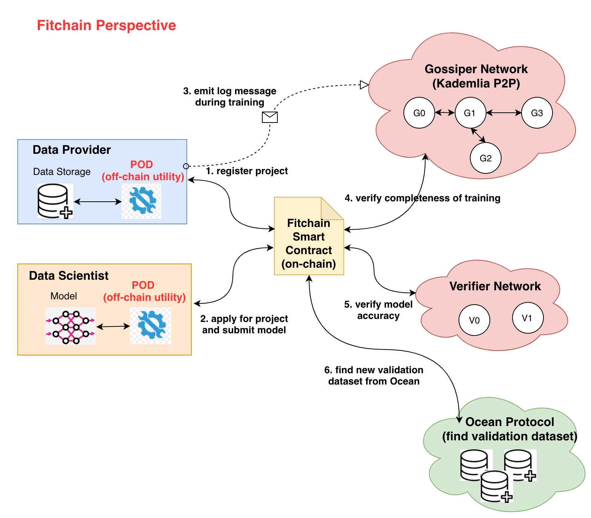

[](https://oceanprotocol.com)

# Fitchain Analysis

```
name: repository of fitchain analysis.
type: research
status: initial draft
editor: Fang Gong <fang@oceanprotocol.com>
date: 01/21/2019
```

## 1. Introduction
This research investigates the following issues of fitchain:

* evaluate Ocean/fitchain integration to determine any gaps
* identify capabilities that fitchain can enable (now vs. future)
* deep dive into fitchain Gossiper network to determine applicability (if any) to Ocean
* research possible model validation methods post fitchain training

## 2. Folder Structure

Folder Name  |  Content Description |
--- | --- | 
fitchain-contracts | smart contract of fitchain business logic (on-chain) |
gossiper | implementation of gossiper network in fitchain (off-chain) |
verifier | implementation of verifier network in fitchain (off-chain) |
img | images for README.md document |


## 3. Fitchain Architecture

The overall fitchain architecture is illustrated as below and includes several modules:

* **POD**: the off-chain component that orchestrates communication and data-model exchange among the actors of the fitchain platform.
* **Fitchain smart contracts**: the on-chain smart contract implementing:
	* Gossipers channel for proof of training
	* Verifiers pool for verification game
	* Commit-Reveal scheme for secure voting
	* Actors registry such as verifiers, gossipers, data owners
	* Model Registry that manages the model life cycle
* **Gossiper network**: the off-chain Kademlia P2P network which replay log messages of model training among gossiper nodes.
* **Verifier netwokr**: the off-chain component where verifier nodes validate model accuracy using the new validation dataset from Ocean.



## 4. Deep Dive into Modules

### 4.1 POD and Fitchain Smart Contracts

* POD is an off-chain component deployed on both Data Provider and Data Scientist sides. It provide interface to all external components including:

	* User interface: dashboard and CLI.
	* Interaction with blockchain & Smart Contract: ethereum, EOS, etc.
	* Storage: IPFS, AWS S3, etc.
	* Data scheme extraction from raw data.
	* ...

* Data provider registers a project in fitchain network (i.e., smart contract) and releases the data scheme in IPFS storage (hash address is published on-chain).

* Data scientist can apply for a project, compose a model based on data scheme in the local, and submit the model to Data Provider for training.


### 4.2 Gossiper Network

* When running the training on the model, **POD** on the data provider side will emit log messages to the Gossiper network as a sequence of messages.

* A `gossiper channel` will be created in smart contract for a specific training process. A subset of gossiper nodes will be randomly chosen and registered in this gossiper channel.

* Each gossiper node that receives an message will broadcast to its neighboring nodes. Therefore, all gossiper nodes in the same `gossiper channel` will be synced with log messages. 


* Each message will become final after a certain number (i.e., k = 3) of gossipers can confirm it. After all messages become final, the training process proves to be complete.

* Merkle root hash of received messaged will be computed to ensure all gossiper nodes receive the same log messages. In the end, each gossiper needs to submit merkle root hash with own signature to Fitchain smart contract.

* Gossiper network can only **verify the completeness of training process** without knowing its accuracy. 


### 4.3 Verifier Network

* Verifier network aims to validate the accuracy of model using new dataset from Ocean.

* The original training data is not accessible to verifiers, therefore, they need to find new dataset which is similar to training data to validate the model accuracy. 

* Each verifier submits own validation result in a commit-reveal process to the Fitchain smart contract. 

* When a certain number (i.e., k = 3) of verifiers can validate the model accuracy, the result becomes final and Fitchain can update the Ocean about model accuracy.


## 5. Investigation (WIP)

* **determine any gaps in Ocean/fitchain integration:**
	*  POD implementation is not available.
	*  Verifier network needs to find validation dataset from Ocean, which is the gap:
		*  how to find new validation dataset from Ocean? 
		*  how Ocean can provide validation data that is similar to training data?
		*  off-chain bridge component passing Fitchain messages to Ocean? (it seems both Ocean and Fitchain are deployed into the same network now?)
	*  ... (on-going investigation)


* **Fitchain Capability:**
	* Present:
		* remote training of AI model on dataset, where POD is a key component.
		* verify completeness of training with gossiper network.

* **Gossiper network capability:**
	* confirm completeness of training process in a decentralized manner.
	* can be used to verify other off-chain event process but needs POD support.

* **Possible model validation:**

## 6. Reference

* [POD off-chain component](https://github.com/fitchain/pod): the off-chain component that orchestrates communication and data-model exchange among the actors of the fitchain platform. (there is no implementation available)
* [Gossiper network](https://github.com/fitchain/gossiper): the off-chain component that verify the completeness of training in a decentralized manner. 
* [Fitchain Smart Contract](https://github.com/fitchain/fitchain-contracts): the on-chain smart contract implementing fitchain business logic.
* [Verifier network](https://github.com/fitchain/verifier): the off-chain component that verify the model correctness/accuracy in a decentralized manner.(the work flow is not complete yet)

