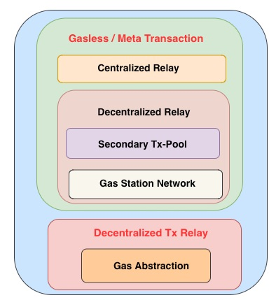
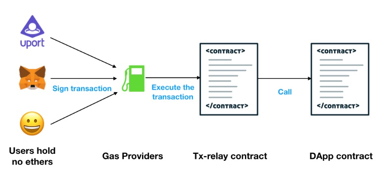
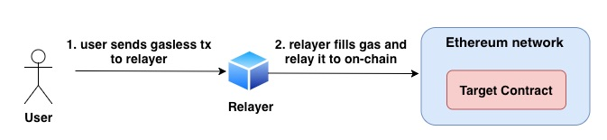
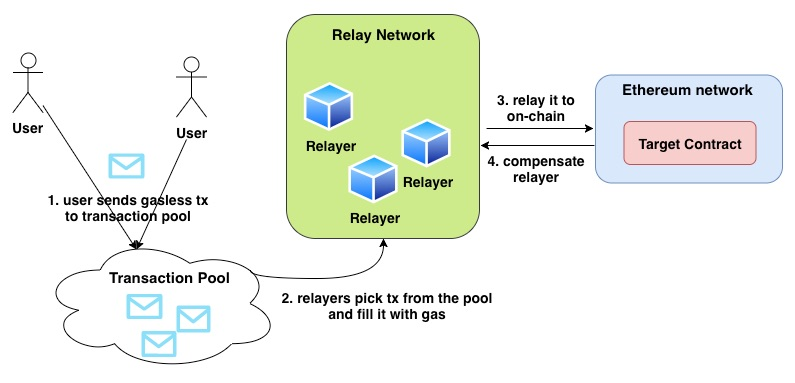
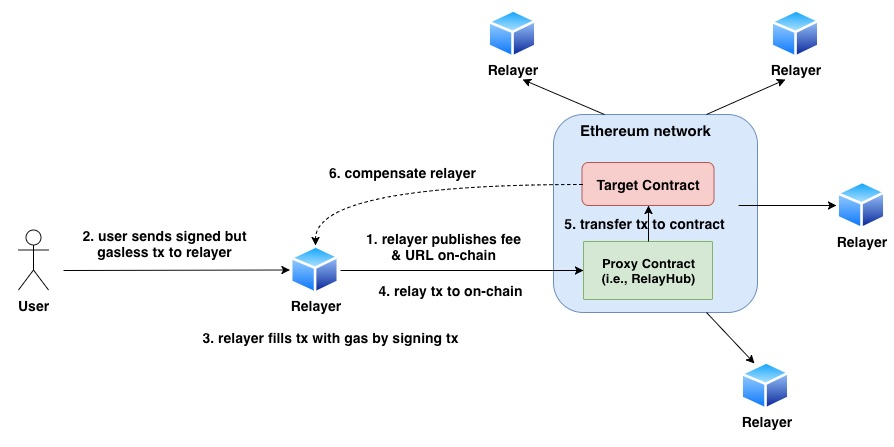
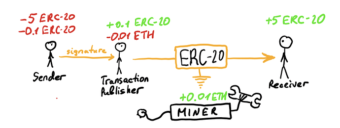

[](https://oceanprotocol.com)

#  Research on Meta Transaction

```
name: research on meta tx for better UX
type: research
status: updated draft
editor: Fang Gong <fang@oceanprotocol.com>
date: 05/14/2019
```

# 1. Introduction

Gas is the transaction fee in Ethereuem network, which pays for the computing cost of transactions. In order to interact with smart contracts on Ethereum, users must have Ether balance in their wallets.

It creates a huge entry barrier for massive adoption of decentralized applications, since users need to go to an exchange, buy ETH, install Metamask wallet and transfer ETH to it. To onboard more new users, it is urgently sought to lower or eliminate the entry barrier in a trustless and decentralized way.

In this research, we investigate many options of meta transaction and further analyze their pros and cons in order to tradeoff between security and usability.


# 2. Overview

The various implementations of meta transaction can be divided into several different categories as follows:



* **Gasless / Meta Transaction**: allow users to send transactions to on-chain contracts without paying any gas
	* **Centralized Relay**: there is one single relayer to fill the gas and relay the gasless transactions from the users;
	* **Decentralized Relay**: there are many relayers (i.e., relayer network) to pick up users' transactions, fill the gas and relay to on-chain contract. It can be further divided into sub-categories as:
		* **Secondary Tx-Pool**: there exists a Tx-pool which buffers the gasless transactions from the users, and relayers are incentivized to relay them to on-chain contract and get corresponding compensation;
		* **Gas Station Network**: there is no Tx-pool in this design. Instead, a proxy contract is deployed on-chain to meditate all relayers; It resolves the synchronization issue for Secondary Tx-pool approach;
* **Gas Abstraction**: it allows users to pay gas using any kind of tokens. It has similar architecture with Gas Station Network but users pay selected tokens to relayers as the gas fee.

We will introduce meta transaction in Section 3 and elaborate Gas Station Network with more details in Section 4. The Gas Abstraction is summarized in Section 5. We present the experiments of Gas Station Network in Section 6.

# 3. Meta Transaction

The idea of meta transaction is: "Signing a transaction with a key that doesn’t own ETH, and then wrapping it with another transaction signed by a key that does own ETH, to pay for the gas. The recipient contract “peels” the outer transaction and uses the inner one" [1]. 

The overview of the general workflow is shown as below:

* **application**: the specific application that assembles the gasless transaction to request services from on-chain smart contract; this is the interface that users need to deal with. 
* **gas provider**: the off-chain servers accept gasless transactions from users and fill it with gas by signing these transactions. 
* **Tx-relay contract**: on-chain open-source smart contract receives the transactions from the gas providers ore relayers, validates signatures and transmits user's tx to the target contract.
* **DApp contract**: the target on-chain contract fulfill the user's request by providing a specific service and compensate the gas providers or relayers for their efforts.



## 3.1 Centralized relays

The most straightfoward approach is to deploy a single relayer to handle all transactions to the smart contracts. In particular, the relayer will validate the signature of the transaction, fill it with gas, and relay it to on-chain conntract.



* **Pro**:
	* simple to implement and operate;
	* it demands little change for on-chain contract;
	* this approach is suitable for the scenario where one single entity provides the relay service for its own on-chain application;

* **Con**:
	* it creates a *centralized* poinnt (e.g., relayer) in the decentralized network;
	* attack or malfunnction of relayer blocks some or all transactions to the network;
	* the relayer becomes a single point of failure and all transactions get lost in that case.


## 3.2 Decentralized relays

Instead, a decentraliezd network of relayers can be built to watch a secondary transaction-pool and serve as secondary miners. Each relayer can only relay one transaction at a time. Also, each transaction can only be relayed by one single relayer so all others get reverted and lose money.

Since it is a decentralized network, the participants (i.e., relayers) must be incentivized to do the work. In fact, relayer will receive different compensations to relay gasless tx to different target contracts. As such, relayers tend to pick the most profitable transactions.

Note that "gas station network" belongs to decentralized relays category, but we will elaborate it in the next section with more details. In this section, we describe this kind of approach with more general overview.

The workflow is shown as below:

* **Transaction Pool**: it is a secondary tx pool to keep all gasless transactions from the users waiting to be relayed to on-chain.
* **Relay Network**: it consists of a few relayer servers and each relayer can pick one gasless tx from the tx pool to relay at a time. They will be compensated by the target contract for the work.



* **Pro**:
	* **trustless**: users and relayers do not need to trust each other;
	* **decentralization**: the relay network is decentralized and there is no central authority can control the relay process;

* **Con**:
	* **synchronization problem**: many relayers will pick the (same) most profitable tx, while the less profitable tx will never be relayed.
	* extra layer of consensus among peer-to-peer relayers can solve the problem but it increases both the runtime latency and tx cost, which makes this approach an overkill.
	* Front running attack: the relayer may deliberately fail its current relay task and use front running attack to compete for the most profitable transaction;

## 3.3 Implementation


* [uport-identity](https://www.uport.me/) implements [txRelay contract](https://github.com/uport-project/uport-identity):
	* txRelay [document](https://github.com/uport-project/uport-identity/blob/develop/docs/reference/txRelay.md)
* [aragon labs](https://aragon.org) implements research work of [Pay Protocol](https://github.com/aragonlabs/pay-protocol) in July 2018
* [Austin Thomas Griffith](https://twitter.com/austingriffith) implements [native meta transactions](https://github.com/austintgriffith/native-meta-transactions), Dec. 2018
* [Gnosis Safe](https://safe.gnosis.io/) includes [Meta Transactions relays](https://gnosis-safe.readthedocs.io/en/latest/contracts/meta_tx.html)
	* demo exists on Rinkeby `truffle unbox gnosis/safe-demo`
* [Status](https://status.im) implements the [gas relayer](https://github.com/status-im/snt-gas-relay) with idea presented in [gas relayer protocol](https://github.com/status-im/snt-gas-relay/blob/master/relayer-protocol.md), Dec. 3, 2018. 
	* it receives the tx from users as messages and relay tx to on-chain Status services.
	* Stauts also implements [IdentityGasRelay](https://github.com/status-im/contracts/blob/73-economic-abstraction/contracts/identity/IdentityGasRelay.sol) in April, 2018
* [Tenzorum](https://tenzorum.org/) uses MetaCartel's meta transaction implementations [Github](https://github.com/Meta-tx/Harbour-MVP) with [Gasless Tx Formt](https://github.com/Tenzorum/meta-transaction-format-share/blob/master/tenzorum.org.md)
* [Zippie](https://zippie.org/) implements [Pay My Gas (PMG)](https://zippiehq.github.io/Overview/Pay%20My%20Gas) to onboard new users in 10s with zero downloads or extensions.
* Meta-tx powered by [Shipl.co](https://shipl.co/)


## 3.4 Related EIP and ERC Standard


* [EIP 1077: Executable Signed Messages refunded by the contract](https://github.com/ethereum/EIPs/blob/master/EIPS/eip-1077.md)
* [EIP1035: Transaction execution batching and delegation](https://github.com/ethereum/EIPs/issues/1035)
* [ERC 1228: Delegated Execution](https://github.com/ethereum/EIPs/issues/1228)
* [ERC 1776: Native Meta Transactions](https://github.com/ethereum/EIPs/issues/1776)


# 4. Gas Station Network

Gas station network is a hot topic and was first proposed in [EIP 1613: Gas Station Network](http://eips.ethereum.org/EIPS/eip-1613). The most widely-used implementation in production stage is developed by [Tabookey](https://www.tabookey.com/).

## 4.1 Architecture

Gas Stations Network is a decentralized and trustless way to add **reverse-charge calls** to smart contracts. The contract takes care of paying for verified transactions, so users can start using the service immediately. 

The overall architecture based on Tabookey's implementation is illustrated as below:

**1. Components**:

* **Target contract**: the on-chain smart contract provides services to users and compensates relays for its effort (i.e., relaying gasless transactions to on-chain);
* **Proxy Contract**: on-chain contract maintains a registry of relays and transfer relayed transactions to target contract; RelayHub in Tabookey's implementation is the proxy contract.
* **Relayer**: off-chain node receives user's gasless request, fill it with gas by signing them, and transfer to on-chain contract; there are many relayers to form a decentralized relay network; they need put stakes in Proxy contract and their stakes will be slashed in case of fraudulence.



**2. Workflow**:

1. Relayer publishes its transactions fees and URLs to on-chain;
2. User can choose the Relayer based on reputation, response time, or other information;
3. User sends gasless transaction to the Relayer off-chain;
4. Relayer fill the tx with gas by signing them;
5. Relayer transfer the signed tx to on-chain RelayHub contract;
6. RelayHub contract validates the signature and transmits the tx to the target contract;
7. Target contract compensates the Relayer for its work.

This mechanism allows sending gasless transactions to Ethereum, as long as there is a party who is interested, or incentivized in a way, to cover the gas costs with own funds.

* **Pro**: 
	* trustless and decentralized method;
	* does not require hard fork or even a soft fork of existing protocol;
	* agnostic to blockchain network infrastructure;
	* backwards compatible with existing applications;

* **Con**:
	* Censorship attack: relayers may censor a tx by not signing it or ignoring tx from a specific user;
	* Fraudulent relayer attack: user register own relayer and send expensive but meaningless/reverted transactions, causing the target contract to pay a relay for nothing;
	

## 4.2 Various Funding Model

1. **Charge Users**: charge users through credit cards or any supported method, purchase ETH using received funds, deposit in contract to compensate relays. 
	* [crypto exchange](https://radarrelay.com/) charges a portion of tokens in the crypto exchange to cover the gas cost.
	* [EthBattle](https://ethbattle.io/) takes some portion of the win prize to cover the gas cost.
2. **Monetize User Activity**: allow users to make a certain amount of daily gasless transactions, but the contract can monetize user's activities somewhere else (e.g., advertising, selling accessories, etc.)
	* [uport](https://www.uport.me) covers the gas cost and benefits from wider use of the DAPP. 
3. **Pre-vetted Users**: the contract pay for its pre-vetted users, funding the transaction from its own revenues. Pre-vetted users will never be charged, but they can be locked out if they abuse this trust. 
	* [BouncerProxy](https://github.com/austintgriffith/bouncer-proxy) is a good example. A bouncer proxy contract is deployed and funded with ETH, which allows pre-vetted devices (i.e., bouncers) to make Ethereuem transactions through the proxy contract without paying gas.

## 4.3 Implementation

* Zeppelin & TabooKey Gas Station Network Alliance [**Production Mode**]: 
	* Github: [Tabookey gasless transaction](https://github.com/tabookey/tabookey-gasless); 
	* Instruction: [step to make an dapp use gas station network](https://medium.com/tabookey/how-to-make-your-dapp-gasless-da15d4d3cacd)
* [Universal Login](https://universallogin.io/) uses TabooKey's Gas Station Network
	*  Github: [Ethereum Universal Login SDK](https://github.com/UniversalLogin/UniversalLoginSDK)
*  [Burner wallet](https://medium.com/gitcoin/burner-wallet-at-ethdenver-was-faa3851ea833) uses TabooKey's Gas Station Network
	*  Github: [Burner Wallet](https://github.com/austintgriffith/burner-wallet)
*  [Austin Thomas Griffith](https://austingriffith.com/) implements [BouncerProxy](https://github.com/austintgriffith/bouncer-proxy) 
* [MetaCartel](https://meta-tx.github.io/) community that drives adoption of TabooKey's Gas Station Network
	* Github: [Harbor: a decentralized p2p meta-tx relayer network (MVP)](https://github.com/Meta-tx/Harbour-MVP)
* [Portis](https://portis.io) sponsors users' gas fees with TabooKey's Gas station network [document](https://medium.com/@portis/sponsor-your-users-gas-fees-with-portis-and-tabookey-s-gas-stations-network-7fd7c8406869), March 2019

## 4.4 Related EIP

* [EIP 1613: Gas stations network](http://eips.ethereum.org/EIPS/eip-1613) and [EIP-1613 document in github](https://github.com/ethereum/EIPs/blob/master/EIPS/eip-1613.md)


# 5. Gas Abstraction

Gas abstration enables users to pay gas fee with any token that is valuable to the network in one single transaction. In general, users can sign a message to contracts which use selected tokens to refund proportional used gas to an incentivized ETH owner to include that message in a transaction.

## 5.1 Architecture

The implementation of Gas Abstraction is similar to Gas Station Network, but the relayer receives selected tokens (e.g., ERC-20 compatible tokens) from users and pay ETH as the gas.

As shown in the following workflow, users can specify in which currency will be used to pay the gas fee when transferring any ERC20 tokens. The relayer receives the ERC20 token and exchange for ETH to pay for the gas. As such, users can pay directly in any ERC20 token they wish, never needing to possess ETH.



* **Pro**:
	* decentralized applications don't need to subsidize users with their own funds;
	* it requires no change in on-chain contracts;

* **Con**:
	* users need other tokens to pay for gas (e.g., ERC20 tokens in their wallet);
	* users need to know the way to operate wallet and send tokens;
	* relayer shall agree to accept the user-specified tokens as gas payment.

## 5.2 Implementation

* Wrapper Contract: [General Meta Transaction Wrapper Contract for ERC20](https://github.com/horizon-games/ERC20-meta-wrapper), May 2019
* [Swam City Lab](https://thisis.swarm.city/) implements an experimental service providing a way to exchange ERC20 tokens for ETH to pay for transaction. 
	* [Github repository](https://github.com/swarmcity/SCLabs-gasstation-service)
* [Status](https://status.im) implements the [gas abstraction](https://github.com/status-im/snt-gas-relay) 
	* Gas Abstraction Ideas [document](https://ideas.status.im/ideas/150-gas-abstraction)
* [Iuri Matias](https://twitter.com/iurimatias) implements [Transaction Relay](https://github.com/iurimatias/TransactionRelay)
* [Gnosis Safe](https://safe.gnosis.io/) implements [Transaction Relay Service](https://gnosis-safe.readthedocs.io/en/latest/services/relay.html)

## 5.3 Related EIP:

* [ERC 865: Pay transfers in tokens instead of gas, in one transaction](https://github.com/ethereum/EIPs/issues/865)
* Eth Research: [ERC20 backward-compatible gas abstraction using Constantinople’s EIP 1014](https://ethresear.ch/t/erc20-backward-compatible-gas-abstraction-using-constantinoples-eip-1014/4798)


# 6. Reference

* [1] ["1–800-Ethereum: Gas Stations Network for Toll Free Transactions"](https://medium.com/tabookey/1-800-ethereum-gas-stations-network-for-toll-free-transactions-4bbfc03a0a56), Jan 9, 2019
* [2] [No Eth? No Wallet?! No Problem! How to Make Your Dapp Work Gasless for Those Poor Crypto Muggles](https://medium.com/tabookey/how-to-make-your-dapp-gasless-da15d4d3cacd), Feb 14, 2019
* [3] [Ethereum Meta Transactions](https://medium.com/@austin_48503/ethereum-meta-transactions-90ccf0859e84), Aug 10, 2018
* [4] [Ethereum meta transactions](https://medium.com/@e2toe4/ethereum-meta-transactions-36f10448619), Jan 8, 2019
* [5] [EIP 1613: Gas stations network](http://eips.ethereum.org/EIPS/eip-1613) and [EIP-1613 document](https://github.com/ethereum/EIPs/blob/master/EIPS/eip-1613.md#attacks-and-mitigations)
* [6] [EIP 1077: Executable Signed Messages refunded by the contract](https://github.com/ethereum/EIPs/blob/master/EIPS/eip-1077.md)
* [7] [The State of Meta Transactions](https://hackernoon.com/the-state-of-meta-transactions-d00735a4e3af)
* [8] [Native Meta Transactions](https://medium.com/gitcoin/native-meta-transactions-e509d91a8482)
* [9] [Meta Transactions and Executable Signed Txns](https://github.com/jpitts/eth-community-discussions/blob/master/meta-transactions.md), Sep. 2018
* [10] [DAI in the hands of all— You can now send DAI without paying Ether gas fees](https://medium.com/lamarkaz/dai-in-the-hands-of-all-8ed335879ae9)
* [11] [Swarm City Gas Relayer](https://github.com/swarmcity/SCLabs-gasstation-service) 
* [12] [ERC865: Pay transfers in tokens instead of gas, in one transaction](https://github.com/ethereum/EIPs/issues/865)