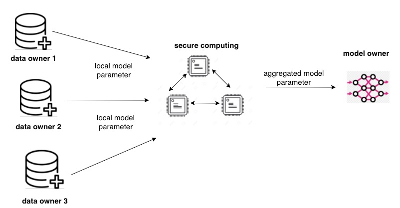
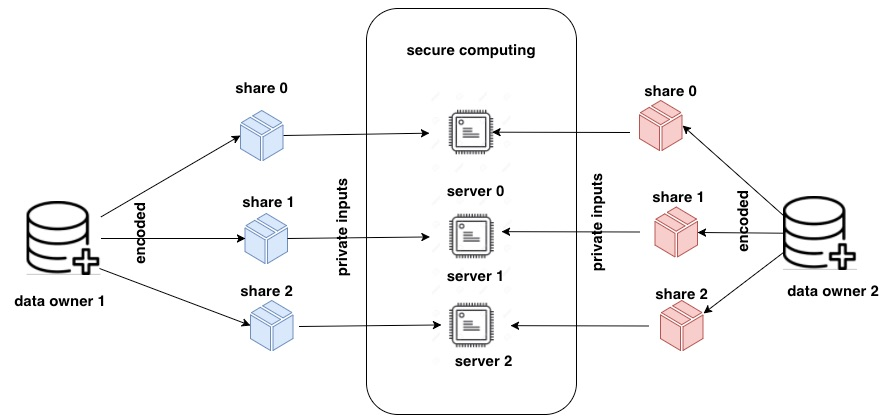

[](https://oceanprotocol.com)

#  Research on TF-Encrypted

```
name: research on tf-encrypted for privacy-preserving machine learning
type: research
status: updated draft
editor: Fang Gong <fang@oceanprotocol.com>
date: 05/25/2019
```

# 1. Introduction

TF-encrypted is a Python library built on top of Tensorflow to run privacy-preserving machine learning. It provides an interface similar to that of Tensorflow, so AI researchers need less effort to use it. 

To preserve the data privacy, this approach leverages the multi-party computing (MPC) framework to compute weight updates in AI algorithm without revealing raw dataset. 

It is currently **experimental** software and not ready for production environment. Its source code can be found in [Github](https://github.com/tf-encrypted/tf-encrypted).


# 2. Overview

Let us take federated learning as an example to illustrate the overall architecture of tf-encrypted.

In this case, each data owner has his local private data and the model owner need to train his model across all private datasets. More importantly, this process should have NO privacy leakage of dataset.

* Step 1: **(local training)**
	* each data owner compute the gradients and weight updates on his *locally* held dataset. 
	* data owner encodes the gradients and split into shares for MPC (i.e., *secret sharing*)
* Step 2: **secure computing**
	* each computing server receives one share of the encoded gradients.
	* secure aggregation is performed with MPC appraoch to compute the *mean of gradient*.
* Step 3: **decrypt result**
	* only the mean gradient is revealed to the model owner

The process is repeated for each iteration in AI training algorithm.



# 3. Data Flow

Each data owner takes the original model parameters from the model owners as his input. Then, data owners train the model on their local dataset without any leakage. 

Data owner encode the computed gradients into several `shares`, where each single share cannot reveal the gradient by itself. Those `shares` are transmitted to different computing servers in MPC as private input. 

As such, each computing server only see a piece of the gradient result from each data owner. However, all these servers can work together to calculate the mean gradient as MPC method.

Only the **mean gradient** will be released to the model owner as the result of currnet iteration.




# 4. Operation

Install the Python package (Python 3.5+ and TensorFlow 1.12.0+)

```
pip3 install tf-encrypted
```

Simple example of `matrix multiplication` on encrypted data using TF Encrypted:

```
import tensorflow as tf
import tf_encrypted as tfe

def provide_input():
    # normal TensorFlow operations can be run locally
    # as part of defining a private input, in this
    # case on the machine of the input provider
    return tf.ones(shape=(5, 10))

# define inputs
w = tfe.define_private_variable(tf.ones(shape=(10,10)))
x = tfe.define_private_input('input-provider', provide_input)

# define computation
y = tfe.matmul(x, w)

with tfe.Session() as sess:
    # initialize variables
    sess.run(tfe.global_variables_initializer())
    # reveal result
    result = sess.run(y.reveal())
```

# 5. Running Mode

TF-encrypted needs a configuration file `config.json` to set the different parties. For example, below shows the IP and port number of each different party including three servers and one data owner.

```
{
    "server0": "10.0.0.10:4440",
    "server1": "10.0.0.11:4440",
    "server2": "10.0.0.12:4440",
    "data-owner": "10.0.0.20:4440",
    "model-owner": "10.0.0.30:4440"
}
```

So the config can be loaded into tf-encrypted as:

```
config = tfe.RemoteConfig.load('config.json')
tfe.set_config(config)
```

### 5.1 Simulated Mode

For development purpose, simulated mode is a convenient way of simulating computations by running everything on the local machine, using different threads for each player. 

In this model, configuration will be created as needed (`tfe.set_config(LocalConfig())`)

It is useful to test out the workflow and debug any potential bugs before moving to network environment.

As an example of tf-encrypted, we can run federated learning with 2000 iterations. The output is `tf.print('expect', loss, y, y_hat, summarize=50)`:

```
$ python3 examples/federated-learning/run.py 
INFO:tf_encrypted:Players: ['server0', 'server1', 'server2', 'model-owner', 'data-owner-0', 'data-owner-1', 'data-owner-2']
2019-06-05 15:01:05.640647: I tensorflow/core/platform/cpu_feature_guard.cc:141] Your CPU supports instructions that this TensorFlow binary was not compiled to use: AVX2 FMA
Iteration 0
expect 24.1210613 [5 0 4 1 9 2 1 3 1 4 3 5 3 6 1 7 2 8 6 9 4 0 9 1 1 2 4 3 2 7 3 8 6 9 0 5 6 0 7 6 1 8 7 9 3 9 8 5 9 3] [8 8 8 8 7 8 4 8 4 3 5 5 4 5 5 8 5 8 1 5 3 8 5 8 4 4 5 4 8 5 5 8 3 5 8 5 5 8 5 3 5 4 5 5 5 8 8 5 5 4]
expect 15.9842739 [5 0 4 1 9 2 1 3 1 4 3 5 3 6 1 7 2 8 6 9 4 0 9 1 1 2 4 3 2 7 3 8 6 9 0 5 6 0 7 6 1 8 7 9 3 9 8 5 9 3] [4 8 0 9 7 3 4 7 4 3 5 9 4 3 9 8 5 8 1 5 3 8 5 9 4 7 9 4 8 5 5 8 3 3 4 3 4 8 4 3 9 4 3 5 4 8 8 5 4 4]
...
expect 0.500440776 [5 0 4 1 9 2 1 3 1 4 3 5 3 6 1 7 2 8 6 9 4 0 9 1 1 2 4 3 2 7 3 8 6 9 0 5 6 0 7 6 1 8 7 9 3 9 8 5 9 3] [5 0 4 1 9 2 1 3 1 4 3 5 3 6 1 7 2 8 6 9 4 0 4 1 1 2 4 3 7 7 3 8 6 7 0 5 6 0 7 6 1 8 7 9 7 9 8 5 8 3]
expect 0.498264909 [5 0 4 1 9 2 1 3 1 4 3 5 3 6 1 7 2 8 6 9 4 0 9 1 1 2 4 3 2 7 3 8 6 9 0 5 6 0 7 6 1 8 7 9 3 9 8 5 9 3] [5 0 4 1 9 2 1 3 1 4 3 5 3 6 1 7 2 8 6 9 4 0 4 1 1 2 4 3 7 7 3 8 6 7 0 5 6 0 7 6 1 8 7 9 7 9 8 5 3 3]
expect 0.247916296 [5 0 4 1 9 2 1 3 1 4 3 5 3 6 1 7 2 8 6 9 4 0 9 1 1 2 4 3 2 7 3 8 6 9 0 5 6 0 7 6 1 8 7 9 3 9 8 5 9 3] [5 0 4 1 9 2 1 3 1 4 3 5 3 6 1 7 2 8 6 9 4 0 9 1 1 2 4 3 7 7 3 8 6 7 0 5 6 0 7 6 1 8 7 9 7 9 8 5 8 3]
expect 0.234102711 [5 0 4 1 9 2 1 3 1 4 3 5 3 6 1 7 2 8 6 9 4 0 9 1 1 2 4 3 2 7 3 8 6 9 0 5 6 0 7 6 1 8 7 9 3 9 8 5 9 3] [5 0 4 1 9 2 1 3 1 4 3 5 3 6 1 7 2 8 6 9 4 0 9 1 1 2 4 3 7 7 3 8 6 7 0 5 6 0 7 6 1 8 7 9 7 9 8 5 8 3]
```

### 5.2 Networked Mode

In real applications, data owners and computing servers are different entities. Each of them may host in different machine with dedicated IP address. 

In this case, each party (such as server0, server1, ..., data-owner, model-owner) on its machine shall be launched as:

```
python3 -m tf_encrypted.player {server0/server1/.../data-owner/model-owner} --config config.json
```

With the configuration file, they can discover each other and setup the communication between them.


# 6. Reference

* [1] githube code [tf-encrypted](https://github.com/tf-encrypted/tf-encrypted)
* [2] dropout labs [website](https://dropoutlabs.com/)