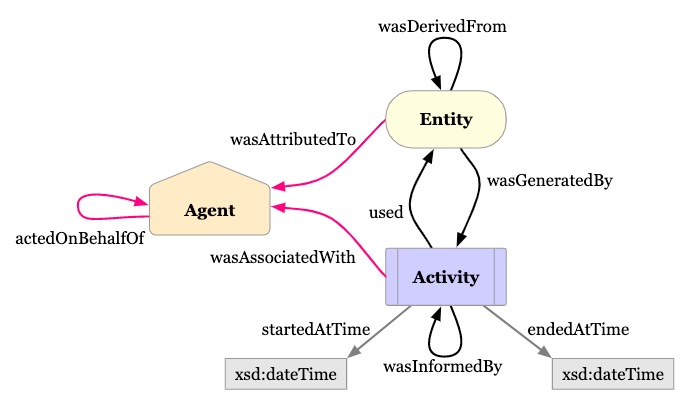
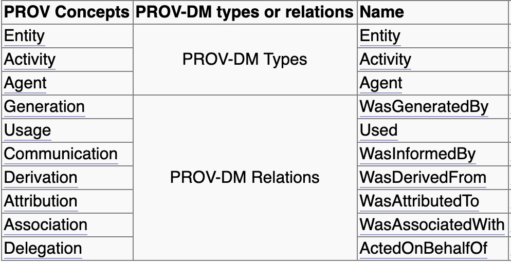
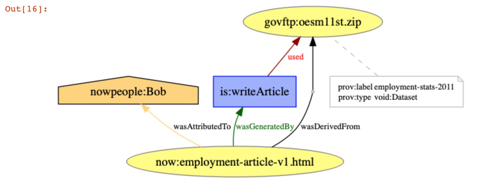
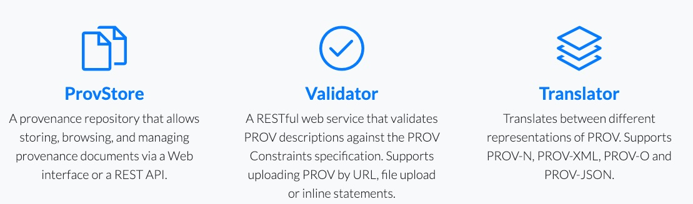

[](https://oceanprotocol.com)

#  Research on Data Provenancce

```
name: research on data provenance
type: research
status: updated draft
editor: Fang Gong <fang@oceanprotocol.com>
date: 06/11/2019
```

# 1. Introduction

Data provenance tracks changes that are made to data, where data originates and moves to, and who makes changes to it over time. This historical record of information can then be trusted for data validation and audit purposes.

It involves three components:

* **Entities**: physical, digital, conceptual, or other kinds of thing are called `entities`. Such entity is `data` inside Ocean network.
* **Agents**: An agent takes a role in an activity such that the agent can cause entities to change. 
* **Activities**: An activity is something that occurs over a period of time and acts upon or with entities. It may include consuming, processing, transforming, modifying, relocating, using, or generating entities. 



Note that `data provenance` only shows **the operation history in the past for data auditability and integrity** rather than operation plan in the future.

In this research, we investigate the way to establish data provenance in a decentralized system allowing to validate integrity of this provenance information, including:

* register relationship between source and derived entities
* register activities (attributes? on-chain or off-chain?)
* associate activities to the input and output entities in a workflow
* validate cryptographically that entity was generated from a specific input entity in a specific activity
* register information with low friction
* potentially visualize provenance information


# 2. PROV Data Model

The PROV data model includes a core set of types and relations commonly found in provenance for more specific uses. 

In particular, the data model includes both `Type` and `Relation` categories

* `Type` category contains `entitiy`, `activity` and `agent`, which are core components.
* `Relations` category defines key relationships between different type of components, which can be mapped into specific PROV model relations. 



### 2.1 register new entity generated by an agent

`Generation` is the completion of production of a new entity by an activity. This entity did not exist before generation and becomes available for usage after this generation.

`Generation`, written `wasGeneratedBy(id; e, a, t, attrs)` in PROV-N (a notation for provenance aimed at human consumption), has:

* `id`: an optional identifier for a generation;
* `entity`: an identifier (e) for a created entity;
* `activity`: an optional identifier (a) for the activity that creates the entity;
* `time`: an optional "generation time" (t), the time at which the entity was completely created;
* `attributes`: an optional set (attrs) of attribute-value pairs representing additional information about this generation.

While each of `id`, `activity`, `time`, and `attributes` is optional, at least one of them must be present.

PROV uses [qualified names](https://www.w3.org/TR/prov-dm/#term-identifier) to identify things in the data provenance, which essentially a shortened representation of a URI in the form of `prefix:localpart`.

Example:

```
  wasGeneratedBy(e1, a1, 2001-10-26T21:32:52)
  wasGeneratedBy(e2, a1, 2001-10-26T10:00:00)
```
  
state the existence of two generations (with respective times `2001-10-26T21:32:52` and `2001-10-26T10:00:00`), at which new entities, identified by `e1` and `e2`, were created by an activity, identified by `a1`. 

### 2.2 register relationship between source and derived entities

`Derivation` is a transformation of an entity into another, an update of an entity resulting in a new one, or the construction of a new entity based on a pre-existing entity.


A `derivation`, written `wasDerivedFrom(id; e2, e1, a, g2, u1, attrs)` in PROV-N, has:

* `id`: an optional identifier for a derivation;
* `generatedEntity`: the identifier (e2) of the **derived entity** generated by the derivation;
* `usedEntity`: the identifier (e1) of the **source entity** used by the derivation;
* `activity`: an optional identifier (a) for the activity using and generating the above entities;
* `generation`: an optional identifier (g2) for the generation involving the generated entity (e2) and activity (a);
* `usage`: an optional identifier (u1) for the usage involving the used entity (e1) and activity (a);
* `attributes`: an optional set (attrs) of attribute-value pairs representing additional information about this derivation.


The following descriptions are about derivations between `e2` and `e1`, but no information is provided as to the identity of the activity (and usage and generation) underpinning the derivation. In the second line, a type attribute is also provided.

```
wasDerivedFrom(e2, e1)
wasDerivedFrom(e2, e1, [ prov:type="physical transform" ])
```

The following description expresses that activity `a`, using the entity `e1` according to usage `u1`, derived the entity `e2` and generated it according to generation `g2`. It is followed by descriptions for generation `g2` and usage `u1`.

```
wasDerivedFrom(e2, e1, a, g2, u1)
wasGeneratedBy(g2; e2, a, -)
used(u1; a, e1, -)
```

With such a comprehensive description of derivation, a program that analyzes provenance can identify the activity underpinning the derivation, it can identify how the preceding entity `e1` was used by the activity (e.g. for instance, which argument it was passed as, if the activity is the result of a function invocation), and which output the derived entity `e2` was obtained from (say, for a function returning multiple results).


### 2.3  register activities (attributes? on-chain or off-chain?)

An `activity` is something that occurs over a period of time and acts upon or with entities; it may include consuming, processing, transforming, modifying, relocating, using, or generating entities.

An `activity`, written `activity(id, st, et, [attr1=val1, ...])` in PROV-N, has:

* `id`: an identifier for an activity;
* `startTime`: an optional time (st) for the start of the activity;
* `endTime`: an optional time (et) for the end of the activity;
* `attributes`: an optional set of attribute-value pairs ((attr1, val1), ...) representing additional information about this activity.

Example:

```
activity(a1, 2011-11-16T16:05:00, 2011-11-16T16:06:00,
        [ ex:host="server.example.org", prov:type='ex:edit' ])
```

states the existence of an activity with identifier `a1`, `start time 2011-11-16T16:05:00`, and `end time 2011-11-16T16:06:00`, running on `host server.example.org`, and of `type edit`.


### 2.4 associate activities to the input and output entities 

When the activities generate an output entity using input entity, it can be described as `Derivation` written as `wasDerivedFrom(id; e2, e1, a, g2, u1, attrs)` in PROV-N. It associates the activity `a` to the input entity `e1` and output entity `e2`.

### 2.5 validate `Derivation` cryptographically

To guarantee data integrity, it is needed to validate cryptographically that entity was generated from a specific input entity in a specific activity. However, it is super expensive to record all data provenance information to be on-chain. 

Instead, we can only keep the hash in keeper contract, therefore, the data provenance info can be pulled out from database and validated using on-chain hash. Only the account with governance permission can update the off-chain data governance record and on-chain hash.

### 2.6 register information with low friction

Since only `hash` of data provenance will be kept on-chain, it has low friction to change keeper contract. All details of data provenance are stored in off-chain database along with other metadata info for data assets.

### 2.7 potentially visualize provenance information

Provenancce Graph Visualization [ProvVis](https://openprovenance.org/vis/) that displays the relationships between activities, entities and agents in a PROV-JSON file:

* [Gantt chart](https://openprovenance.org/vis/gantt/)
* [Hive plot](https://openprovenance.org/vis/hive/)
* [Wheel](https://openprovenance.org/vis/wheel/)

# 3. PoC using Prov Python

We test the Python tool for PROV data model at [Prov Python](http://pypi.python.org/pypi/prov). This is documentation of a simple [example](https://prov.readthedocs.io/en/latest/usage.html)

### 3.1 Insntall Package

To install the prov library using pip with support for graphical exports:

```
pip install prov
```

Install jupyter notebook and launch it:

```
pip install jupyter
jupyter notebook
```

### 3.2 create PROV example

The PROV example from book [8] is generated in the [ipynb file](PROV.ipynb):

```
document
  prefix now <http://www.provbook.org/nownews/>
  prefix nowpeople <http://www.provbook.org/nownews/people/>
  prefix bk <http://www.provbook.org/ns/#>
  prefix govftp <ftp://ftp.bls.gov/pub/special.requests/oes/>
  prefix void <http://vocab.deri.ie/void#>
  
  entity(now:employment-article-v1.html)
  agent(nowpeople:Bob)
  wasAttributedTo(now:employment-article-v1.html, nowpeople:Bob)
  entity(govftp:oesm11st.zip, [prov:label="employment-stats-2011", prov:type="void:Dataset"])
  wasDerivedFrom(now:employment-article-v1.html, govftp:oesm11st.zip, -, -, -)
endDocument
```

### 3.3 export to JSON format

It can be converted into JSON format as `print(d1.serialize(indent=2))`

```
{
  "prefix": {
    "now": "http://www.provbook.org/nownews/",
    "nowpeople": "http://www.provbook.org/nownews/people/",
    "bk": "http://www.provbook.org/ns/#",
    "govftp": "ftp://ftp.bls.gov/pub/special.requests/oes/",
    "void": "http://vocab.deri.ie/void#",
    "is": "http://www.provbook.org/nownews/is/#"
  },
  "entity": {
    "now:employment-article-v1.html": {},
    "govftp:oesm11st.zip": {
      "prov:label": "employment-stats-2011",
      "prov:type": "void:Dataset"
    }
  },
  "agent": {
    "nowpeople:Bob": {}
  },
  "wasAttributedTo": {
    "_:id1": {
      "prov:entity": "now:employment-article-v1.html",
      "prov:agent": "nowpeople:Bob"
    }
  },
  "wasDerivedFrom": {
    "_:id2": {
      "prov:generatedEntity": "now:employment-article-v1.html",
      "prov:usedEntity": "govftp:oesm11st.zip"
    }
  },
  "activity": {
    "is:writeArticle": {}
  },
  "used": {
    "_:id3": {
      "prov:activity": "is:writeArticle",
      "prov:entity": "govftp:oesm11st.zip"
    }
  },
  "wasGeneratedBy": {
    "_:id4": {
      "prov:entity": "now:employment-article-v1.html",
      "prov:activity": "is:writeArticle"
    }
  }
}
```

### 3.4 serialize to JSON file

The PROV model data can be serialized JSON format into a file as:

```
d1.serialize('article-prov.json')
```
it creates a local file `article-prov.json` as 

```
{"prefix": {"now": "http://www.provbook.org/nownews/", "nowpeople": "http://www.provbook.org/nownews/people/", "bk": "http://www.provbook.org/ns/#" ...,  "wasGeneratedBy": {"_:id4": {"prov:entity": "now:employment-article-v1.html", "prov:activity": "is:writeArticle"}}}
```

### 3.5 visualize PROV 

```
pip install pydot
brew install graphviz
```

PROV document can be exported into a graphical representation with the help of the [GraphViz](http://www.graphviz.org/). It is provided as a software package in popular Linux distributions, or can be downloaded for Windows and Mac.

Once you have GraphViz installed and the dot command available in your operating system's paths, you can save the document we have so far into a PNG file as follows.

```python
# visualize the graph
from prov.dot import prov_to_dot
dot = prov_to_dot(d1)
dot.write_png('article-prov.png')
```




# 4. Resourec: Open Provenance 

The Open Provenance Model OPM defines a data model that is open from an inter-operability viewpoint but also with respect to the community of its contributors, reviewers and users.



It has several tools & libraries:

* [ProvToolbox](https://github.com/lucmoreau/ProvToolbox) - a Java toolbox for handling PROV [Tutorial](https://lucmoreau.github.io/ProvToolbox/)
* [Prov Python](http://pypi.python.org/pypi/prov) - a Python implementation of the PROV data model 
	* [tutorial](https://trungdong.github.io/prov-python-short-tutorial.html) 
	* [ipynb notebook example](https://nbviewer.jupyter.org/github/trungdong/notebooks/blob/master/PROV%20Tutorial.ipynb)
	* [document](https://prov.readthedocs.io/en/latest/)
* [ProvJS](https://bitbucket.org/provenance/provjs) - a JavaScript implementation of the PROV data model
* [ProvStore](https://openprovenance.org/store/) - Provenance storage and distribution
* [ProvExtract](https://openprovenance.org/tools/extract/) - for dealing with PROV embedded in web pages
* [ProvVis](https://openprovenance.org/vis/) - experimental visualizations of PROV
* [PROV-N Editor](https://openprovenance.org/tools/editor/) - a text editor with PROV-N syntax highlighted


# 5. Reference

* [1] W3C PROV specification: [The PROV Data Model](https://www.w3.org/TR/2013/REC-prov-dm-20130430/); [The PROV XML Schema](https://www.w3.org/TR/2013/NOTE-prov-xml-20130430/); [The PROV-JSON Serialization](https://www.w3.org/Submission/prov-json/)
* [2] "Using Blockchain and smart contract for secure data provenance management", Sept. 2017 [paper](paper1.pdf)
* [3] "ProvChain: A blockchain-based data provenance architecture in cloud environment with enhanced privacy and availability", Aug. 2017 [paper](ProvChain.pdf)
* [4] "How Blockchain Technology is Revolutionizing Data Provenance" [medium](https://medium.com/blockpool/how-blockchain-technology-is-revolutionizing-data-provenance-e47610019390)
* [5] "How ChainTrail Uses Blockchain to Track Data Provenance" [medium](https://medium.com/@chaintrail/how-chaintrail-uses-blockchain-to-track-data-provenance-9440392d10a5)
* [6] Open Provenance Model [OPM](https://openprovenance.org/)
* [7] OPMW-PROV: The open provenance model for workflows [web](http://www.opmw.org/)
* [8] "Provenance: An Introduction to PROV" by Luc Moreau and Paul Groth [book](http://www.provbook.org/)