[](https://oceanprotocol.com)

#  Research on Proof of Execution (PoE)

```
name: research on PoE
type: research
status: updated draft
editor: Fang Gong <fang@oceanprotocol.com>
date: 06/17/2019
```

# 1. Cloud Providers

## 1.1 AWS

As a centralized server provider, AWS can track user activity and API usage which cann be used as a proof of execution. With [CloudTrail](https://aws.amazon.com/cloudtrail/), it is possible to continuously monitor and log user activity. CloudWatch can be used to search through log data. 


## 1.2 Azure

Azure provides [Azure Monitor](https://docs.microsoft.com/en-us/azure/azure-monitor/) which includes Log Analytics and Application Insights. Activity Log provides data about the operations on a resource. Once created, Activity Log entries are not modified or deleted by the Azure (resource owner cannot modify it), which are stored for 90 days. It is possible to export the log events to storage for longer periods.


## Pros & Cons

**Pro**:

* simple to implement: automatically record and store event logs; search through logs with toolkit.
* high reliability and availability 

**Con**:

* centralization: need to trust AWS & Azure in recording and monitoring the user activities.
* users may not be comfortable to be monintored and tracked when accessing the cloud resources.

# 2. Replication with Blockchain

With blockchain technology, it is possible to replicate the same compute in several different nodes. The execution can be proved by a consensus about the compute result, which assumes only a few nodes are malicious to attack (e.g., deliberately generate wrong results). Here, different consensus algorithms may be used. For example, PBFT can be used to torlerate 1/3 malicious nodes.

To do so, each node needs to register with smart contract and deposit tokens in order to be eligible to compute. Depends on the consensus result, nodes will receive reward incentives or their deposit tokens will be slashed.


**Pro**:

* decentralization: there is no need to trust any central authority (such as cloud provider) to generate the proof;
* easy integration: the workflow can be easily integrated with smart contract of existing blockchain projects.

**Con**:

* well-designed consensus algorithm is critical to protect the security of proof-of-execution;
* susceptible to attacks: there are many attack vectors trying to manipulate the consensus result;
* not eco-friendly: the same computation needs to be replicated by many times, which may consume more energy.

# 3. Cryptography:

In general, there are three categories in this section which provide secure computation using different cryptography. However, most of them suffers performance and scalability issue and stay in the experimental stage.

## 3.1 Zero Knowledge Proof (ZKP)

A zero-knowledge proof (ZKP) system is an interactive protocol between a prover and a verifier, which aims at demonstrating that some statement is true without revealing any other information. ZKP is a hot research topic in past few decades.

### Case 1:

[AZTEC Protocol](https://www.aztecprotocol.com/) is a new and efficient zero-knowledge privacy protocol bringing private transactions to Ethereum. The [poof-of-concept contract](https://etherscan.io/address/0xcf65A4e884373Ad12cd91c8C868F1DE9DA48501F) converts DAI into AZTEC note form. It has been deployed to Ethereum mainnet to handle financial applications at this time.

### Case 2:

[0x](https://0x.org/) is partering with [StarkWare](https://starkware.co/) to test a ZKP solution called StarkDEX, which process roughly 550 tx per second. The blog announcement is [here](https://blog.0xproject.com/starkdex-bringing-starks-to-ethereum-6a03fffc0eb7)


Clearly, ZKP is used in **confidential token transfer and trading** application at this moment due to its performance issue. It is not practical to be used in more complicated applications.
 
## 3.2 Multi-Party Computation (MPC)

### Case 1:

[tf-encrypted](https://github.com/tf-encrypted/tf-encrypted) is a Python library built on top of Tensorflow to run privacy-preserving machine learning. To preserve the data privacy, this approach leverages the multi-party computing (MPC) framework to compute weight updates in AI algorithm without revealing raw dataset. It is currently experimental software and not ready for production environment. Detailed report can be found in [research repo](https://github.com/oceanprotocol/research/tree/master/12-tf-encrypted)

### Case 2:

[Openmined](https://www.openmined.org/) claimed to develop a MPC solution to enable secure computation but it is not delivered yet at this time.

## 3.3 Homomorphic Encryption (HE)

It enables secure computation on the **encrypted** data, therefore, untrusted 3rd parties can use the data without beingn able to steal it.

The expensive computing time for HE is the bottleneck to provide an elegant solution to numerous applications. At this time, it was regarded as being mainly of theoretical
interest.

## 3.4 Complete Workflow

Here we show the complete workflow with all parts:

* each node (e.g., X, Y, Z) generates its local result (i.e., E1, E2, E3) along with ZKP (i.e., C1, C2, C3);
* all local results are submitted to MPC to compute the final result I1;
* the ZKP need to be checked for security before releasing the final result;
* I1 is encrypted and used for secure computation with Homorphic Encryption.


## 3.5 Pros & Cons

**Pro**:

* provide high security for secure computation, which is difficult to be attacked;

**Con**:

* difficult to be used due to performance bottleneck and scalability issue;
* more complicated to be implemented and integrated into existing projects;

# 4. Secure Enclave:

This category relies on TEE to deliver secure computation. 

## 4.1 Enigma

[Enigma](https://enigma.co/) is a decentralized secure computation protocol based on Intel SGX hardware. It has provided [secret voting](https://blog.enigma.co/secret-voting-an-update-code-walkthrough-605e8635e725) to the TCR community. 


The detailed analysis of Enigma can be found in our [research repo](https://github.com/oceanprotocol/research/tree/master/00-enigma-mpc/0-Enigma-Integration)

## 4.2 Oasis

[Oasis](https://www.oasislabs.com/) delivered secure computing based on TEE as well. It developed a flexible and easy-to-use SDKs with built-in privacy-preserving computation. Moreover, it plans to develop open-sourced hardware to provide private computing.

## 4.3 Microsoft OpenEnclave SDK

The Microsfot [OpenEnclave](https://github.com/microsoft/openenclave) is an SDK for building enclave applications in C and C++. The current implementation is built on Intel SGX. 

## 4.6 Pros and Cons

**Pro**:

* straightforward: separate the privacy-preseving computing from public component and execute inside secure enclave;
* performance enhancement: the computation is efficient on TEE hardware.

**Con**:

* design flaws: it is well-known that TEE like Intel SGX has design flaws (e.g., foreshadow and etc.), therefore, making it possible to release private data during execution;
* centralization risk: remote attestation service with fake IDs;
* limited resources: the secure enclave has limited resources (e.g., memory, storage) and is not suitable for complicated application such as AI algorithm.
* limited applications: the SDK may support only limited applications (i.e., secret voting), which makes it difficult to solve complicated problems.


# 5. Overall Comparision

In this diagram, we compare all different technologies in two perspectives:

* complexity: the complexity and demanded efforts to implement;
* time-to-deliver: the potential time required to deliver.

In this chart, the cloudTrail and Activity log is the most straightforward and ready to be used, while ZKP/MPC/HE needs the most efforts to develop. 


# 6. POE with Cloud Provider

## 6.1 CloudTrail in S3

To enable the tracking of activities in AWS, we need to create `trail` for a specific bucket or all S3 buckets across all regions.

In the `Data Event` section, we can add the bucket that should be monitored or tracked.

**Note**:

* `Management Events` can be disabled (i.e., set to be `None`) to reduce amount of event logs;
* `Data Events` must add the bucket name that should be tracked;
* `Storage location` should choose a different bucket to keep the event logs (otherwise, writting logs will generate new event logs and add extra amount of log files). 


It is also possible to create trail for a specific S3 object such as a file, image and etc. The detailed instruction is [here](https://docs.aws.amazon.com/awscloudtrail/latest/userguide/logging-management-and-data-events-with-cloudtrail.html)

AWS will store the log events in a bucket (i.e., fangtrail) with path: `Location: /AWSLogs/647548619895/CloudTrail/us-east-1`. 

The path to event log file has the below format:

```
<bucket_name>/<prefix_name>/AWSLogs/<Account ID>/CloudTrail/<region>/<YYYY>/<MM>/<DD>/<file_name>.json.gz
```

The storage location can be changed in following settings:


### 6.1.1 GetObject

Assuming user access the dataset `data.csv` as follows:


The `getObject` API is used to access the dataset:

```
$ aws s3api get-object --bucket oceanfang --key data.csv data.csv
{
    "AcceptRanges": "bytes", 
    "ContentType": "text/csv", 
    "LastModified": "Thu, 20 Jun 2019 03:38:23 GMT", 
    "ContentLength": 41, 
    "ETag": "\"3966951c417ed470c2eeaa3a5fc9c390\"", 
    "Metadata": {}
}
```

This transaction cause an event log file generated in the path: `fangtrail/AWSLogs/647548619895/CloudTrail/us-east-1/2019/06/20/647548619895_CloudTrail_us-east-1_20190620T0345Z_bH47qE9U25f69VXX.json.gz`


This [log file](647548619895_CloudTrail_us-east-1_20190620T0345Z_bH47qE9U25f69VXX.json) can be downloaded and opened as JSON file:


### 6.1.2 PutObject

Let us test `putObject` API to add a new dataset file `city` to the bucket `oceanfang` in this scenario:

```
$ aws s3api put-object --bucket oceanfang --key city 
{
    "ETag": "\"d41d8cd98f00b204e9800998ecf8427e\""
}
```

A new event log file is generated:


The [log file](647548619895_CloudTrail_us-east-1_20190620T0410Z_iPYad5CeutQr7FlK.json) shows the putObject event as follows:


## 6.2 Export Log in ECS(EC2 Container Service)

CloudTrail can only track AWS S3 API activities, for example, user accessed a specific dataset with `getObject` or added a new dataset with `putObject`. However, it cannot track the activities inside the AWS container, such as training process on a particular dataset.

To do so, we need to export the log file of AI computing as proof of execution ([OEP-12 Execution of Computing Services](https://github.com/oceanprotocol/OEPs/tree/feature/oep12-compute/12)). 

The workflow can be described as follows:

* Brizo creates a [Deep Learning container](https://aws.amazon.com/machine-learning/containers/) on EC2 and generate key pairs inside;
* Container access the dataset in S3 as set in the Service Agreement;
* Container run the AI algorithms and generate a encrypted log file as proof of execution;
* Container stores the encrypted log file into S3 and update the Keeper contract with hash signature;
* Validator can register to validate the compute service and access the encrypted log file:
	* the encrypted log file can be re-encrypted using validator's public key (i.e., proxy re-encryption) so it can be validated;
	* Or the encrypted log file can be validated inside TEE such as Intel SGX to generate a boolean result. 

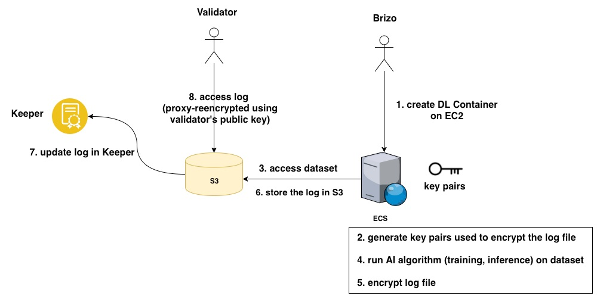


### 6.2.1 POC in AWS ECS

#### 1. Create EC2 Instance 
First, we create an EC2 instance and connect to it using SSH:

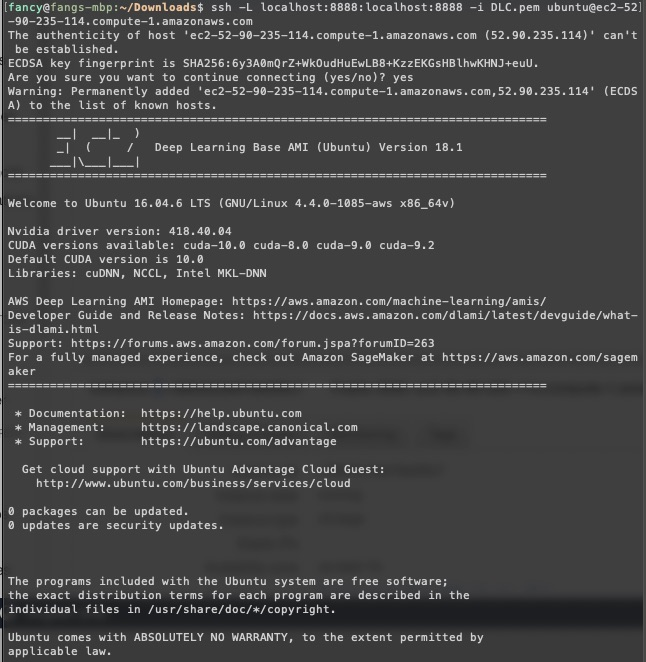

#### 2. Setup AWS Credentials

Credentials must be setup in order to login Amazon Elastic Container Registry (ECR), a fully-managed Docker container registry:

```
$ aws configure
AWS Access Key ID [None]: AKIA....JCJ4
AWS Secret Access Key [None]: P6HX35....aLI91c
```

#### 3. Login Amazon Elastic Container Registry (ECR)

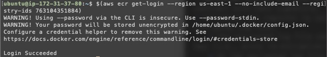

#### 4. Run AWS Deep Learning Container

```
~$ docker run -it 763104351884.dkr.ecr.us-east-1.amazonaws.com/tensorflow-training:1.13-cpu-py36-ubuntu16.04
Unable to find image '763104351884.dkr.ecr.us-east-1.amazonaws.com/tensorflow-training:1.13-cpu-py36-ubuntu16.04' locally
1.13-cpu-py36-ubuntu16.04: Pulling from tensorflow-training
34667c7e4631: Pull complete 
d18d76a881a4: Pull complete 
119c7358fbfc: Pull complete 
2aaf13f3eff0: Pull complete 
079fb48766f5: Pull complete 
fb6f24611e94: Pull complete 
5f4ea8f36692: Pull complete 
60098707f66b: Pull complete 
Digest: sha256:f40fd1ef4088dabdfc9fddd15bdc7e3bdba2c1144b57f945a7e751ef76c9b95e
Status: Downloaded newer image for 763104351884.dkr.ecr.us-east-1.amazonaws.com/tensorflow-training:1.13-cpu-py36-ubuntu16.04
root@f871a37ec3dd:/# 
```

#### 5. Run AI Training and Save Log

The [log file](logfile.txt) is saved during the training process. 


```
# python keras/examples/mnist_cnn.py > logfile.txt
x_train shape: (60000, 28, 28, 1)
60000 train samples
10000 test samples
Train on 60000 samples, validate on 10000 samples
Epoch 1/12

  128/60000 [..............................] - ETA: 10:36 - loss: 2.3061 - acc: 0.0859
  256/60000 [..............................] - ETA: 5:57 - loss: 2.2747 - acc: 0.1211 
  384/60000 [..............................] - ETA: 4:19 - loss: 2.2512 - acc: 0.1432
  512/60000 [..............................] - ETA: 3:30 - loss: 2.2082 - acc: 0.1973
  ....
  59136/60000 [============================>.] - ETA: 0s - loss: 0.0259 - acc: 0.9920
59264/60000 [============================>.] - ETA: 0s - loss: 0.0259 - acc: 0.9920
59392/60000 [============================>.] - ETA: 0s - loss: 0.0258 - acc: 0.9920
59520/60000 [============================>.] - ETA: 0s - loss: 0.0258 - acc: 0.9920
59648/60000 [============================>.] - ETA: 0s - loss: 0.0258 - acc: 0.9920
59776/60000 [============================>.] - ETA: 0s - loss: 0.0257 - acc: 0.9920
59904/60000 [============================>.] - ETA: 0s - loss: 0.0258 - acc: 0.9920
60000/60000 [==============================] - 71s 1ms/step - loss: 0.0257 - acc: 0.9920 - val_loss: 0.0259 - val_acc: 0.9930
Test loss: 0.025881229943022117
Test accuracy: 0.993
```

#### 6. Upload Log into S3 Bucket

```
root@f871a37ec3dd:/home# aws s3 sync logfile.txt s3://oceanfang/logfile
upload: ./logfile.txt to s3://oceanfang/logfile/logfile.txt       
root@f871a37ec3dd:/home# Connection to ec2-52-90-235-114.compute-1.amazonaws.com closed by remote host.
```

Now the logfile is available in the bucket of S3:

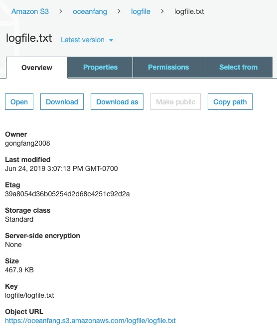

Similarly, the trained model can be saved and uploaded to S3 as well.


# 7. Security of Model 

It is critical to prove that the model in the execution is the same as requested in service agreement. 

## 7.1 Hash Signature (non-interactive approach)

The most straightforward approach is to verify the hash signature of model file at the beginning of execution.

As shown in the diagram below, the model owner can publish the hash of model file to smart contract in Keeper. As such, the AWS EC2 container can calculates the hash of model file and verify it against the on-chain record. 

If different, the execution will be aborted. Otherwise, the execution can continue to generate the log file as the proof.

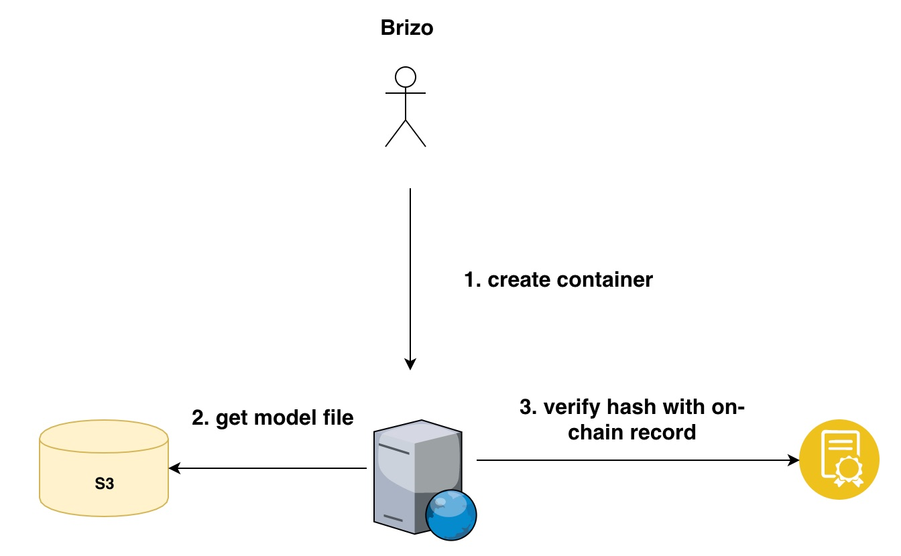

### POC of Hash Signature

To experiment this approach, we develop a POC with smart contract and verification script. 

* **Deploy Smart Contract**

The [smart contract](hash_sig/contracts/HashSig.sol) is a simplified contract mapping filename to its hash signature of model file.

```Solidity
pragma solidity 0.5.3;

contract HashSig {

  mapping (bytes32 => bytes32) signatures;

  constructor() public {
  }

  function addSig(bytes32 _name, bytes32 _hash) public returns (bool) {
    if(signatures[_name] != 0x0) return false;
    signatures[_name] = _hash;
    return true;
  }

  function getSig(bytes32 _name) public view returns (bytes32) {
    return signatures[_name];
  }

}
```

In the testing script, we use function to calculate hash of the model file:

```javascript
function fileHash(filename, algorithm = 'sha1') {
  return new Promise((resolve, reject) => {
    // Algorithm depends on availability of OpenSSL on platform
    // Another algorithms: 'sha1', 'md5', 'sha256', 'sha512' ...
    let shasum = crypto.createHash(algorithm);
    try {
      let s = fs.ReadStream(filename)
      s.on('data', function (data) {
        shasum.update(data)
      })
      // making digest
      s.on('end', function () {
        const hash = shasum.digest('hex')
        return resolve(hash);
      })
    } catch (error) {
      return reject('calc fail');
    }
  });
}
...
contract("HashSig", (accounts) => {
  let sig
  let filename = web3.utils.keccak256('mnist_cnn.py')


  describe("should add signature", () => {
    it("add and query", async () => {
      sig = await HashSig.deployed()
      let hash = await fileHash('mnist_cnn.py')
      let bytes32Hash = web3.utils.keccak256(hash)
      console.log(bytes32Hash)
      // add hash signature to on-chain 
      await sig.addSig(filename, bytes32Hash, { from: accounts[0]})
      // query the hash signature from smart contract
      let res = await sig.getSig(filename, { from: accounts[0]})
      console.log("hash :=" + res)
    });
  });

});
```

As a test, we deploy the contract to Kovan network as：

```
Starting migrations...
======================
> Network name:    'kovan'
> Network id:      42
> Block gas limit: 8000000
...
2_deploy_hashsig.js
===================

   Deploying 'HashSig'
   -------------------
   > transaction hash:    0xe7fd8becdcb762c12c13b363cbf51461728f5ee9641abeb3a8cf2d9760f8504f
   > Blocks: 1            Seconds: 4
   > contract address:    0x0f2c3e140F8EC039785b3631F3C7c282ceb9c12e
   > account:             0x0E364EB0Ad6EB5a4fC30FC3D2C2aE8EBe75F245c
   > balance:             2.100196295853937168
   > gas used:            131327
   > gas price:           10 gwei
   > value sent:          0 ETH
   > total cost:          0.00131327 ETH

   > Saving artifacts
   -------------------------------------
   > Total cost:          0.00131327 ETH


Summary
=======
> Total deployments:   2
> Final cost:          0.00404489 ETH
```


We add the hash value of the model file to the deployed contract in Kovan. For example, [`mnist_cnn.py`](hash_sig/mnist_cnn.py) has hash value: `0xbadd11443db8a4074339c73a77141eded30b41422b6d4afa9d20e5389b1978af`

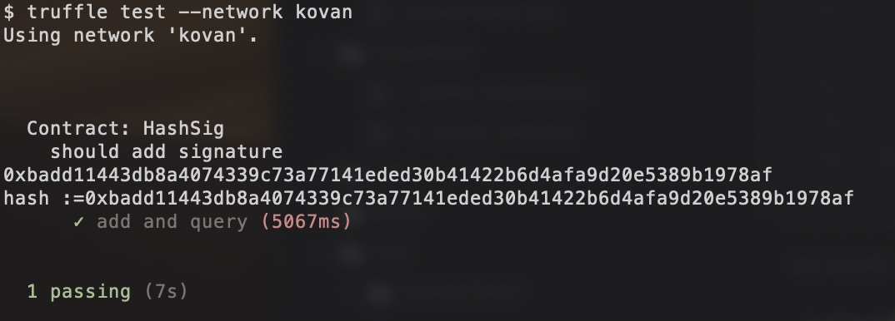

* **Verify Hash Singnature**

Next, we can verify the hash of model file against the smart contract record in Kovan network.

First, we add the hash value of model file to smart contract using [script](hash_sig/addHash.js)

```Javascript
const Web3 = require('web3')
const Tx = require('ethereumjs-tx')

var abi = '[{"inputs":[],"payable":false,"stateMutability":"nonpayable","type":"constructor","signature":"constructor"},{"constant":false,"inputs":[{"name":"_name","type":"bytes32"},{"name":"_hash","type":"bytes32"}],"name":"addSig","outputs":[{"name":"","type":"bool"}],"payable":false,"stateMutability":"nonpayable","type":"function","signature":"0xfa3d1325"},{"constant":true,"inputs":[{"name":"_name","type":"bytes32"}],"name":"getSig","outputs":[{"name":"","type":"bytes32"}],"payable":false,"stateMutability":"view","type":"function","signature":"0x893182ff"}]';

let web3 = new Web3(new Web3.providers.HttpProvider("https://kovan.infura.io/"));
const addressFrom = '0x0e364eb0ad6eb5a4fc30fc3d2c2ae8ebe75f245c'
const privKey = process.env.privateKey
const addressTo = '0x0f2c3e140F8EC039785b3631F3C7c282ceb9c12e'
const contract = new web3.eth.Contract(
  JSON.parse(abi),
  addressTo
);

// change this to whatever contract method you are trying to call, E.G. SimpleStore("Hello World")
let filename = web3.utils.keccak256('mnist_cnn.py')
let filehash = '0xbadd11443db8a4074339c73a77141eded30b41422b6d4afa9d20e5389b1978af'
const tx = contract.methods.addSig(filename, filehash);
const encodedABI = tx.encodeABI();

function sendSigned(txData, cb) {
  const privateKey = new Buffer(privKey, 'hex')
  const transaction = new Tx(txData)
  transaction.sign(privateKey)
  const serializedTx = transaction.serialize().toString('hex')
  web3.eth.sendSignedTransaction('0x' + serializedTx, cb)
}

// get the number of transactions sent so far so we can create a fresh nonce
web3.eth.getTransactionCount(addressFrom).then(txCount => {

  // construct the transaction data
  const txData = {
    nonce: web3.utils.toHex(txCount),
    gasLimit: web3.utils.toHex(6000000),
    gasPrice: web3.utils.toHex(10000000000), // 10 Gwei
    to: addressTo,
    from: addressFrom,
    data: encodedABI
  }

  // fire away!
  sendSigned(txData, function(err, result) {
    if (err) return console.log('error', err)
    console.log('sent', result)
  })

})
```

The transaction is sucessful as:

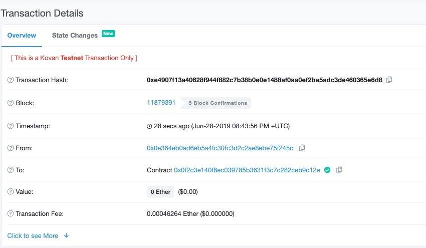

We can verify the hash value with [query script](hash_sig/verifyHash.js)

```Javascript
let fs = require("fs");
let crypto = require('crypto')
const Web3 = require('web3')

let web3 = new Web3(new Web3.providers.HttpProvider("https://kovan.infura.io/Kuo1lxDBsFtMnaw6GiN2"));

const account = '0x0E364EB0Ad6EB5a4fC30FC3D2C2aE8EBe75F245c';

var abi = '[{"inputs":[],"payable":false,"stateMutability":"nonpayable","type":"constructor","signature":"constructor"},{"constant":false,"inputs":[{"name":"_name","type":"bytes32"},{"name":"_hash","type":"bytes32"}],"name":"addSig","outputs":[{"name":"","type":"bool"}],"payable":false,"stateMutability":"nonpayable","type":"function","signature":"0xfa3d1325"},{"constant":true,"inputs":[{"name":"_name","type":"bytes32"}],"name":"getSig","outputs":[{"name":"","type":"bytes32"}],"payable":false,"stateMutability":"view","type":"function","signature":"0x893182ff"}]';
const addressTo = '0x0f2c3e140F8EC039785b3631F3C7c282ceb9c12e'
const contract = new web3.eth.Contract(
  JSON.parse(abi),
  addressTo
);

async function call(transaction) {
    return await transaction.call({from: account});
}

async function checkHash(name) {
    let val = await call(contract.methods.getSig(name));
    console.log("the hash of model file :=" + val)
    return val;
}

async function fileHash(filename, algorithm = 'sha1') {
  return new Promise((resolve, reject) => {
    // Algorithm depends on availability of OpenSSL on platform
    // Another algorithms: 'sha1', 'md5', 'sha256', 'sha512' ...
    let shasum = crypto.createHash(algorithm);
    try {
      let s = fs.ReadStream(filename)
      s.on('data', function (data) {
        shasum.update(data)
      })
      // making digest
      s.on('end', function () {
        const hash = shasum.digest('hex')
        return resolve(hash);
      })
    } catch (error) {
      return reject('calc fail');
    }
  });
}

// check hash of file and compare with local calculation
async function verify() {
  let localHash = await fileHash("mnist_cnn.py")
  let bytes32Hash = web3.utils.keccak256(localHash)
  console.log("local hash of model file :=" + bytes32Hash)

  let filehash = web3.utils.keccak256('mnist_cnn.py')
  let res = await checkHash(filehash)
  if(bytes32Hash === res)
    console.log("matched")
  else {
    console.log("unmatched")
  }
}

verify()
```


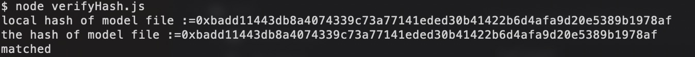

* **Test in AWS EC2 Instance**

First, we put the model file [`mnist_cnn.py`](hash_sig/mnist_cnn.py) and [query script](hash_sig/verifyHash.js) in AWS S3 bucket.

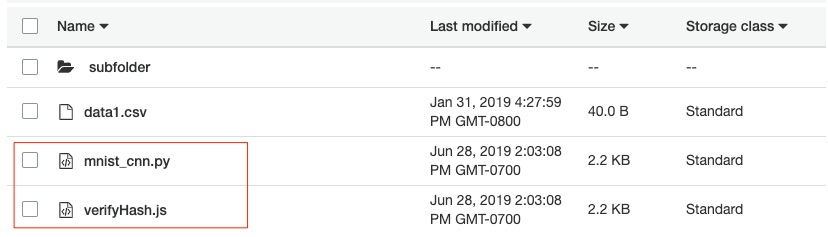
 
Create an EC2 instance and access both files with `getObject` API:

```
root@e13c73608257:/home# aws s3 cp s3://oceanfang/mnist_cnn.py .
download: s3://oceanfang/mnist_cnn.py to ./mnist_cnn.py       
root@e13c73608257:/home# aws s3 cp s3://oceanfang/verifyHash.js .
download: s3://oceanfang/verifyHash.js to ./verifyHash.js 
```

Install  `Node.js` in EC2:

```
// 1. install nvm
root@e13c73608257:/home# curl -o- https://raw.githubusercontent.com/nvm-sh/nvm/v0.34.0/install.sh | bash

// 2. activate nvm
root@e13c73608257:/home# . ~/.nvm/nvm.sh

// 3. install node.js v8.11.1
root@e13c73608257:/home# nvm install 8.11.1
Downloading and installing node v8.11.1...
Downloading https://nodejs.org/dist/v8.11.1/node-v8.11.1-linux-x64.tar.xz...
######################################################################## 100.0%
Computing checksum with sha256sum
Checksums matched!
Now using node v8.11.1 (npm v5.6.0)
Creating default alias: default -> 8.11.1 (-> v8.11.1)

// 4. install packages
root@e13c73608257:/home# npm install fs crypto web3
+ web3@1.0.0-beta.55
+ fs@0.0.1-security
+ crypto@1.0.1
added 132 packages in 7.931s
```

Now, it is time to access the on-chain record from EC2. Use command `node verifyHash.js` to calculate the hash value of model file inside EC2, and compare with the on-chain hash value in Kovan network. 

The both hash values are matched in the experiment:

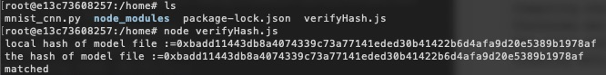

## 7.2 Proof of Retrieveability (interactive approach)

The PoR approach can be applied to prove the model file matches the original from the model owner.

The brizo behaves as the verifier who generates and verify the challenges, while AWS container needs to generate proof to prove the model file remains the same as original.

Note that the model file (e.g., python script) is usually small such as 10KB, therefore, computing complexity is affordable to check every single byte in the file. The original PoR algorithm can be directly applied in order to guarantee its integrity.

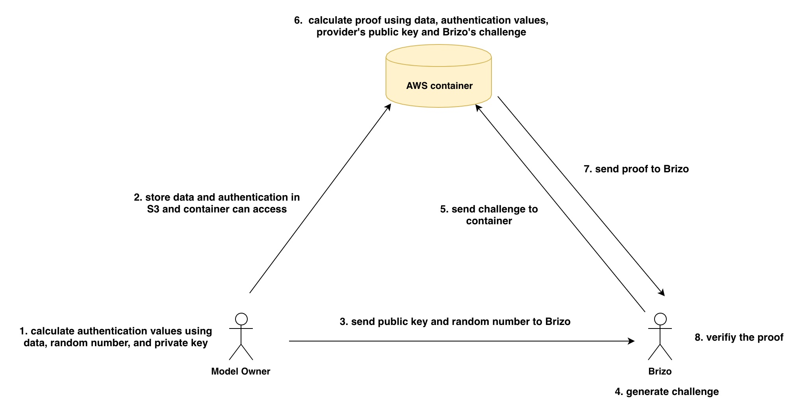