[](https://oceanprotocol.com)

#  Research on Proof of Execution (PoE)

```
name: research on PoE
type: research
status: updated draft
editor: Fang Gong <fang@oceanprotocol.com>
date: 06/17/2019
```

# 1. Cloud Providers

## 1.1 AWS

As a centralized server provider, AWS can track user activity and API usage which cann be used as a proof of execution. With [CloudTrail](https://aws.amazon.com/cloudtrail/), it is possible to continuously monitor and log user activity. CloudWatch can be used to search through log data. 

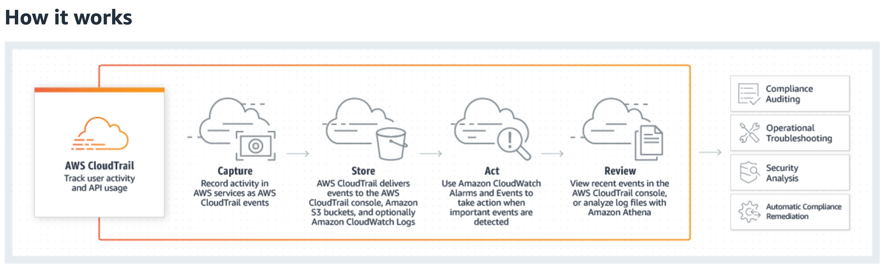


## 1.2 Azure

Azure provides [Azure Monitor](https://docs.microsoft.com/en-us/azure/azure-monitor/) which includes Log Analytics and Application Insights. Activity Log provides data about the operations on a resource. Once created, Activity Log entries are not modified or deleted by the Azure (resource owner cannot modify it), which are stored for 90 days. It is possible to export the log events to storage for longer periods.

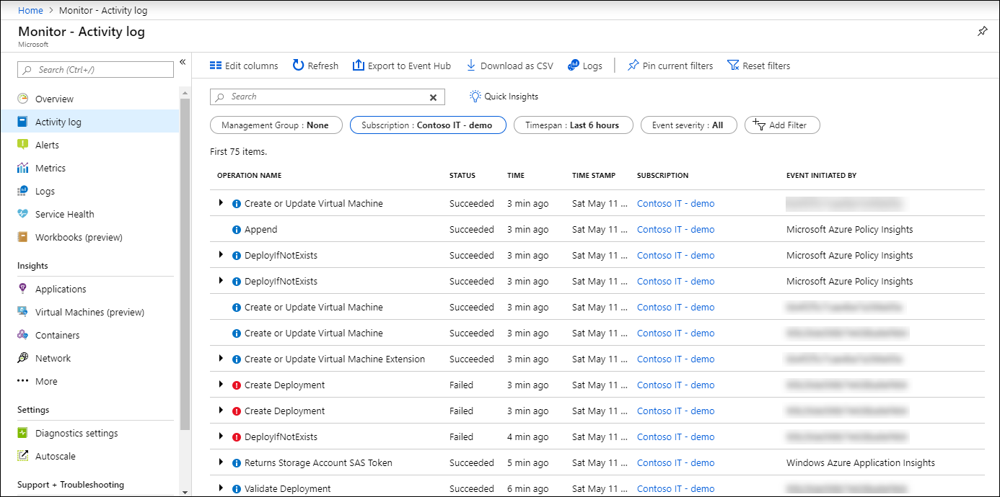

## Pros & Cons

**Pro**:

* simple to implement: automatically record and store event logs; search through logs with toolkit.
* high reliability and availability 

**Con**:

* centralization: need to trust AWS & Azure in recording and monitoring the user activities.
* users may not be comfortable to be monintored and tracked when accessing the cloud resources.

# 2. Replication with Blockchain

With blockchain technology, it is possible to replicate the same compute in several different nodes. The execution can be proved by a consensus about the compute result, which assumes only a few nodes are malicious to attack (e.g., deliberately generate wrong results). Here, different consensus algorithms may be used. For example, PBFT can be used to torlerate 1/3 malicious nodes.

To do so, each node needs to register with smart contract and deposit tokens in order to be eligible to compute. Depends on the consensus result, nodes will receive reward incentives or their deposit tokens will be slashed.

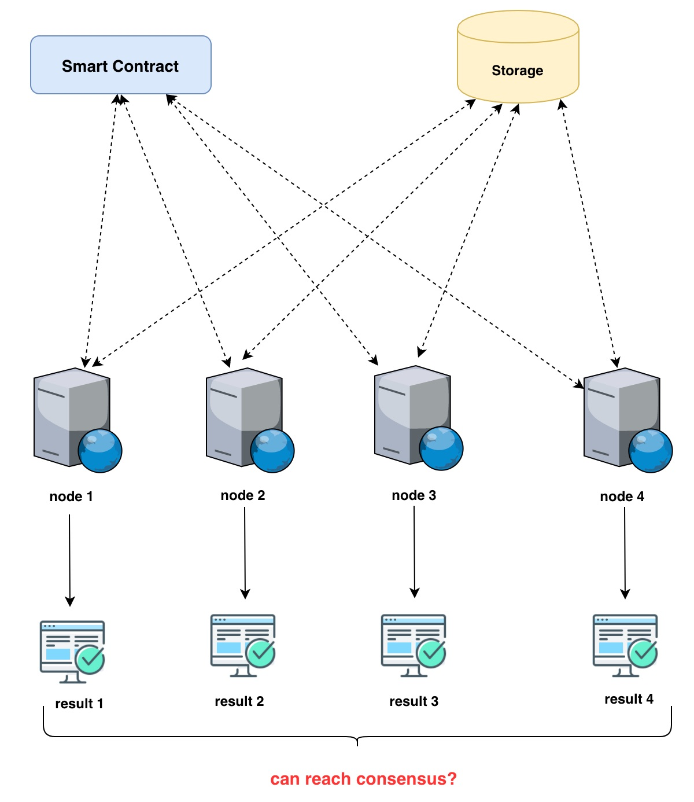

**Pro**:

* decentralization: there is no need to trust any central authority (such as cloud provider) to generate the proof;
* easy integration: the workflow can be easily integrated with smart contract of existing blockchain projects.

**Con**:

* well-designed consensus algorithm is critical to protect the security of proof-of-execution;
* susceptible to attacks: there are many attack vectors trying to manipulate the consensus result;
* not eco-friendly: the same computation needs to be replicated by many times, which may consume more energy.

# 3. Cryptography:

In general, there are three categories in this section which provide secure computation using different cryptography. However, most of them suffers performance and scalability issue and stay in the experimental stage.

## 3.1 Zero Knowledge Proof (ZKP)

A zero-knowledge proof (ZKP) system is an interactive protocol between a prover and a verifier, which aims at demonstrating that some statement is true without revealing any other information. ZKP is a hot research topic in past few decades.

### Case 1:

[AZTEC Protocol](https://www.aztecprotocol.com/) is a new and efficient zero-knowledge privacy protocol bringing private transactions to Ethereum. The [poof-of-concept contract](https://etherscan.io/address/0xcf65A4e884373Ad12cd91c8C868F1DE9DA48501F) converts DAI into AZTEC note form. It has been deployed to Ethereum mainnet to handle financial applications at this time.

### Case 2:

[0x](https://0x.org/) is partering with [StarkWare](https://starkware.co/) to test a ZKP solution called StarkDEX, which process roughly 550 tx per second. The blog announcement is [here](https://blog.0xproject.com/starkdex-bringing-starks-to-ethereum-6a03fffc0eb7)


Clearly, ZKP is used in **confidential token transfer and trading** application at this moment due to its performance issue. It is not practical to be used in more complicated applications.
 
## 3.2 Multi-Party Computation (MPC)

### Case 1:

[tf-encrypted](https://github.com/tf-encrypted/tf-encrypted) is a Python library built on top of Tensorflow to run privacy-preserving machine learning. To preserve the data privacy, this approach leverages the multi-party computing (MPC) framework to compute weight updates in AI algorithm without revealing raw dataset. It is currently experimental software and not ready for production environment. Detailed report can be found in [research repo](https://github.com/oceanprotocol/research/tree/master/12-tf-encrypted)

### Case 2:

[Openmined](https://www.openmined.org/) claimed to develop a MPC solution to enable secure computation but it is not delivered yet at this time.

## 3.3 Homomorphic Encryption (HE)

It enables secure computation on the **encrypted** data, therefore, untrusted 3rd parties can use the data without beingn able to steal it.

The expensive computing time for HE is the bottleneck to provide an elegant solution to numerous applications. At this time, it was regarded as being mainly of theoretical
interest.

## 3.4 Complete Workflow

Here we show the complete workflow with all parts:

* each node (e.g., X, Y, Z) generates its local result (i.e., E1, E2, E3) along with ZKP (i.e., C1, C2, C3);
* all local results are submitted to MPC to compute the final result I1;
* the ZKP need to be checked for security before releasing the final result;
* I1 is encrypted and used for secure computation with Homorphic Encryption.

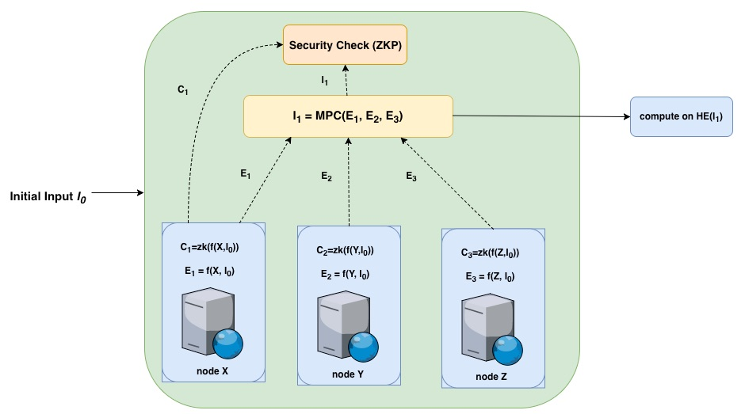

## 3.5 Pros & Cons

**Pro**:

* provide high security for secure computation, which is difficult to be attacked;

**Con**:

* difficult to be used due to performance bottleneck and scalability issue;
* more complicated to be implemented and integrated into existing projects;

# 4. Secure Enclave:

This category relies on TEE to deliver secure computation. 

## 4.1 Enigma

[Enigma](https://enigma.co/) is a decentralized secure computation protocol based on Intel SGX hardware. It has provided [secret voting](https://blog.enigma.co/secret-voting-an-update-code-walkthrough-605e8635e725) to the TCR community. 

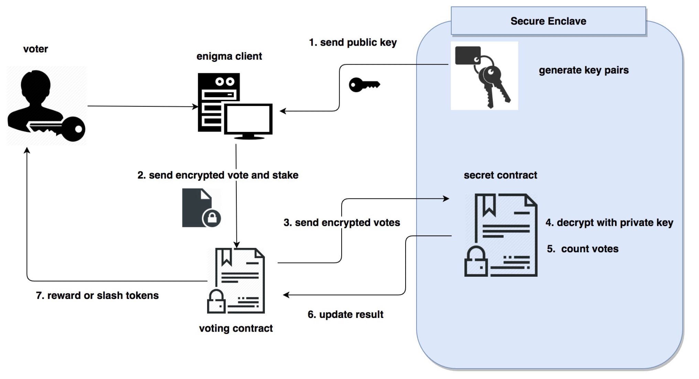

The detailed analysis of Enigma can be found in our [research repo](https://github.com/oceanprotocol/research/tree/master/00-enigma-mpc/0-Enigma-Integration)

## 4.2 Oasis

[Oasis](https://www.oasislabs.com/) delivered secure computing based on TEE as well. It developed a flexible and easy-to-use SDKs with built-in privacy-preserving computation. Moreover, it plans to develop open-sourced hardware to provide private computing.

## 4.3 Microsoft OpenEnclave SDK

The Microsfot [OpenEnclave](https://github.com/microsoft/openenclave) is an SDK for building enclave applications in C and C++. The current implementation is built on Intel SGX. 

## 4.6 Pros and Cons

**Pro**:

* straightforward: separate the privacy-preseving computing from public component and execute inside secure enclave;
* performance enhancement: the computation is efficient on TEE hardware.

**Con**:

* design flaws: it is well-known that TEE like Intel SGX has design flaws (e.g., foreshadow and etc.), therefore, making it possible to release private data during execution;
* centralization risk: remote attestation service with fake IDs;
* limited resources: the secure enclave has limited resources (e.g., memory, storage) and is not suitable for complicated application such as AI algorithm.
* limited applications: the SDK may support only limited applications (i.e., secret voting), which makes it difficult to solve complicated problems.


# 5. Overall Comparision

In this diagram, we compare all different technologies in two perspectives:

* complexity: the complexity and demanded efforts to implement;
* time-to-deliver: the potential time required to deliver.

In this chart, the cloudTrail and Activity log is the most straightforward and ready to be used, while ZKP/MPC/HE needs the most efforts to develop. 

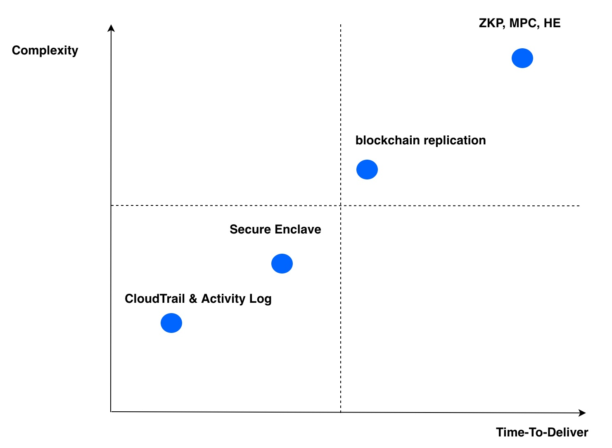


# 6. POE with Cloud Provider

## 6.1 CloudTrail in AWS

To enable the tracking of activities in AWS, we need to create `trail` for a specific bucket or all S3 buckets across all regions.

In the `Data Event` section, we can add the bucket that should be monitored or tracked.

**Note**:

* `Management Events` can be disabled (i.e., set to be `None`) to reduce amount of event logs;
* `Data Events` must add the bucket name that should be tracked;
* `Storage location` should choose a different bucket to keep the event logs (otherwise, writting logs will generate new event logs and add extra amount of log files). 

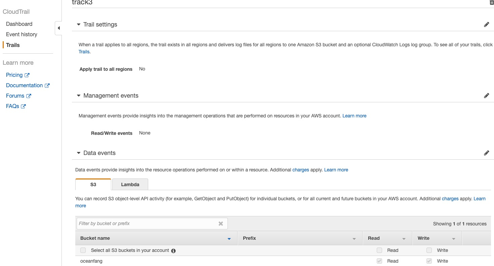

It is also possible to create trail for a specific S3 object such as a file, image and etc. The detailed instruction is [here](https://docs.aws.amazon.com/awscloudtrail/latest/userguide/logging-management-and-data-events-with-cloudtrail.html)

AWS will store the log events in a bucket (i.e., fangtrail) with path: `Location: /AWSLogs/647548619895/CloudTrail/us-east-1`. 

The path to event log file has the below format:

```
<bucket_name>/<prefix_name>/AWSLogs/<Account ID>/CloudTrail/<region>/<YYYY>/<MM>/<DD>/<file_name>.json.gz
```

The storage location can be changed in following settings:

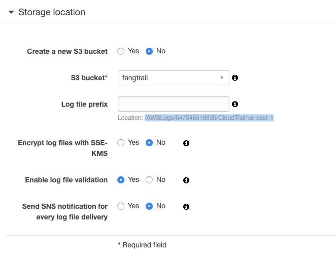

### 6.1.1 GetObject

Assuming user access the dataset `data.csv` as follows:

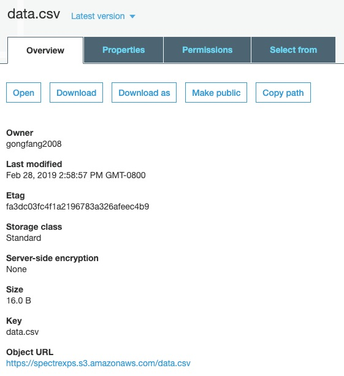

The `getObject` API is used to access the dataset:

```
$ aws s3api get-object --bucket oceanfang --key data.csv data.csv
{
    "AcceptRanges": "bytes", 
    "ContentType": "text/csv", 
    "LastModified": "Thu, 20 Jun 2019 03:38:23 GMT", 
    "ContentLength": 41, 
    "ETag": "\"3966951c417ed470c2eeaa3a5fc9c390\"", 
    "Metadata": {}
}
```

This transaction cause an event log file generated in the path: `fangtrail/AWSLogs/647548619895/CloudTrail/us-east-1/2019/06/20/647548619895_CloudTrail_us-east-1_20190620T0345Z_bH47qE9U25f69VXX.json.gz`

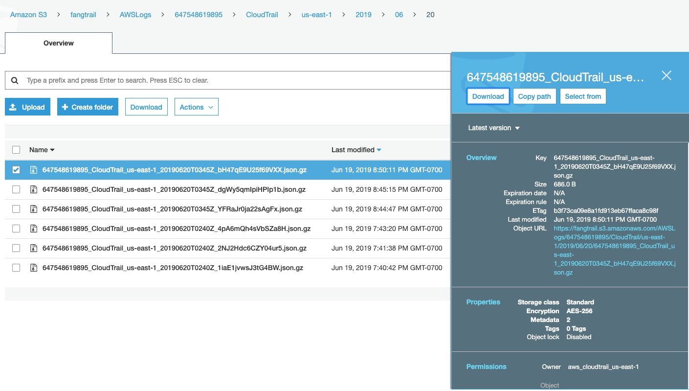

This [log file](647548619895_CloudTrail_us-east-1_20190620T0345Z_bH47qE9U25f69VXX.json) can be downloaded and opened as JSON file:

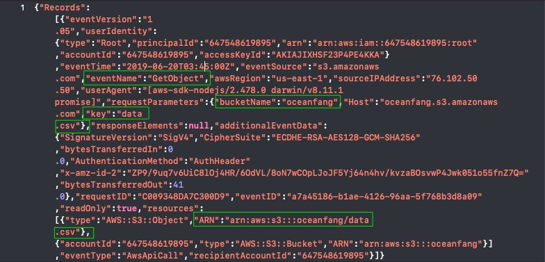

### 6.1.2 PutObject

Let us test `putObject` API to add a new dataset file `city` to the bucket `oceanfang` in this scenario:

```
$ aws s3api put-object --bucket oceanfang --key city 
{
    "ETag": "\"d41d8cd98f00b204e9800998ecf8427e\""
}
```

A new event log file is generated:

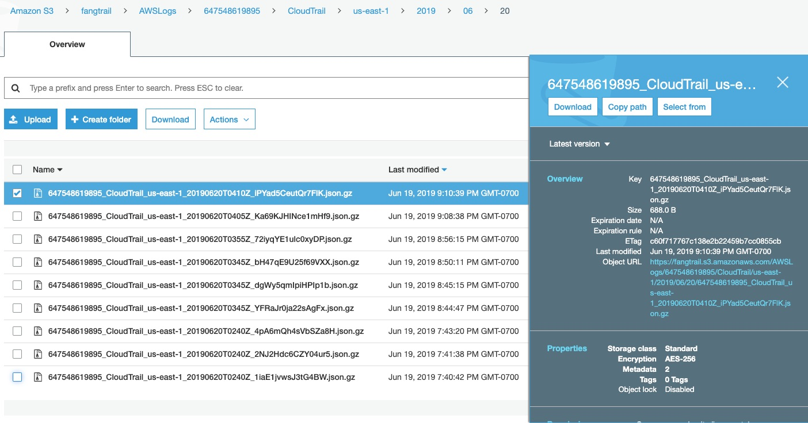

The [log file](647548619895_CloudTrail_us-east-1_20190620T0410Z_iPYad5CeutQr7FlK.json) shows the putObject event as follows:

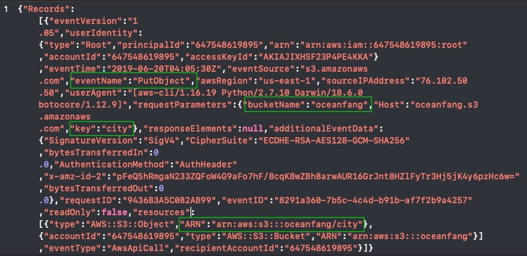


