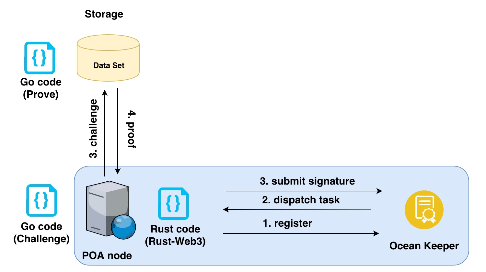
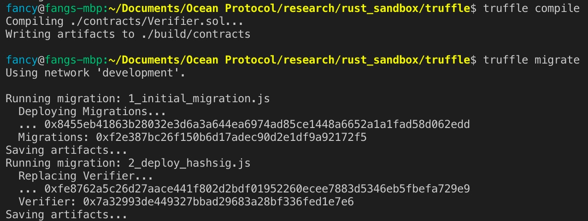
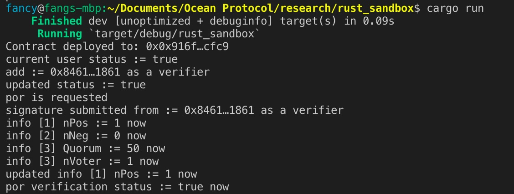
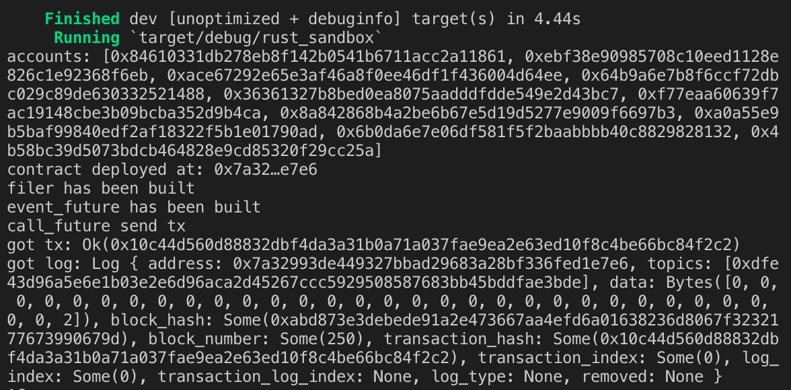

[](https://oceanprotocol.com)

#  Verifier Network Design (WORK IN PROGRESS)

```
name: research on verifier network for Proof of Retrieveability
type: research
status: updated draft
editor: Fang Gong <fang@oceanprotocol.com>
date: 07/02/2019
```

# 1. Introduction

More information about PoR can be found in [report](../03-data-availability/web2-compact-por/README.md). In this research, we investigate the design of verifier network, which generates challenges and verifies the proofs from the storage in a decentralized way.

In each design of the verifier network, there are some critical modules in the below:

* **selection of verifiers**: there are a verifier pool, which may include POA authority nodes or registered entities. 
* **consensus mechanism**: the way that verifiers reach an agreement or conclude a verification task.
* **incentive mechanism**: when verifier pool is open to the public and any node can join, it is important to have a proper incentive mechanism in place to reward or punish participants.

We will investigate different designs from these three perspectives and compare their pros & cons in the below. They are sorted by the implementation difficulty from low to high.

# 2. Design 

## 2.1 All-hands POA Authorities

The most straightforward design is to have POA authority nodes in Ocean network to be verifiers. The identity of node operator is known to us. 

* **Selection**: all POA authority nodes are required to participate in the verification task. Each node can generate his own challenge, send it to the storage and verify the proof on its own. 

* **Consensus**:
	* since the number of authority nodes is limited, it is possible to *request all of them to agree* on the verification result; it fails to conclude if there is any single verifier cannot verify the challenge. 
	* alternatively, a *M-out-of-N signature* can be used to reach an agreement: 
		* *fixed number of required signature*: it may require fixed number of signatures from the selected verifiers no matter the total number of participated verifiers;
		* *fixed percentage of requried signature*: it may require a certain percentage of selected verifiers to submit signatures in order to verify data availability. For example, >50% signature is a typical scenario.

* **Incentive**: it is not needed to give rewards to POA authority nodes since they are known and trustworthy entities.

* **Pro**:
	* simple to implement and manage;

* **Con**:
	* limited scalability as each verifier needs to be a POA node;

## 2.2 Variant: Randomly Selected POA Authorities

Based on above design, we can further introduce randomness to the verification game. 

* **Selection**: for each verification task, a few POA authority nodes will be randomly selected from the pool to serve as the verifiers, therefore, making it difficult to predict the verifiers for a specific task.

Other apsects includinng Consensus, Incentive are the same as previous design.

* **Pro**:
	* simple to manage verifiers;
	* random selection makes it difficult to predict verifiers and prevents potential attacks;

* **Con**:
	* limited scalability as each verifier needs to be a POA node;
	* it requires a reliable way to generate random numbers (i.e., Chainlink can be used to import random numbers into smart contract)


## 2.3 Open Verifier Network

To achieve a better decentralization, an open verifier network is demanded, where any node can participate in the verifier pool and receive reward for its own contribution.

* **Selection**: any node can register itself with on-chain smart contract and put in tokens as a stake to join the verifier pool. For each verification task, a few verifiers will be randomly selected from the pool. 

* **Consensus**:
	* since the selected nodes are not reliable and may fail to accomplish the task, it is difficult to request all signatures from them to verify the data availability.
	* instead, a *M-out-of-N signature* is more suitable for this design. It can have two options:
		* *fixed number of required signature*: it may require fixed number of signatures from the selected verifiers no matter the total number of participated verifiers;
		* *fixed percentage of requried signature*: it may require a certain percentage of selected verifiers to submit signatures in order to verify data availability. For example, >50% signature is a typical scenario.

* **Incentive**: 
	* *Participation Incentive*: the selected node that fails to finish the task will be given lower probability to be selected in the future or removed from the verifier pool for a period of time;
	* *Verification Incentive*: verifiers who submit **correct** signature will be given rewards as the incentive; otherwise, their stake will be slashed.

* **Pro**:
	* more open and decentralized approach to the public;
	* it has great scalability as any node can participate the verification;
	* there is no way to predict the verifier identity for each verification task, therefore, reducing the chance of attack from the storage.

* **Con**:
	* it has the risk that the malicious nodes manipulate the consnensus result. 
	* In particular, "fixed number of required signature" approach is easier to be gamed as only limited number of singatures are required.  
	* "fixed percentage of required signature" can have the risk of sybil attack but the cost of such attack is high due to staking requirement.

## 2.4 Challenge-Response Approach

A much more lightweight approach is challenge respose design:

* **Selection**: any node can register itself with on-chain smart contract and put in tokens as a stake to join the verifier pool. Each verifier in the pool can generate challenge and verify the proof on its own.

* **Consensus**:
	* verifiers in the pool continuously challenge the storage for data availability, where the target storage and dataset is randomly chosen;
	* when the verifier cannot prove the data availability, it will raise a challenge against the storage for a specific dataset. The challenge will initiate a verification task that more verifiers are involved;
	* depends on the verification result, the challenger will receive reward or get their stake slashed;
	* if there is no challenge, Ocean assumes the availability of dataset is proved.

* **Incentive**: 
	* challenger who successfully challenge the faulty storage will be given rewards as the incentive; otherwise, their stake will be slashed.		

# 3. POC

After research meeting, we agree to move forward to implement a POC, which is a simplest and working solution. In particular, we will prototype the all-hands POA node approach with majority-win consensus. To make it more fun, we try to use Rust to interact with smart contract.

## 3.1 Architecture

* **Keeper Contract**: 
	* register POA node and manage permission;
	* register dataset and maintain DID registry;
	* dispatch por verification task (i.e., emit event message to POA nodes);
	* submit signature to resolve challenge for a specific dataset;
	* query the status of dataset and their challenges;
* **Verifier Node**:
	* use Rust code to interact with Keeper contract;
	* listen to the event message from Keeper contract and accept task;
	* generate proof for requested dataset;
	* verify the proof from the storage;
	* submit own signature to Keeper contract to confirm the data availability;
* **Storage**:
	* use Rust code to gennerate proof according to challenges;



## 3.2 Smart Contract using Solidity

First, the smart contract is built to maintain the registry of verifier and challenge:

```Solidity
pragma solidity 0.5.3;

contract Verifier {
    struct Challenge{
        uint256 nPos;
        uint256 nNeg;
        uint256 quorum;
        bool    result;
        bool    finish;
        mapping(address => bool) votes;
    }

    uint256 nVoters;
    mapping(address => bool) public registry;
    mapping(uint256 => Challenge) public challenges;

    // events
    event verifierAdded(address _verifier, bool _state);
    event verifierRemoved(address _verifier, bool _state);
    event verificationRequested(uint256 _did);
    event verificationFinished(uint256 _did, bool _state);
    
    ...
    
    // manage verifier registration
    function addVerifier(address user) public {
        require(user != address(0), 'address is invalid');
        if(registry[user] == true) return;
        // if not registered yet
        registry[user] = true;
         nVoters = nVoters + 1;
        emit verifierAdded(user, true);
    }
    
    ...
    // quest por verification
    function requestPOR(uint256 did) public {
        // // if challenge of the same did exists AND it is not finished yet, do not allow new challenge
        if(challenges[did].quorum != 0 && challenges[did].finish != true) return;
        // create new challenge for the did
        challenges[did] = Challenge({
            nPos: 0,
            nNeg: 0,
            quorum: 50,
            result: false,
            finish: false
        });
        emit verificationRequested(did);
    }
    ...
    function resolveChallenge(uint256 did) public {
        if(challenges[did].nPos + challenges[did].nNeg == nVoters && !challenges[did].finish ) {
                challenges[did].finish = true;
                uint256 cur = challenges[did].nPos * 100;
                uint256 target = nVoters * challenges[did].quorum;
                if( cur >= target){
                    challenges[did].result = true;
                    emit verificationFinished(did, true);
                } else {
                    challenges[did].result = false;
                    emit verificationFinished(did, false);
                }
        }
    }
	...
```

We use the local testnet to run the testing:



In the same time, we need to generate ABI file that is needed in Rust code:

```
$ solc -o build --bin --abi contracts/*.sol --overwrite
```
It creates two files: `Verifier.abi` and `Verifier.bin` under the `build` directory.


## 3.3 Rust Coding

### 3.3.1 Interact with Smart Contract 

* **setup network and web3**

```Rust
let (_eloop, transport) = web3::transports::Http::new("http://localhost:8545").unwrap();
let web3 = web3::Web3::new(transport);
```

* **create contract interface using address and ABI**

Note: the contract address should not include prefix of "0x"!

```Rust
let contract_address: Address = "916f91fe8a60012bad9b7264680afd008ed4cfc9".parse().unwrap();
    let contract = Contract::from_json(
        web3.eth(),
        contract_address,
        include_bytes!("../truffle/build/Verifier.abi"),
    )
    .unwrap();

    println!("Contract deployed to: 0x{}", contract.address()); 
```

* **send transaction to smart contract**

```Rust
contract.call("addVerifier", (my_account,), my_account, Options::default());
println!("add := {} as a verifier", my_account);
```

* **query the state of smart conntract**

```Rust
let result = contract.query("queryVerifier", (my_account,), None, Options::default(), None);
let status: bool = result.wait().unwrap();
println!("updated status := {}", status);
```

The local testnet needs to be launched in order to run the test. Use `cargo run` in the workspace to run the test:



### 3.3.2 Subscribe to Event Message

* **create event loop to monitor events**

```Rust
let mut eloop = tokio_core::reactor::Core::new().unwrap();
let web3 = web3::Web3::new(web3::transports::Http::with_event_loop("http://localhost:8545", &eloop.handle(), 1).unwrap());
```

* **create eloop futures**

```Rust
eloop.run(web3.eth().accounts().then(|accounts| {
	...
	event_future.join(call_future)

    })).unwrap();    
```

* **define parameters of event filter**

the event signature is needed. For example, the event has signature (i.e., hash value) generated as:

```
> keccak('Pregnant(address,uint256,uint256,uint256)')
241ea03ca20251805084d27d4440371c34a0b85ff108f6bb5611248f73818b80

> keccak('Transfer(address,address,uint256)')
ddf252ad1be2c89b69c2b068fc378daa952ba7f163c4a11628f55a4df523b3ef
```

It can be generated from online site: [Keccak256 online](https://emn178.github.io/online-tools/keccak_256.html)

Similarly, the hash string should not have prefix of "0x"!

In this step, the contract address and specificed event signature are defined so Rust code can listen to.

```Rust
let filter = FilterBuilder::default()
            .address(vec![contract.address()])
            .topics(
                Some(vec![
                    "dfe43d96a5e6e1b03e2e6d96aca2d45267ccc5929508587683bb45bddfae3bde" // verificationRequested event signature
                    .parse()
                    .unwrap(),
                ]),
                None,
                None,
                None,
            )
            .build();
        println!("filer has been defined");
```

* **build event filter**

It creates an event filter based on the definition in last step and sets the duration of monitoring.

```Rust
let event_future = web3
            .eth_filter()
            .create_logs_filter(filter)
            .then(|filter| {
                filter.unwrap().stream(time::Duration::from_secs(0)).for_each(|log| {
                    println!("got log: {:?}", log);
                    Ok(())
                })
            })
            .map_err(|_| ());
        println!("event_future has been built");
```


* **send transaction to trigger the event log**


```Rust
let call_future = contract.call("requestPOR", (2,), accounts[0], Options::default()).then(|tx| {
            println!("got tx: {:?}", tx);
            Ok(())
        });
        println!("call_future send tx");
```



<!--

## 3.4 Calling Go functions from Node.js

### 3.4.1 export functions from Golang 

* The package must be a `main` package. 
* The compiler will build the package and all of its dependencies into a single shared object binary.
* The source must import the pseudo-package “C”.
* Use the `//export` comment to annotate functions you wish to make accessible to other languages.
* An empty main function must be declared.

Assume we need to generate library of `provider.go` file:

```
package main;

import "C"

//export St
func St(ssk_file string, fileName string, S int64, N int64, tau_file string, auth_file string, sample_file string) {
...
}

func main() {}
```

The command can be used to generate header file and provider.so file:

```
$ go build -o provider.so -buildmode=c-shared provider.go
$ ls
provider.go  provider.h   provider.so
```

The header file defines the type and functions in Go code:

```
...
#ifndef GO_CGO_GOSTRING_TYPEDEF
typedef _GoString_ GoString;
#endif
typedef void *GoMap;
typedef void *GoChan;
typedef struct { void *t; void *v; } GoInterface;
typedef struct { void *data; GoInt len; GoInt cap; } GoSlice;
...
extern void St(GoString p0, GoString p1, GoInt64 p2, GoInt64 p3, GoString p4, GoString p5, GoString p6);
...
```

Similarly, we can generate header file and library for `verifier.go` and `storage.go`. These files can be found in `nodejs-golang-poc` folder. 

### 3.4.2 Call Go function from Node.js

Node uses a library called [node-ffi](https://github.com/node-ffi/node-ffi) (and a other dependent libraries) to dynamically load and call exported Go functions:

Note that the library file in MacOS has the name of ".dylib" rather than ".so". The error will be encountered in Mac as [issue](https://github.com/vladimirvivien/go-cshared-examples/issues/1). Simply change the suffix to be ".dylib" in MacOs or switch to Linux machine.

-->