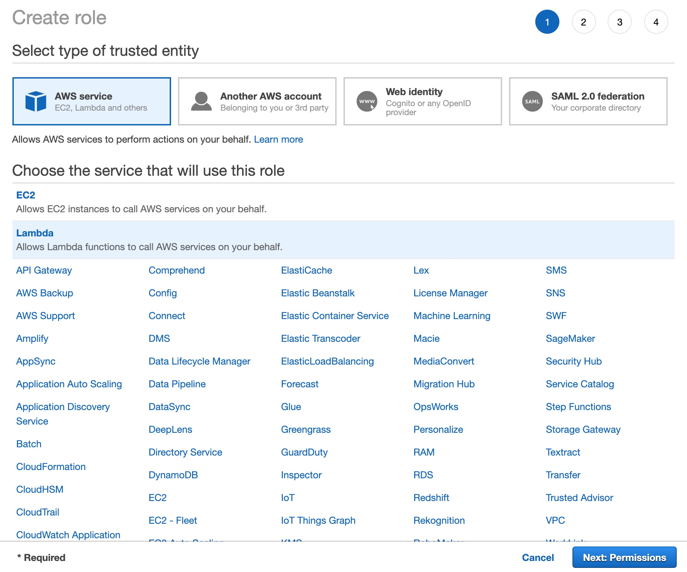
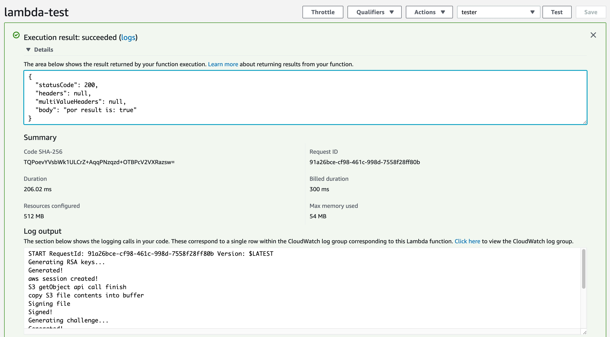

[](https://oceanprotocol.com)

#  Lambda Deployment

```
name: research on deploying POR in Lambda settings
type: research
status: updated draft
editor: Fang Gong <fang@oceanprotocol.com>
date: 08/15/2019
```


## 1: write and compile lambda code

Install aws cli and sdk for golang:

```
$ aws --version
aws-cli/1.16.19 Python/2.7.10 Darwin/18.7.0 botocore/1.12.9

$ go get -u github.com/aws/aws-sdk-go
$ go get -u github.com/aws/aws-lambda-go/lambda
```

Write the lambda code as [`por-lambda.go`](code/por-lambda.go)

```Go
import (
	...
	"encoding/json"
	"github.com/aws/aws-sdk-go/aws"
    "github.com/aws/aws-sdk-go/aws/session"
	"github.com/aws/aws-sdk-go/service/s3"
	"github.com/aws/aws-lambda-go/events"
	"github.com/aws/aws-lambda-go/lambda"
	"errors"
	"io"
)

type BodyRequest struct {
	Bucket string `json:"bucket"`
	Key string `json:"key"`
}
...
func Handler(request events.APIGatewayProxyRequest) (events.APIGatewayProxyResponse, error)  {
	...
	bodyRequest := BodyRequest{
		Bucket: "", 
		Key: "",
	}

	// Parse request body
	err := json.Unmarshal([]byte(request.Body), &bodyRequest)
	if err != nil {
		return events.APIGatewayProxyResponse{Body: err.Error(), StatusCode: 404}, nil
	}

	bucket := bodyRequest.Bucket
	item   := bodyRequest.Key


	sess, _ := session.NewSession(&aws.Config{
		Region: aws.String("us-east-1")},
	)
	fmt.Printf("aws session created!\n")

	results, err := s3.New(sess).GetObject(
		&s3.GetObjectInput{
			Bucket: aws.String(bucket),
			Key:    aws.String(item),
    })
    ...
	if request.HTTPMethod == "POST"{
		if yes {
			ApiResponse := events.APIGatewayProxyResponse{Body: "por result is: true", StatusCode: 200}
			return ApiResponse, nil
		} else {
			ApiResponse := events.APIGatewayProxyResponse{Body: "por result is: false", StatusCode: 200}
			return ApiResponse, nil
		}
	} else {
		err := errors.New("Method Not Allowed!")
		ApiResponse := events.APIGatewayProxyResponse{Body: "Method Not OK", StatusCode: 502}
		return ApiResponse, err
	}
	
}

func main() {
	lambda.Start(Handler)
}
```


compile it to be a binary:

```
$ GOOS=linux go build por-lambda.go

$ zip por-lambda.zip por-lambda
  adding: por-lambda (deflated 57%)
```

it generates a `por-lambda.zip` compressed file in the same workspace, which needs to be uploaded to AWS lambda function.

## Step 2: create a new IAM role

### 2.1 Choose a new IAM role for Lambda functions:



### 2.2 Add S3 permission


### 2.3 Create a new role `lambda-tester`


### 2.4 Display new role in the list


## Step 3: Deploy Lambda Function

### 3.1 Create a new Lambda function

Choose Go 1.x runtime environment and use the new created role `lambda-tester`:


### 3.2 Upload the function package

Choose to upload the `por-lambda.zip` package to deploy the function code. Change the Handler name to be `por-lambda`, which is the golang file name.


### 3.3 Test the Lambda Function

Use `Test` tab to create a testing script to verify the Lambda function works as expected.



## Step 4: Create API Trigger

In the `API Gateway` service, a new API `lambda-test-api` can be created in order to trigger the Lambda function. As shown in the below, it shall be connected to deployed Lambda function `lambda-test`.


Create a new `POST` method:


In the Test page, a POST request can be created to test the Lambda function as:


It pass the `bucket` and `key` name corresponding to a specific dataset file:


## Step 5: Test Lambda Function

In the Lambda function page, add a API gateway as the trigger as:


Here, the API endpoint is `https://fr14nltbu5.execute-api.us-east-1.amazonaws.com/dev/lambda-test`

To run the testing, a POST request including JSON-format request body is created. It triggers the Lambda function to run POR on the specified dataset and returns the POR result.


