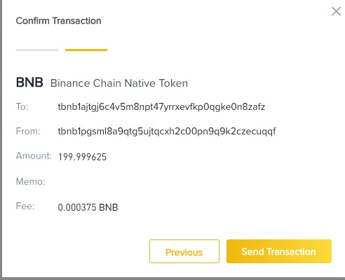

[](https://oceanprotocol.com)

#  BNB token bridge (WORK IN PROGRESS)

```
name: research on token bridge for Binance Chain
type: research
status: updated draft
editor: Fang Gong <fang@oceanprotocol.com>
date: 07/23/2019
```

In this research, we investigate the issuance of BEP-2 token in binance chain and the token bridge converts ERC20 token in Ethereum into the BEP-2 token.

## 1. Issue New Token in Binance Chain

As the first step, Ocean needs to **issue a new type of token** compatible with the **BEP-2 standard** in Binance chain. In this research, we use [Binance testnet](https://testnet.binance.org/en/) for demonstration and POC. 

Note that `issue token` is different from `list token` in binance chain. `list token` must go through a voting period in the community to add trading pairs into the [DEX](https://www.binance.org/en), which is decentralized and out of token owner's control. We will discuss it in more details later. 

### 1.1 Create Wallet

As described in [tutorial](https://www.binance.vision/tutorials/binance-dex-creating-a-wallet), user needs to create new account in Binance chain. The most convenient approach is the [webpage](https://www.binance.org/en/create). It is recommended to download the Keystore file to unlock the BNB wallet in the future.


Next, it displays the private key and 24-word nmemoric. Remember to write it down and keep it private for backup. 


Now, the wallet is ready to be used and accessed from [Unlock Wallet in Mainnet](https://www.binance.org/en/unlock) or [Unlock Wallet in Testnet](https://testnet.binance.org/en/unlock)


After unlock the wallet, the Binance DEX shows up and the wallet address can be found in the account info. In my case, it is `tbnb1ajtgj6c4v5m8npt47yrrxevfkp0qgke0n8zafz`, which starts with `t` to indicate it is wallet address in the testnet.

The same keystore file can be used in the mainnet of Binance chainn as well, but the wallet address is different. For example, use the same keystore file to unlock the wallet in the mainnet and wallet address becomes `bnb1ajtgj6c4v5m8npt47yrrxevfkp0qgke0ajtefn`.

### 1.2 Get test BNB

BNB tokens are required to interact with the Binance chain. For testing purpose, we can request 200 BNB for each wallet from the [faucet](https://www.binance.com/en/dex/testnet/address) but it requires 500 BNB to issue an new BEP-2 token. Listing token costs more than 2000 BNB.

To get enough amount of BNB for testing, we create more wallets and transfer all BNB into one wallet.


After a few minutes, the test BNB tokens can be found in the wallet:


We transfer BNB tokens from other wallet into one wallet:



### 1.3 Install Commannd Line Interface

To implemennt more complicated functionalities such as issuing tokens, Binance Chain requires an utility toolkit [`bnbcli`](https://github.com/binance-chain/node-binary), which is a command line interface. Note that the tool for **testnet** is `tbnbcli` that starts with `t`.

```
$ git clone git@github.com:binance-chain/node-binary.git
$ cd ./node-binary/cli/testnet/0.5.8/mac
$ ./tbnbcli 
BNBChain light-client

Usage:
  bnbcli [command]

Available Commands:
  init                  Initialize light client
  status                Query remote node for status
              
  txs                   Search for all transactions that match the given tags.
  tx                    Matches this txhash over all committed blocks
              
  account               Query account balance
  send                  Create and sign a send tx
  sign                  Sign transactions generated offline
              
  api-server            Start the API server daemon
  keys                  Add or view local private keys
              
  version               Print the app version
  token                 issue or view tokens
  dex                   dex commands
  params                params commands
  create-validator      create new validator initialized with a self-delegation to it
  remove-validator      remove validator
  validators            Query for all validators
  unbonding-delegations Query all unbonding-delegations records for one delegator
  gov                   gov commands
  admin                 admin commands
  help                  Help about any command

Flags:
  -e, --encoding string   Binary encoding (hex|b64|btc) (default "hex")
  -h, --help              help for bnbcli
      --home string       directory for config and data (default "/Users/fancy/.bnbcli")
  -o, --output string     Output format (text|json) (default "text")
      --trace             print out full stack trace on errors

Use "bnbcli [command] --help" for more information about a command.
```

As such, we can import our wallet to send transactions to the Binance testnet. Here `myWallet` is the alias of local wallet. 


This keystore now exists in `~/.bnbcli/keys` that is the same as the keystore file downloaded previously during the “create wallet” steps. It is encrypted using the selected passphrase.

We can verify our wallet account with cli as:

```
$ ./tbnbcli account tbnb1ajtgj6c4v5m8npt47yrrxevfkp0qgke0n8zafz --chain-id Binance-Chain-Nile  --node=data-seed-pre-2-s1.binance.org:80
{"type":"bnbchain/Account","value":{"base":{"address":"tbnb1ajtgj6c4v5m8npt47yrrxevfkp0qgke0n8zafz","coins":[{"denom":"BNB","amount":"59999925000"}],"public_key":null,"account_number":"690656","sequence":"0"},"name":"","frozen":null,"locked":null}}
```

Now we are ready to issue a new BEP-2 token in Binance chain.

### 1.4 Issue BEP-2 Token

The commandline `$ ./tbnbcli token issue` is used to issue a new BEP-2 token with following specifications in Binance Chain:

* readable token name: `--token-name “Fang” `
* total supply is 1.4 Billion: ` --total-supply 140000000000000000`
* token symbol: `--symbol FANG`
* mintable token: `--mintable=true/false`
* token owner: `--from myWallet` (myWallet is my local alias of wallet address)
* Binance network: `--chain-id Binance-Chain-Nile`

The complete command and transaction are following:

```
$ ./tbnbcli token issue --token-name “Fang” --total-supply 140000000000000000 --symbol FANG --mintable --from myWallet --chain-id Binance-Chain-Nile  --node=data-seed-pre-2-s1.binance.org:80
```


The tx hash is `EE56C7AF0C8785AEF9D3CDAF2D7FDE18A8A3DB919D6F2F094394B379CEBB7C86`. Tx details can be found [here](https://testnet-explorer.binance.org/tx/EE56C7AF0C8785AEF9D3CDAF2D7FDE18A8A3DB919D6F2F094394B379CEBB7C86).


From the explorer, we can see it creates a new token `FANG-EE5`. To avoid the uniqueness issue, Binance append the first three letters of tx hash to the token symbol (`EE5` in this case). Also, this tx costs 500 BNB. 


Moreover, the token details can be verified from [https://testnet-explorer.binance.org/asset/FANG-EE5](https://testnet-explorer.binance.org/asset/FANG-EE5):


From now on, the token can be transfered to other users. 

### 1.5 List Token 

While anyone can issue their tokens on Binance Chain, the listing of trading pairs on Binance DEX involves 4 steps: Proposal, Deposit, Vote, and List. This process is detailed in the [tutorial](https://community.binance.org/topic/18/guidelines-on-how-to-list-your-token-on-binance-dex) from Binance.


In short, token owner needs to submit Listing proposal and deposit at least 1,000 BNB tokens to make it eligible for voting. In this process, listing application, project information, vote results and all community interaction will be public on the [Binance Chain Community Forum](https://community.binance.org/). The Validators will vote purely based on public information in the forum.

At least half of the voting power is required to vote “Yes” for the proposal to be accepted. Denied proposals will lose all the funds deposited. If the vote is passed, the Token Issuer will need to initiate a “List” transaction on-chain (1,000 BNB fee), while the previous 1,000 BNB deposit will be refunded back to the proposing user.


## 2. POC of BNB Bridge 
<!---

Once the BEP-2 token is created in binance chain, we can investigate the token bridge in this section. The overall workflow and structure of the bridge is shown as follows:


```
$ npm install
...
npm ERR! code ELIFECYCLE
npm ERR! errno 1
npm ERR! tiny-secp256k1@1.1.0 install: `node-gyp rebuild`
npm ERR! Exit status 1
npm ERR! 
npm ERR! Failed at the tiny-secp256k1@1.1.0 install script.
...
$ npm i tiny-secp256k1 --ignore-scripts
npm WARN api.bnbridge.exchange@0.0.1 No repository field.

+ tiny-secp256k1@1.1.3
+ added 3 packages, removed 1 package, updated 1 package and audited 13667 packages in 3.19s
found 182 high severity vulnerabilities

$ npm install
npm WARN api.bnbridge.exchange@0.0.1 No repository field.

audited 13667 packages in 2.502s
found 182 high severity vulnerabilities
  run `npm audit fix` to fix them, or `npm audit` for details
```


```
$ cd cli

$ git clone https://github.com/binance-chain/node-binary.git
Cloning into 'node-binary'...
remote: Enumerating objects: 1067, done.
remote: Total 1067 (delta 0), reused 0 (delta 0), pack-reused 1067
Receiving objects: 100% (1067/1067), 848.28 MiB | 10.46 MiB/s, done.
Resolving deltas: 100% (268/268), done.
git-lfs filter-process: git-lfs: command not found
fatal: The remote end hung up unexpectedly
warning: Clone succeeded, but checkout failed.
You can inspect what was checked out with 'git statu

$ chmod +x ./node-binary/cli/prod/0.5.8/mac/bnbcli 

$ ./node-binary/cli/prod/0.5.8/mac/bnbcli version
Binance Chain Release: 0.5.8;Binance Chain Commit: 91044e2; Cosmos Release: =v0.25.0-binance.17; Tendermint Release: =v0.30.1-binance.6;
```

brew install postgresql

pg_ctl -D /usr/local/var/postgres start

$ pg_ctl -D /usr/local/var/postgres start
waiting for server to start....2019-07-23 17:54:23.573 PDT [42781] LOG:  listening on IPv6 address "::1", port 5432
2019-07-23 17:54:23.573 PDT [42781] LOG:  listening on IPv4 address "127.0.0.1", port 5432
2019-07-23 17:54:23.573 PDT [42781] LOG:  listening on Unix socket "/tmp/.s.PGSQL.5432"
2019-07-23 17:54:23.585 PDT [42782] LOG:  database system was shut down at 2019-07-23 17:52:08 PDT
2019-07-23 17:54:23.589 PDT [42781] LOG:  database system is ready to accept connections
 done
server started


$ postgres -V
postgres (PostgreSQL) 11.4

$ psql postgres
psql (11.4)
Type "help" for help.

postgres=# \du
                                   List of roles
 Role name |                         Attributes                         | Member of 
-----------+------------------------------------------------------------+-----------
 fancy     | Superuser, Create role, Create DB, Replication, Bypass RLS | {}


$ createuser --interactive postgres
Shall the new role be a superuser? (y/n) y

$ psql postgres

postgres=# \du
                                   List of roles
 Role name |                         Attributes                         | Member of 
-----------+------------------------------------------------------------+-----------
 fancy     | Superuser, Create role, Create DB, Replication, Bypass RLS | {}
 postgres  | Superuser, Create role, Create DB                          | {}
 
postgres=# \password postgres
Enter new password: 
Enter it again:

--->