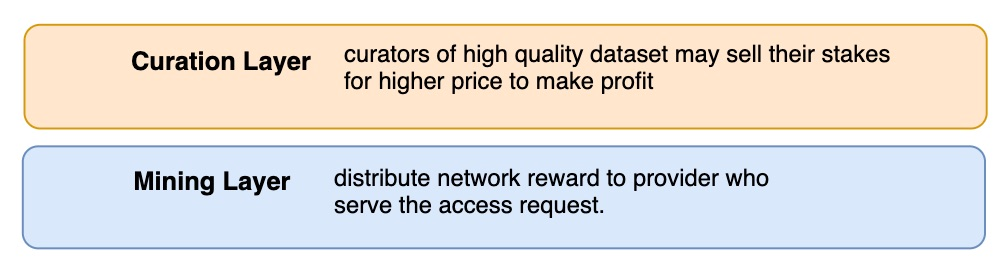
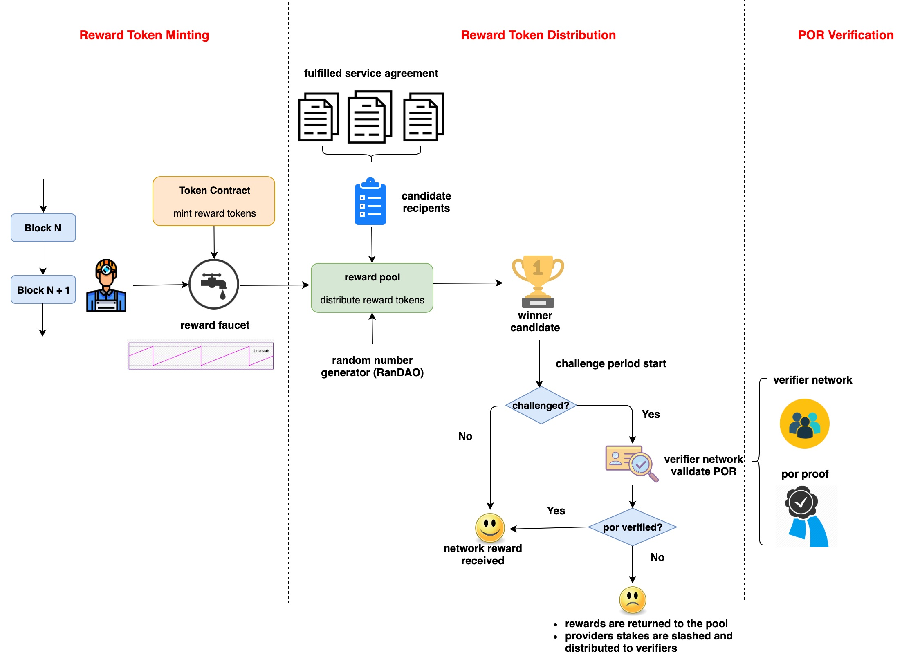
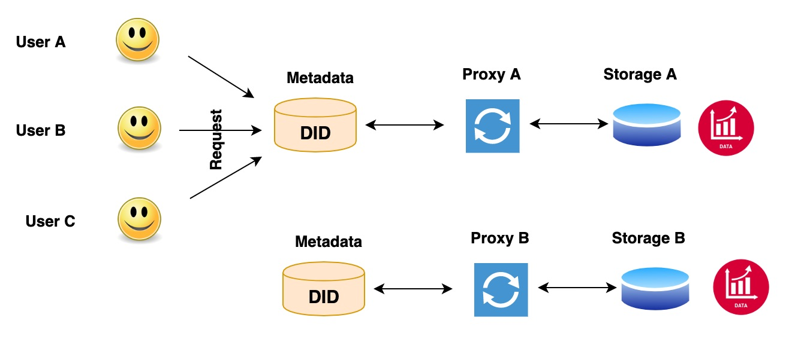
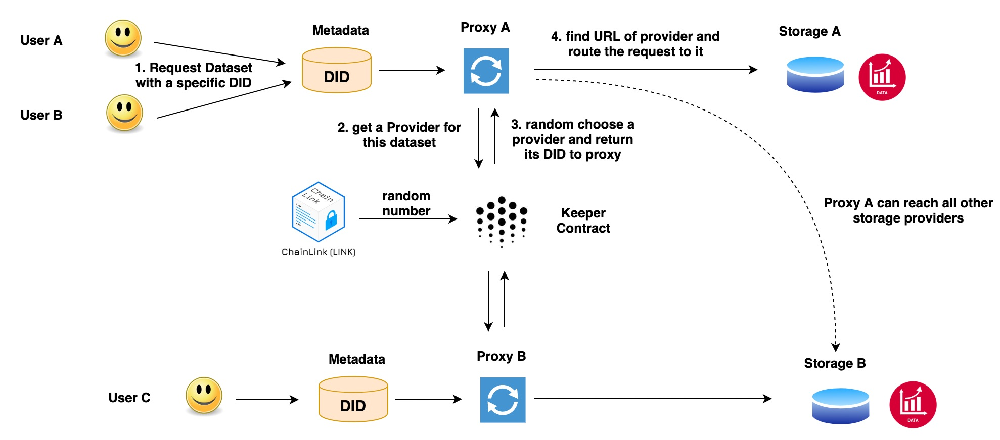
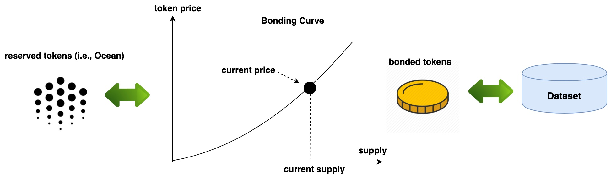
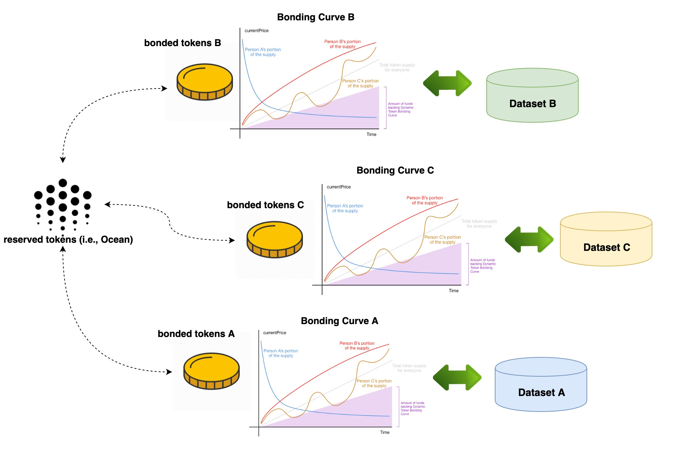
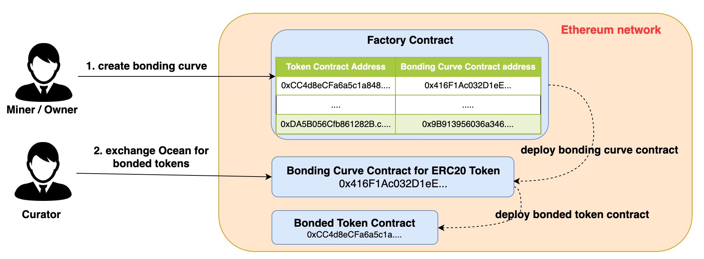

[](https://oceanprotocol.com)

#  Incentive Design with Permissionless Settings

```
name: research on incentive design
type: research
status: updated draft
editor: Fang Gong <fang@oceanprotocol.com>
date: 08/27/2019
```

# 1. Introduction

Incentive mechanism is an essential component in any decentralized applications (dApps), since dApps have no centralized authorities to govern it and each participant can join and leave at any time. Therefore, it is critical to reward the contributions from participants, who add more value to the network. As such, individual interest can be aligned with the entire network benefit. 

At this moment, Ocean keeper contracts are deployed to POA network, which is mainly maintained by POA nodes. In particular, these nodes govern the operation of the entire network and interaction with keeper contracts.

However, Ocean plan to **migrate to a permissionless blockchain network** such as Ethereum mainnet or so in the near future. In that situation, it is must to include incentive mechanism so that participants are motivated to contribute.

# 2. Overview

From the top-level point of view, the incentive mechanism can be divided into two layers:

* **curation layer**: it rewards users to curate high quality dataset through staking such as bonding curves.
* **mining layer**: it rewards miners or providers to serve the access request of data commons.



We compare these incentive layers from different perspectives in the below:

 **Layer**  |  Mining Layer |Curation Layer |
---| ---|  ---| ---|
**Participants** | data provider, verifier, challenger |    curator |
**Incentive** | network reward |  profit gain | 
**Mechanism** | reward token mining + por* |  bonding curves |
**Required Effort** |  L1, L2 + RanDAO/Chainlink | L1 |

\*por: `proof of retrieveability` which proves the dataset is available and ready for access.

# 3. Incentive in Mining Layer

The mining layer is the fundamental cornerstone for all incentive mechanism. In this layer, the funding source of incentives is the network reward that will be minted over blocks. 

To be clear, the network rewards in this layer aims to **reward the providers of data commons**, since providers of priced dataset can earn income from consumer payment.

## 3.1 Key Problems

The key problems of incentive design in this layer are follows:

* **Minting**: 
	* how to mint network rewards tokens (e.g., trigger, amount, speed, ...)? 
	* how to securely keep or hold them?
* **Distribution**: 
	* how to gather the candidate recipents? 
	* how to pick the final recipent of rewards?
	* what if the distribution is canceled?
* **Verification**:
	* how to challenge the chosen recipent for token rewards? 
	* how to validate the recipent indeed provides the service? 
	* how to build the verifier network and choose verifiers for the validation?
	* how to introduce randomness in the selection process to prevent potential fraudulence?

<!--

**Question**: shall we reward computing provider? 

* my opinion is NO, because they receive payment for their computing services, even though the dataset is public and free.
* but we can definitely add it if needed in the future. To build a working initial solution, let us stay focus on rewarding providers of data commons, who need incentives the most :)
-->

## 3.2 Architecture

To address these problems, we plotted the initial architecture design as follows:



* **Mining**: 
	* the network reward tokens will be minted every period of blocks as pre-defined schedule.
	* the minting transaction can be implemented in many different way:
		* an external minter account monitors new blocks and send minting transaction to token contract;
		* certain transaction in keeper contract can trigger the minting event;
		* or reward tokens can even be pre-minted and unlock ever period of time;
		* we can scale down the amount to put the risk under control in early stage.
	* the minted tokens can be holded in a smart contract that is in charge of distribution.
*  **Distribution**: 
	* providers who fulfill the service agreement of **data commons** in the same period can be added into the candidate list;
	* when current epoch is closed, the list will be cleared and start a new epoch;
	* an random number generator (e.g., RanDAO) or oracle service (e.g. Chainlink) can be used to choose a random recipent from the list;
	* assume each recipent has the same probability to be chosen, but the actual reward paid out might be a function of provider's staking amount);
* **Verification: (challenge-response appraoch that assume to be good until challenged)**
	* when a recipent is picked, the challenge period starts, which can be 1 week or 1 month.
	* anyone can be the challenger to create a challenge against the picked recipent;
	* anyone can register with Keeper contract and put down stakes to be an verifier;
	* when a challenge is created, a group of verifiers will be chosen from the verifier network;
	* these verifier perform POR verification against the data commons served by the recipent;
	* if failed, the reward tokens will return to the pool; Also, provider's stakes are slashed and splitted between challenger and verifiers.
	* if success, the reward tokens are distributed to recipent. Challenger loses stakes.

As such, we can summarize the **participants and their incentives** as below:

| -  |  **data commons provider** | **challenger** | **verifier** |
--- | ---|  ---| ---|
**Favorable Behavior** | serve data commons | challenge fraudulent providers | verify POR correctly and timely |
**Incentive** | network reward | provider's stakes | stakes of provider (if failed) or challenger (if sucess) |
**Penalty** |  loss of token rewards and own stakes | loss of stakes | loss of stakes |


## 3.3 Modules

In this section, we elaborate each different module as described in the architecture.

### 3.3.1 PoR 

Proof of Data Retrievability (PoR) indicates that the provider must provide the continued availability of specific dataset and be able to prove to a verifier that the data is stored and available for access. See details in [POR research](../03-data-availability/web2-compact-por/README.md). The code on each party (e.g., owner, provider, and verifier) has been implemented in Golang: 

* [instruction of por functions](../03-data-availability/web2-compact-por/por-refactoring/README.md)
* [source code](../03-data-availability/web2-compact-por/por-refactoring/src)

The entire workflow is **challenge-reponse approach**: the verifier generates a unique challenge each time and provider computes the corresponding proof. The challenge and proof are paired and different for each verification task.


There are two approaches to deploy the code, which may needs some development in L2 to interact with the Golang functions.

* **Cloud Service** (e.g., AWS Lambda Function, Google Cloud Function)
	* we deploy por code as cloud services for provider and verifier, respectively. 
	* it is much convenient for both of them to fulfill the verification task.
	* however, it can **only handle small-size dataset**, because the AWS API function `S3.GetObject` loads the entire dataset from S3.
	* see [research poc about deployment using AWS Lambda function]([Verifier Network Design](../15-por-verifier-network/lambda/README.md))


* **Standalone Service**
	* data provider and verifier deploy different code of por in their local;
	* verifier monitors the event from Ocean network to get verification task;
	* this method can handle large-size dataset, because the por functionn can read file by chunks in the local.
	* risk: verifier may attack this design by submitting (random) results without doing real verification.
		* solution 1: Ocean build a binary for verifier to run directly, therefore, verifier cannot submit result without fulfilling the verification task.
		* solution 2: Ocean creates the challenge and ask for proof from the verifier, who can only provide the result after fulfill the task.  (described as "Hybrid Service")


* **Hybrid Service**
	* verifier use the por function in cloud deployed by Ocean;
	* provider run the por service in his local;
	* Ocean can ask for the challenge along with proof from verifier to verify his service;
	* meanwhile, provider can handle large-size file by reading chunk by chunk in his local.
	* verifier only needs to listen to Ocean network, request challenge from Ocean and replay the proof received from the provider.


### 3.3.2 Verifier Network

The verifier network connsists of a group of registered verifiers. They will be randomly chosen to fulfill the verification tasks. In the future, they may have different probabilities to be chosen depending on their performance or reputation. 

A research poc can be found: [verifier network design document](../15-por-verifier-network/README.md) and [poc code](../15-por-verifier-network/js-poc)

This module includes following components:

* **register as a verifier**:
	* Keeper contract needs to add a "Verifier" contract to accept stakes and register verifier;


* **randomly choose verifier**:
	* it requires a RNG to choose a group of verifiers from the verifier network;
	* the selection may leverage reputation information in the future.
	* One critical building block for reward distribution is a `Random Number Generator (RNG)` such as [poc of RanDAO](../00-archive/poc-12-2018/contracts/random/OceanRandao.sol) and [poc of RNG using Chainlink](../06-random-number/README.md).

	

* **resolve challenge**:
	* Keeper contract shall add a contract to resolve the challenge according to results from verifiers;
	* more importantly, it shall distribute reward tokens or slash stakes accordingly.

### 3.3.3 Network Reward Distribution

* **Minting network rewards**:
	* the off-chain identity can be OPF or other governor, who has the permission to mint tokens. 
	* The mining service monitors new blocks in the blockchain network and trigger minting tx **periodically**.
	* It requires modification and deployment of Keeper contracts including token contract.

	

* **Distribute network rewards**
	* **(Update: 09/10/2019)**: each provider who have staked, made dataset available, and served the access to data commons in current epoch is eligible to receive network rewards;
	* for each epoch, one eligible provider is chosen to receive all reward tokens in the pool;
	* the reward tokens are locked up for a period (e.g., one week or one month) when anyone can challenge the reward and initiate a verification aganist the provider.
	* **(Update: 09/10/2019)**: provider must stake more Ocean tokens than the amount of received network rewards:
		* when picked as the winner, provider can get the reward tokens right away;
		* meanwhile, their stakes become the "locked stake", which can be lost in the challenge period (e.g., one week or one month) if a successful challenge. 


	

## 3.4 Development Roadmap

We estimate the roadmap of development in the following:


* **POR module: (L2 and DevOps support)**
	* the core functionalities are implemented in Golang;
	* needs to deploy the POR services or provider can run it in his local;
	* it does not depend on other modules.
	* **TODO WORK**: 
		* core functionalities had been implemented for each role in Golang.
		* need new development based on deployment strategy:
			* Cloud: deploy in Cloud and build new code to interact with them;
			* Standalone: develop local services to interact with Golang program. 
* **Verifier network module: (L1 & L2 support)**
	* it needs the smart contract development to allow verifiers to stake and register;
	* it needs a RNG module to randomly choose a group of verifiers from the pool for verification task;
	* the `resolution` smart contract shall resolve the challenge and reward/slash tokens.
	* it can be developed in parallel with POR module and they can be integrated together later;
	* **TODO WORK**:
		* we have research poc and need to develop code for production;
		* needs to add new smart contracts (e.g., register verifier, resolve challenge) and write interface functions;
		* needs to integrate with RNG to get random numbers.
* **Reward distribution: (L1 & L2 support)**
	* it needs a off-chain minter or other on-chain event to trigger the minting transaction;
	* the token contract shall be updated to allow minting tokens as the schedule in WP;
	* add new `reward pool` contract to handle distribution;
	* it depends on RNG module (e.g., RandDAO or Chainlink) and Verifier network.
	* **TODO WORK**:
		* build off-chain miner service to mint network reward tokens every period of time;
		* modify the token contract to compute available token rewards and add a minting function;
		* add new smart contract to distribute rewards considering challenge period;
		* integrate with RNG and verifier network.

Overall, all these modules can be built in the same time but they should be integrated at certain point along the time. In the below diagram, it shows verifier network should take longer time than that of POR, and they need to be integrated later. Moreover, the reward distribution provides the framework that needs to integrate other two modules, therefore, it takes longest time.


## 3.5 Outstanding Issues

### 3.5.1 Reward Multiple Providers for The Same Dataset

* **Problem**

In the current design of Ocean architecture, each proxy has a single URL pointing to a specific storage serving the dataset. However, many storage providers may serve the exactly the same dataset. 

When users interact with the same proxy to access the dataset, **the proxy will route all requests to the same storage provider**. As such, other providers of the same dataset cannot serve the access request, therefore, making them unqualified to receive network rewards, which discourages other providers to continue storage services. 

The root cause of the issue is that each proxy is not aware of the complete list of providers for the same dataset. Also, proxy shall not decide which storage provider serve the access request, which may potential cause fraudulence.



* **Solution**

To resovle the issue, the key is to enable all proxies to be aware of all storage providers for the same dataset, which can be done through Keeper contract.

When a storage provider registers with Ocean to serve a dataset, his DID will be recorded in Keeper contract for the specific dataset. It forms a complete list of providers for the same dataset.

When users request dataset from a proxy, the proxy will query the Keeper contract for a provider for the requested dataset. Keeper contract will randomly choose a provider from the on-chain list so that each provider has the same probability to receive network reward. Here, a random number needs to be generated by RNG (e.g., RanDAO) or imported from Oracle network (e.g., Chainlink).

After the proxy receives the provider DID from Keeper contract, it can retrieve the corresponding URL from metadata store to route the access correctly. As such, no matter which proxy the user is interacting with, the request can be routed to any provider who serve the same dataset.

More importantly, Keeper contract is in charge of randomly choosing a provider from the list, which prevents potential attacks: for example, an attacker runs a proxy and a storage in the same time, and creates a huge amount of requests to access the dataset in his own storage. As such, he fakes the requests and earn network rewards. 

The potential disadvantage is the performance hit, since proxy needs to transact with Keeper to get the provider DID and it may cause a latency.



### 3.5.2 Need to stake Ocean token to earn

There is an option to requrie miners and sourcers to stake Ocean tokens on their served dataset in addition to serve access requests. The motivations have two folds:

* the staking requirement can filter out most fraudulence, which serve tons of low-quality (if not garbage) dataset in Ocean network to earn network rewards;
* it creates the huge demand of Ocean tokens and drive up the token price. 

However, it creates certain entrance barrier or friction for new miners to Ocean, who only want to serve dataset to earn network rewards. It can potentially prevent them from participating in Ocean ecosystem. 

Some thoughts of possible solution:

* each miner has a one-time trail period (e.g., one month or so):
	* miners do not need to stake in order to earn. They can start serving dataset right away without any friction;
	* after the trail period expires, miners are requried to stake Ocean tokens (funding source can be purchased token or earned network rewards).
	* possible attack:
		* miners can create a new account to start a new trail period (i.e., Sybil attack);
		* however, they cannot build up their reputations in this way;
		* network rewards can be tuned to reward more to miners with longer time history.
* alternatively, Ocean can enforce staking policy in a latter stage:
	* in the early stage, the top priority is to encourage more miners to serve dataset, therefore, it helps them onboard by suspending the staking requirement for time being;
	* when more and more miners join Ocean, we can enforce the staking policy at that time to prevent fraudulence.

### 3.5.3 IP Rights Violation (Elsa & Anna Attack)

Miners may serve a IP-protected but very popular dataset (e.g., Disney movie, music songs and etc) to earn tremendous amount of network rewards in a short period of time. However, they clearly don't own the copyright. Such behavior creates an IP violation and critical legal issue. Ocean shall reduce the chance of such IP issue at the early stage.

Depending on the required efforts from Ocean, the solutions can include:

* **challenge-response** approach: 
	* Ocean will not step into the investigation of IP violation until anyone (e.g., real IP owner or normal user) challenge an existing dataset;
	* for every distribution of network rewards, tokens will be locked up for a period time (e.g., one week, one month or even longer). So the miner can be challenged and lose their earned rewards. 
	* the challenger will take the staking of the miner as his rewards.
	* (optional): OPF may reserve a pool of network rewards for challengers to motivate them to detect the IP violations more actively.
* **proactive infringement detection** approach:
	* in order to actively detect the violation, Ocean can leverage external infringement detection service to inspect the dataset at the very beginning (e.g., when publisher upload the dataset through the client).


### 3.5.4 Sybil Download Attack

To earn more network rewards, the miners may fake tremendous amount of access transactions on their own datasets *within one epoch of reward distribution*. In this way, miners serve more fake access requests and have higher probability to receive the rewards.

To prevent such attack, some potential approaches can be adopted:

* **Simple Case: attack from single account**
	* detect the abnormal access pattern from single account:
		* repeatedly download the same dataset within a short period of time
		* single account repeatedly download various datasets from one single miner;
		* ...
	* deactivate those account to stop their access to the Ocean network for a period of time or limit their transactions in a epoch of reward distribution.
	* reward distribution smart contract can lower the winning probability for miners with such abnormal transaction history.
* **Complex Case: attack from many controlled accounts or a ring of actors**
	* it becomes extremely difficult to recognize those controlled accounts in this scenario, because all of them seem to be normal;
	* instead, Ocean can monitor the abnormal download stats for miners and properly scale down the factor of download transactions in calculating the probability of receiving network reward.
	
Overall, Ocean need to create a fair policy to distribute reward tokens to all miners with equal probability, who contribute dataset and serve the access requests in the network. 

# 4. Incentive in Curation Layer

Ocean needs to motivate the community to curate high-quality dataset in a more decentralized way. To do so, each dataset can have corresponding bonding curve so that the community can stake and unstake on the dataset and make a profit. 


## 4.1 Architecture

The bonding curves is an automated market maker that accept reserve token deposit and mint bonded tokens at the price set by the curve; similarly, it can burn bonded token and return reserved token as the exchange. More details can be found in [POC of bonding curve](../02-signaling-mechanism/1-bonding-curve)




As such, each dataset has its **own bonding curves with different parameters** and its **own bonded tokens**. Note that bonded token is an ERC20 token that can be transferred between peers and traded in external exchanges as well. 

Token holders can deposit their Ocean tokens in the bonding curves of their favorite datasets and receive bonded tokens at the exchange rate at that time. If they stake early, the cost of bonded token is much lower, therefore, they can make a great profit by unstaking when dataset becomes popular and bonded token is expensive.



## 4.2 Development

The entire curation layer can be developed in Keeper contract, which includes two components:

* **Factory Contract**: this is the manager contract of all bonding curve contract that can:
	* create a new bonding curve contract;
	* activate / deactivate a bonding curve contract;
	* search for bonded token contract address for a specific bonding curve contract;
	* search for bonding curve contract for a specific dataset DID;
	* ...
* **Bonding Curve Contract**: 
	* it implements the bonding curve with specified parameters;
	* it create and deploy a new ERC20 contract as the bonded token contract;
	* it has ownership of the deployed bonded token contract.



Note that each bonding curve may have different parameters that determines the shape of curve and appreciation speed of bonded token price. These paramters can be set by Ocean in the global or individual governor from OPF.

## 4.3 Outstanding Issues

### 4.3.1 Curation Clone Attack

It is possible that attackers re-publish the super popular dataset and started a brand new curation market, where they get significant stake in the market because they were early adopters of the duplicate dataset. In this way, multiple duplicate curation market can be built for the same dataset, hindering discoverability not to mention being unfair to the first publisher..

The key to solve this issue is to prevent any publisher/miner from creating new curation market at their will. This is the root cause of this kind of fraudulence.

Instead, a **proposal-voting process** can be adopted to create new curation markets:

* miner needs to submit a proposal (that details the market info, dataset info, etc.) to the community in order to create new curation market;
* miner is required to deposit a certain amount of Ocean tokens on their proposal, which will be returned to them if the proposal is successful;
* all miners can vote on the proposal in a certain period of time using TCR;
	* miners are motivated to find duplicate markets, because they may be the victim of such attack;
* when most miners approve the proposal, this curation market can be created.

### 4.3.2 Data Availability Attack

It is possible that miner removes the dataset by accident or on purpose when the curation market has been created. In this way, the market becomes dangling without real dataset behind it and bonded tokens will be dumped. 

Much worse, the attacker may dump all his bonded token at higher price and remove the dataset after.

There are some approaches to reduce the chance of such attack:

* Miner is required to restore the access of dataset in a certain period of time;
* If dataset is still unavailable after the time window, the stakes of the miner will be slashed as the penalty, which will be distributed to all curators of this dataset;
* Miner of this dataset will become ineligible to receive any network rewards;
* Miner account will be deactivated to publish new dataset.

### 4.3.2 Pump-and-Dump Attack

Attackers may stake in curation market at very low price, broadcast fake information to pump the token price and dump all their positions at higher price for profits.

**Shorting in Bonding Curves** is a possible approach to prevent such attack: 

* it motivates the community to inspect curation markets that include fraudulence. Since shorting requires no previous purchase, shorting traders can short at any price before the attacker dump their tokens;
* it requires the bonding curve can be defined as an analytic formula so that it is integral calculation can be programmed in smart contract;
* more details in [shorting bonding curve research](../02-signaling-mechanism/2-shot-sell-bc/README.md) 

## 4.4 More Features

* **stake in Ether or any other ERC20 token**
	* users can deposit Ocean, Ether or any other ERC20 token as the reserve token into the bonding curve contract;
	* it can be enabled by integrating Uniswap to automated swap other tokens into Ocean tokens and deposit Ocean tokens into bonding curve contract.

