[](https://oceanprotocol.com)

#  Incentive Design with Permissionless Settings

```
name: research on incentive design
type: research
status: initial draft
editor: Fang Gong <fang@oceanprotocol.com>
date: 08/27/2019
```

# 1. Introduction

Incentive mechanism is an essential component in any decentralized applications (dApps), since dApps have no centralized authorities to govern it and each participant can join and leave at any time. Therefore, it is critical to reward the contributions from participants, who add more value to the network. As such, individual interest can be aligned with the entire network benefit. 

At this moment, Ocean keeper contracts are deployed to POA network, which is mainly maintained by POA nodes. In particular, these nodes govern the operation of the entire network and interaction with keeper contracts.

However, Ocean plan to **migrate to a permissionless blockchain network** such as Ethereum mainnet or so in the near future. In that situation, it is must to include incentive mechanism so that participants are motivated to contribute.

# 2. Overview

From the top-level point of view, the incentive mechanism can be divided into following layers:

* **curation layer**: it rewards users to curate high quality dataset through staking such as bonding curves. 
* **reputation layer**: it entitle users with more privilege for higher reputation:
	* users build their reputation through their services:
		* data provider serves high quality dataset; 
		* verifier validates the availability of dataset timely and correctly;
		* curators stake on high quality dataset;
		* etc.
	* they receive privilege for higher reputation, such as:
		* dataset from provider can be promoted with higher rank in elastic search result;
		* verifier will have higher probability to be chosen to fulfill the verification task;
		* etc.
* **storage layer**: it rewards users to serve the access request of data commons.

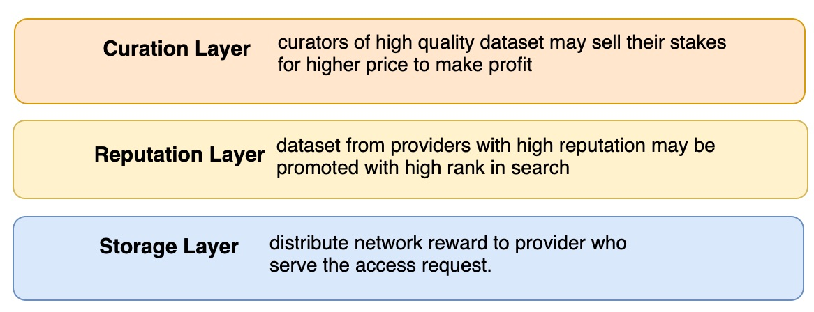

We compare these incentive layers from different perspectives in the below:

 **Layer**  |  Storage Layer |Reputation Layer | Curation Layer |
---| ---|  ---| ---|
**Participants** | data provider, verifier, challenger |   all service providers | curator |
**Incentive** | network reward | privilege | profit gain | 
**Mechanism** | reward token minting + por* |  layered TCR | bonding curves |
**Required Effort** |  L1, L2 + RanDAO/Chainlink | L1 | L1 |

\*por: `proof of retrieveability` which proves the dataset is available and ready for access.

# 3. Incentive in Storage Layer

The storage layer is the fundamental cornerstone for all incentive mechanism. In this layer, the funding source of incentives is the network reward that will be minted over the time. 

To be clear, the network rewards in this layer aims to **reward the providers of data commons**, since providers of priced dataset can earn income of consumer payment.

## 3.1 Key Problems

The key problems of incentive design in this layer are follows:

* **Minting**: 
	* how to mint network rewards tokens (e.g., trigger, amount, speed, ...)? 
	* how to securely keep or hold them?
* **Distribution**: 
	* how to gather the candidate recipents? 
	* how to pick the final recipent of rewards?
	* what if the distribution is canceled?
* **Verification**:
	* how to challenge the chosen recipent for token rewards? 
	* how to validate the recipent indeed provides the service? 
	* how to build the verifier network and choose verifiers for the validation?
	* how to introduce randomness in the selection process to prevent fraudulence?

<!--

**Question**: shall we reward computing provider? 

* my opinion is NO, because they receive payment for their computing services, even though the dataset is public and free.
* but we can definitely add it if needed in the future. To build a working initial solution, let us stay focus on rewarding providers of data commons, who need incentives the most :)
-->

## 3.2 Architecture

To address these problems, we plotted the initial architecture design as follows:

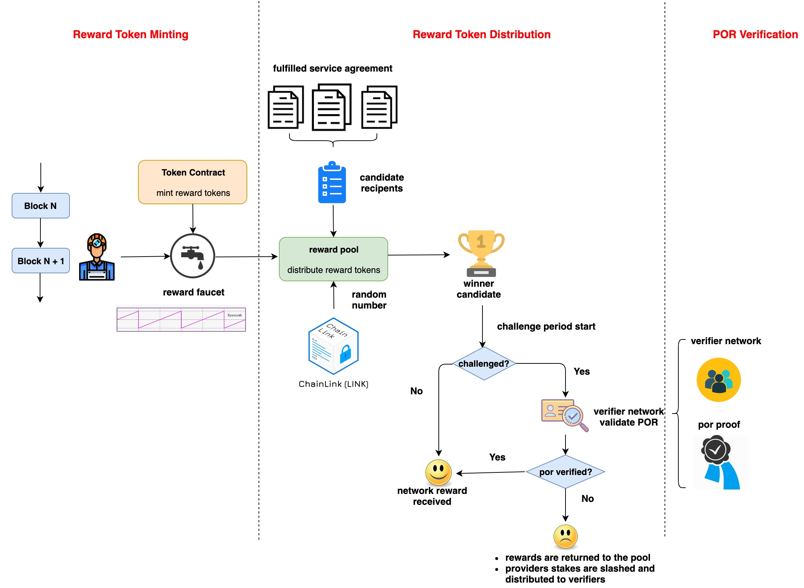

* **Minting**: 
	* the network reward tokens will be minted every period of blocks as pre-defined schedule.
	* the minting transaction can be implemented in many different way:
		* an external minter account monitors new blocks and send minting transaction to token contract;
		* certain transaction in keeper contract can trigger the minting event;
		* or reward tokens can even be pre-minted and unlock ever period of time;
		* we can scale down the amount to put the risk under control in early stage.
	* the minted tokens can be holded in a smart contract that is in charge of distribution.
*  **Distribution**: 
	* providers who fulfill the service agreement of **data commons** in the same period can be added into the candidate list;
	* when current epoch is closed, the list will be cleared and start a new epoch;
	* an random number generator (e.g., RanDAO) or oracle service (e.g. Chainlink) can be used to choose a random recipent from the list (assume each recipent has the same probability to be chosen);
* **Verification: (challenge-response appraoch that assume to be good until challenged)**
	* when a recipent is picked, the challenge period starts, which can be 1 week or 1 month.
	* anyone can be the challenger to create a challenge against the picked recipent;
	* anyone can register with Keeper contract and put down stakes to be an verifier;
	* when a challenge is created, a group of verifiers will be chosen from the verifier network;
	* these verifier perform POR verification against the data commons served by the recipent;
	* if failed, the reward tokens will return to the pool; Also, provider's stakes are slashed and splitted between challenger and verifiers.
	* if success, the reward tokens are distributed to recipent. Challenger loses stakes.

As such, we can summarize the **participants and their incentives** as below:

| -  |  **data commons provider** | **challenger** | **verifier** |
--- | ---|  ---| ---|
**Favorable Behavior** | serve data commons | challenge fraudulent providers | verify POR correctly and timely |
**Incentive** | network reward | provider's stakes | stakes of provider (if failed) or challenger (if sucess) |
**Penalty** |  loss of token rewards and own stakes | loss of stakes | loss of stakes |


## 3.3 Modules

In this section, we elaborate each different module as described in the architecture.

### 3.3.1 PoR 

Proof of Data Retrievability (PoR) indicates that the provider must provide the continued availability of specific dataset and be able to prove to a verifier that the data is stored and available for access. See details in [POR research](../03-data-availability/web2-compact-por/README.md). The code on each party (e.g., owner, provider, and verifier) has been implemented in Golang: 

* [instruction of por functions](../03-data-availability/web2-compact-por/por-refactoring/README.md)
* [source code](../03-data-availability/web2-compact-por/por-refactoring/src)

The entire workflow is **challenge-reponse approach**: the verifier generates a unique challenge each time and provider computes the corresponding proof. The challenge and proof are paired and different for each verification task.


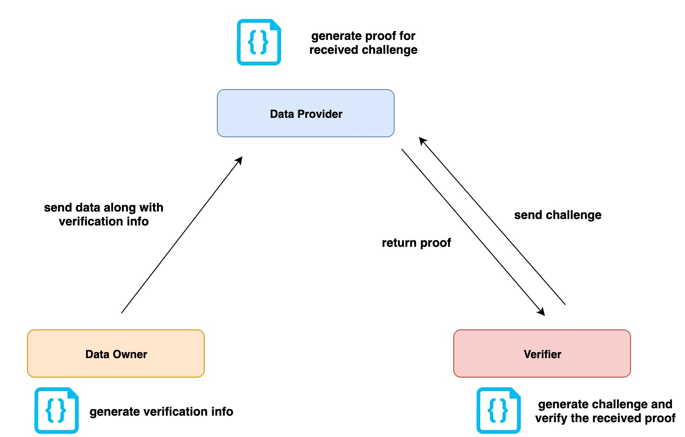

There are two approaches to deploy the code, which may needs some development in L2 to interact with the Golang functions.

* **Cloud Service** (e.g., AWS Lambda Function, Google Cloud Function)
	* we deploy por code as cloud services for provider and verifier, respectively. 
	* it is much convenient for both of them to fulfill the verification task.
	* however, it can **only handle small-size dataset**, because the AWS API function `S3.GetObject` loads the entire dataset from S3.
	* see [research poc about deployment using AWS Lambda function]([Verifier Network Design](../15-por-verifier-network/lambda/README.md))

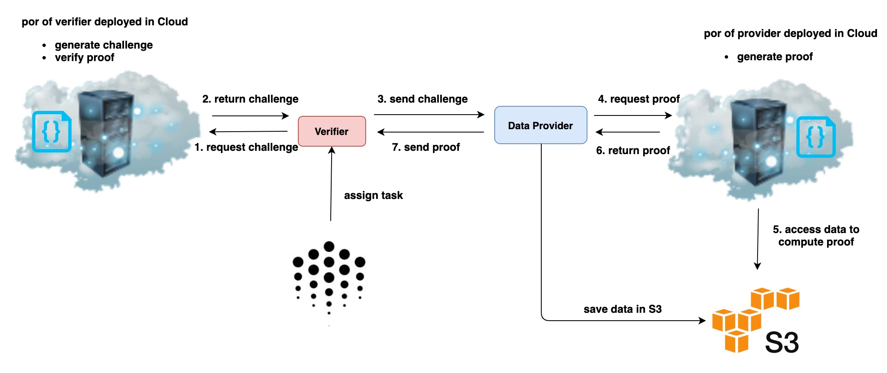

* **Standalone Service**
	* data provider and verifier deploy different code of por in their local;
	* verifier monitors the event from Ocean network to get verification task;
	* this method can handle large-size dataset, because the por functionn can read file by chunks in the local.
	* risk: verifier may attack this design by submitting (random) results without doing real verification.
		* solution 1: Ocean build a binary for verifier to run directly, therefore, verifier cannot submit result without fulfilling the verification task.
		* solution 2: Ocean creates the challenge and ask for proof from the verifier, who can only provide the result after fulfill the task.  (described as "Hybrid Service")

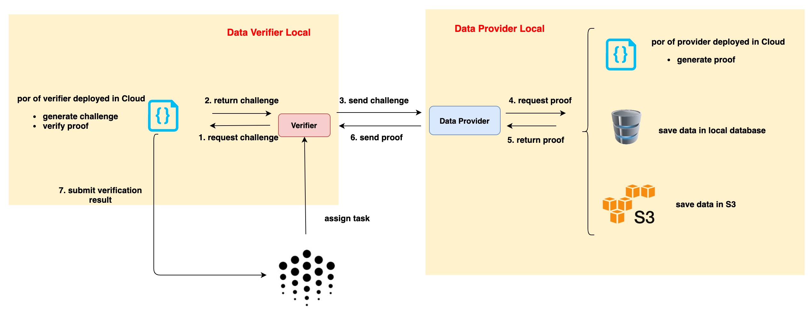

* **Hybrid Service**
	* verifier use the por function in cloud deployed by Ocean;
	* provider run the por service in his local;
	* Ocean can ask for the challenge along with proof from verifier to verify his service;
	* meanwhile, provider can handle large-size file by reading chunk by chunk in his local.
	* verifier only needs to listen to Ocean network, request challenge from Ocean and replay the proof received from the provider.

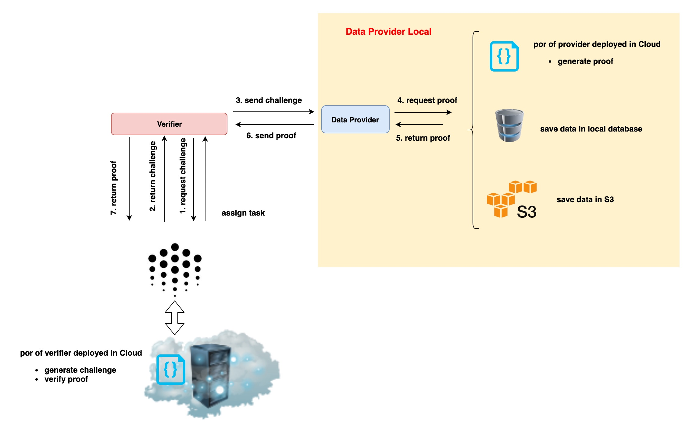

### 3.3.2 Verifier Network

The verifier network connsists of a group of registered verifiers. They will be randomly chosen to fulfill the verification tasks. In the future, they may have different probabilities to be chosen depending on their performance or reputation. 

A research poc can be found: [verifier network design document](../15-por-verifier-network/README.md) and [poc code](../15-por-verifier-network/js-poc)

This module includes following components:

* **register as a verifier**:
	* Keeper contract needs to add a "Verifier" contract to accept stakes and register verifier;

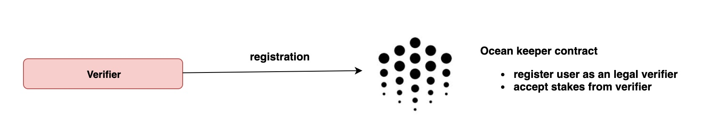

* **randomly choose verifier**:
	* it requires a RNG to choose a group of verifiers from the verifier network;
	* the selection may leverage reputation information in the future.
	* One critical building block for reward distribution is a `Random Number Generator (RNG)` such as [poc of RanDAO](../00-archive/poc-12-2018/contracts/random/OceanRandao.sol) and [poc of RNG using Chainlink](../06-random-number/README.md).

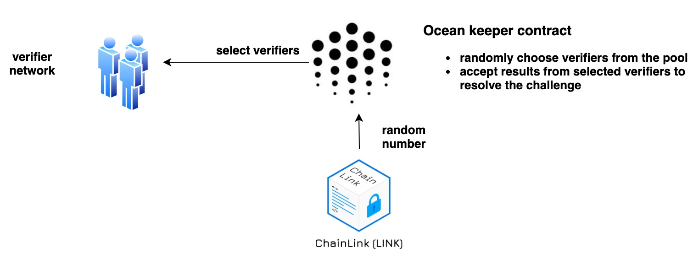	

* **resolve challenge**:
	* Keeper contract shall add a contract to resolve the challenge according to results from verifiers;
	* more importantly, it shall distribute reward tokens or slash stakes accordingly.

### 3.3.3 Network Reward Distribution

* **Minting network rewards**:
	* the off-chain identity can be OPF or other governor, who has the permission to mint tokens. 
	* The mining service monitors new blocks in the blockchain network and trigger minting tx **periodically**.
	* It requires modification and deployment of Keeper contracts including token contract.

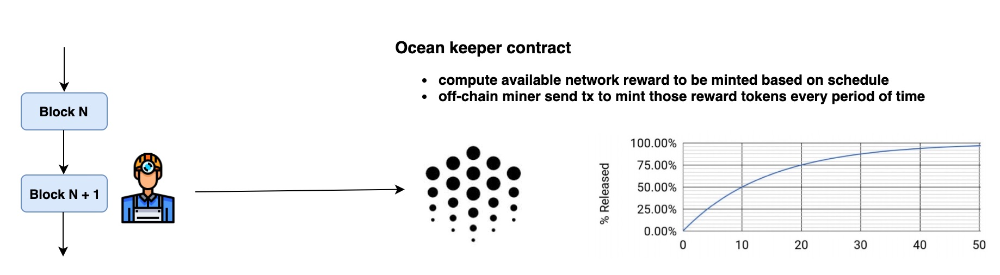	

* **Distribute network rewards**
	* as a first-cut design, each provider who **serve the access to data commons** is eligible to receive network rewards;
	* for each epoch, one eligible provider is chosen to receive all reward tokens in the pool;
	* the reward tokens are locked up for a period (e.g., one week or one month) when anyone can challenge the reward and initiate a verification aganist the provider.

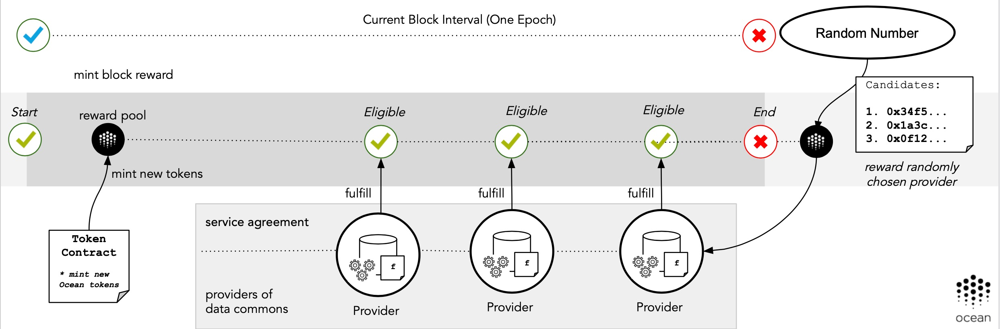	

## 3.4 Development Roadmap

We estimate the roadmap of development in the following:


* **POR module: (L2 and DevOps support)**
	* the core functionalities are implemented in Golang;
	* needs to deploy the POR services or provider can run it in his local;
	* it does not depend on other modules.
	* **TODO WORK**: 
		* core functionalities had been implemented for each role in Golang.
		* need new development based on deployment strategy:
			* Cloud: deploy in Cloud and build new code to interact with them;
			* Standalone: develop local services to interact with Golang program. 
* **Verifier network module: (L1 & L2 support)**
	* it needs the smart contract development to allow verifiers to stake and register;
	* it needs a RNG module to randomly choose a group of verifiers from the pool for verification task;
	* the `resolution` smart contract shall resolve the challenge and reward/slash tokens.
	* it can be developed in parallel with POR module and they can be integrated together later;
	* **TODO WORK**:
		* we have research poc and need to develop code for production;
		* needs to add new smart contracts (e.g., register verifier, resolve challenge) and write interface functions;
		* needs to integrate with RNG to get random numbers.
* **Reward distribution: (L1 & L2 support)**
	* it needs a off-chain minter or other on-chain event to trigger the minting transaction;
	* the token contract shall be updated to allow minting tokens as the schedule in WP;
	* add new `reward pool` contract to handle distribution;
	* it depends on RNG module (e.g., RandDAO or Chainlink) and Verifier network.
	* **TODO WORK**:
		* build off-chain miner service to mint network reward tokens every period of time;
		* modify the token contract to compute available token rewards and add a minting function;
		* add new smart contract to distribute rewards considering challenge period;
		* integrate with RNG and verifier network.

Overall, all these modules can be built in the same time but they should be integrated at certain point along the time. In the below diagram, it shows verifier network should take longer time than that of POR, and they need to be integrated later. Moreover, the reward distribution provides the framework that needs to integrate other two modules, therefore, it takes longest time.

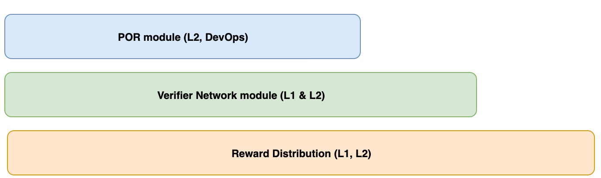


# 4. Incentive in Reputation Layer


# 5. Incentive in Curation Layer
