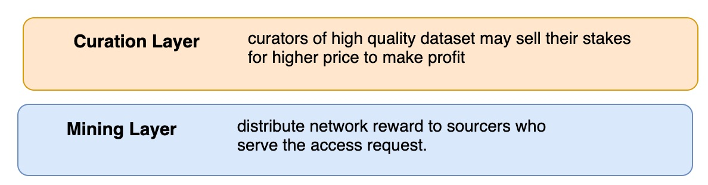
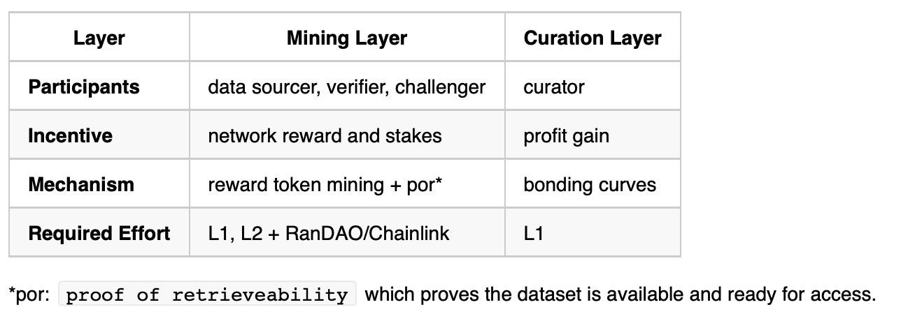
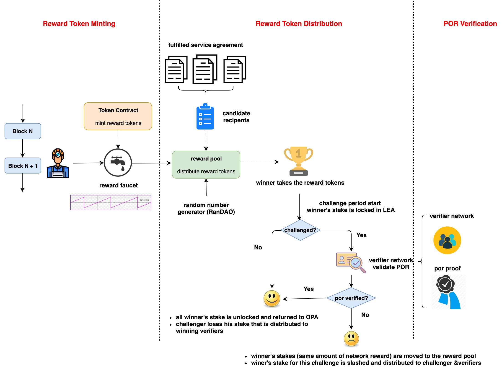
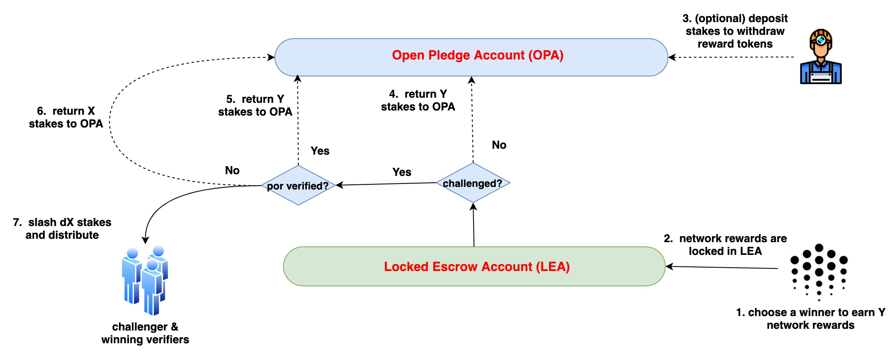
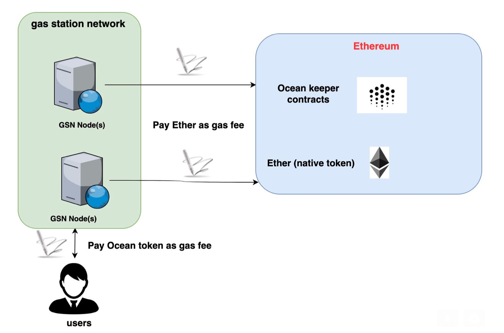

[](https://oceanprotocol.com)

#  Ocean Token Design: Structure and Behavior

```
name: research on Ocean token design
type: research
status: updated draft
editor: Fang Gong <fang@oceanprotocol.com>
date: 08/27/2019
```

# 1. Introduction

Incentive mechanism is an essential component in any decentralized applications (dApps), since dApps have no centralized authorities to govern it and each participant can join and leave at any time. Therefore, it is critical to design an incentive mechanism to reward tokens to participants who made contributions. As such, individual interest can be aligned with the entire network benefit. 

In this research, we investigate the token dynamics in Ocean network and propose the token design to incentivize various participants in our ecosystem. It categorizes the token design into different layers and analyze the potential attack along with solutions.

In this research, we consider following types of roles in Ocean network:

* **supplier**: have the data but don't know how to distribute;
* **consumer**: consume the dataset (no need to have extra incentive :)
* **sourcer**: publish the dataset and fulfill the access request from users;
	* initial sourcer: first to publish dataset and initialize curation market, etc.
	* second sourcer: identify a high quality dataset and make it available themselves.
* **challenger**: challenge the provider about data availability;
* **verifier**: verify the data availability of dataset served by a specific provider;
* **curator**: stake on promising dataset to promote the high quality datasets;

# 2. Overview

From the top-level point of view, the token design can be divided into two layers:

* **curation layer**: it rewards curators to curate high quality dataset through staking mechanism such as bonding curves.
* **mining layer**: it rewards sourcers to publish dataset and serve the access requests.



We compare these incentive layers from different perspectives in the below:



<!---
 **Layer**  |  Mining Layer | Curation Layer |
---| ---|  ---| ---| ---|
**Participants** | data sourcer, verifier, challenger |     curator |
**Incentive** | network reward and stakes | profit gain | 
**Mechanism** | reward token mining + por* |  bonding curves |
**Required Effort** |  L1, L2 + RanDAO/Chainlink | L1 |

\*por: `proof of retrieveability` which proves the dataset is available and ready for access.
--->

# 3. Token Design in Mining Layer

The mining layer is the fundamental cornerstone for all token design. In this layer, the funding source of incentives is the network reward that will be minted over blocks. 

To be clear, the network rewards aims to **reward the providers of data commons**, since providers of priced dataset can earn income from their consumer payments.

## 3.1 Key Problems

The key problems of incentive design in this layer are follows:

* **Mining**: 
	* how to mine network rewards tokens (e.g., trigger, amount, speed, ...)? 
	* how to securely keep or hold them?
* **Distribution**: 
	* how to gather the candidate recipents? 
	* how to pick the final recipent of rewards?
	* what if the distribution is canceled?
* **Verification**:
	* how to challenge the chosen recipent for token rewards? 
	* how to validate the recipent indeed provides the service? 
	* how to build the verifier network and choose verifiers for the validation?
	* how to introduce randomness in the selection process to prevent potential fraudulence?

<!--

**Question**: shall we reward computing provider? 

* my opinion is NO, because they receive payment for their computing services, even though the dataset is public and free.
* but we can definitely add it if needed in the future. To build a working initial solution, let us stay focus on rewarding providers of data commons, who need incentives the most :)
-->

## 3.2 Architecture

To address these problems, we plotted the initial architecture design as follows:



* **Mining**: 
	* the network reward tokens (i.e., new Ocean tokens) will be mined every period of blocks as the releasing schedule (**ref**: Section 2.5 of [Ocean Token Design](https://docs.google.com/document/d/1zgf-rVW0UrAokJ2GZr_k4RKrcqgaP18Yj0aqMK16rh8/edit#heading=h.90ggq3ysgdu4)).
	* the mining transaction can be implemented in many different way:
		* an external miner (e.g., OPF) monitors new blocks and send mining transaction to token contract;
		* a specific transaction in keeper contract may trigger the mining transaction;
		* pre-mine tokens and unlock every period of time as scheduled;
		* we can scale down the amount to lower the risk in the early stage.
	* the mined tokens can be kept in a smart contract as a escrow account.
* **Distribution**: 
	* providers who fulfill the service agreement of **data commons** in the same period can be added into the candidate list;
	* when current epoch is closed, the list will be cleared and start a new epoch;
	* an random number generator (e.g., RanDAO) or oracle service (e.g. Chainlink) can be used to randomly choose a winner candidate from the list;
	* **assume each candidate has the same probability to be chosen as the winner because:**
		* it is impractical to calculate different probabilties for individual providers with smart contract in EVM due to the gas limit;
		* much worse, the total number of candidates in the list may grow very fast when more and more providers join Ocean.
	* (**Updated: 09/12**) However, the actual reward amount for the chosen winner candidate to receive is calculated with **network reward formula** considering below factors (see Section 1.4 of [Ocean Token Design](https://docs.google.com/document/d/1zgf-rVW0UrAokJ2GZr_k4RKrcqgaP18Yj0aqMK16rh8/edit#heading=h.90ggq3ysgdu4) for details):
		* provider's staking amount;
		* number of fulfillments or #bits downloaded in the epoch;
		* ratio for provider serving up vs. accessing a dataset;
* **Verification: (challenge-response appraoch)** (**Updated: 09/12**)
	* the winner can earn the network rewards without puting in stakes, but **they must stake the same amount tokens** to withdraw reward tokens.
	* without stakes, the reward tokens will be locked into "Locked Escrow Account" (LEA) in case of potential challenge;
	* the challenge period starts, which can be 1 week or 1 month.
	* anyone can deposit stakes into "Open Pledge Account" (OPA) and become a challenger;
	* anyone can deposit stakes into "Open Pledge Account" and register to be an verifier;
	* when a challenge is created, a group of verifiers will be chosen from the verifier network;
	* For challenger and verifier, Keeper contract will move partial of their stakes from "Open Pledge Account" to "Locked Escrow Account";
	* verifiers perform POR verification against the data commons served by the candidate winer;
	* if failed, winner will lose his accumulated network rewards that will be returned to the pool; In addition, winner's own stake or reward tokens (if unstaked) locked in "Locked Escrow Account" for the challenge will be slashed and splitted between challenger and winning verifiers.
	* if success, challenger loses his stakes which will be distributed to verifiers in the winner party.

The flowchart of provider's stakes is plotted as below:



* **Open Pledge Account (OPA)**: it holds the initial token deposits from sourcer, challenger and verifier, where tokens can be freely withdraw. 
	* The sourcers may not deposit up-front stakes to earn network rewards, but they need to stake in order to withdraw those rewards.
	* However, challenger and verifier need enough token balance in the OPA in order to earn any token:
	* if sourcers put in stakes, the amount of their stakes in OPA shall be larger than the amount of network rewards that he can earn;
	* in case of any challenge:
		* the stakes from sourcers will be locked for the challenge;
		* if no stake is available, the locked network rewards will be used as the stakes for the challenge.
	* challenger must have stakes in OPA in order to create any challenge against winner;
	* verifiers must put in stakes in OPA in order to fulfill verification task. 

* **Locked Escrow Account (LEA)**: stakes are automatically moved locked LEA in the event of network reward distribution, challenge, and verification.
	* winner's stake or locked network rewards (if no stake available) will be moved into LEA in case of any challenge is created;
	* if no challenge happens or winner wins the challenge, the locked stakes will return to OPA, while the network rewards remains locked if no stake is available;
	* if winner lose the challenge, the locked stakes will be distributed to challenger and winning verifiers, while the remaining network rewards will be returned to the reward pool.


As such, we can summarize the **participants and their incentives** as below:

| -  |  **sourcer** | **challenger** | **verifier** |
--- | ---|  ---| ---|
**Favorable Behavior** | serve data commons | challenge fraudulent sourcers | verify POR correctly and timely |
**Incentive** | network reward | sourcer's stakes | sourcer's stakes (if failed) or challenger's stake (if sucess) |
**Penalty** |  loss of token rewards and own stakes | loss of stakes | loss of stakes |


## 3.3 Modules

In this section, we elaborate each different module as described in the architecture.

### 3.3.1 PoR 

Proof of Data Retrievability (PoR) indicates that the provider must provide the continued availability of specific dataset and be able to prove to a verifier that the data is stored and available for access. See details in [POR research](../03-data-availability/web2-compact-por/README.md). The code on each party (e.g., owner, provider, and verifier) has been implemented in Golang: 

* [instruction of por functions](../03-data-availability/web2-compact-por/por-refactoring/README.md)
* [source code](../03-data-availability/web2-compact-por/por-refactoring/src)

The entire workflow is **challenge-reponse approach**: the verifier generates a unique challenge each time and provider computes the corresponding proof. The challenge and proof are paired and different for each verification task.


There are two approaches to deploy the code, which may needs some development in L2 to interact with the Golang functions.

* **Cloud Service** (e.g., AWS Lambda Function, Google Cloud Function)
	* we deploy por code as cloud services for provider and verifier, respectively. 
	* it is much convenient for both of them to fulfill the verification task.
	* however, it can **only handle small-size dataset**, because the AWS API function `S3.GetObject` loads the entire dataset from S3.
	* see [research poc about deployment using AWS Lambda function]([Verifier Network Design](../15-por-verifier-network/lambda/README.md))


* **Standalone Service**
	* data provider and verifier deploy different code of por in their local;
	* verifier monitors the event from Ocean network to get verification task;
	* this method can handle large-size dataset, because the por functionn can read file by chunks in the local.
	* risk: verifier may attack this design by submitting (random) results without doing real verification.
		* solution 1: Ocean build a binary for verifier to run directly, therefore, verifier cannot submit result without fulfilling the verification task.
		* solution 2: Ocean creates the challenge and ask for proof from the verifier, who can only provide the result after fulfill the task.  (described as "Hybrid Service")


* **Hybrid Service**
	* verifier use the por function in cloud deployed by Ocean;
	* provider run the por service in his local;
	* Ocean can ask for the challenge along with proof from verifier to verify his service;
	* meanwhile, provider can handle large-size file by reading chunk by chunk in his local.
	* verifier only needs to listen to Ocean network, request challenge from Ocean and replay the proof received from the provider.


### 3.3.2 Verifier Network

The verifier network connsists of a group of registered verifiers. They will be **randomly chosen** to fulfill the verification tasks. In the future, they may have different probabilities to be chosen depending on their performance. 

A research poc can be found: [verifier network design document](../15-por-verifier-network/README.md) and [poc code](../15-por-verifier-network/js-poc)

This module includes following components:

* **register as a verifier**:
	* Keeper contract needs to add a "Verifier" contract to accept stakes and register verifier;


* **randomly choose verifier**:
	* it requires a RNG to choose a group of verifiers from the verifier network;
	* the selection may leverage reputation information in the future.
	* One critical building block for reward distribution is a `Random Number Generator (RNG)` such as [poc of RanDAO](../00-archive/poc-12-2018/contracts/random/OceanRandao.sol) and [poc of RNG using Chainlink](../06-random-number/README.md).

	

* **resolve challenge**:
	* Keeper contract shall add a contract to resolve the challenge according to results from verifiers;
	* more importantly, it shall distribute reward tokens or slash stakes accordingly.

### 3.3.3 Network Reward Distribution

* **Minting network rewards**:
	* the off-chain identity can be OPF or other governor, who has the permission to mine new Ocean tokens. 
	* The mining service monitors new blocks in the blockchain network and trigger minting tx **periodically**.
	* It requires proper modification on Keeper contracts (i.e., token contract).

	

* **Distribute network rewards**
	* **(Update: 09/10/2019)**: each sourcer who have staked, made dataset available, and served the access to data commons in current epoch is eligible to receive network rewards;
	* for each epoch, one eligible sourcer is chosen to receive all reward tokens in the pool;
	* the reward tokens are available to the winner right away;
	* but winner's stakes must be locked up in LEA for a period (e.g., one week or one month) when anyone can challenge aganist the winner.
	* Note that provider must **stake more Ocean tokens than the amount of network rewards** that he can earn from Ocean.

	

## 3.4 Development Roadmap

We estimate the roadmap of development in the following:


* **POR module: (L2 and DevOps support)**
	* the core functionalities are implemented in Golang;
	* needs to deploy the POR services or provider can run it in his local;
	* it does not depend on other modules.
	* **TODO WORK**: 
		* core functionalities had been implemented for each role in Golang.
		* need new development based on deployment strategy:
			* Cloud: deploy in Cloud and build new code to interact with them;
			* Standalone: develop local services to interact with Golang program. 
* **Verifier network module: (L1 & L2 support)**
	* it needs the smart contract development to allow verifiers to stake and register;
	* it needs a RNG module to randomly choose a group of verifiers from the pool for verification task;
	* the `resolution` smart contract shall resolve the challenge and reward/slash tokens.
	* it can be developed in parallel with POR module and they can be integrated together later;
	* **TODO WORK**:
		* we have research poc and need to develop code for production;
		* needs to add new smart contracts (e.g., register verifier, resolve challenge) and write interface functions;
		* needs to integrate with RNG to get random numbers.
* **Reward distribution: (L1 & L2 support)**
	* it needs a off-chain minter or other on-chain event to trigger the minting transaction;
	* the token contract shall be updated to allow minting tokens as the schedule in WP;
	* add new `reward pool` contract to handle distribution;
	* it depends on RNG module (e.g., RandDAO or Chainlink) and Verifier network.
	* **TODO WORK**:
		* build off-chain miner service to mint network reward tokens every period of time;
		* modify the token contract to compute available token rewards and add a minting function;
		* add new smart contract to distribute rewards considering challenge period;
		* integrate with RNG and verifier network.

Overall, all these modules can be built in the same time but they should be integrated at certain point along the time. In the below diagram, it shows verifier network should take longer time than that of POR, and they need to be integrated later. Moreover, the reward distribution provides the framework that needs to integrate other two modules, therefore, it takes longest time.


### 3.4.1  POR deployment

The first step is to deploy por as a micro-service inside Brizo, which is mostly related with Brizo at L2. There is no development work needed in L1 at this moment.

The critical work is to run the [por Golang code](https://github.com/oceanprotocol/research/tree/master/03-data-availability/web2-compact-por/por-refactoring) in Brizo and develop code to interact with it.

Some recommendation steps:

* Brizo should allow owners to **sign the dataset** using `provider` module in the [por code](https://github.com/oceanprotocol/research/tree/master/03-data-availability/web2-compact-por/por-refactoring)
	* when owner upload the dataset, sign it with private key to generate extra verification information; store both in the storage.
	* it may needs parameter tuning (e.g., blocksize, sampling rate) for different size of dataset.
* Brizo should build a API server to listen to por challenge request from the verifier:
	* it has access to both raw dataset and the extra verification info;
	* it should generate proof when received a challenge using `storage` module in [por code](https://github.com/oceanprotocol/research/tree/master/03-data-availability/web2-compact-por/por-refactoring)
* For testing purpose at this moment, individual should be able to generate a challenge and verify the proof from the Brizo:
	* generate the challenge using the `verifier` module in [por code](https://github.com/oceanprotocol/research/tree/master/03-data-availability/web2-compact-por/por-refactoring);
	* verify the proof from the storage using the `verifier` module in [por code](https://github.com/oceanprotocol/research/tree/master/03-data-availability/web2-compact-por/por-refactoring);
	* Keeper will create verifier network in the future that ;
	

## 3.5 Outstanding Issues

### 3.5.1 Reward Multiple Providers for The Same Dataset

* **Problem**

In the current design of Ocean architecture, each proxy has a single URL pointing to a specific storage serving the dataset. However, many storage providers may serve the exactly the same dataset. 

When users interact with the same proxy to access the dataset, **the proxy will route all requests to the same storage provider**. As such, other providers of the same dataset cannot serve the access request, therefore, making them unqualified to receive network rewards, which discourages other providers to continue storage services. 

The root cause of the issue is that each proxy is not aware of the complete list of providers for the same dataset. Also, proxy shall not decide which storage provider serve the access request, which may potential cause fraudulence.


* **Solution**

To resovle the issue, the key is to enable all proxies to be aware of all storage providers for the same dataset, which can be done through Keeper contract.

When a storage provider registers with Ocean to serve a dataset, his DID will be recorded in Keeper contract for the specific dataset. It forms a complete list of providers for the same dataset.

When users request dataset from a proxy, the proxy will query the Keeper contract for a provider for the requested dataset. Keeper contract will randomly choose a provider from the on-chain list so that each provider has the same probability to receive network reward. Here, a random number needs to be generated by RNG (e.g., RanDAO) or imported from Oracle network (e.g., Chainlink).

After the proxy receives the provider DID from Keeper contract, it can retrieve the corresponding URL from metadata store to route the access correctly. As such, no matter which proxy the user is interacting with, the request can be routed to any provider who serve the same dataset.

More importantly, Keeper contract is in charge of randomly choosing a provider from the list, which prevents potential attacks: for example, an attacker runs a proxy and a storage in the same time, and creates a huge amount of requests to access the dataset in his own storage. As such, he fakes the requests and earn network rewards. 

The potential disadvantage is the performance hit, since proxy needs to transact with Keeper to get the provider DID and it may cause a latency.


### 3.5.2 IP Rights Violation (Elsa & Anna Attack)

Providers may serve a IP-protected but very popular dataset (e.g., Disney movie, music songs and etc) to earn tremendous amount of network rewards in a short period of time. However, they clearly don't own the copyright. Such behavior creates an IP violation and critical legal issue. Ocean shall reduce the chance of such IP issue at the early stage.

Depending on the required efforts from Ocean, the near-term solutions can be **challenge-response** approach: 

* Users are encouraged to put in stakes and create "IP rights violation" challenges against the dataset, where provider may not own the copyright;
* Both the challenger and the provider get their stake locked;
* They enter "arbitration" to resolve the challenge, which could include a 3rd party (e.g., special arbitration center, law firms, or Kleros).

### 3.5.3 Sybil Download Attack

To earn more network rewards, the providers may fake tremendous amount of access transactions on their own datasets *within one epoch of reward distribution*. In this way, providers serve more fake access requests and have higher probability to receive the rewards.

To prevent such attack, some potential approaches can be adopted:

* **Simple Case: attack from single account**
	* detect the abnormal access pattern from single account:
		* repeatedly download the same dataset within a short period of time
		* single account repeatedly download various datasets from one single provider;
		* ...
	* deactivate those account to stop their access to the Ocean network for a period of time or limit their transactions in a epoch of reward distribution.
	* reward distribution smart contract can lower the winning probability for providers with such abnormal transaction history.
* **Complex Case: attack from many controlled accounts or a ring of actors**
	* it becomes extremely difficult to recognize those controlled accounts in this scenario, because all of them seem to be normal;
	* instead, Ocean can monitor the abnormal download stats for providers and properly scale down the factor of download transactions in calculating the probability of receiving network reward.
	
Overall, Ocean need to create a fair policy to distribute reward tokens to all providers, who contribute dataset and serve the access requests in the network. 

### 3.5.4 Sybil Verifiers Attack

It is possible that an attacker registers many verifiers accounts and tries to control or manipulate the verification results. The solution to this attack include two folds:

* **Skin-in-the-game**: each verifier needs to put in a non-negligible stake, which could cost a lot for attackers to create many fake verifier accounts. 
* **Random Selection**: for each verification task, Ocean keeper contract will **randomly choose** verifiers for each task. Therefore, even though attacker may control some verifier accounts, they have no way to guarantee that those accounts will be selected when challenged. 

### 3.5.5 Enable Gasless Tx

If Ocean is deployed to Ethereum mainnet, it is paintful for users to pay tx fee (e.g., a small amount of Ether as gas fee) in order to access Ocean network.

One possible solution to build a **gas station network** (GSN), which help user access Ocean network. More details can be found in [GSN research](https://github.com/oceanprotocol/research/tree/master/11-meta-tx )

It can be implemented in either way: 

* GSN charges users a small amount of Ocean tokens and pays Ether gas fee. In this way, user only need to hold Ocean tokens instead of holding both Ocean token and Ether. 
* Users only sign the download tx without paying any fee, but they need to pay for other tx. GSN relays the signed download tx to Ocean keeper contracts. But how GSN get paid? Some options:
	* the sourcers can pay GSN nodes, since sourcers have the great incentive (i.e., earn network reward) to serve the download tx;
	* GSN nodes can be compensated with a piece of network rewards;
	* BigchainDB can fund the GSN to facilitate users to download the dataset.



## 3.6 Check Specs

| Spec  | Met or Comments? | 
--- | ---|
Does Ocean Miner product full incorporate Ocean V3, in the spirit that Ocean Miner needs in order to achieve its related success metrics? | Yes |
Ocean Marketplace can give network rewards on priced data, without any changes to backend code | may not need to reward priced data |


### 3.6.1 Migrate ERC20 Token Contract

| Spec  | Met or Comments? | 
--- | ---|
we don’t want someone to deploy a few $M and bring the network to its knees. | limit the impact factor of stakes in calculating reward amount |
Reconcile existing bridge |  |
Have a plan for handling community. Should have full transparency for the Ocean community into how the 51% of Ocean tokens are allocated, over time. | Ocean can provide token allocation map and release plan to the community for information |
Reconciles v5 permissionless. The challenge: this may mean migrating to a different network | keeper contract can migrate without change; but token bridge needs re-engineering |


### 3.6.2 Reconciles v2, v4, v5
| Spec  | Met or Comments? | 
--- | ---|
Upon release of V3, it be in the same codebase that has V2, even if their functionalities don’t merge yet. (Assumes V2 is released before V3. If V3 first, then vice versa.) |  |
Of the remaining token supply dedicated to network rewards, there’s an explicit carve-out for on-chain bounties. | |
V3 functions normally well in a permissionless  & censorship-resistant network. | Yes |
V3 should not constrain our (still open) choice to use a 3rd party network or a dedicated Ocean network for V5. | Yes |
Challenge: who tx fees for downloaders (we don’t want them to have to pay). | sourcers that running GSN |


### 3.6.3 Good Token Design

| Spec  | Met or Comments? | 
--- | ---|
For priced data, is there an incentive for supplying more? | Yes, to earn token payment |
For priced data, is there an incentive for referring? |  |
For free data, is there an incentive for supplying more? | Yes, network rewards |
For free data, is there an incentive for referring? | Yes |
Is the tx fee zero for data consumers? | Yes, sourcer pay tx fee |
Are Transaction Validators incentivized to run nodes? | Yes, block rewards |
For priced data, is there a good spam prevention? ie Sourcer getting paid for lots of junk data | Yes, curation market |
For free data, is there good spam prevention? ie Sourcer getting paid for lots of junk data | Yes, curation market |
Address: Curation Clones | Yes |
Address: Sybil Downloads | |
Address: Data Availability Issue. Sourcer goes down | Yes, second sourcers |
Address: a Sourcer claims to serve a dataset, but didn’t | Yes, verify POR |
Address: IP Rights Violation: Priced Data | |
Address: IP Rights Violation: Free Data (Elsa & Anna Attack) | Yes, challenge-response + arbitrage |
Address: Initial vs Second Sourcer Rewards | Yes |
Address: a Sourcer served a dataset; 1 verifier says it didn’t | Yes, he can challenge the sourcer |
Address: a Sourcer served a dataset; majority of verifiers says it didn’t | verifier needs to put in stakes and may lose if cheat; injected error can help |
Address: a Challenger challenges everything because it’s so cheap to challenge | limit the # of challenge from the same challenger at the same time; properly choose the stake amount to challenge |
Address: Pump & Dump on Drops | flat bonding curve + shorting BC|
Is onboarding low-friction? | Yes, no up-front stake to earn rewards|
Is cash income low-friction? Delays to payout <1h. To solve, could reward more if staked longer (up to 30 days). Eg tx fee → 0 if staked → 30, ie discount token. | |
Is offboarding low-friction?  | Yes |
Are there zero centralized points of failure or gatekeepers? | token bridge running by Ocean can be a centralized point of failure |
Are there zero points of old-school centralization? E.g. can’t link to old-school lawyers for arbitration on IP. | IP violation may need external arbitration |
Are any components prone to censorship? E.g. after v5, is the whole system censorship-resistant end-to-end? | |  
Does the token give higher marginal value to users of the network versus HODLers? | Yes, token has more utility value in the network |
Do not distinguish between free & priced data for incentives | |
Is it simple (enough, but no simpler)?  | it has some complexity |


### 3.6.4 Token Verification / Adapatability
| Spec  | Met or Comments? | 
--- | ---|
Few tokens are at risk, at least at first | Yes, scale down the network rewards |
Are the milestones to ratchet up the % rewards clearly defined? Or are they too subjective and subject to centralized control? | It is defined by Ocean team (centralized control) |
We have a methodology laid out, to follow, to improve the system. | needs governance mechanism to upgrade |

# 4. Token Design in Curation Layer

Ocean needs to motivate the community to curate high-quality dataset in a more decentralized way. To do so, each dataset can have corresponding bonding curve so that the community can stake and unstake on the dataset and make a profit. 


## 4.1 Architecture

The bonding curves is an automated market maker that accept reserve token deposit and mint bonded tokens at the price set by the curve; similarly, it can burn bonded token and return reserved token as the exchange. More details can be found in [POC of bonding curve](../02-signaling-mechanism/1-bonding-curve)


As such, each dataset has its **own bonding curves with different parameters** and its **own bonded tokens**. Note that bonded token is an ERC20 token that can be transferred between peers and traded in external exchanges as well. 

Token holders can deposit their Ocean tokens in the bonding curves of their favorite datasets and receive bonded tokens at the exchange rate at that time. If they stake early, the cost of bonded token is much lower, therefore, they can make a great profit by unstaking when dataset becomes popular and bonded token is expensive.


## 4.2 Development

The entire curation layer can be developed in Keeper contract, which includes two components:

* **Factory Contract**: this is the manager contract of all bonding curve contract that can:
	* create a new bonding curve contract;
	* activate / deactivate a bonding curve contract;
	* search for bonded token contract address for a specific bonding curve contract;
	* search for bonding curve contract for a specific dataset DID;
	* ...
* **Bonding Curve Contract**: 
	* it implements the bonding curve with specified parameters;
	* it create and deploy a new ERC20 contract as the bonded token contract;
	* it has ownership of the deployed bonded token contract.


Note that each bonding curve may have different parameters that determines the shape of curve and appreciation speed of bonded token price. These paramters can be set by Ocean in the global or individual governor from OPF.

## 4.3 Outstanding Issues

### 4.3.1 Curation Clone Attack

It is possible that attackers re-publish the super popular dataset and started a brand new curation market, where they get significant stake in the market because they were early adopters of the duplicate dataset. In this way, multiple duplicate curation market can be built for the same dataset, hindering discoverability not to mention being unfair to the first publisher..

The potential solution at this moment: we choose bonding curve parameters that make it economically rational to join an existing BC. 

* Ocean network can charge a large amount of setup fee for creation of a new curation market. As such, people may lose tokens by opening new market that is not popular.
* Choose small slope for bonding curves, which make it more rational to join existing market rather than paying a lot to open a new one. 


<!----
The key to solve this issue is to prevent any publisher/miner from creating new curation market at their will. This is the root cause of this kind of fraudulence.

Instead, a **proposal-voting process** can be adopted to create new curation markets:

* miner needs to submit a proposal (that details the market info, dataset info, etc.) to the community in order to create new curation market;
* miner is required to deposit a certain amount of Ocean tokens on their proposal, which will be returned to them if the proposal is successful;
* all miners can vote on the proposal in a certain period of time using TCR;
	* miners are motivated to find duplicate markets, because they may be the victim of such attack;
* when most miners approve the proposal, this curation market can be created.
--->

### 4.3.2 Data Availability Attack

It is possible that provider removes the dataset by accident or on purpose when the curation market has been created. In this way, the market becomes dangling without real dataset behind it and bonded tokens will be dumped. 

<!---
Much worse, the attacker may dump all his bonded token at higher price and remove the dataset after. Curators shall take this risk into account. 
--->

The issue can be mitigated with second sourcers, who serve the same dataset. If there is at least one second sourcer available, this attack cannot happen.

### 4.3.3 Pump-and-Dump Attack

Attackers may stake in curation market at very low price, broadcast fake information to pump the token price and dump all their positions at higher price for profits.

**Shorting in Bonding Curves** is a possible approach to prevent such attack: 

* it motivates the community to inspect curation markets that include fraudulence. Since shorting requires no previous purchase, shorting traders can short at any price before the attacker dump their tokens;
* it requires the bonding curve can be defined as an analytic formula so that it is integral calculation can be programmed in smart contract;
* more details in [shorting bonding curve research](../02-signaling-mechanism/2-shot-sell-bc/README.md) 


