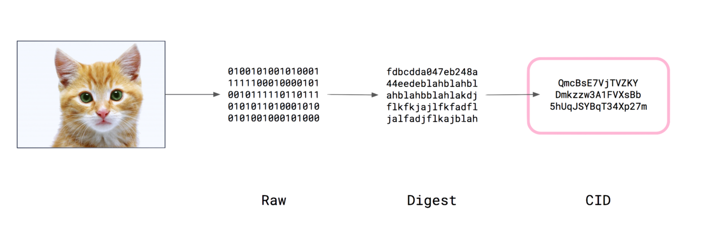

[](https://oceanprotocol.com)

#   Interplanetary File System (IPFS) investigation

```
name: research on IPFS
type: research
status: initial draft
editor: Fang Gong <fang@oceanprotocol.com>
date: 10/06/2019
```


## 1. Introduction

Ocean allows providers to upload dataset into IPFS and publish in Ocean marketplace. As such, IPFS provides a distributed & permanent storage and enables easy access to the published dataset, which can be downloaded on the demand. 

In the meantime, it is critical to incentivize providers who serve the public dataset in Ocean. To this purpose, Ocean needs to track the providers of the public dataset and distribute network rewards to those providers. 

We investigate the IPFS and resolve some related issues for Ocean network. 

## 2. Location addressing vs. Content addressing

* **Location addressing**

At this time we access data over the Internet via a link or url, which specifies the content by its **location**. Such as: `http://192.168.10.20/images/cat.jpg` 

In this model, each data (i.e., image, html file, spreadsheet, dataset or tweet...) has its own address that identifies its location in the web, served from a particular server over a particular port at a particular location. 

When these data is requested, the browser asks DNS to resolve the domain name into IP address and initiates a connection to that IP address over a specific port. Once the request arrives at the web server, it process the request and check the permission before it returns the data via the HTTP connection.

As such, it is clear that the data is controlled by the owner of the location.


* **Content addressing**

The alternative approach is to identify data by its **content** rather than its location, which is the fundamental idea behind IPFS. 

In the world of IPFS, each data is identified by its cryptographic hash or `CID (Content IDentifier)`, which is a alphanumeric string calculated by running data through a hash function (`Digest`) and further encoded with `base58` method. This `CID` serves as a content-addressed identifier that is cryptographically unique in the global IPFS system. 



`> ipfs object get QmW2WQi7j6c7UgJTarActp7tDNikE4B2qXtFCfLPdsgaTQ`

Note that all hashes begin with “**Qm**”. This is because the hash is in actuality a **multihash**, meaning that the hash itself specifies the **hash function (i.e., SHA256) and length of the hash (i.e., 32 bytes)** in the first two bytes of the multihash.

As such, users can request data from IPFS network with the exact `CID`, therefore, the network will find the nodes that store the data, retrieve and verify the data. Literally, users can access data efficiently from its peer that has the data they want at different locations. 


Some benefits of content addressing:

1. content-addressing links are permanent pointing to exactly that data;
2. allow peers to store data together and share the responsibility;
3. cryptographical hash guarantees the data integration;
4. data can be distributed to multiple peers for high availability.


## 3. IPFS Distributed HashTable (DHT) API

The complete IPFS CLI commands can be found in the [API page](https://docs.ipfs.io/reference/api/cli/). Here, we focus on the [DHT API](https://github.com/ipfs/interface-js-ipfs-core/blob/master/SPEC/DHT.md) that can be very helpful to Ocean use case.

### 3.1 find providers of a specific data in IPFS

The most urgently sought functionality is to track providers of a specific data in the IPFS network, which can be fulfilled by below command:

* `ipfs dht findprovs <multihash>`: Retrieve the providers for content that is addressed by an multihash.

	It accepts the hash of a specific data in IPFS and interact with the DHT to output a list of newline-delimited provider Peer IDs.
	
	`options`: an optional object with the following properties
	- **timeout** - a maximum timeout in milliseconds
	- **maxNumProviders** - a maximum number of providers to find

	Here is an [example](https://github.com/ipfs/interface-js-ipfs-core/blob/master/src/dht/find-provs.js) that use this API to retrieve the list in a testing.

### 3.2 serve a specific data in IPFS

The other important functionality is to serve a specific data and announce to the network that you are providing the data. As such, the network can route the accessing request correctly.

* `ipfs dht provide <multihash>`: Announce to the network that you are providing a specific data.

	It accepts the multihash of a specific data in IPFS and add the routing information into the DHT. To successfully announce it, provider must have the data in their local where IPFS node is running. Otherwise, the command will error out with `block not found locally`.
	
	The [example](https://github.com/ipfs/interface-js-ipfs-core/blob/master/src/dht/provide.js) test case can be helpful.


## 4. Outstanding Issues

### 4.1 Where IPFS Peer ID comes from?

When provider initialize a new IPFS node, a new key pairs will be automatically generated using [RSA cryptographical algorithm](https://en.wikipedia.org/wiki/RSA_(cryptosystem)). The `public key` can be shared to verify the signature and `private key` can be used to decrypt the message. 

The workflow that generates the key pairs is shown as below. Note that the **peer's ID is a cryptographic SHA-256 multihash of its [protobuf-encoded](https://developers.google.com/protocol-buffers/) public key**, which is unique in the IPFS network and enables peers to find each other and facilitate the authentication.


### 4.2 Potential Free-Riding Attack

From the above description, it is obvious that IPFS identity is different from the wallet account in Ethereum. Therefore, Ocean cannot directly distribute reward tokens to the IPFS nodes that serve a specific dataset. 

To receive the reward tokens, **IPFS nodes must register themselves with Ocean** since they are dealing with two different networks. 

The registration information shall include:

* **Ethereum wallet address**: the wallet can hold the Ocean tokens;
* **IPFS identity ID**: the unique peer ID in the IPFS network, which can be used to verify that the node is serving a particular dataset.

In this scenario, one potential **free-riding attack** is following: 

* the attacker may use `ipfs dht findprovs <cid>` to get the provider list of a particular dataset;
* if the dataset is popular and many people download it, Ocean is more likely to distribute network rewards to the providers of this dataset;
* attacker may search for the provider peer ID of this dataset, which is not registered with Ocean yet;
* attacker claims himself as the provider in IPFS network and register with Ocean using his own Ethereum wallet along with other person's peer ID in IPFS;
* as such, the attacker do not need to serve the dataset but receive the network rewards from Ocean network.

The root cause of this attack is IPFS and Ocean network are two different and separated network. Therefore, it is possible to have inconsistent information across both networks. Attackers may take advantage of it to get Ocean network rewards for free.


