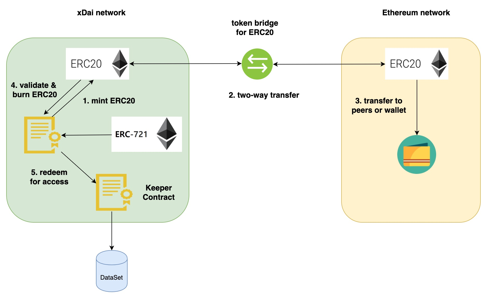
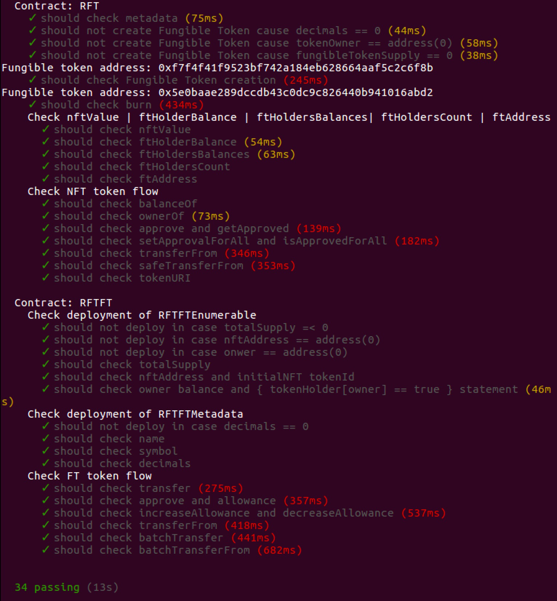

[](https://oceanprotocol.com)

#   Refungible Token investigation

```
name: research on refungible token design
type: research
status: initial draft
editor: Fang Gong <fang@oceanprotocol.com>
date: 10/24/2019
```

## Introduction

An ERC721 non-fungible token (NFT) is a type of token standard that cannot be duplicated, which is a great fit for Ocean data marketplace. Inside the marketplace, each dataset's access can be represented by a unique NFT token and transfered between peers.

In the meanwhile, many individuals may want to share the access to the same dataset or put in stakes on the same dataset. In this scenario, the NFT that represents the access to a unique dataset needs to be owned by fungible ERC20 tokens that represents shared access to the same dataset.

## Architecture

The overall architecture is illustrated as below:



* The NFT ERC721 token is created in xDai network where the Keeper contract is deployed.
* Create a new smart contract to mint ERC20 tokens against the NFT and maintain the mapping relationship;
* The minted ERC20 tokens can be transfered to Ethereum mainnet through the token bridge;
* In the mainnet, ERC20 tokens can be freely transfered between peers and stored in the wallet;
* User can burn ERC20 tokens and redeem them for access to the dataset.


## Implementation

We need to create a RFT token contract to connect NFT token with its corresponding ERC20 tokens. The potential interface for this contract can be: 

```Solidity
contract RFT {

	// non-fungible-token address => underlying fungible token address
	mapping (address => address) public ftAddress;
	
	// non-fungible-token => number of underlying fungible tokens
	mapping (address => uint256) public ftAmount;
	
	// create fungible tokens for NFT
	function createFT(
		string name, 
		string symbol,
		uint256 decimals,
		address owner,
		address nftAddress,
		uint256 supply
	) 
		public
		return (address) {};
	
	// mint fungible tokens for NFT
	function mint(
		address ftAddress,
		uint256 amount
	)
		public
		return (bool){};
	
	// burn fungible tokens for NFT
	function burn(
		address ftAddress,
		uint256 amount
	)
		public
		return (bool) {};
}
``` 

My search found an ERC Implementation for Refungible Token (RFT) at [RFT - ERC721 backed by ERC20](https://github.com/tallyxinc/top-rft). The folder is duplicated in current directory [top-rft-master](./top-rft-master), which can be used as the starting point to develop our own RFT contract. The RFT contract can pass the testing:




## Trust Wallet

Trust wallet support ERC20 and ERC721 tokens, however, it requires the team to add token asset to a centralized repository in order to be displayed in the wallet.

### Add support for a New Blockchain

Trust wallet support Ethereum mainnet, POA network and other blockchains. Below is the list of supported blockchains by Trust Wallet at this time:

* **Ethereum (ETH), including all ERC20 tokens**
* Bitcoin (BTC) (only on iOS)
* Bitcoin Cash (BCH)
* Litecoin (LTC)
* Ripple (XRP)
* Ethereum Classic (ETC)
* **POA Network (POA)**
* Callisto (CLO)
* GoChain (GO)
* Vechain (VET and VTHO), including staking
* Wanchain (WAN)
* Tron (TRX), including TRX10 tokens
* ICON (ICX)
* TomoChain (TOMO)
* All ERC20. You can see the list of supported tokens on etherscan.io
* All BEP2 and TRC10 tokens

In order to store ERC20 and NFT, the Trust Wallet must support the blockchain network that the tokens are minted. It is good to see POA network is supported from the list.

More info can be find in [Supported coins & blockchains](https://trustwallet.com/assets).

### Add New Token 

* Prepare image according to requirements
* Fork the github repo at https://github.com/trustwallet/assets
* Choose the desired chain folder you want to add asset
* Prepare folder with image
* Press on Create pull request
* Once tests have completed and verified that your image follows all requirements, a maintainer will merge it. 