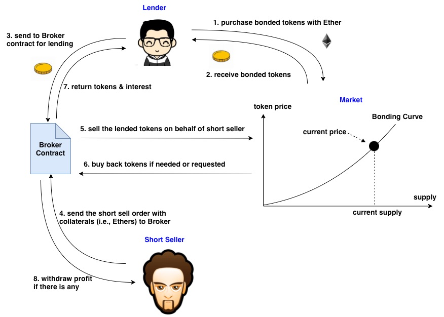

[](https://oceanprotocol.com)

# Short Selling in Bonding Curves

```
name: investigate short selling in Bonding Curves.
type: research
status: initial draft
editor: Fang Gong <fang@oceanprotocol.com>
date: 02/19/2019
```


## 1. Introduction
With the regular bonding curve settings, users can sell bonded tokens and push down the bonded token price, which serves as *negative signal* for the asset asscoiated with the bonded token. However, this approach requires users to purchase bonded tokens before they can sell. 

In this research, we investigate an alternative approach to generate negative singles: **short selling**, which has long been a popular trading technique to depreciate the asset value for decades. We will study it in the framework of bonding curves, identify the critical challenges and explore the proper approach to implement it.

## 2. Background

In the existing stock market, **Short selling** involves the sale of stock that the seller does not own, or shares that the seller has taken on loan from a broker. In other words, short sellers bet on the prediction that stock price will move downward in the future.

* If stock price moves downward in favor of their interests, short sellers can buy stock shares back (or "covering short position") at a "lower" price to pay off the loan and porket the profits. 
* Otherwise, in the case of "*Short Squeeze*" (i.e., stock price moves up), they need to buy at a "higher" price to close their short positions and lose their money.

Short selling involves some parties as illustrated as below:

* **Lender**: purchase stock shares from the open market and keep them in the Brokers. 
* **Broker**: borrow custodial stock shares to short sellers for interest returns.
* **Short seller**: borrow stock shares from Broker and promise to return them along with interest.
* **Market**: the stock market matches buy and sell orders and executes trading of stock shares. 


## 3. Overview of Design

### 3.1 Modules

The design of short selling in bonding curves includes following components:

* **Lender**: buy bonded tokens and keep tokens in the Broker contract for lending.
* **Broker**: lend bonded tokens to short seller with collateral depsoit, and cover short position if needed.
* **Short seller**: borrow bonded tokens and short sell them in the market to make a profit.
* **Token Market**: it is the bonding curves that executes trading transactions of boned tokens.


### 3.2 Workflow Summary



* Step 1: purchase and lending by token lenders
	* purchases bonded tokens from bonding curves;
	* sends the bonded tokens to Broker contract for lending;
* Step 2: short selling by short sellers
	* borrow bonded tokens from the Broker contract and sell them to bonding curves for proceeds;
	* deposit collateral tokens (i.e., ETH, OCEAN, etc.) to manage short squeeze;
* Step 3: cover short position by Broker contract or short seller
	* Broker contract automatically cover short position using proceeds + collateral if needed;
	* short sellers can place an order to close short position to make a profit;
* Step 4: distribute funds by Broker contract
	* send interest to token lenders;
	* allow short sellers to withdraw profits if there is any.


## 4. Challenges

### 4.1 Design of Broker Contract

The proposed structure in our design of Broker contract is following:

* a gloabl hashtable can map a specific bonded token to a double linked list (DLL);
* each DLL includes all available tokens for lending. 


The key problems & our proposed solution:

* **Question 1**: match the lending and borrowing orders to fulfill the borrowing request:
	* Broker contract will access the DLL of a specific bonded token to lend the next available tokens to short seller when receiving the borrowing request;
	* short seller may borrow tokens from multiple lenders towards his borrowing amount.
* **Question 2**: handle the withdrawal request from lenders when their tokens had been sold by short seller:
	* Broker finds the next available bonded tokens to fulfill the withdrawal request from the original lenders (but lender may be not eligible for interest in this case);
	* the loan of bonded tokens will be transferred to new lenders;
	* if there is no new lender available, Broker forces to close the short position and return the bonded tokens to the lender.
* **Question 3**: the calculation of interest for lending:
	* it can depends on the duration of lending period (e.g., accumulated daily);
	* there is a cap that is the maximum amount of accumulated interest;
	* lender is not eligible for interest if he requests to withdraw lended tokens before the interest cap is reached. (In this case Broker contract pockets the interest and make money! :)


### 4.2 Short Squeeze Issue

The key challenge is to handle "short squeeze", which guarantees the short position can be covered so that borrowed bonded tokens can be returned in case of token price increase. 

The **root causes** for the challenge:

* every transaction moves the token price in different directions. As such, any new "buy" transaction moves token price up and may potentially cause short position cannot be covered.
* closing of one short position (i.e., buy back bonded tokens) moves token price up and force other short positions to be covered. It is very challenging to determine the **"order"** to close these short positions.


The key of solution: 

* assuming the new "buy" transaction is executed and token price moves up, we need to check whether the short position can be covered at the moment. 
* If not, the short position must be closed **before** the "buy" transaction can execute.

### 4.2.1 Single Short Seller Scenario

We can walk through the process to understand the challenge:

* **short sell bonded tokens**: 
	* short seller borrows bonded tokens from other tokenholders in Broker contract
	* sell them into bonding curve to receive proceeds of reserved tokens (e.g., ETH, Ocean, etc.).
	* those proceeds must be stored in Broker contract as an escrow account, which will be used to cover the short position. 
	* token price will drop due to short selling.


* **deposit collaterals**: 
	* short seller must deposit reserved tokens as collaterals to tolerate token price fluctuation. 
	* current reserved token balance of short seller = proceeds + collateral
	* however, short seller has negative balance of bonded tokens that need to be covered in the future.
	* more deposit of collateral tokens indicates short sellers can tolerate more fluctuation in token price;
	* otherwise, short sellers are required to cover their short positions with a small price jump.


* **check whether need to cover short position**:
	* when there is a new "buy" transaction, it is must to check validity of short position after this "buy" transaction.
	* after "buy" transaction, the cost of covering short position should not exceed the reserved token balance of short seller in Broker contract;
	* if false, Broker contract requires to cover the short position before this new "buy" transaction.


* **cover short position**:
	* Broker is required to cover the short position (i.e., buy back the same amount of bonded tokens as those borrowed from other tokenholder);
	* the purchase price for the new "buy" transaction will move up due to covering of short position;
	* should confirm the new purchase price with the buyer of new "buy" transaction. 
	* if failed, both transaction inlucuding covering short position will be cancelled.


### 4.2.2 Multiple Short Seller Scenario

When there are many short positions exist at the same time, it is possible that closing of one short position moves token price up, therefore, causing other short positions must be closed as well. 

For example, the first short position needs to be closed, which moves token price up. At that moment, the second short position must be closed before the new "buy" transaction can be executed. 


Therefore, it becomes very challenging to determine **(1) which short positions shall be covered** and **(2) their "order" to be covered in a sequence**.

There are two factors need to be taken into the account:

* the price after the short sell;
* the total cost to cover the short position compared with the balance (= proceeds + collaterals) in Broker contract.

#### 4.2.2.1 Threshold Price

we need first to define **"threshold price"** as: 


where:

* `Balance = proceeds + collaterals` is the balance of short seller in the Broker contract. 
* `k` is the number of bonded tokens sold in short selling. 
* `f(x)` is the analytic formula for bonding curve and `x` is the supply of bonded token.
* as such, it is key to solve the equation for `N` so that **threshold price** `TP = f(N)`

Here, **"threshold price"** represents **the highest price that short seller can tolerate** before he must cover the short position (shown in the left as below). 

Note: if cost of **interests** is considered, the maximum budget of short seller for closing short position is `proceeds + collaterals - interest`.


#### 4.2.2.2 Remove Overlapping

Another issue is overlapping among different short positions as shown in the right of above image. If the first short position is covered at the `TP1`, the second short position can never be covered at the `TP2` due to overlapping.

The solution is to eliminate the overlapping by moving the `TP1` of first short position towards the left while keeping the #bonded token `k` until these two short position has no overlapping. 

Note: the cost to cover the first short position after the adjustment is **smaller** than the total balance of short seller in Broker contract.


#### 4.2.2.3 Solution for Multiple Short Positions

* Pre-Processing:
	* first, all open short positions must be sorted by threshold price from low to high;
	* traverse from the last to the first and move the threshold price of the former short position if two neighboring ones have overlapping;
* when there is new "buy" transaction, check whether short position should be closed:
	* calculate the resulting token price if the "buy" transaction is executed;
	* if the new token price is higher than the threshold price of the first short position, it must be covered;
	* assume the short position is closed and "buy" transaction is executed, find the resulting token price. If it is higher than the threshold price of the second short position, the second short position must be closed;
	* repeated this process until:
		* either all short positions need to be closed;
		* or the "buy" transaction can be executed without need of closing short position anymore.

### 4.2.3 Improved Solution using Batched Bonding Curve

It is possible the "buy" and "sell" transaction may cancel out each other so that token price remains the same in the end. Therefore, the short position remains to be open as long as possible.

To this end, "**Batched Bonding Curve**" can be used (e.g., [billy rennekamp
's work](https://github.com/okwme/BatchedBondingCurves)). It was originally proposed to prevent front-running attack but seems to be a great fit to our work: 

* it aggregates the "buy" & "sell" orders across one or more blocks and generates a "batched order" accordingly;
* all buyers or sellers in the batched order share the same token price;


With batched bonding curve, our solution can be further improved as:

* first, aggregate all "sell" orders into a batched "sell" order and execute it, which pushes down the token price. All sellers share the same price;
* then, aggregate **partial** "buy" orders into a batched "buy" order (it should raise token price back to its original price before the execution of batched "sell" order) and execute it. All buyers share the same price;
* if all "buy" orders cannot raise price back to the original price, there is no need to cover any short positions;
* otherwise, check all open short positions against the bonding curve to decide whether any of them should be covered;
* if there is any short position must be covered, confirm new purchase price with buyers of the remaining "buy" orders. 
* if any buyer agree with new purchase price, bonding curve shall cover the short position first and execute those "buy" orders with agreement of new price;
* if there is no buyer agree to pay new price, cancel all remaining "buy" orders and there is no need to cover the short positions. 

In this way, we try our best to reduce the number of transactions and keep the short position to be open as long as possible.

## 5. Prototype

### 5.1 Settings

For demo purpose, the prototype uses **linear bonding curve** + **single short seller scenario**. Mathmatically, linear bonding curve: `f(x) = x` where `x` is supply of bonded token and `f(x)` is the price of bonded token.

### 5.2 Demo

* **Step 1**: Alice buy 10 bonded tokens with cost of 50 reserved tokens. Note that: `cost = n^2 /2` where `n` is the number of bonded tokens to buy.


* **Step 2**: Christ buy 10 bonded tokens with cost of 150 reserved tokens. At this moment, bonded token price becomes 20 and unit is `number of reserved token per bonded token`.


* **Step 3**: Alice sends her 10 bonded tokens to Broker contract for lending. 
* **Step 4**: Bob **short sells** bonded tokens at this price:
	* borrows Alice's 10 bonded tokens from Broker contract;
	* sells 10 bonded tokens into bonding curve and receive 150 reserved tokens:
	* deposit collateral of 50 reserved tokens
	* his total balance in Broker contract is 150 + 50 = 200 reserved tokens
	* threshold price of his short position:
		*  assume threshold price is `p`
		*  the equation becomes `((p + 10)^2 - p^2)/2 = 200`
		*  solution is `p = 15`, which is the maximum price Bob can tolerate before he is forced to cover;
		*  if current price > threshold price, Bob cannot cover his short position by any means.
	


* **Step 5**: Alice buys another 2 bonded token with cost of 22 reserved tokens.


* **Step 6**: Christ want to buy 10 bonded tokens at this moment:
	* the price after this buy transaction would be 22 (>= threshold price 15)
	
	
	* **Bob must cover his short position before Christ can buy;**
	* Broker contract automatically covers Bob's short position:
		* buy 10 bonded tokens with cost of 170 reserved tokens;
		* returns 10 bonded tokens to Alice;
		


* When short position is open, Bob's total balance in Broker contract is 200 reserved tokens and he spent 170 tokens to cover the short position, therefore, Bob can only withdraw 30 reserved tokens from Broker contract:
	* remember Bob only deposit 50 reserved tokens as collaterals out of his own pocket;
	* he has loss of 50 - 30 = 20 reserved tokens. 


The process is implemented and illustrated as:


### 5.3 Issues

* To implement short selling, bonding curve should be able to be described with an analytic formula (i.e., exponential, polynomial, etc.) and its integral can be calculated analytically.
* Buyer of bonded tokens may get different token price in the end because his "buy" transaction can potentially trigger the closing of existing short positions.


## 6. License

```
Copyright 2018 Ocean Protocol Foundation

Licensed under the Apache License, Version 2.0 (the "License");
you may not use this file except in compliance with the License.
You may obtain a copy of the License at

   http://www.apache.org/licenses/LICENSE-2.0

Unless required by applicable law or agreed to in writing, software
distributed under the License is distributed on an "AS IS" BASIS,
WITHOUT WARRANTIES OR CONDITIONS OF ANY KIND, either express or implied.
See the License for the specific language governing permissions and
limitations under the License.
```

