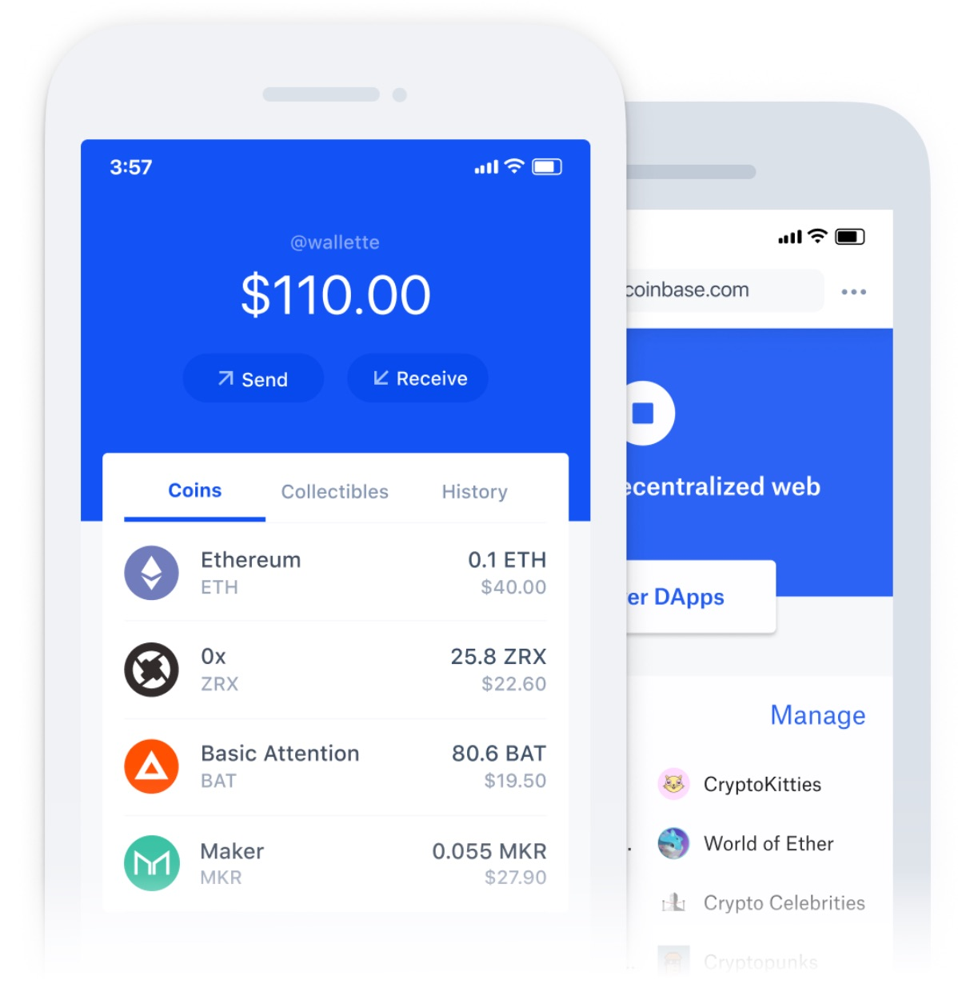
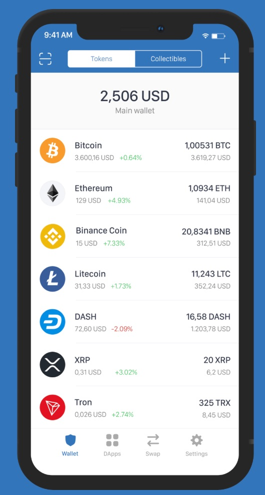
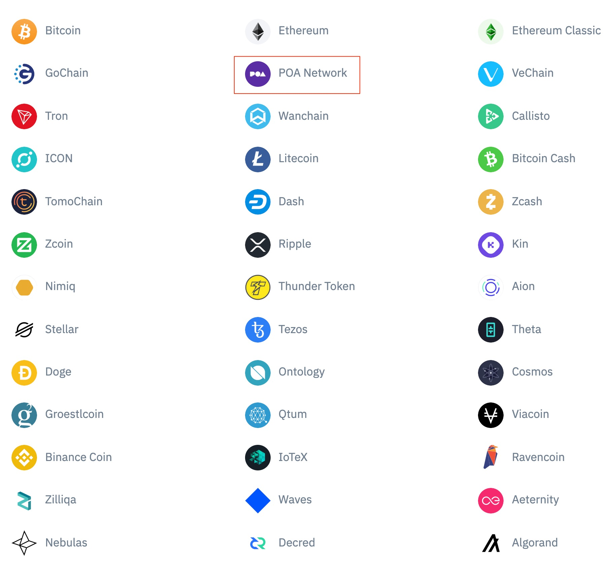
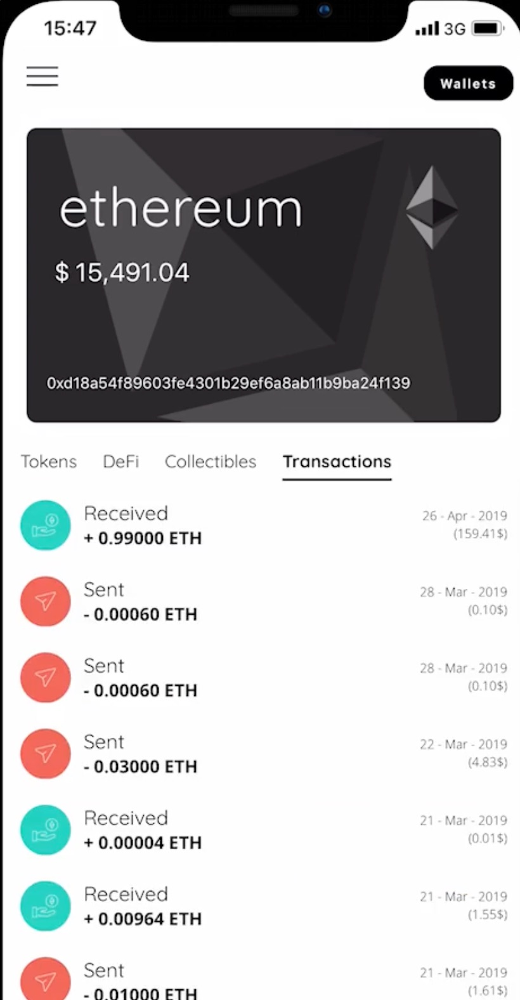
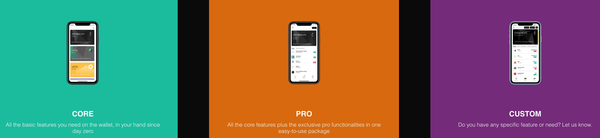
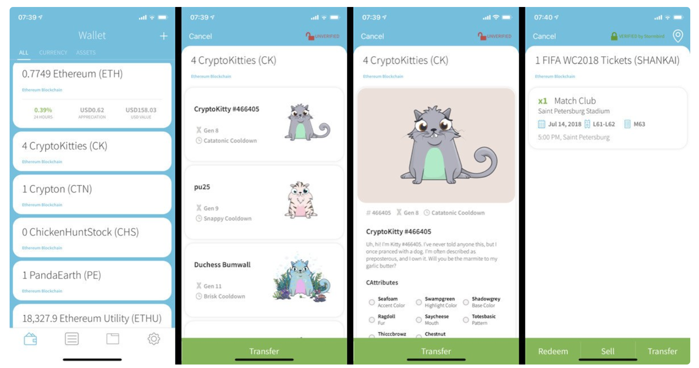

[](https://oceanprotocol.com)

#   nonfungible token (NFT) wallet 
```
name: research on nonfungible token wallet
type: research
status: initial draft
editor: Fang Gong <fang@oceanprotocol.com>
date: 11/05/2019
```

## Introduction

Ocean use non-fungible token (NFT) or ERC721 token to represent the access to a specific dataset, which open the door to a new data economy. To enable this functionality, the wallet is a criticl step. 

In this research, we investigate existing ERC721 token wallet and analyze pros & cons of them for Ocean's benefit. Here is a list of [wallets supporting Ethereum tokens](https://etherscan.io/directory/Wallet)

## 1. Coinbase Wallet

The [coinbase wallet](https://wallet.coinbase.com/) support most mainstream cryptocurrencies such as BTC, ETH, LTC, all ERC20 tokens and ERC721 collectibles.



* Pro:
	* easy to use and user-friendly UI;
	* user controls the private key and own full ownership;
	* support most cryptocurrencies including ERC20 and ERC721 in Ethereum network.

* Con:
	* it is not open-sourced;
	* does not support POA network and it may be difficult to add such support;

## 2. Trust Wallet

The [Trust wallet](https://trustwallet.com/) is developed for the community and support more networks and tokens. 



It support much more blockchain networks including POA network:



* Pro:
	* user-friendly UI that is iterated according to community review;
	* user controls the private key and can use it for DEX exchange;
	* support most cryptocurrencies including ERC20, BEP2 and ERC721 in Ethereum network;
	* it is open-sourced and can add support for new network and tokens (with approval from the team).

* Con:
	* need engineering efforts to add support for new blockchain and token;
	* trust wallet development team has the permission to approve and integrate support.

* Trust wallet includes two components: wallet client and core;
	* wallet client: the front-end interface showing balance and interact with users;
	* wallet core: the light node or full node; 
	* two components interact with each other through APIs or RPCs.

* The steps to add support for a new blockchain: [Adding Support for a New Blockchain](https://developer.trustwallet.com/wallet-core/newblockchain) and add needed APIs or RPCs [RPC / API Requirements](https://developer.trustwallet.com/wallet-core/rpc-requirements)
	* Trust wallet development team has strict criteria to select blockchain to support;
	* community provide the code and files for new support and the Trust wallet team needs to approve the change.
	* xDai network needs to work with Trust wallet team to add their support.


## 3. DexWallet

The [DexWallet](https://www.dexwallet.io/) is a mobile native wallet support many different tokens and blockchains incuding xDai and ERC721 tokens. It can be downloaded from Apple appstore. It is designed to serve DeFi applications such as lending, borrowing, staking and etc.



There are Basic version and Pro version, and the development team can help customize it for any specific feature or needs.



* Pro:
	* mobile wallet supporting xDai, ERC20 and ERC721 tokens;
	* user friendly and easy to navigate;

* Con:
	* it cost money to customize the wallet for specific features. [quote and demo](https://www.dexwallet.io/whitelabel/)

	
## 4. Alpha Wallet

[Alpha wallet](https://alphawallet.com/) is an open-source Ethereum mobile wallet supporting ETH, ERC20 and NFT tokens.



* Pro:
	* wallet is mobile friendly and designed for iOS & Android
	* access from Apple AppStore and Google Play
	* open-sourced as an iOS and Android project
	* designed ERC875 standard to transfer/trade ERC721 efficiently

* Con:
	* only support Ethereum network at this time.

	
## 5. Buntoy Wallet

The [Buntoy wallet](https://www.buntoy.com/buntoy.html) support BTC, ETH, ERC20 and ERC721 tokens, which is suitable for game dApps.

However, it is not open-sourced. 

## 6. Dapper Wallet 

The [Dapper wallet](http://www.meetdapper.com/) is a wallet powered by smart contract and interacts with the blockchain differently than other services and wallets. Dapper’s smart contract enables the most secure way to recover your account.

It is more suitable to be integrated into decentralized applications as a standalone module.