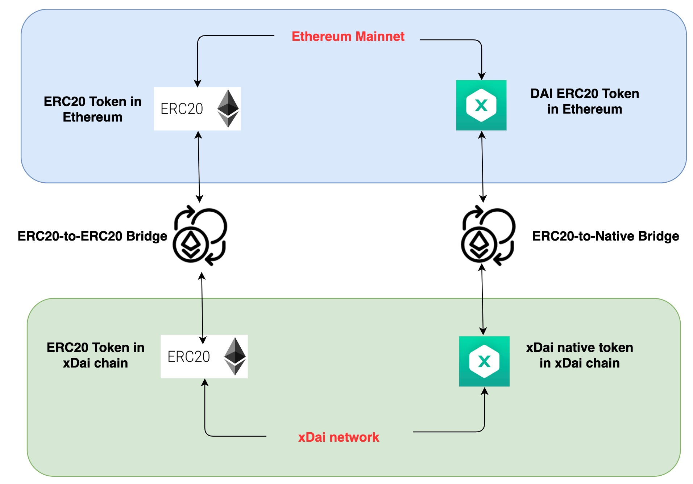
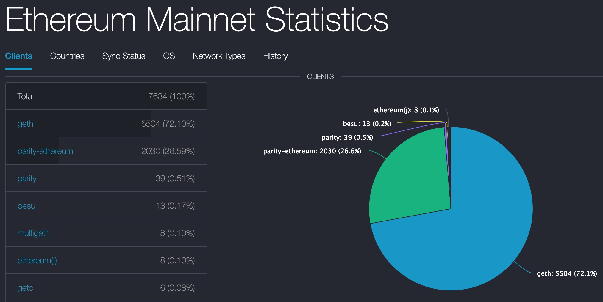
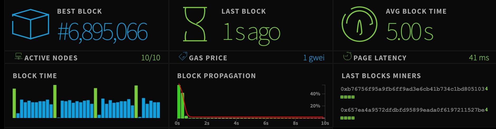
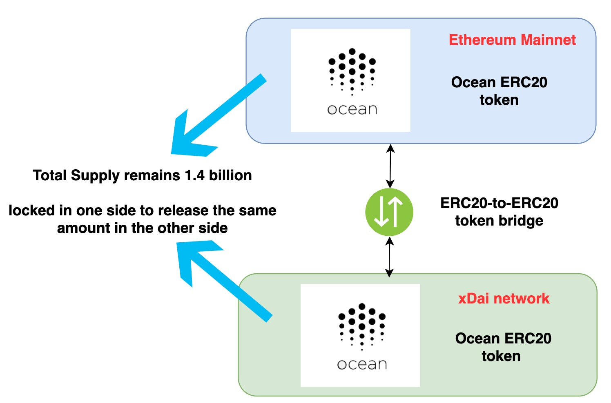

[](https://oceanprotocol.com)

#   xDai vs. Ethereum
```
name: investigate xDai and Ethereum for Ocean token contract
type: research
status: initial draft
editor: Fang Gong <fang@oceanprotocol.com>
date: 11/18/2019
```

## 1. Introduction

Ocean token is deployed to Ethereum mainnet at this time, but Ocean keeper contract will be deployed to xDai network that will become permissionless sooner or later. In this research, we investigate and compare the xDai and Ethereum networks to find the better choice for Ocean tokens. 


## 2. Comparision and Analysis

* **what is xDai network?**: 
	* created in 2018.10, xDai Chain is an Ethereum sidechain with 5-second block times (~60 tx per second);
	* it has a native stablecoin token that’s also called xDai;
	* it offers low gas prices that is fixed at 1Gwei and paid with xDai;
	* it uses Proof of Authority consensus;
	* it may adopt POSDAO in the future to become permissionless.
	
* **Token transfer between Ethereum and xDai Chain**
	* xDai is a USD-pegged stable coin in the xDai chain, which can be transferred to Ethereum mainnt through a token bridge;
	* DAI ERC20 token is the ERC20 token represenation of xDai token in the Ethereum mainnet;
	* similarly, ERC20 token in xDai network can be transferred to Ethereum mainnet through ERC20-to-ERC20 bridge.

	
	
* **Security Analysis**:
	* Ethereum mainnet has more nodes (~7634 nodes) [(source)](https://www.ethernodes.org/)
		* Ethereum has a larger number of nodes in the network, which makes it difficult to be attacked;
		* even though Ethereum will migrate to POS consensus in the future, it demands huge amount of funds to acquire >51% total supply of ETH in order to launch an attack, which makes the possibility of such attack to be very low.
	
	 
	
	* xDai chain has 10 validator nodes [status](https://dai-netstat.poa.network/)
		* current 10 validators are POA netowrk, MakerDAO, Burner Wallet, etc. [(source)](https://medium.com/poa-network/xdai-validators-decentralizing-stable-chains-4e2ee6dcd2cc)
		* with POA consensus, all validators are well-known, therefore, the chance of an attack is low;
		* however, when it changes to be POSDAO, the nodes in the network can be any one and the total number of nodes in xDai network will be limited.
		* With POSDAO, it is **easier to stake >51% xDai tokens to launch an attack**.
	


* **Comparision from various perspectives**:

Perspective   |  Ethereum | xDai chain |
--- | ---| ---|
tx per second | ~15 | ~60 | 
gas fee (network traffic depeneded) | ~\$0.15 per tx | ~\$0.000021 per tx |
number of nodes | 7634 | 10 |
native token | Ether with volatile value | xDai with stable value |
consensus algorithm | proof of work | proof of authority (change to be POSDAO in the future) |
scalability | single mainnet | enables any number of side-chains |
attack security | more secure| less secure (vulnerable to 51% attack with POSDAO consensus)|

From the comparision, it is clear:

* Ethereum is slow and expensive, but more secure;
* xDai is fast and cheap, but less secure (considering POSDAO in the near future).


## 3. Recommendation

* **Ocean token contract shall be deployed to Ethereum mainnet** for higher security:
	* some token holders only store Ocean tokens in their wallet and trade in exchange, therefore, security concern is top priority for them and Ethereum mainnet is the best choice;
* **Keeper contract shall be deployed to xDai network** to enjoy fast block speed and low gas for better user experience:
	* other token holders can transact with Keeper contract in xDai network for low latency and gas fee. 
	* they can transfer Ocean tokens from Ethereum mainnet to xDai network through a ERC20-to-ERC20 bridge.

