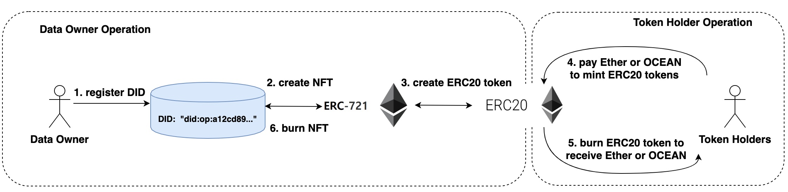
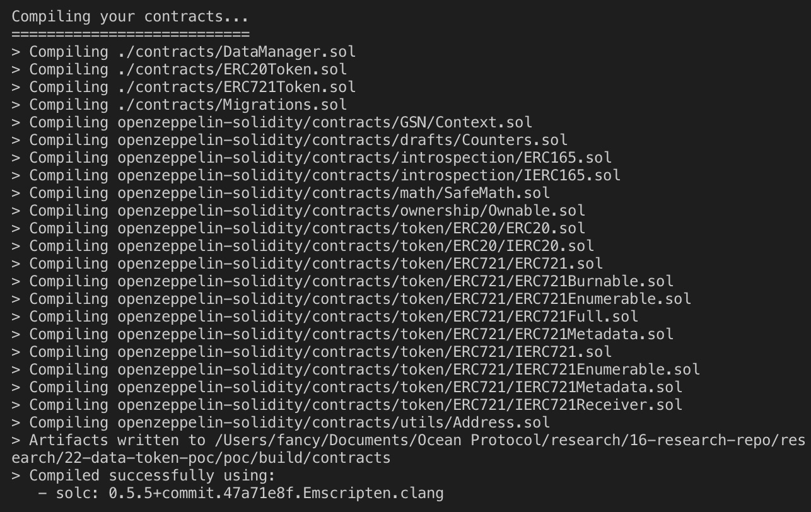
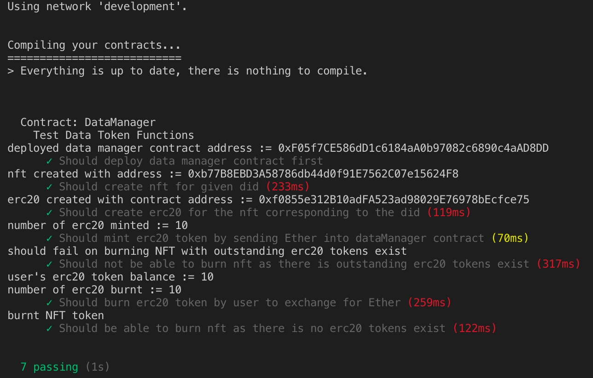
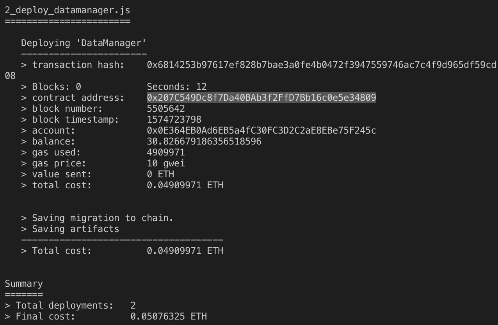
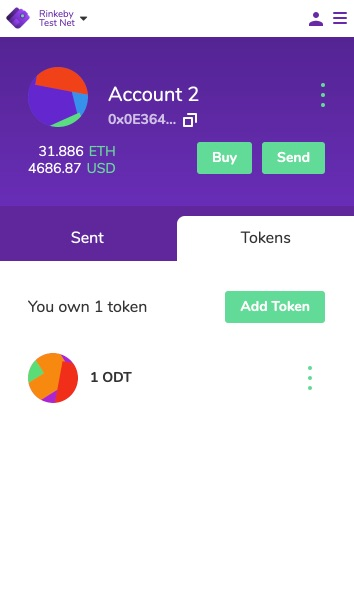
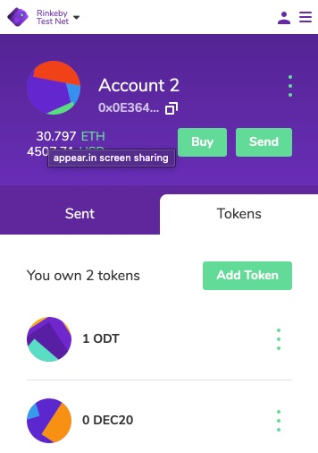
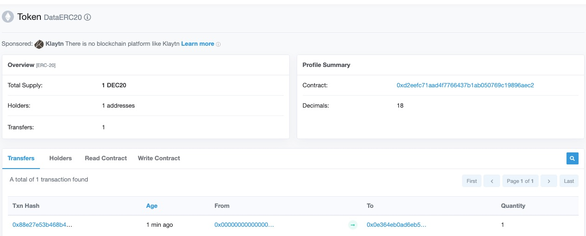
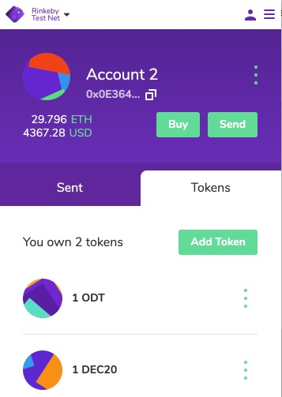

[](https://oceanprotocol.com)

#   Data Token POC
```
name: prototype of data token
type: research
status: initial draft
editor: Fang Gong <fang@oceanprotocol.com>
date: 11/19/2019
```

## 1. Introduction

This research tries to develop a data token POC as a standalone module, which will be integrated into the Keeper contract in the near future.

## 2. Functionality

The POC of data tokens implemented following functinalities:

* create NFT token (ERC721) for each unique DID;
* burn NFT token corresponding unique DID;
* create ERC20 tokens for NFT token to make it refungible;
* mint ERC20 tokens by making payments in Ether or Ocean tokens;
* burn ERC20 tokens to redeem them for Ether or Ocean tokens;
* transfer NFT or ERC20 tokens between peers.



## 3. Get Started

* Install the dependence:

```bash
$ npm install
```

* compile contracts

```bash
$ truffle compile
```



* run local testing in development testnet

The test file is `test/DataToken.Test.js`

```bash
$ truffle test
```



## 4. Integrated Test with Nifty Wallet

The Nifty wallet is used to hold the NFT token. xDai network has no testnet and any testing needs xDai tokens with real values. Therefore, **Rinkeby network is used** for instead, but the workflow remains the same for xDai network.

* **Step 1: Deploy to Rinkeby network**

```bash
$ truffle migrate --network rinkeby
```

The DataManager contract is deployed and address is `0x207C549Dc8f7Da40BAb3f2FfD7Bb16c0e5e34809`




* **Step 2: Create NFT token**: `script/1.createNFT.js`
	* did: "0x319d158c3a5d81d15b0160cf8929916089218bdb4aa78c3ecd16633afd44b8ae" 
	* name: "OceanData"
	* symbol: "ODT"


* **Step 3: Check NFT token address**: `script/2.getNFTAddress.js`

```bash
$ node script/2.getNFTAddress.js 
NFT token address is := 0x03DD908563921bbaAa73b4E4e71fda6422EE068C
```

This token can be found in Nifty wallet as:



* **Step 4: Create ERC20 tokens** for `ODT` NFT token: `script/3.createERC20.js`
	* did: "0x319d158c3a5d81d15b0160cf8929916089218bdb4aa78c3ecd16633afd44b8ae" 
	* name: "DataERC20"
	* symbol: "DEC20"

```bash
$ node 4.getERC20Address.js 
ERC20 token address is := 0xD2eEfC71AaD4f7766437b1aB050769c19896aec2
```

The ERC20 token `DEC20` can be found in the Nifty wallet:



* **Step 5: mint ERC20 tokens**: `script/5.mintERC20.js`
	* send 1 Ether to mint 1 DEC20 token

The tx can be verified from Etherscan as:



The ERC20 token can be found in the Nifty wallet now:



* **Step 6: burn ERC20 tokens**: `script/6.approveERC20.js` & `script/7.burnERC20.js`
	* approve the contract with allowance equals to the ERC20 balance
	* burn ERC20 tokens and receive Ether or Ocean tokens

* **Step 7: burn NFT token**: `script/8.burnNFT.js`


