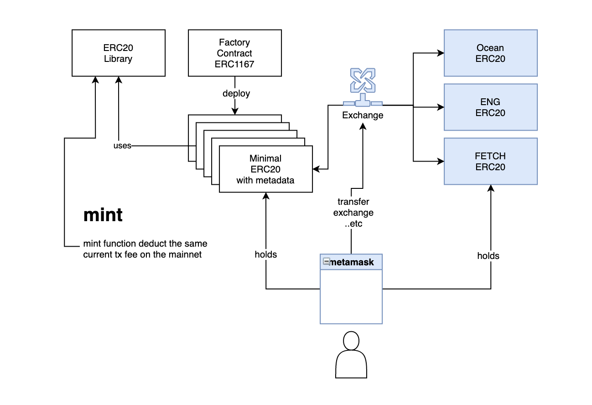

# Ocean protol v3 | poc 2

The porpose of this repo is to demonstrate the basic mechaincs of the candidate B for DataToken implementation. 

In this POC each dataset is represented by an ERC20 token contract clone which is being deployed based on an ERC1167 standard.  



Minting new ERC20 token involves fees. The fee itself is based on the price of the gas and the amount of the consumed/used gas (gas count).

The below formula describes how the fee is calculated:

```
fee = usedGas * trx.gasprice ; // value in ETH
```

the gas price is changing over the time based on the network (Ethereum mainnet) utilization. The value of used gas for minting new token can be estimated using the static analysis tools.

### Test

```
npm install

truffle develop

test
```