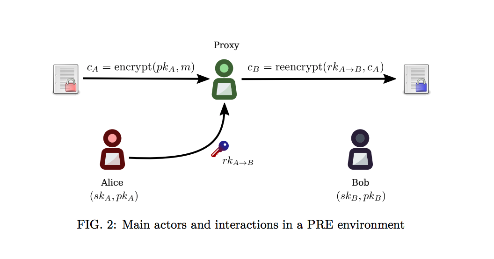
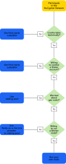
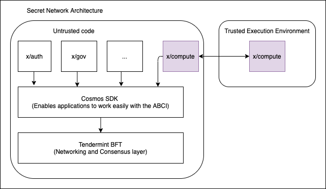

# Decentralized Proxy Re-encryption

## Introduction

we don't want OPF to run a (centralized) provider that is holding custody of the keys that encrypt/decrypt each url for Ocean Market.

The question in this tech spike is to answer if we can solve this by somehow storing the secret (private key) on-chain or there's a third-party network that interfaces well, that's fine (ideally interfaces with Eth mainnet, but perhaps also via JS in browser.)

Possible tools:

- [Nucypher](#nucypher)
- [Keep Network](#keep-network)
- [Secret Network](#secret-network)
- [Enzypt.io](#enzypt)

If we can't find a simple/fast solution in the near term, then here's a path forward for V3.0:

In Ocean Market, ensure there's an option for people to provide an endpoint of the Provider. (Therefore they can retain decentralization.)
In Ocean Market, if the user chooses to use the OPF-run Provider, set the expectation that this Provider will only be run until some specific cut-off date (e.g. Dec 31, 2021). This ensures that OPF is not bound to some weird long-term commitment that it didn't mean to make.

At the [end](#conclusion) of this teck-spike, there is a comparison which summarizes the different
features that are provided by each network/service.

# Nucypher

It provides a decentralized key management system (KMS) and cryptographic access control layer to distributed systems. There are extra services such as FHE secure computation, dynamic access management, and secret management but they are out-of-scope. Nucypher uses PoS as underlying protocol for decentralized proxy re-encryption. 

The decentralized proxy re-encryption uses an asymmetric non-interactive re-encryption key method that allows an untrusted proxy entity  to transform cipher-texts from one public key to another without learning anything about the underlying message.

NuCypher implements a [threshold split-key re-encryption scheme](https://arxiv.org/pdf/1707.06140.pdf) as follows:

- Alice broadcasts data (with a smart contract policy) and a re-encryption key to the network (proxies/nodes).
- The re-encryption key is splitted between different nodes. Splitting the key splits trust.
- The trust relies on how much a proxy's/node's nucypher token staked as a collateral.
- When Bob asks for re-encryption using his public key, proxies will use threshold re-encryption keys to re-encrypt the payload and send it back to Bob. 
- Finally, Bob decrypts and reads the message.

Nucypher implemented a new PRE librray called [pyUmbral](https://github.com/nucypher/pyUmbral) to do that. The demo below shows how to use PRE in Nuchyper:

## Tokenomics

Nodes are incentivized to continually provide re-encryption services by receiving fees from users (paid in ETH) and participation rewards (paid in NU tokens). Node operators must stake NU tokens to their node and will receive rewards which are earned in proportion to their stake. When the mainnet launches, incentives will mostly come in the form of rewards rather than fees. Eventually, when the network gains users, fees will become a large part of the financial incentive to run a node.

Staking rewards are automatically restaked after each period, unless the user has opted out or the period ends. At the end of the staking period, if the Ursula Node did it’s job providing re-encryption services, the stake plus rewards can be claimed.

## Integration

The NuCypher protocol requires access to an Ethereum node for the Ursula worker node to read and write to NuCypher’s smart contracts. 
Due to the complexity of running a node on the network, there are a variety of ways to participate depending on your comfort level:

- Delegate custody of NU and work to a third-party custodian.
- Delegate work via a staking pool or [Node-as-a-Service provider](https://github.com/nucypher/validator-profiles).
- Run your own node ([worker](https://docs.nucypher.com/en/latest/guides/network_node/staking_guide.html) + [staker](https://docs.nucypher.com/en/latest/guides/network_node/staking_guide.html))

More details WorkLock Participation to be found [here](https://blog.nucypher.com/the-worklock/)
# Keep Network

Keep is a native token in which powers the network and supports all the apps that are and will be built on it. KEEP is required in order for someone to become a member of the Keep network; members are eligible to earn rewards by performing work on the platform. This work is the computation and availability required to select and pull the network’s off-chain “keeps” together and to read the associated data.

Members are randomly selected to coordinate a distributed key generation protocol that results in a public ECDSA key for the group, which is used to produce a wallet address that is then published to the host chain.

There is no enough documentation found in [keep.network](https://keep.network) but to run a KEEP worker, you should follow the KEEP documentation for running
[Random Bacon](https://docs.keep.network/run-random-beacon.html) and This is a TDLR [tutorial to integrate the KEEP worker with their tesnet](https://medium.com/@ben_longstaff/a-beginners-quick-start-guide-to-staking-on-the-keep-network-testnet-using-digitalocean-5a74ca60adc3)
## Components
- Owner

The address owning KEEP tokens or KEEP token grant. The owner’s participation is not required in the day-to-day operations on the stake, so cold storage can be accommodated to the maximum extent.

- Operator

The address of a party authorized to operate in the network on behalf of a given owner. The operator handles the everyday operations on the delegated stake without actually owning the staked tokens. An operator can not simply transfer away delegated tokens, however, it should be noted that operator’s misbehaviour may result in slashing tokens and thus the entire staked amount is indeed at stake.

- Beneficiary

the address where the rewards for participation and all reimbursements are sent, earned by an operator, on behalf of an owner

- Delegated stake

an owner’s staked tokens, delegated to the operator by the owner. Delegation enables KEEP owners to have their wallets offline and their stake operated by operators on their behalf.

- Operator contract

Ethereum smart contract handling operations that may have an impact on staked tokens.

- Authorizer

the address appointed by owner to authorize operator contract on behalf of the owner. Operator contract must be pre-approved by authorizer before the operator is eligible to use it and join the specific part of the network.

## Integration
KEEP token owners can run full node (Including Full Ethereum Node) or use delegated stake where
an owner’s staked tokens, delegated to the operator by the owner. Delegation enables KEEP owners to have their wallets offline and their stake operated by operators on their behalf.

# Secret Network

Enigma is the software company that developed the Secret newtork. The secret network mainnet is a proof-of-stake-based blockchain based on [Cosmos SDK/Tendermint](https://github.com/cosmos/cosmos-sdk). It is backed by a new native coin, Secret (SCRT), which is used for staking and transaction fees within the network.

The following process describes, step by step, how a secret contract is submitted and a computation performed on the Secret Network:

- Developers write and deploy Secret Contracts to the Secret Network
- **Validators run full nodes and execute Secret Contracts**
- Users submit transactions to Secret Contracts (on-chain), which can include encrypted data inputs.
- Validators receive encrypted data from users, and execute the Secret Contract.
- During Secret Contract execution:
   - Encrypted inputs are decrypted inside a Trusted Execution Environment.
   - Requested functions are executed inside a Trusted Execution Environment.
   - Read/Write state from Tendermint can be performed (state is always encrypted when at rest, and is only decrypted within the Trusted Execution Environment).
   - Outputs are encrypted.
   - In summary, at all times, data is carefully always encrypted when outside the Trusted Compute Base (TCB) of the TEE.
- The Block-proposing validator proposes a block containing the encrypted outputs and updated encrypted state.
- At least 2/3 participating validators achieve consensus on the encrypted output and state.
- The encrypted output and state is committed on-chain.

## Components

- Validators

The Secret Network validator (full node) is responsible for proposing new blocks to the blockchain, and confirming blocks proposed by other validators.

 Delegators can delegate to validators they believe will maintain proper uptime, and will grow the blockchain through governance in what delegators feel is the right direction 

- Secret Contracts

Secret Contracts are code which executes over encrypted data. Secret Contracts are currently written in Rust (though this could be potentially expanded in the future to include AssemblyScript), and compile to WASM.

- Compute Module

It out of scope.

- Client Library

The Secret Network client library is an API included in decentralized applications that enables them to easily communicate with Secret Contracts on the Secret blockchain. ***This component is still under development***, but will most likely be built on top of CosmWasmJS, and include novel functions for specific tasks.

## Integration

It is possible for anyone who holds SCRT to become a Secret Network validator or delegator, and thus participate in both staking and governance processes. If and when the network upgrades to integrate Secret Contract functionality, validators will be required to run nodes equipped with the latest version of Intel SGX.

# Enzypt

Enzypt has the workflow for publish/sell data assets:

- Payload is zipped and encrypted [details below]()
- Metadata is encrypted
- Payload and metadata are uploaded to separate IPFS locations using ipfs.enzypt.io
- Payload and metadata hashes are posted to the API
- Unique payment link is returned to the seller
- Seller shares the link with buyers
- Buyer loads the metadata file from /:urlSlug
- Buyer requests a random string to sign from /rand
- Buyer posts a signed message to /msg
- Buyer sends the transaction with the data equal to the return from /msg
- Buyer sends the transaction hash to /buy
- API returns the IPFS hash of the payload
- Buyer downloads and decrypts the payload

The mysterious part here is about how enzypt does this p2p file sharing:

The encryption key is generated client-side, and only the initialisation vector is passed to the server. This IV is then sent to any buyer, but they must also have **the seller-generated key**.

The seller distributes this key by way of it being appended to the URL on the client side which they receive upon successful upload. You can clearly see the key portion of the URL (it's after the second forward slash) https://enzypt.io/some-server-reference/decryption-key. The buying client then parses that out of the URL and then only uses it to decrypt the file upon successful purchase.

Pros:
- It is just a single client/server app in which allow users to buy/sell their data

Cons:

- The seller has to re-generate and distribute the decryption key everytime someone asking for a download.
- It tightly coupled to IPFS 
- It is not clean when the seller sends the decryption key.

# Conculsion

The below table lists and summarizes all the supported features fthat are provided by each network/service.

| Feature/Network | Nucypher | Secret.network | Keep.network | Enzypt |
|-----------------------------------|---------|----------------------------------------------|-------|-------|
| **Requires Token**                 | Yes ($NU)              | Yes  ($SCRT)   |Yes  ($KEEP)               |NA|
| **Etherum Support**              | Yes  | No (lives on Cosmos/Tendermint) | Separate Parachain/Unknown | Yes |
| **Proxy Re-encryption Support**  | Yes        |  No (secret contracts & SGX) | Unknown | Yes (happens on the client side) |
| **Requires running Node**        | Yes (Nucypher PRE Node + Ethereum full node) | Yes (Valdiators + SGX support) | Yes (KEEP worker)   | No (But runs a server |
| **Tokonmics**        | Staking | Staking | Staking   | NA |
| **3rd Party Service Providers**        | Yes | Unknown | Unknown   | NA |
