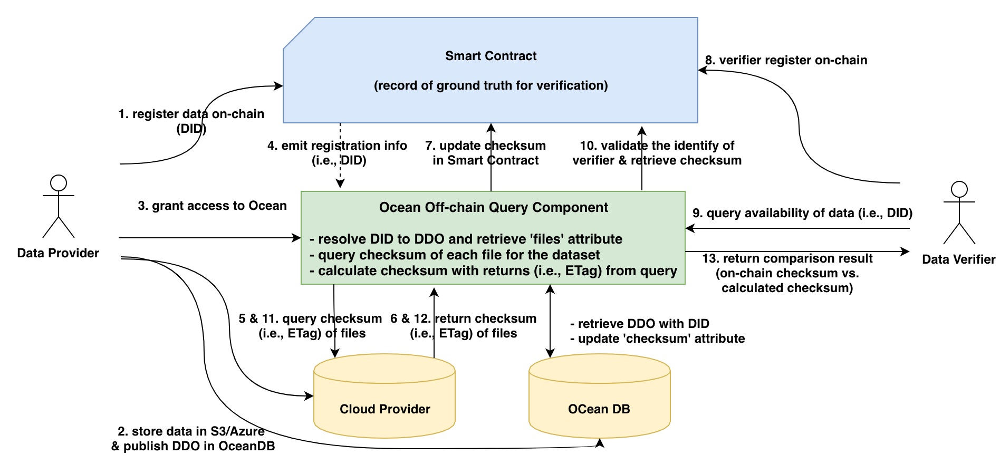

[](https://oceanprotocol.com)

# Data Availability in Web 2.0 settings

```
name: data availability (web 2.0).
type: research
status: updated draft
editor: Fang Gong <fang@oceanprotocol.com>
date: 01/31/2019
```

## 1. Introduction

Nowadays the big volumes of data are typically stored in enterprise/organization silos in Big Data Lakers, Data Warehouse solutions or similar bespoke solutions.

This data is not publicly available and typically stored in:

* Cloud Providers (mostly Amazon and Azure)
* On-premise solutions
One of the requirements to ensure the "availability" of all datasets, which facilitates the mechanisms to retreive a Proof of Availability from cloud providers (p.e Amazon S3, Microsoft Azure) or on-premise (behind a HTTP service).

Ocean must provide the mechanisms to proof that data is available in these circumstances. Also needs to facilitate the procedure to external verifiers to validate that files included in the assets are available to be consumed.

The solution must not require to move the source data to make any calculation.

In the scope of this research task, it would be necessary to detail the possible solutions to put in place and the potential integration with Ocean architecture.

## 2. Architecture

Consider the solution cannot move or modify the source data, the most straightforward approach is **challenge-response solution**. The overall architecture shown in the below:

* **Data Provider**: the data owner who provides the dataset;
* **Data Verifer**: the data verifier who verifies the availability of dataset;
* **Smart Contract**: the Keeper contract deployed on blockchain network;
* **Ocean Off-Chain Query Component**: the off-chain query module that bridges the Keeper contract with cloud storage and OceanDB:
	* resolves the DID into DDO and extract `files` attribute;
	* query the checksum of each file from cloud provider (e.g., ETag of each file in S3)
	* calculate checksum of dataset as **SHA3 Hash** of ([list of all file checksums] + name + author + license + did)
* **OceanDB**: metadata-store that contains metadata information of datasets. 
* **Cloud Provider**: the data storage infrastructure that holds the raw data files such as AWS S3 and Azure.



**Pros:**

* simple and implementable;
* no need to move or modify the data source;
* easy to integrate with Ocean.

**Cons:**

* require off-chain component to interact with cloud providers;
* all parties shall trust cloud providers to honestly return checksums. A potential attack vector is cloud providers store all checksums and simply lookup the needed checksum to return when queried. It fails the proof of availability;
* data providers must trust Ocean off-chain query component will not access or distribute datasets illegally, because they should grant data access to Ocean for future queries;

### 2.1 Data Provider Workflow

* Data provider registers the dataset to keeper contract on-chain (i.e., DID registry);
* Data provider stores the data source in AWS S3 or Azure and publish DDO in OceanDB;
* Data provider grants the data access to Ocean off-chain component (e.g., add it into the permission registry for cloud storage access);
* When dataset is registered, on-chain DID registration transaction emits an event message including DID;
* Ocean off-chain component listens to the event message and resolves the DID into DDO with OceanDB. 
* `list of files` attribute can be extracted from DDO. 
* Ocean off-chain component queries the checksums of these files from cloud storage.
* Cloud provider returns the corresponding checksums for data files (e.g., ETag for each file in S3);
* Ocean off-chain component calculates the dataset checksum with formula and updates the on-chain contract for this dataset;
* At this time, registration of dataset is complete and dataset is ready to be purchased.

### 2.2 Data Verifier Workflow

* Data verifier needs to register himself as an eligible verifier in Keeper contract;
* Verifier needs to send query of data availability (i.e., query availability of a specific DID) to Ocean off-chain component;
* Ocean off-chain component first validates the identity of verifier with on-chain verifier registry;
* If identity validation pass, Ocean off-chain component: 
	* retrieve the on-chain checksum of dataset;
	* resolve DID into DDO;
	* extract `list of files` attribute;
	* query checksums of these files from cloud provider such as AWS S3.
* Cloud provider returns the checksums for all files;
* Ocean off-chain component calculates the dataset checksum with formula and compares it against the on-chain checksum;
* If matched, the data availability is verified and data verifier receives the confirmation;
* Otherwise, the data is either changed or unavailable at this time. Verifier will receive the notice of unavailability from the off-chain component.

## 3. Amazon S3 Proof of Availability


### 3.1 Data Attributes 
Amazon S3 provides several different attributes of data, which can be combined to prove that data is the same and available for access. 

I did an experiment with bucket `fangocean`, which includes `data1.csv` and `subdata.csv` dataset files. In particular, `subdata.csv` is under the folder `subfolder` in the bucket. The file structure is following:


```
(bucket: fangocean)
	├── data1.csv
	└── (folder: subfolder)
	    └── subdata.csv
```

The online console looks like this:


The metadata of a data file is similar to below. Clearly, each data file and folder has its own unique attributes:


* **ETag**: The entity tag is a hash of the object. The ETag reflects changes only to the contents of an object, not its metadata. 
	* Objects created by the PUT Object, POST Object, or Copy operation, or through the AWS Management Console, and are encrypted by SSE-S3 or plaintext, have ETags that are an MD5 digest of their object data.
	
	* Objects created by the PUT Object, POST Object, or Copy operation, or through the AWS Management Console, and are encrypted by SSE-C or SSE-KMS, have ETags that are not an MD5 digest of their object data.
	
	* If an object is created by either the Multipart Upload or Part Copy operation, the ETag is not an MD5 digest, regardless of the method of encryption.

* **Key**: The dataset name that identifies the data file inside S3 bucket.
* **Size**: The length in bytes of the data.

### 3.2 Original File Info

Let us take the data file `subfolder/subdata.csv` as an example. The original contents of this file is:

```
1,left,Berlin
2,right,Berlin
3,middle,SF

```

If the data file is available, S3 should return the metadata information as:

```
 {
            "LastModified": "2019-02-01T00:28:15.000Z", 
            "ETag": "\"d41d8cd98f00b204e9800998ecf8427e\"", 
            "StorageClass": "STANDARD", 
            "Key": "subfolder/", 
            "Owner": {
                "DisplayName": "webaccount", 
                "ID": "a5af246e1a2d8986ddb54302d839152f27823e44e9dc73414037190634ec749c"
            }, 
            "Size": 0
        }, 
        {
            "LastModified": "2019-02-01T00:29:03.000Z", 
            "ETag": "\"997f0517b9e486de9e879e9bd0ae9be1\"", 
            "StorageClass": "STANDARD", 
            "Key": "subfolder/subdata.csv", 
            "Owner": {
                "DisplayName": "webaccount", 
                "ID": "a5af246e1a2d8986ddb54302d839152f27823e44e9dc73414037190634ec749c"
            }, 
            "Size": 41
        }
```

### 3.3 Modify File Contents

As an experiment, we change "Berlin" to be "Paris" in the first line:

```
1,left,Paris
2,right,Berlin
3,middle,SF
```

Note that the information of `subdata.csv` has some changes:

* "Size" is changed from 41Bytes to be 40Bytes;
* "ETag" is changed from `997f0517b9e486de9e879e9bd0ae9be1` to be `a0145a3c0f81f2f9e995ccd5024d8e94`.

**But the info of folder remains the same.**

So, any changes on data file can be detected by comparing the "ETag" against its original records.

```
{
            "LastModified": "2019-02-01T00:28:15.000Z", 
            "ETag": "\"d41d8cd98f00b204e9800998ecf8427e\"", 
            "StorageClass": "STANDARD", 
            "Key": "subfolder/", 
            "Owner": {
                "DisplayName": "webaccount", 
                "ID": "a5af246e1a2d8986ddb54302d839152f27823e44e9dc73414037190634ec749c"
            }, 
            "Size": 0
        }, 
        {
            "LastModified": "2019-02-01T00:44:35.000Z", 
            "ETag": "\"a0145a3c0f81f2f9e995ccd5024d8e94\"", 
            "StorageClass": "STANDARD", 
            "Key": "subfolder/subdata.csv", 
            "Owner": {
                "DisplayName": "webaccount", 
                "ID": "a5af246e1a2d8986ddb54302d839152f27823e44e9dc73414037190634ec749c"
            }, 
            "Size": 40
        }
```

### 3.4 Add New File

We can add a new data file `subdata2.csv` into the same folder `subfolder`:

```
1,left,Rome
2,right,London
3,middle,Madrid
```

The metadata information of `subfolder` remains the same. 

```
{
            "LastModified": "2019-02-01T00:28:15.000Z", 
            "ETag": "\"d41d8cd98f00b204e9800998ecf8427e\"", 
            "StorageClass": "STANDARD", 
            "Key": "subfolder/", 
            "Owner": {
                "DisplayName": "webaccount", 
                "ID": "a5af246e1a2d8986ddb54302d839152f27823e44e9dc73414037190634ec749c"
            }, 
            "Size": 0
        }, 
        {
            "LastModified": "2019-02-01T00:44:35.000Z", 
            "ETag": "\"a0145a3c0f81f2f9e995ccd5024d8e94\"", 
            "StorageClass": "STANDARD", 
            "Key": "subfolder/subdata.csv", 
            "Owner": {
                "DisplayName": "webaccount", 
                "ID": "a5af246e1a2d8986ddb54302d839152f27823e44e9dc73414037190634ec749c"
            }, 
            "Size": 40
        }, 
        {
            "LastModified": "2019-02-01T00:52:36.000Z", 
            "ETag": "\"be382b71761909b99e47b474248a849b\"", 
            "StorageClass": "STANDARD", 
            "Key": "subfolder/subdata2.csv", 
            "Owner": {
                "DisplayName": "webaccount", 
                "ID": "a5af246e1a2d8986ddb54302d839152f27823e44e9dc73414037190634ec749c"
            }, 
            "Size": 43
        }
```

## 4. Microsoft Azure Proof of Availability


## 5. Reference

* [Amazon S3 API Reference](https://docs.aws.amazon.com/AmazonS3/latest/API/Welcome.html)
* [Data Security Privacy Availability and Integrity](http://thesai.org/Downloads/Volume7No4/Paper_64-Data_Security_Privacy_Availability_and_Integrity.pdf)
* [OEP-7 ASSET-DID](https://github.com/oceanprotocol/OEPs/tree/master/7#integrity)
* [OEP-8 ASSET-DDO](https://github.com/oceanprotocol/OEPs/tree/master/8#base-attributes)

## 6. License

```
Copyright 2018 Ocean Protocol Foundation

Licensed under the Apache License, Version 2.0 (the "License");
you may not use this file except in compliance with the License.
You may obtain a copy of the License at

   http://www.apache.org/licenses/LICENSE-2.0

Unless required by applicable law or agreed to in writing, software
distributed under the License is distributed on an "AS IS" BASIS,
WITHOUT WARRANTIES OR CONDITIONS OF ANY KIND, either express or implied.
See the License for the specific language governing permissions and
limitations under the License.
```

