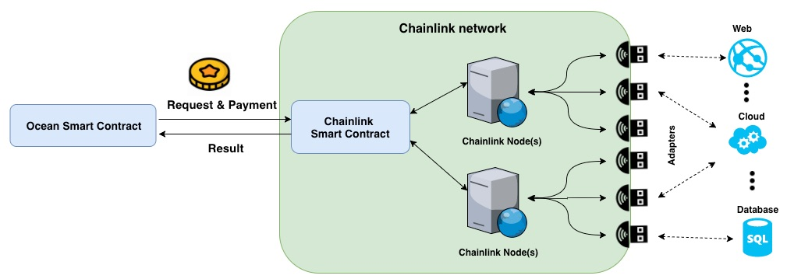
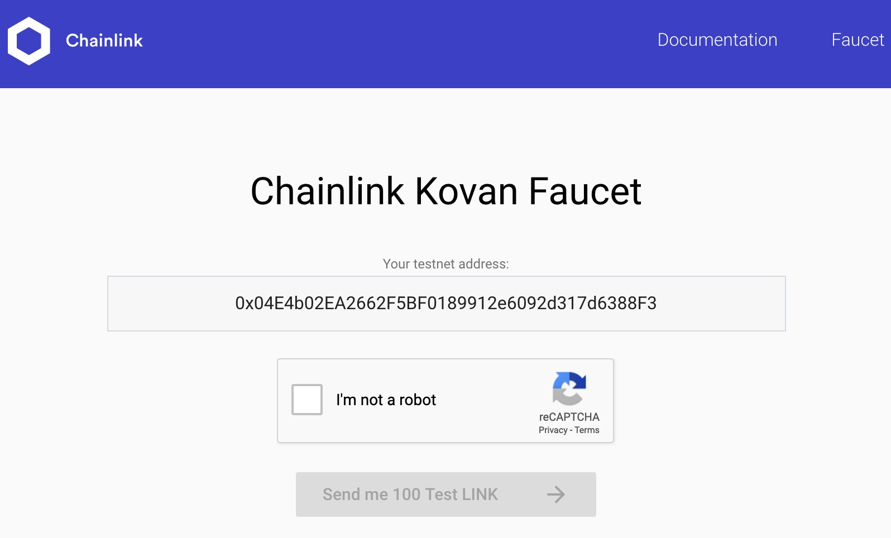
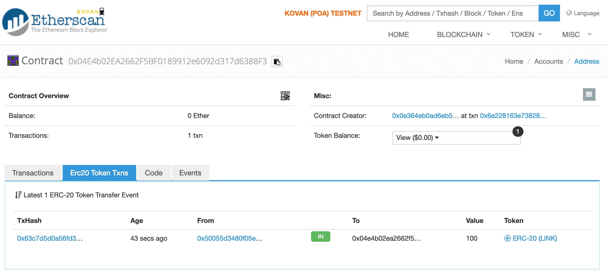
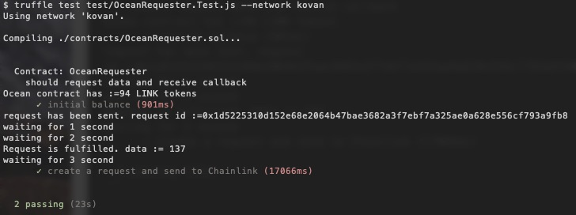

[](https://oceanprotocol.com)

# Integration of Chainlink & Ocean

```
name: research of Chainlink & Ocean integration
type: research
status: updated draft
editor: Fang Gong <fang@oceanprotocol.com>
date: 03/07/2019
```

## 1. Introduction

Ocean Protocol needs the web 2.0 data availability proof (i.e., data is available for access in the storage) to distribute reward tokens and fulfill the service agreements. It is a fundamental building block for great success of Ocean. 

A decentralized approach is urgently sought. We had researched POA network, verifier network and we continue to investigate Oracle network. [Chainlink](https://chain.link/) is a great project in this scope. 

In this research, we explore the integration of Chainlink & Ocean. In this way, Ocean can access the external information through Chainlink network. 

## 2. Architecture Overview

The high-level architecture design is following:



* **Ocean Smart Contract**: send Chainlink request and LINK tokens as payment to the smart contract of Chainlink;
* **Chainlink Smart Contract**: Oracle contract that accepts request and dispatch jobs to Chainlink nodes;
* **Chainlink Nodes**: handles jobs, tasks, scheduling, and signing transactions for the smart contract;
* **Adapters**: service interfaces to the external data sources. It accepts and responds with JSON formatted data;
* **External Data**: the information source including Web pages, Cloud dataset, Database, etc. 

## 3. POC of Integration

In this POC, we try to build the workflow in the architecture with all components in place. To this end, we leverage the [existing core adapters](ttps://docs.chain.link/docs/available-oracles) provided by Chainlink. 

Moreover, we interface with Chainlink deployed in Kovan testnet as an example.

### 3.1 Install Chainlink Packages
Add Chainlink to our project by running:

```bash
$ npm install github:smartcontractkit/chainlink --save
```

Or simply link to deployed chainlink instance using ZeppelinOS:

```bash
zos link chainlink
```

### 3.2 Setup of Chainlink network (Kovan testnet)

```javascript
pragma solidity ^0.4.24;

import "chainlink/solidity/contracts/Chainlinked.sol";

contract OceanRequester is Chainlinked {
  constructor() public {
    // Set the address for the LINK token for the network.
    setLinkToken(0xa36085F69e2889c224210F603D836748e7dC0088);
    // Set the address of the oracle to create requests to.
    setOracle(0x2f90A6D021db21e1B2A077c5a37B3C7E75D15b7e);
  }
  ...
}
```

### 3.3 Create and Send Oracle Request

```javascript
  /*
   * Create a request and send it to default Oracle contract
   */
  function createRequest(
    bytes32 _jobId,
    string _url,
    string _path,
    int256 _times
  )
    public
    onlyOwner
    returns (bytes32 requestId)
  {
    // create request instance
    Chainlink.Request memory req = newRequest(_jobId, this, this.fulfill.selector);
    // fill in the pass-in parameters
    req.add("url", _url);
    req.add("path", _path);
    req.addInt("times", _times);
    // send request & payment to Chainlink oracle
    requestId = chainlinkRequestTo(getOracle(), req, ORACLE_PAYMENT);
    // emit event message
    emit requestCreated(msg.sender, _jobId, requestId);
  }
```

### 3.4 Deploy Requester Contract to Kovan

first install the "truffle-hdwallet-provider" package:

```bash
$ npm install truffle-hdwallet-provider
```

Then deploy the contract to Kovan network: `0x04E4b02EA2662F5BF0189912e6092d317d6388F3 `

```bash
$ truffle migrate --network kovan
	...
   Deploying 'OceanRequester'
   --------------------------
   > transaction hash:    0x6e228163e73828c58c8287fec72c551289516a1d8e9300aab5dcc99d848f6146
   > Blocks: 0            Seconds: 16
   > contract address:    0x04E4b02EA2662F5BF0189912e6092d317d6388F3
   > account:             0x0E364EB0Ad6EB5a4fC30FC3D2C2aE8EBe75F245c
   > balance:             2.703082875853937168
   > gas used:            1439461
   > gas price:           10 gwei
   > value sent:          0 ETH
   > total cost:          0.01439461 ETH

   > Saving artifacts
   -------------------------------------
   > Total cost:          0.01439461 ETH
```

### 3.5 Deposit LINK tokens to Requester Contract

Open the faucet page [https://kovan.chain.link/](https://kovan.chain.link/) and type the requester contract address:



It will deposit 100 LINK tokens into the requester contract: 



### 3.6 Use Script to Interact with Contract

A javascript file is created to send transactions to the deployed Chainlink contracts on Kovan network. 

Note that `jobId` is very important for Chainlink to recognize the request in different network. Please refer to core request jobs in the [list](https://docs.chain.link/docs/addresses-and-job-specs) that are provided by Chainlink.

In this test, the request tries to GET the UINT256 variable from the webpage. So we use the jobId `2c6578f488c843588954be403aba2deb` for `HttpGet JsonParse EthUint256` on Kovan network.


```javascript
contract("OceanRequester", (accounts) => {
  const LinkToken = artifacts.require("LinkToken.sol");
  const OceanRequester = artifacts.require("OceanRequester.sol");
  const jobId = web3.utils.toHex("2c6578f488c843588954be403aba2deb");
  const url = "https://min-api.cryptocompare.com/data/price?fsym=ETH&tsyms=USD,EUR,JPY";
  const path = "USD";
  const times = 100;
  let link, ocean;

  beforeEach(async () => {
  	 // get Link token contract instance at deployed address
    link = await LinkToken.at("0xa36085F69e2889c224210F603D836748e7dC0088");
    // get Ocean requester contract instance at deployed address
    ocean = await OceanRequester.at("0x04E4b02EA2662F5BF0189912e6092d317d6388F3");
  });

  describe("query the initial token balance", () => {
    it("initial balance", async () => {
      let initBalance = await link.balanceOf(ocean.address)
      console.log("Ocean contract has :=" + initBalance + " LINK tokens")
    });
    
    it("create a request and send to Chainlink", async () => {
      let tx = await ocean.createRequest(jobId, url, path, times);
      request = h.decodeRunRequest(tx.receipt.rawLogs[3]);
      console.log("request has been sent. request id :=" + request.id)
      ...
      data = await ocean.getRequestResult(request.id)
	  console.log("Request is fulfilled. data := " + data)
	   ...
     });
   });
});

```

The output is the `ETH` price in the unit of `USD`, which is 137 USD at this moment:




## 4. Build Customized Adapter for Ocean


## Reference

* [1] how to create Chainlinked contracts: [https://docs.chain.link/docs/getting-started](https://docs.chain.link/docs/getting-started)
* [2] testnet LINK available on Ropsten, Rinkeby, and Kovan:
	- Ropsten: [https://ropsten.chain.link/](https://ropsten.chain.link/)
	- Rinkeby: [https://rinkeby.chain.link/](https://rinkeby.chain.link/)
	- Kovan: [https://kovan.chain.link/](https://kovan.chain.link/)
* [3] core adapters from Chainlink: [https://docs.chain.link/docs/available-oracles](https://docs.chain.link/docs/available-oracles)


## License

```
Copyright 2018 Ocean Protocol Foundation

Licensed under the Apache License, Version 2.0 (the "License");
you may not use this file except in compliance with the License.
You may obtain a copy of the License at

   http://www.apache.org/licenses/LICENSE-2.0

Unless required by applicable law or agreed to in writing, software
distributed under the License is distributed on an "AS IS" BASIS,
WITHOUT WARRANTIES OR CONDITIONS OF ANY KIND, either express or implied.
See the License for the specific language governing permissions and
limitations under the License.
```

