[](https://oceanprotocol.com)

# Integration of Chainlink & Ocean

```
name: research of Chainlink & Ocean integration
type: research
status: updated draft
editor: Fang Gong <fang@oceanprotocol.com>
date: 03/18/2019
```

## 1. Introduction

Ocean Protocol needs the web 2.0 data availability proof (i.e., data is available for access in the storage) to distribute reward tokens and fulfill the service agreements. It is a fundamental building block for great success of Ocean. 

A decentralized approach is urgently sought. We had researched POA network, verifier network and we continue to investigate Oracle network. [Chainlink](https://chain.link/) is a great project in this scope. 

In this research, we explore the integration of Chainlink & Ocean. In this way, Ocean can access the external information through Chainlink network. 

*Note*: the POC in folder `poc` uses Truffle v5.0.3 and Node v8.11.1.

## 2. Architecture Overview

The high-level architecture design is following:


* **Ocean Smart Contract**: send Chainlink request and LINK tokens as payment to the smart contract of Chainlink;
* **Chainlink Smart Contract**: Oracle contract that accepts request and dispatch jobs to Chainlink nodes;
* **Chainlink Nodes**: handles jobs, tasks, scheduling, and signing transactions for the smart contract;
* **Adapters**: service interfaces to the external data sources. It accepts and responds with JSON formatted data;
* **External Data**: the information source including Web pages, Cloud dataset, Database, etc. 

## 3. POC of Integration

In this POC, we try to build the workflow in the architecture with all components in place. To this end, we leverage the [existing core adapters](ttps://docs.chain.link/docs/available-oracles) provided by Chainlink. 

Moreover, we interface with Chainlink deployed in Kovan testnet as an example.

### 3.1 Install Chainlink Packages
Add Chainlink to our project by running:

```bash
$ npm install github:smartcontractkit/chainlink --save
```

Or simply link to deployed chainlink instance using ZeppelinOS:

```bash
zos link chainlink
```

### 3.2 Setup of Chainlink network (Kovan testnet)

```javascript
pragma solidity ^0.4.24;

import "chainlink/solidity/contracts/Chainlinked.sol";

contract OceanRequester is Chainlinked {
  constructor() public {
    // Set the address for the LINK token for the network.
    setLinkToken(0xa36085F69e2889c224210F603D836748e7dC0088);
    // Set the address of the oracle to create requests to.
    setOracle(0x2f90A6D021db21e1B2A077c5a37B3C7E75D15b7e);
  }
  ...
}
```

### 3.3 Create and Send Oracle Request

```javascript
  /*
   * Create a request and send it to default Oracle contract
   */
  function createRequest(
    bytes32 _jobId,
    string _url,
    string _path,
    int256 _times
  )
    public
    onlyOwner
    returns (bytes32 requestId)
  {
    // create request instance
    Chainlink.Request memory req = newRequest(_jobId, this, this.fulfill.selector);
    // fill in the pass-in parameters
    req.add("url", _url);
    req.add("path", _path);
    req.addInt("times", _times);
    // send request & payment to Chainlink oracle
    requestId = chainlinkRequestTo(getOracle(), req, ORACLE_PAYMENT);
    // emit event message
    emit requestCreated(msg.sender, _jobId, requestId);
  }
```

### 3.4 Deploy Requester Contract to Kovan

first install the "truffle-hdwallet-provider" package:

```bash
$ npm install truffle-hdwallet-provider
```

Then deploy the contract to Kovan network: `0x04E4b02EA2662F5BF0189912e6092d317d6388F3 `

```bash
$ truffle migrate --network kovan
	...
   Deploying 'OceanRequester'
   --------------------------
   > transaction hash:    0x6e228163e73828c58c8287fec72c551289516a1d8e9300aab5dcc99d848f6146
   > Blocks: 0            Seconds: 16
   > contract address:    0x04E4b02EA2662F5BF0189912e6092d317d6388F3
   > account:             0x0E364EB0Ad6EB5a4fC30FC3D2C2aE8EBe75F245c
   > balance:             2.703082875853937168
   > gas used:            1439461
   > gas price:           10 gwei
   > value sent:          0 ETH
   > total cost:          0.01439461 ETH

   > Saving artifacts
   -------------------------------------
   > Total cost:          0.01439461 ETH
```

### 3.5 Deposit LINK tokens to Requester Contract

Open the faucet page [https://kovan.chain.link/](https://kovan.chain.link/) and type the requester contract address:


It will deposit 100 LINK tokens into the requester contract: 


### 3.6 Use Script to Interact with Contract

A javascript file is created to send transactions to the deployed Chainlink contracts on Kovan network. 

Note that `jobId` is very important for Chainlink to recognize the request in different network. Please refer to core request jobs in the [list](https://docs.chain.link/docs/addresses-and-job-specs) that are provided by Chainlink.

In this test, the request tries to GET the UINT256 variable from the webpage. So we use the jobId `2c6578f488c843588954be403aba2deb` for `HttpGet JsonParse EthUint256` on Kovan network.


```javascript
contract("OceanRequester", (accounts) => {
  const LinkToken = artifacts.require("LinkToken.sol");
  const OceanRequester = artifacts.require("OceanRequester.sol");
  const jobId = web3.utils.toHex("2c6578f488c843588954be403aba2deb");
  const url = "https://min-api.cryptocompare.com/data/price?fsym=ETH&tsyms=USD,EUR,JPY";
  const path = "USD";
  const times = 100;
  let link, ocean;

  beforeEach(async () => {
  	 // get Link token contract instance at deployed address
    link = await LinkToken.at("0xa36085F69e2889c224210F603D836748e7dC0088");
    // get Ocean requester contract instance at deployed address
    ocean = await OceanRequester.at("0x04E4b02EA2662F5BF0189912e6092d317d6388F3");
  });

  describe("query the initial token balance", () => {
    it("initial balance", async () => {
      let initBalance = await link.balanceOf(ocean.address)
      console.log("Ocean contract has :=" + initBalance + " LINK tokens")
    });
    
    it("create a request and send to Chainlink", async () => {
      let tx = await ocean.createRequest(jobId, url, path, times);
      request = h.decodeRunRequest(tx.receipt.rawLogs[3]);
      console.log("request has been sent. request id :=" + request.id)
      ...
      data = await ocean.getRequestResult(request.id)
	  console.log("Request is fulfilled. data := " + data)
	   ...
     });
   });
});

```

The output is the `ETH` price in the unit of `USD`, which is 137 USD at this moment:


## 4. Build Customized Adapter for Ocean

### 4.1 Overview of Workflow

The key challenge is to develop an external and customized adapter for a specific application. The overview of workflow is illustrated as below:

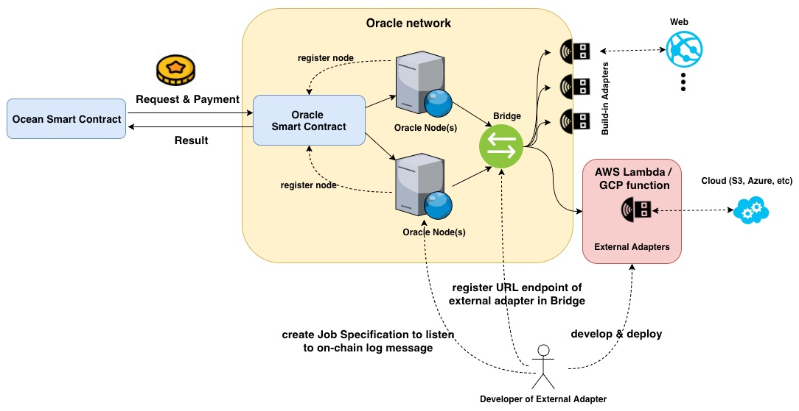

**Note:** all the components (i.e., Smart Contract and Chainlink nodes) should be maintained by developers of external adapters.

Some development works include:

* **deploy Oracle contract**:
	* 	a brand-new copy of [Oracle contract](https://github.com/smartcontractkit/chainlink/blob/master/examples/ropsten/contracts/Oracle.sol) must be deployed to blockchain network;
	*  Chainlink nodes must be registered in Oracle contract by owner in order to fulfill requests;
* **setup a new Chainlink node**: 
	* run a Chainlink node to connect Chainlink network;t
	* run an Ethereum Client in the node side to connect Ethereum blockchain and smart contract;
	* link Chainlink node to the new adapter URL endpoint;
	* register this Chainlink node in previously deployed Oracle contract;
* **build a new external adapter**:
	*  implement the application logic (e.g., query checksum from S3) in the adapter;
	*  prepare the external adapter package for AWS/GCP;
	*  run the adapter in stateless platform such as Amazon Lambda and GCP Function;
*  **write new Ocean smart contract to request**:
	*  create functions in Ocean smart contract to generate request;
	*  create callback functions to receive the returned results from the request.


### 4.2 Run a new Chainlink node

* 1. install the **docker** on the machine. It is recommended to run the Chainlink node with Docker. 

```
$ curl -sSL https://get.docker.com/ | sh
$ sudo usermod -aG docker $USER
$ exit
# (log in again)
```

* 2. install **Parity** client for the Ropsten and Kovan test networks.

```
$ docker pull parity/parity:stable
$ mkdir ~/.parity-kovan
$ docker run -h eth --name eth -p 8546:8546 \
           -v ~/.parity-kovan:/home/parity/.local/share/io.parity.ethereum/ \
           -it parity/parity:stable --chain=kovan \
           --ws-interface=all --ws-origins="all" --light \
           --base-path /home/parity/.local/share/io.parity.ethereum/
```

If the container was stopped and you need to run it again, you can simply use the following command:

```
$ docker start -i eth
```

* 3. run **Chainlink node**: 

```
$ docker pull smartcontract/chainlink:latest
$ mkdir -p ~/.chainlink-kovan/tls
$ openssl req -x509 -out  ~/.chainlink-kovan/tls/server.crt  -keyout ~/.chainlink-kovan/tls/server.key \
  -newkey rsa:2048 -nodes -sha256 \
  -subj '/CN=localhost' -extensions EXT -config <( \
   printf "[dn]\nCN=localhost\n[req]\ndistinguished_name = dn\n[EXT]\nsubjectAltName=DNS:localhost\nkeyUsage=digitalSignature\nextendedKeyUsage=serverAuth")
```

set variables (if there is no local Ethereum client running, `ETH_URL` should be set to be `wss://kovan.infura.io/ws/v3/Kuo1lxDBsFtMnaw6GiN2`):

```
echo "ROOT=/chainlink
LOG_LEVEL=debug
ETH_URL=ws://eth:8546 
ETH_CHAIN_ID=42
MIN_OUTGOING_CONFIRMATIONS=2
MIN_INCOMING_CONFIRMATIONS=0
LINK_CONTRACT_ADDRESS=0xa36085F69e2889c224210F603D836748e7dC0088
TLS_CERT_PATH=/chainlink/tls/server.crt
TLS_KEY_PATH=/chainlink/tls/server.key
ALLOW_ORIGINS=*" > .env
```

run the Chainlink node as (Remove `--link eth` if you are not running your Ethereum client):

```
$ docker run --link eth -p 6689:6689 -v ~/.chainlink-kovan:/chainlink -it --env-file=.env smartcontract/chainlink n
```
at this moment, the Chainlink node is up and running. The node's GUI can be accessed from [https://localhost:6689](https://localhost:6689)

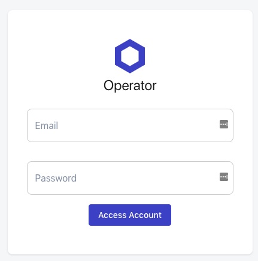

After login, the interface shows the details of this Chainlink node:

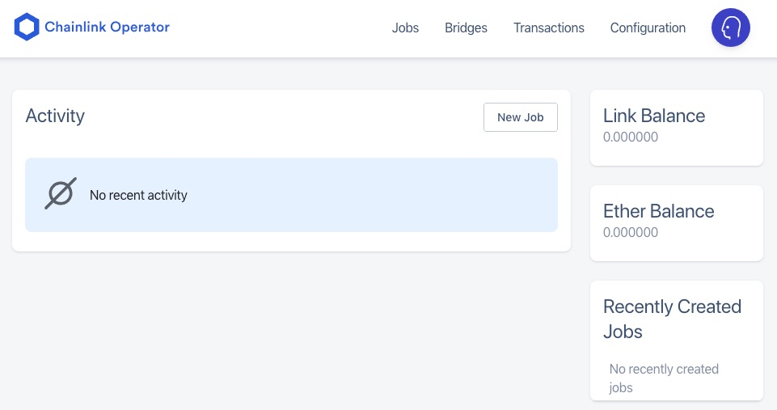


### 4.3 Deploy Oracle contract to Kovan

An Oracle contract is required to interact with this new Chainlink node. Therefore, the [document](https://docs.chain.link/docs/fulfilling-requests#section-deploy-your-own-oracle-contract) suggests to deploy our own Oracle contract and resigser the Chainlink node to it. 

We deploy the [Oracle contract](https://github.com/smartcontractkit/chainlink/blob/master/examples/ropsten/contracts/Oracle.sol) to Kovan network.

```
3_oracle_migration.js
=====================

   Deploying 'Oracle'
   ------------------
   > transaction hash:    0xd281b18c4be0be9b2bdbfed4bae090aab5c86027564f048785b1f971cf0b6f2c
   > Blocks: 0            Seconds: 8
   > contract address:    0x698EFB00F79E858724633e297d5188705512e506
   > account:             0x0E364EB0Ad6EB5a4fC30FC3D2C2aE8EBe75F245c
   > balance:             2.262907885853937168
   > gas used:            1311430
   > gas price:           10 gwei
   > value sent:          0 ETH
   > total cost:          0.0131143 ETH

   > Saving artifacts
   -------------------------------------
   > Total cost:           0.0131143 ETH
```


### 4.4 Build a new external adapter

In this POC, we use an external adapter [CryptoCompareExternalAdapter](https://github.com/OracleFinder/CryptoCompareExternalAdapter) from [OracleFinder](https://oraclefinder.com/) as: 

```
$ git clone https://github.com/OracleFinder/CryptoCompareExternalAdapter.git
$ cd CryptoCompareExternalAdapter/
$ npm install
$ zip -r chainlink-cloud-adapter.zip .
```

The zip file `chainlink-cloud-adapter.zip` is created and ready to be deployed.

### 4.5 deploy new adapter to GCP/Amazon Lambda

First, an GCP account is needed to run adapter on serverless platform. Google offers $300 credit for free trial so register [here](https://cloud.google.com/free):

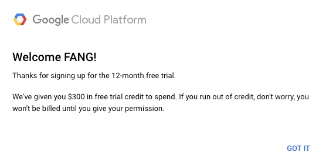

Next, create a new GCP function project and upload the zip file `chainlink-cloud-adapter.zip` as:

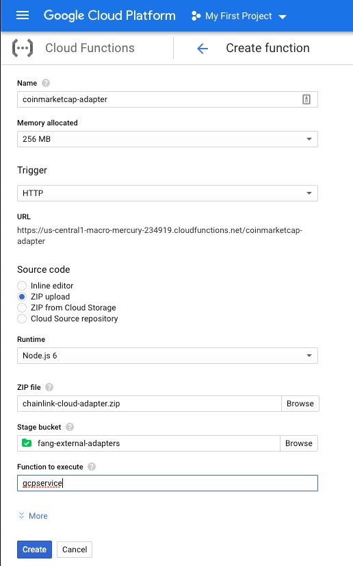

The generated URL endpoint is needed to add this adapter to Chainlink node:

```
https://us-central1-macro-mercury-234919.cloudfunctions.net/coinmarketcap-adapter 
```

Here, we can test the deployed GCP functions as:

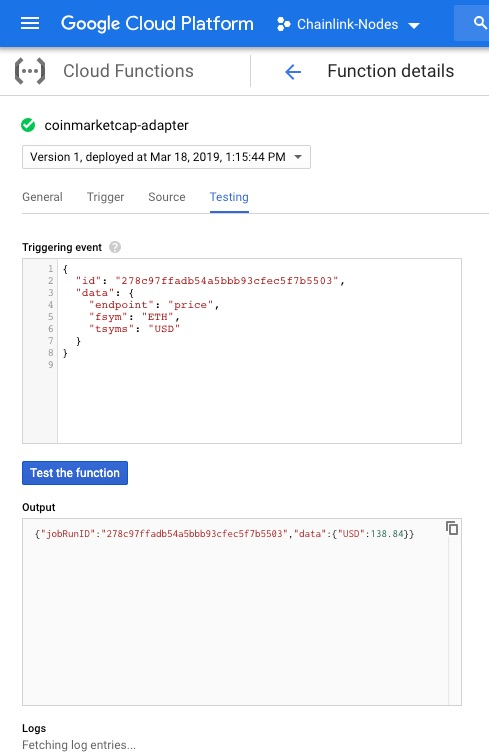

Now, the external adapter is setup and ready on Google Cloud Functions. 

### 4.6 register external adapter in Chainlink node

* Register the URL enndpoint to the Chainlink node by creating a new Bridge:

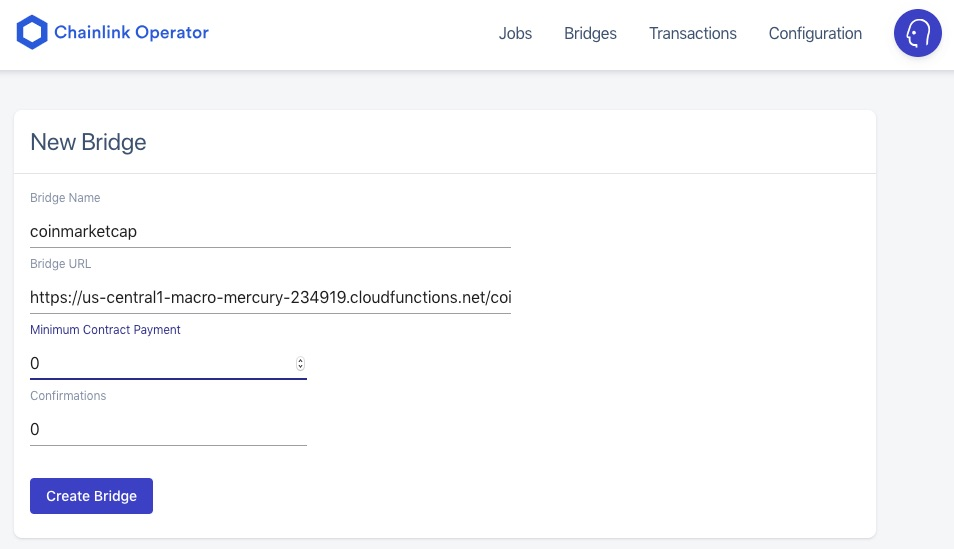

The bridge is up and running. 

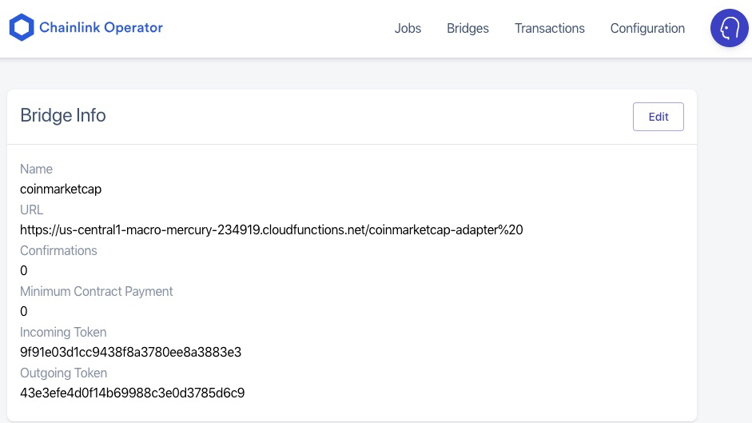

* Next, we need to create a Job Specification for this adapter, so the Chainlink node can trigger the action when the Oracle contract emit an message. Details about Job Specification can be found [here](https://docs.chain.link/docs/job-specifications)

In the GUI of Chainlink node, create a new JOB with following JSON. Note that `initiator` is the address of Oracle contract.

```
{
  "initiators": [
    {
      "type": "RunLog",
      "params": { "address": "0x698efb00f79e858724633e297d5188705512e506" }
    }
  ],
  "tasks": [
    {
      "type": "coinmarketcap",
      "confirmations": 0,
      "params": {}
    },
    {
      "type": "Copy",
      "params": {}
    },
    {
      "type": "Multiply",
      "params": { "times": 100 }
    },
    { "type": "EthUint256" },
    { "type": "EthTx" }
  ]
}
```

In the Job tab of the Chainlink node GUI, the new Job can be found as:

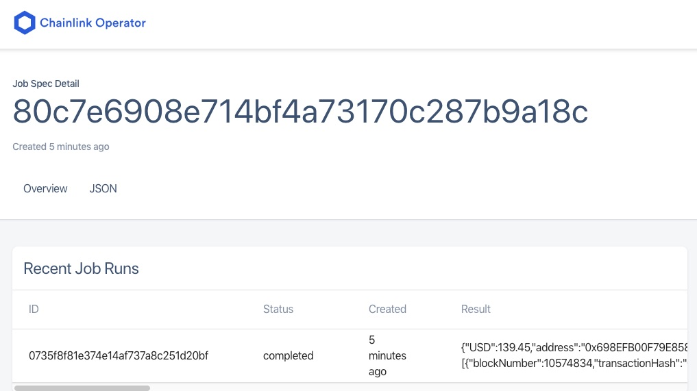

**IMPORTANT**: `80c7e6908e714bf4a73170c287b9a18c` is the **new jobID** for this external adapter, which should be used for submitting the request from Ocean requester contract.

### 4.7 register Chainlink nodes in Oracle contract

Then, register the new Chainlink node to it, which requires the account address of the node. It can be found from the configuration page of Chainlink node:

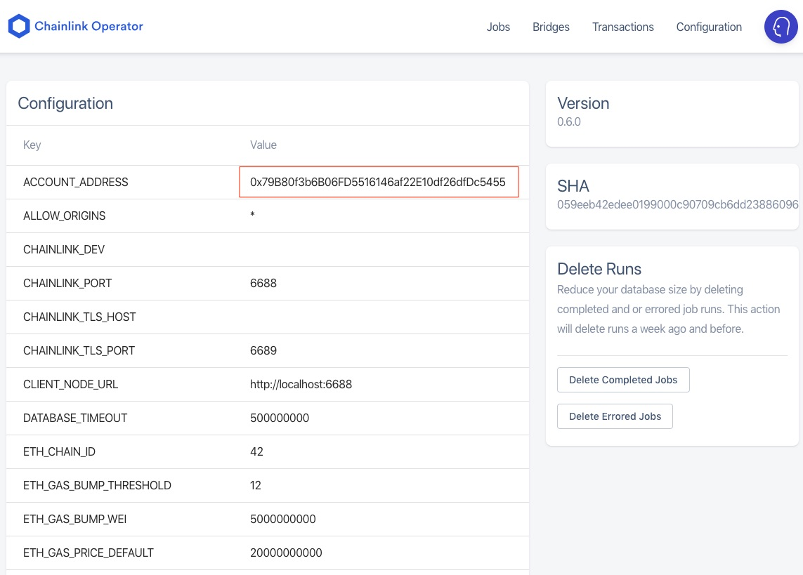

Here is the script `poc/test/Oracle.Test.js` to register Chainlink node in Oracle contract:

```javascript
"use strict";

const Web3 = require('web3')

const web3 = new Web3(new Web3.providers.HttpProvider('https://kovan.infura.io/Kuo1lxDBsFtMnaw6GiN2'))


const h = require("chainlink-test-helpers");
const scale = 1e18;

contract("Oracle", (accounts) => {
  const Oracle = artifacts.require("Oracle.sol");
  const chainlinkNode ='0x79B80f3b6B06FD5516146af22E10df26dfDc5455';
  let oracle;

  beforeEach(async () => {
    oracle = await Oracle.at("0x698EFB00F79E858724633e297d5188705512e506");
  });

  describe("should register chainlink node", () => {

    it("register chainlink node", async () => {
      await oracle.setFulfillmentPermission(chainlinkNode, true)
      let status = await oracle.getAuthorizationStatus(chainlinkNode)
      console.log("Chainlink node's status is := " + status)
    });
  });
});
```

Output of this script:

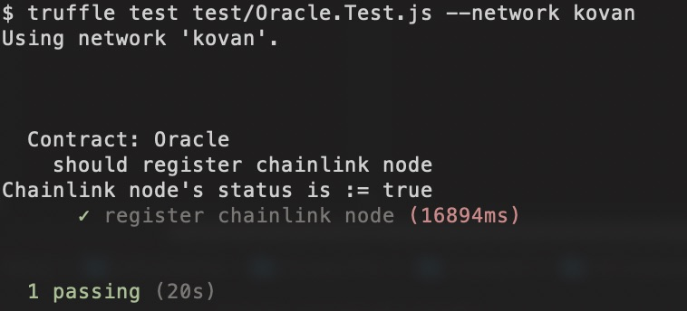


### 4.8 Create and Deploy Requester Contract

The last step is to create request from Ocean and send this request to Chainlink smart contract. 

We create a new contract `poc/contracts/requestGCP.sol`. The key function is:

```javascript
  function createRequest(
    bytes32 _jobId,
    string _coin,
    string _market
  )
    public
    onlyOwner
    returns (bytes32 requestId)
  {
    // create request instance
    Chainlink.Request memory req = newRequest(_jobId, this, this.fulfill.selector);
    // fill in the pass-in parameters
    req.add("endpoint", "price");
    req.add("fsym", _coin);
    req.add("tsyms", _market);
    req.add("copyPath", _market);
    req.addInt("times", 100);
    // send request & payment to Chainlink oracle (Requester Contract sends the payment)
    requestId = chainlinkRequestTo(getOracle(), req, ORACLE_PAYMENT);
    // emit event message
    emit requestCreated(msg.sender, _jobId, requestId);
  }
```

We deploy this contract to Kovan testnet:

```
4_requestGCP_migration.js
=========================

   Replacing 'requestGCP'
   ----------------------
   > transaction hash:    0x978974b43d843606c42ce15c87fcc560a5c625497bf074f5ec0f337347438fdf
   > Blocks: 0            Seconds: 16
   > contract address:    0x6f73E784253aD72F0BA4164101860992dFC17Fe1
   > account:             0x0E364EB0Ad6EB5a4fC30FC3D2C2aE8EBe75F245c
   > balance:             2.248942845853937168
   > gas used:            1396504
   > gas price:           10 gwei
   > value sent:          0 ETH
   > total cost:          0.01396504 ETH

   > Saving artifacts
   -------------------------------------
   > Total cost:          0.01396504 ETH
```

Remember to load this new request contract with LINK tokens using [https://kovan.chain.link/](https://kovan.chain.link/).

### 4.9 Send Request to the External Adapter

Next, we use javascript file to submit the request to the new external adapter as `poc/test/requestGCP.Test.js`:

```javascript
"use strict";

const Web3 = require('web3')

//const web3 = new Web3(new Web3.providers.HttpProvider('https://kovan.infura.io/Kuo1lxDBsFtMnaw6GiN2'))
const web3 = new Web3(new Web3.providers.WebsocketProvider('ws://eth:8546'))

const h = require("chainlink-test-helpers");
const scale = 1e18;

function wait(ms) {
    const start = new Date().getTime()
    let end = start
    while (end < start + ms) {
        end = new Date().getTime()
    }
}

contract("requestGCP", (accounts) => {
  const LinkToken = artifacts.require("LinkToken.sol");
  const RequestGCP = artifacts.require("requestGCP.sol");
  const jobId = web3.utils.toHex("80c7e6908e714bf4a73170c287b9a18c");
  const coin = "ETH"
  const market = "USD";
  const defaultAccount =0x0e364eb0ad6eb5a4fc30fc3d2c2ae8ebe75f245c;
  let link, ocean;

  beforeEach(async () => {
    link = await LinkToken.at("0xa36085F69e2889c224210F603D836748e7dC0088");
    ocean = await RequestGCP.at("0x6f73E784253aD72F0BA4164101860992dFC17Fe1");
  });

  describe("should request data and receive callback", () => {
    let request;

    it("initial balance", async () => {
      let initBalance = await link.balanceOf(ocean.address)
      console.log("Ocean contract has :=" + initBalance / scale + " LINK tokens")
      let oracle = await ocean.getOracle()
      console.log("Ocean contract links to Oracle contract :=" + oracle)
    });

    it("create a request and send to Chainlink", async () => {
      let tx = await ocean.createRequest(jobId, coin, market);
      request = h.decodeRunRequest(tx.receipt.rawLogs[3]);
      console.log("request has been sent. request id :=" + request.id)

      let data = 0
      let timer = 0
      while(data == 0){
        data = await ocean.getRequestResult(request.id)
        if(data != 0) {
          console.log("Request is fulfilled. data := " + data)
        }
        wait(1000)
        timer = timer + 1
        console.log("waiting for " + timer + " second")
      }

    });
  });
});
```

Run this script to submit the request, which is fulfilled by the external adapter:

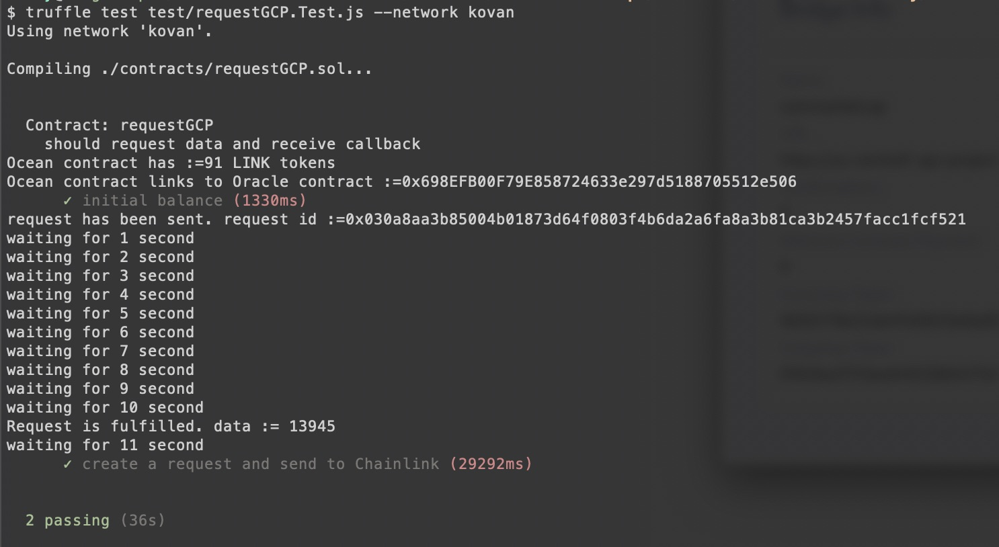

This transaction can be found in Chainlink node transaction history:

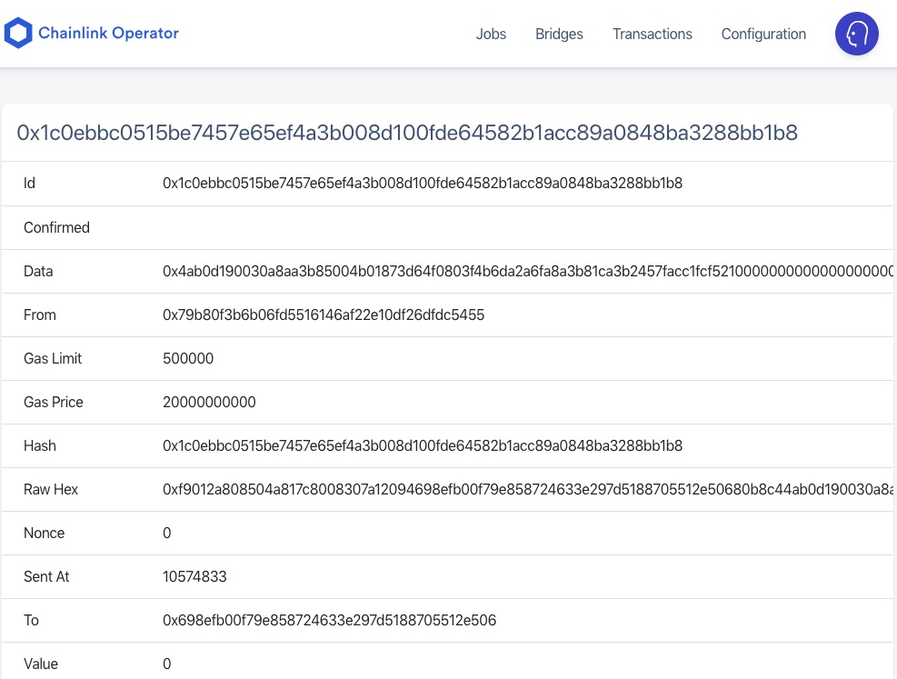

In the dashboard of GCP Functions, we can find this transaction in the history:

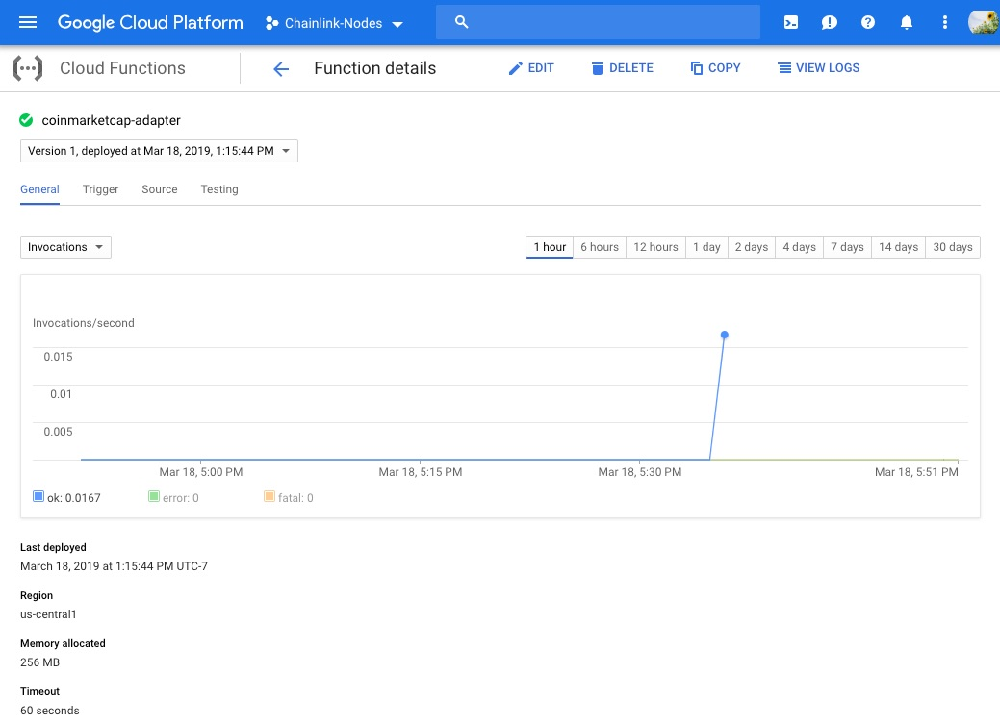

## 5. Conclusion

This research investigates Chainlink and potential integration with Ocean. It implements the POC to show how the Oracle network works. At this moment, it needs great efforts to setup the Oracle network using Chainlink.

## Reference

* [1] how to create Chainlinked contracts: [https://docs.chain.link/docs/getting-started](https://docs.chain.link/docs/getting-started)
* [2] testnet LINK available on Ropsten, Rinkeby, and Kovan:
	- Ropsten: [https://ropsten.chain.link/](https://ropsten.chain.link/)
	- Rinkeby: [https://rinkeby.chain.link/](https://rinkeby.chain.link/)
	- Kovan: [https://kovan.chain.link/](https://kovan.chain.link/)
* [3] core adapters from Chainlink: [https://docs.chain.link/docs/available-oracles](https://docs.chain.link/docs/available-oracles)
* [4] [CL-Adapters.com](https://chainlinkadapters.com/)
* [5] [Amazon Lambda](https://docs.aws.amazon.com/lambda/latest/dg/welcome.html)
* [6] tutorial on external adapters: [Tutorial](https://docs.chain.link/docs/external-adapters)
* [7] guides on developing external adapters: [Guides](https://chainlinkadapters.com/guides)
* [8] [OracleFinder](https://oraclefinder.com/)


## License

```
Copyright 2018 Ocean Protocol Foundation

Licensed under the Apache License, Version 2.0 (the "License");
you may not use this file except in compliance with the License.
You may obtain a copy of the License at

   http://www.apache.org/licenses/LICENSE-2.0

Unless required by applicable law or agreed to in writing, software
distributed under the License is distributed on an "AS IS" BASIS,
WITHOUT WARRANTIES OR CONDITIONS OF ANY KIND, either express or implied.
See the License for the specific language governing permissions and
limitations under the License.
```

