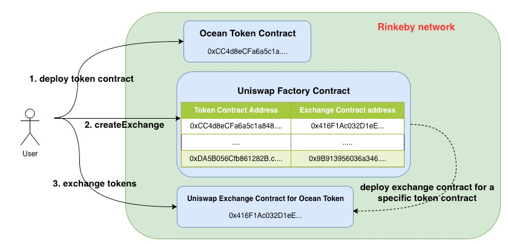
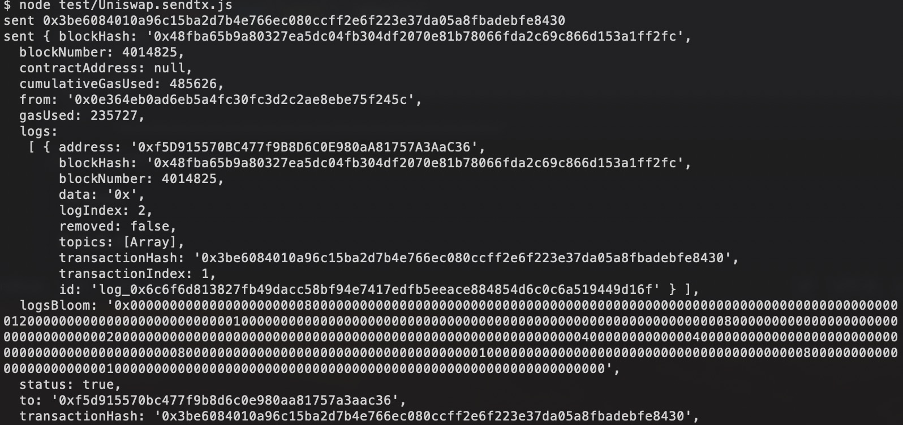
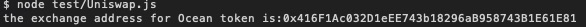

[](https://oceanprotocol.com)

# Uniswap/Ocean Integration

```
name: research on Uniswap/Ocean integration.
type: research
status: initial draft
editor: Fang Gong <fang@oceanprotocol.com>
date: 03/11/2019
```

## 1. Introduction
Uniswap is a decentralized token exchange for cryptocurrencies, which facilitates users to exchange one kind of token to others with low gas cost. It is needed for Ocean in terms of several aspects:

* Ocean needs to provide liquidity of Ocean tokens (i.e., ETH<>OCEAN, DAI<>OCEAN, etc.);
* Ocean needs other utility tokens to pay for the services in other network (i.e., OCEAN<>Chainlink, etc.).

To this end, we investigate how to integrate OCEAN tokens to Uniswap in this research. To be clear, it is desired to leverage the existing deployed Uniswap contract rather than building Uniswap-type exchange internally. 

## 2. Uniswap Structure  

* **Token contract**: the token contract must be first deployed on the blockchain network;
* **Uniswap Factory contract**: 
	* it is the manager of exchange contracts for all token contracts; 
	* it maintains a mapping from token contract address to corresponding exchange contract address;
	* it creates a new exchange contract for a specific token contract;
* **Uniswap Exchage contract**:
	* execute the swap order to exchange tokens;
	* accept token deposit to enhance liquidity of Uniswap.




## 3. POC in Rinkeby Testnet 

In this POC, we add the Ocean tokens into Uniswap deployed in Rinkeby as the prototype. The same procedure applies to the Ethereum Main network. 

### 3.1 deploy Ocean tokens to Rinkeby Testnet

clone the `ocean-token` project in `ocean-uniswap` directory and compile with truffle:

```
$ npm install
$ truffle compile
```

setup the rinkeby network settings in `truffle-config.js`:

```
rinkeby: {
     provider: function() {
     return new HDWalletProvider(process.env.NMEMORIC, "https://rinkeby.infura.io/")
     },
     network_id: '4',
     websockets: true,
     gas: 6000000,
     gasPrice: 10000000000 // 10 Gwei
 },
```

deploy the token contract to rinkeby:

```
$ truffle deploy --network rinkeby 
...
10_ocean_token.js
=================

   Replacing 'OceanToken'
   ----------------------
   > transaction hash:    0xd17a0dc69f54f78aa9a158682dc5bd24c281de959e3a7545ecb7d3c60cdadeab
   > Blocks: 0            Seconds: 12
   > contract address:    0xCC4d8eCFa6a5c1a84853EC5c0c08Cc54Cb177a6A
   > account:             0x0E364EB0Ad6EB5a4fC30FC3D2C2aE8EBe75F245c
   > balance:             2.57090605
   > gas used:            1214459
   > gas price:           10 gwei
   > value sent:          0 ETH
   > total cost:          0.01214459 ETH

   > Saving artifacts
   -------------------------------------
   > Total cost:          0.01214459 ETH

```

Note: modify the token contract owner in `migration/10_ocean_token.js` and it must be different from the one that deploys the contract in Truffle.


### 3.2 Add Ocean Token to Uniswap Exchange

Uniswap factory contract is deployed on Rinkeby at `0xf5d915570bc477f9b8d6c0e980aa81757a3aac36`. 

Details of ABI, code can be found in the Etherscan page: 
[https://rinkeby.etherscan.io/address/0xf5d915570bc477f9b8d6c0e980aa81757a3aac36](https://rinkeby.etherscan.io/address/0xf5d915570bc477f9b8d6c0e980aa81757a3aac36)

We need to send transaction `createExchange` to the Uniswap contract on Rinkeby. However, I received `Error: Node error: {"code":-32601,"message":"The method eth_sendTransaction does not exist/is not available"`

This error means that the underlying JSON-RPC method is not supported by Infura. Infura only blocks methods that do not make sense for Infura, such as those that require Infura to store private keys. Apparently web3.eth.sendTransaction invokes the eth\_sendTransaction method (which requires the server to hold keys). 

We need to use the web3 method that instead invokes eth_sendRawTransaction, so that the transaction signing happens locally. Details of "Offline transaction signing" can be found in [https://web3j.readthedocs.io/en/stable/transactions.html#offline-signing](https://web3j.readthedocs.io/en/stable/transactions.html#offline-signing)

Here is the Javascript file for this purpose: `ocean-uniswap/ocean-token/test/Uniswap.sendtx.js`

```javascript
let Web3 = require("web3");
const Tx = require('ethereumjs-tx')

var abi = '[{"name":"NewExchange","inputs":[{"type":"address","name":"token","indexed":true},{"type":"address","name":"exchange","indexed":true}],"anonymous":false,"type":"event"},{"name":"initializeFactory","outputs":[],"inputs":[{"type":"address","name":"template"}],"constant":false,"payable":false,"type":"function","gas":35725},{"name":"createExchange","outputs":[{"type":"address","name":"out"}],"inputs":[{"type":"address","name":"token"}],"constant":false,"payable":false,"type":"function","gas":187911},{"name":"getExchange","outputs":[{"type":"address","name":"out"}],"inputs":[{"type":"address","name":"token"}],"constant":true,"payable":false,"type":"function","gas":715},{"name":"getToken","outputs":[{"type":"address","name":"out"}],"inputs":[{"type":"address","name":"exchange"}],"constant":true,"payable":false,"type":"function","gas":745},{"name":"getTokenWithId","outputs":[{"type":"address","name":"out"}],"inputs":[{"type":"uint256","name":"token_id"}],"constant":true,"payable":false,"type":"function","gas":736},{"name":"exchangeTemplate","outputs":[{"type":"address","name":"out"}],"inputs":[],"constant":true,"payable":false,"type":"function","gas":633},{"name":"tokenCount","outputs":[{"type":"uint256","name":"out"}],"inputs":[],"constant":true,"payable":false,"type":"function","gas":663}]'

let web3 = new Web3(new Web3.providers.HttpProvider("https://rinkeby.infura.io/"));
// the address that will send the test transaction
const addressFrom = '0x0e364eb0ad6eb5a4fc30fc3d2c2ae8ebe75f245c'
const privKey = process.env.privateKey
// the destination address
const addressTo = '0xf5D915570BC477f9B8D6C0E980aA81757A3AaC36'
const contract = new web3.eth.Contract(
  JSON.parse(abi),
  addressTo
);
const tx = contract.methods.createExchange('0xCC4d8eCFa6a5c1a84853EC5c0c08Cc54Cb177a6A');
const encodedABI = tx.encodeABI();

// Signs the given transaction data and sends it. Abstracts some of the details
// of buffering and serializing the transaction for web3.
function sendSigned(txData, cb) {
  const privateKey = new Buffer(privKey, 'hex')
  const transaction = new Tx(txData)
  transaction.sign(privateKey)
  const serializedTx = transaction.serialize().toString('hex')
  web3.eth.sendSignedTransaction('0x' + serializedTx, cb)
}

// get the number of transactions sent so far so we can create a fresh nonce
web3.eth.getTransactionCount(addressFrom).then(txCount => {

  // construct the transaction data
  const txData = {
    nonce: web3.utils.toHex(txCount),
    gasLimit: web3.utils.toHex(6000000),
    gasPrice: web3.utils.toHex(10000000000), // 10 Gwei
    to: addressTo,
    from: addressFrom,
    data: encodedABI
  }

  // fire away!
  sendSigned(txData, function(err, result) {
    if (err) return console.log('error', err)
    console.log('sent', result)
  })

})
```
The tx can be found at EtherScan:
[https://rinkeby.etherscan.io/tx/0x3be6084010a96c15ba2d7b4e766ec080ccff2e6f223e37da05a8fbadebfe8430](https://rinkeby.etherscan.io/tx/0x3be6084010a96c15ba2d7b4e766ec080ccff2e6f223e37da05a8fbadebfe8430)

Here is the output from this tx:



## 3.3 Get Exchange Contract Address for Ocean Token

Now, we need to query the exchange address for Ocean Token. Here is the Javascript code `ocean-uniswap/ocean-token/test/Uniswap.js` for this purpose:

```javascript
let fs = require("fs");
let Web3 = require("web3");

var abi = '[{"name":"NewExchange","inputs":[{"type":"address","name":"token","indexed":true},{"type":"address","name":"exchange","indexed":true}],"anonymous":false,"type":"event"},{"name":"initializeFactory","outputs":[],"inputs":[{"type":"address","name":"template"}],"constant":false,"payable":false,"type":"function","gas":35725},{"name":"createExchange","outputs":[{"type":"address","name":"out"}],"inputs":[{"type":"address","name":"token"}],"constant":false,"payable":false,"type":"function","gas":187911},{"name":"getExchange","outputs":[{"type":"address","name":"out"}],"inputs":[{"type":"address","name":"token"}],"constant":true,"payable":false,"type":"function","gas":715},{"name":"getToken","outputs":[{"type":"address","name":"out"}],"inputs":[{"type":"address","name":"exchange"}],"constant":true,"payable":false,"type":"function","gas":745},{"name":"getTokenWithId","outputs":[{"type":"address","name":"out"}],"inputs":[{"type":"uint256","name":"token_id"}],"constant":true,"payable":false,"type":"function","gas":736},{"name":"exchangeTemplate","outputs":[{"type":"address","name":"out"}],"inputs":[],"constant":true,"payable":false,"type":"function","gas":633},{"name":"tokenCount","outputs":[{"type":"uint256","name":"out"}],"inputs":[],"constant":true,"payable":false,"type":"function","gas":663}]'

var token = '0xCC4d8eCFa6a5c1a84853EC5c0c08Cc54Cb177a6A'
var address = '0xf5D915570BC477f9B8D6C0E980aA81757A3AaC36';
const account = '0x0e364eb0ad6eb5a4fc30fc3d2c2ae8ebe75f245c';
let web3 = new Web3(new Web3.providers.HttpProvider("https://rinkeby.infura.io/"));
const uniswap = new web3.eth.Contract(JSON.parse(abi), address);

async function call(transaction) {
    return await transaction.call({from: account});
}

async function getTokenExchange() {
    let exchange = await call(uniswap.methods.getExchange(token));
    console.log("the exchange address for Ocean token is:" + exchange)
}
getTokenExchange()
```

Output is the exchange address for Ocean token:



It proves that **we had successfully add Ocean token into the Uniswap Exchange**!


## 3.4 Interact with Exchange via Javascript 

Now we are ready to interact with the exchange contract for Ocean tokens. In particular, we can exchange Ether<>Ocean pair on Uniswap.

* Ocean Token contract address: `0xCC4d8eCFa6a5c1a84853EC5c0c08Cc54Cb177a6A`
* Ocean Token Exchange contract address: `0x416F1Ac032D1eEE743b18296aB958743B1E61E81`


## Reference


## License

```
Copyright 2018 Ocean Protocol Foundation

Licensed under the Apache License, Version 2.0 (the "License");
you may not use this file except in compliance with the License.
You may obtain a copy of the License at

   http://www.apache.org/licenses/LICENSE-2.0

Unless required by applicable law or agreed to in writing, software
distributed under the License is distributed on an "AS IS" BASIS,
WITHOUT WARRANTIES OR CONDITIONS OF ANY KIND, either express or implied.
See the License for the specific language governing permissions and
limitations under the License.
```

