[](https://oceanprotocol.com)

# Token Migration Investigation

```
name: research on token migration.
type: research
status: initial draft
editor: Fang Gong <fang@oceanprotocol.com>
date: 03/19/2019
```

## 1. Introduction

Ocean will launch V1 Beta network in our own POA without "real" Ocean tokens. Instead, "real" Ocean tokens will be put into Ethereum mainnet. When V1 Beta network becomes sufficiently mature, we need to **migrate** "real" Ocean tokens from the Ethereum mainnet to the V1 Production Ocean network. 

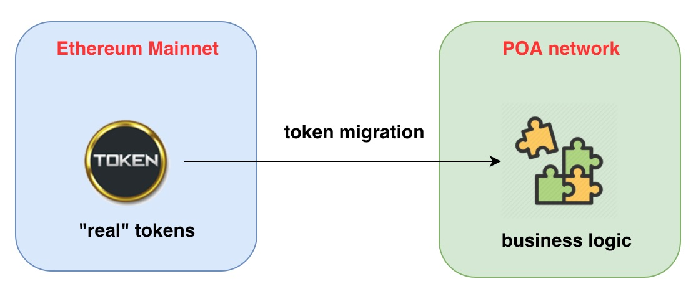

**Some factors to consider:**

1. one-way migration or two-way transfer?
2. old tokens will be burnt or not?
3. temporary or permanent supporting for migration?
4. migrate to the same blockchain network or a different one?
5. homogeneous migration (EVM <> EVM) or heterogeneous (EVM <> Native)?

**Criteria for Migration:**

1. Minimize chance of phishing of Ocean token holders.
2. Maximize security overall
3. Minimize technical effort to us. 
4. Ease of use for our users (e.g. we "pull" versus user "pushing"). 
5. Time constraints: any changes to token contract should be done before 04/01 and migration happens in the coming months.

In this research we aim to enumerate the possible ways to migrate "real" Ocean tokens from Ethereum mainnet to V1 Production Ocean POA network. In the end, we try to find the most suitable solution to fit Ocean's need and identify required changes to Ocean token contract.

## 2. Available Options

### 2.1 Exchanges

The easist migration approach for token holders is to let crypto exchange (e.g., Binance, Bittrex, etc.) to handle it. Users simply use the same username and password to login their accounts in the exchange. As such, the exchange fufills the migration work by collaborating with the Ocean team. 

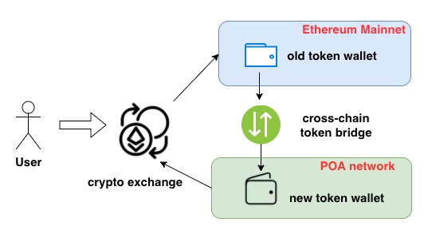

* **Pro**: very low entry barrier for regular token holders.
* **Con**: it may need high fee paid out to the exchange.
* **Limitation**: it needs support from selected exchanges.
* **Security**: neutral
	* users need to protect their username and password in the exchange;
	* exchange is able to work with team to roll back migration if any error happens;
	* there is less chance of phishing attack as users deal with exchanges directly;
	* the high risk: when exchange is hacked, all tokens in the wallet will be lost;
* **Effort**: 
	* users have no effort and no cost; 
	* Ocean team has to provide migration support (e.g., cross-chain token bridge and gas cost) to the exchange; 
	* exchange needs extra work to switch user wallet from Ethereum to POA network;


### Swap Partner

Similar to Exchanges, **Swap Partners** can help users to accomplish the token migration. [`CoinSwitch`](https://coinswitch.co/) & [`Changelly`](https://changelly.com/) are swap partners that act as intermediaries between users and exchanges to facilitate the migration process. Swap services will perform a **one-to-one** swap for old ERC-20 tokens and the new token with no additional fees.

Here is workflow of [`Changelly`](https://changelly.com/) Swap Service. 
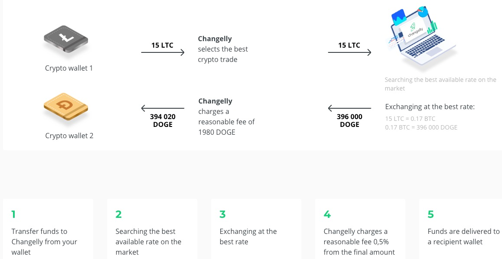

When the same service is provided between old token and new token, it can help users to migrate tokens from one blockchain network to the other. Example is [Kin Token Migration](https://coinswitch.co/kin-swap/). 

Users take less efforts to migrate tokens with Swap Partners, however, **they can get phished and lose all their tokens**.

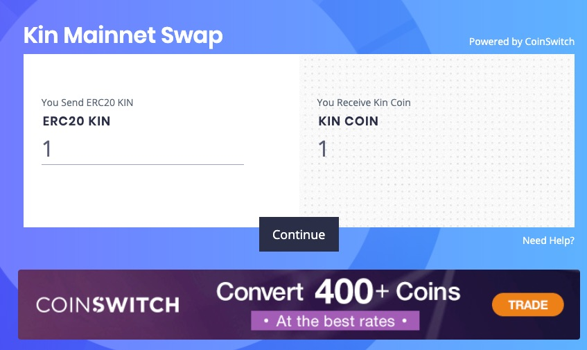

### 2.3 Uniswap

Uniswap is a decentralized exchange to swap tokens in the Ethereum network. Since both tokens are in the same blockchain, user can use **the same wallet** to hold both tokens. The on-chain smart contract of Uniswap will fulfill the exchange with low gas cost. 

Since Uniswap is limited to ONE single Ethereum network, it does not fit our situation for token migration.

The mechanism is illustrated as below:

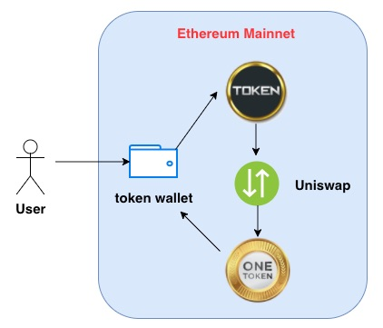

* **Pro**: straightforward for people to conduct two-way token exchagne on their own.
* **Con**: 
	* users need to operate wallet and transactions on their own.
	* native token (e.g., Ether) is needed to cover gas cost no matter which token pair is traded.
* **Security**: very high 
	* all swapping transactions happen on Ethereum mainnet.
	* user only need to take care of their private key to the wallet.
	* there is no chance of phishing attack as users interact with Ethereum network directly;
* **Limitation**: it is limited to Ethereum network and homogeneous (EVM<>EVM) swapping.
* **Effort**: users need very limited efforts to use it.

### 2.4 Token Bridge

Token Bridge is a **cross-chain** and **two-way** token transfer service, which moves a token from one blockchain network to the other. It deploys bridge contract on both networks and handle the token transfer transactions. The off-chain validators listen to the on-chain transaction event messages from one blockchain and trigger new transaction to the other.

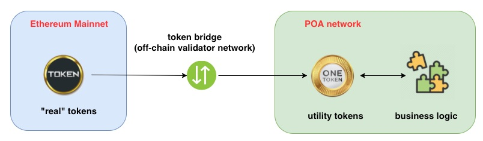
 
* **Pro**: 
	* it is very flexible to fit different demands, such as ERC20<>ERC20, ERC20<>Native token swap.
	* there is no change to the "real" token contract, which will be simply linked to bridge contract. 
	* users can use the **same** wallet for token swap if both are Ethereum based tokens.
* **Con**:
	* it needs off-chain validator network to function correctly;
	* it require users to pay for the gas cost for mining transaction on POA network;
* **Security**: low
	* the off-chain component could be attacked and generate malicious transactions;
	* user needs the URL link to access the token bridge, where they can be phished!
* **Limitation**:
	* currently, there are two solutions: Parity token bridge and POA token bridge;
	* token bridge requires both blockchain networks are Ethereum network (e.g., Mainnet, POA, etc.)
	* Parity token bridge can only handle Native <> ERC20 token swap;
	* POA token bridge can handle Native <> ERC20 and ERC20 <> ERC20 token swap.
* **Effort**:
	* user needs to migrate tokens through the token bridge UI;
	* user needs to switch network in their wallet (e.g., MetaMask) to find new tokens;
	* Ocean team needs more efforts to deploy bridge contract, off-chain validator network, and brige UI.

### 2.5 Mirror Copy

Mirror copy is an **one-way**, **1-to-1** approch to migrate tokens across blockchains. At a specified timestamp, the token contract fixes all tokens (non-transferable) and takes a "**snapshot**" of the token balance in the Ethereum network (i.e., token holder wallet address and corresponding ERC20 token balance). 

On the other blockchain network (e.g., POA network), the team will mint new tokens and credited to token holders in the "snapshot" so that they have the same token balance.

Note: the ERC20 token in the Ethereum network will be burnt after the migration to ensure the total supply never exceeds the cap limit.

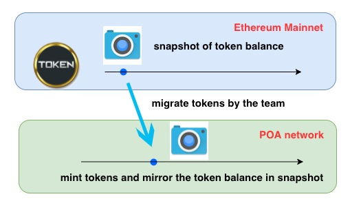

* **Pro**: 
	* users do not need to anything but simply switch to the new blockchain network. 
	* users can find the new tokens in the **same** wallet address if both are Ethereum network (i.e., Ethereum mainnet and Ethereum POA network).
* **Con**:
	* token holders must trust the team will correctly perform the migration;
	* all tokens become non-transferable during the migration;
	* with heterogeneous migration, users may lose their tokens if they do not have new wallets to receive the new tokens because Ethereum wallet cannot store them.
* **Security**: high
	* there is no action needed from the users, therefore, there is no chance of phishing attack;
	* all the token operations are internal to the team. The safety can be ensured with proper supervision (e.g., use multisig wallet to perform mirror copying).
* **Limitation**:
	* a migration period of time is needed to conduct the mirror copy. 
* **Effort**: limited
	* the "real" token contract must have `freeze`, `burn` and `getSnapShot` functions;
	* users only need to switch to the new blockchain network;

## 3. Case Study

### 3.1 Aeternity - using Token Bridge

**key points:**

* one-way, 1-to-1 migration from Ethereum to its own Aeternity network;
* use off-chain token bridge to migrate tokens to Aeternity network;
* old AE tokens on Ethereum will be burnt in the end;
* temporary migration supporting from the team and exchange;
* heterogeneous migration (Ethereum network -> Aeternity network)

Aeternity use "hard fork" to upgrade its protocol and each time it migrates partial Ethereum AE tokens to be the native tokens in its own network. [Document](https://blog.aeternity.com/be-part-of-æternitys-mainnet-launch-ae-token-migration-2a5d3e33ea64)

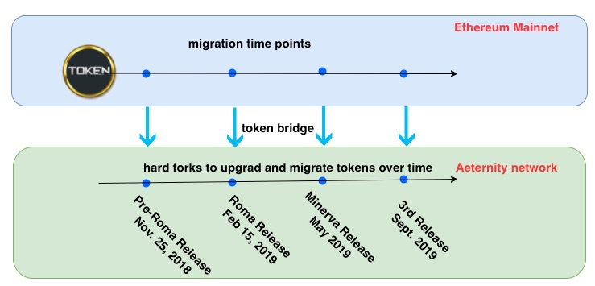

* **Pro**: easy for user to operate. Users only need to send tokens to the bridge contract;
* **Con**: user need to create a new wallet in the Aeternity network;
* **Security**: (**high risk**) users can be phished! Fake migration website misleads users to lose their tokens.

### 3.2 EOS - using Mirror Copy

**key points:**

* one-way, 1-to-1 migration from Ethereum to EOS network;
* users need to register their EOS wallet in advance;
* the team mints EOS tokens and credits users in the snapshot from Ethereum network;
* old ERC20 tokens on Ethereum will be destroyed in the end;
* temporary migration supporting from the team and exchange;
* heterogeneous migration (Ethereum network -> EOS network)

The EOS migration needs a `EOS token registration`, which asscoiates the wallet address in Ethereum mainnet with the (native) EOS wallet in the EOS network. This is required because EOS network is not compatible with Ethereum network, therefore, **users must create and register their EOS wallets** to receive tokens in EOS network.

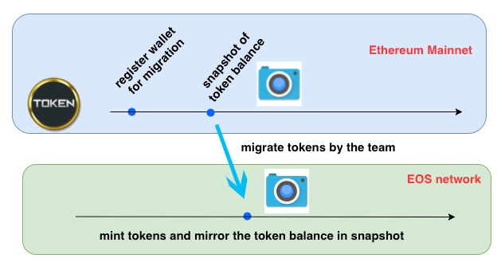

When the EOS mainnet is launched, it will go through the Ethereum blockchain looking for the Ethereum addresses that are registered and for each such Ethereum address, credit the appropriate number of EOS coins (with EOS coins distributed on a 1:1 to the EOS tokens at a registered Ethereum address) to the linked EOS address on the EOS blockchain. 

Once the EOS snapshot is taken, all (ERC-20) EOS tokens will be frozen on the Ethereum blockchain and you will no longer be able to send or exchange them.  

* **Pro**: users only need to register and do nothing else;
* **Con**: 
	* users need to trust EOS team in the migration process;
	* users may lose their tokens if they do not register EOS wallet in the registration period, because Ethereum wallet cannot hold EOS tokens.
* **Security**: (**low risk**) the migration process is controled by the EOS team. 

### 3.3 Melonport - using Uniswap-type Exchange

**key points:**

* one-way, 1-to-1 migration from old token contract to new token contract;
* a migration contract is deployed on Ethereum to fulfill the token migration;
* old ERC20 tokens will be destroyed in the end;
* permanent migration supporting due to on-chain smart contract exchange;
* homogeneous migration (the same Ethereum network)

The token migration of Melonport is relatively easier because everything happens on-chain in the same Ethereum network. It is actually **an upgrade of token contract**: it destroys the old token contract and credit holders with the same balance in the new token contract. Detailed instruction is [here](https://medium.com/melonport-blog/mln-token-migration-instructions-196a645fc3ac)

Several exchanges will help their members to complete the migration. However, if users need to perform migration on their own, the procedure is very technical and complicated, which is not suitable for non-technical people. The entry barrier is very high.

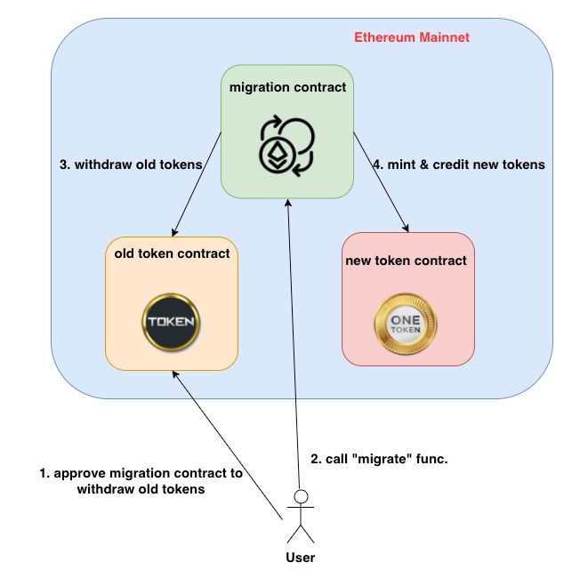

* **Pro**: decentralized way since users have full control over the migration;
* **Con**: users need more technical knowledge and skills to finish the migration on their own;
* **Security**: 
	* for technical users, this migration is very secure because all transactions happens in Ethereum mainnet;
	* for non-technical users, it is too complicated and they can make mistakes to lose tokens.

### 3.4 Cosmos - using Mirror-Copy type method

**key points:**

* one-way, 1-to-1 migration from Ethereum to Cosmos (or any Tendermint) chain;
* [`hard spoon`](https://blog.cosmos.network/introducing-the-hard-spoon-4a9288d3f0df) mints new tokens and credits users with the same Ethereum token balance;
* old ERC20 tokens on Ethereum will be intact in the end;
* heterogeneous migration (Ethereum network -> Tendermint network)

A `hard spoon` occurs when a new cryptocurrency is minted by replicating the account balances of an existing cryptocurrency. For example, a hard spoon of Ethereum is to take the account balances of existing Ethereum holders, replicate those values, and peg them within the `Ethermint VM zone`. Note that `Ethermint` is an implementation of the EVM that runs on top of tendermint consensus, a Proof of Stake system. This means that ETH holders will have their tokens replicated in this EVM zone within Ethermint.

**It is under development and `hard spoon` is not available right now.** It will not be in our consideration at this moment.

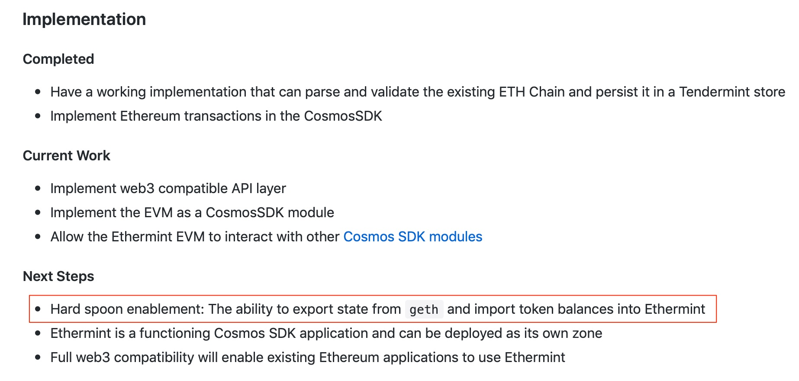

## 3. Recommended Solution

* **Consider our situation of token migration in Ocean**:

	* one-way and one-to-one migration from ERC20@Ethereum-mainnet to ERC20@POA-network;
	* old tokens shall be burnt to ensure that the total supply never exceeds 1.4 billion;
	* temporary supporting for migration;
	* migrate to different blockchain (Mainnet -> POA);
	* homogeneous migration between EVM and EVM (i.e., ERC20 <> ERC20)

* **Our objectives**:

	* minimize chance of phishing
	* maximize security 
	* minimize technical efforts to Ocean team
	* low cost to get exchange support
	* ease of use for users
	* time constraint

* The recommended solution is **Mirror Copy (or One-way 1:1 Mapping)**

	* **Step 1: Pause token transfer**
		* the token contract is controlled by a multisig wallet;
		* the multisig wallet should pause all token transfers at a pre-announced time;
	* **Step 2: Generate snapshot in Ethereum mainnet**
		* the multisig wallet retrieve the complete list of existing holders;
		* their token balance on Ethereum mainnet can be requested;
		* complete token holder list along with their token balances form the "snapshot";
	* **Step 3: Mint tokens in POA network**
		* the total amount of tokens to be migrated can be calculated from Step 2;
		* the owner of the new token contract on POA network can mint the same amount of new tokens;
		* initially those new tokens are kept in owner's wallet in POA network;
	* **Step 4: Distribute new tokens to users according to the snapshot**
		* leverage [token-distribution](https://github.com/oceanprotocol/token-distribution) to credit the same amount of new tokens to holders in the snapshot;
		* new token in POA network is distributed on a 1:1 to the old token in the Ethereum mainnet;
	* **Step 5: Appeal if there is any error**
		* after the migration period is closed, anyone can submit an appeal to Ocean if they are supposed to receive new tokens but have not (or token amount is not correct);
		* Ocean will look at the snapshot to verify the token amount and fix any error;
	* **Step 6: Kill old token contract to destroy all old tokens**
		* after the appeal period is closed, the old token contract in Ethereum mainnet will be killed and all tokens will be destroyed.
		* the entire migration process is complete at this moment.

	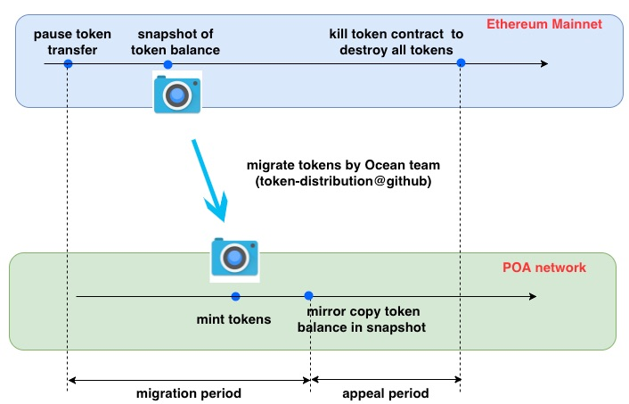

	* **Pro**：
		* users can use the **SAME** wallet to keep the tokens in both network (mainnet & POA);
		* users have almost zero effort;
		* the effort demand for Ocean technical team is very limited (in fact, the existing [token distribution procedure](https://github.com/oceanprotocol/token-distribution) can be leveraged for the token migration purpose)；
		* it requires no support from the exchange;
	* **Con**:
		* tokens will be fixed and cannot be transferred during the migration process;
		* token holders need to trust the Ocean team in the migration;
	* **Security**:
		* Ocean team controls the migration process and ensures the security;
		* the chance of phishing attack is very low since users do not need to migrate on their own.
		* all old tokens are enforced to be migrated and destroyed after, therefore, no token will be lost;
	
<!--* **Optional: Token Bridge for Exchange**:
	* old token contract needs no change for this;
	* exchange is more familiar with token bridge and has adequate technical knowledge;
	* exchange is more cautious and less likely to get phished;
	* exchange can process some migration work and reduce the workload for Mirror Copy;
	* exchange needs very limited effort and cost in the migration:
		* use the **SAME** wallet to keep the new tokens in POA network;
		* exchange need to switch to POA network;
		* add new token contract address in the wallet to find new tokens.
	
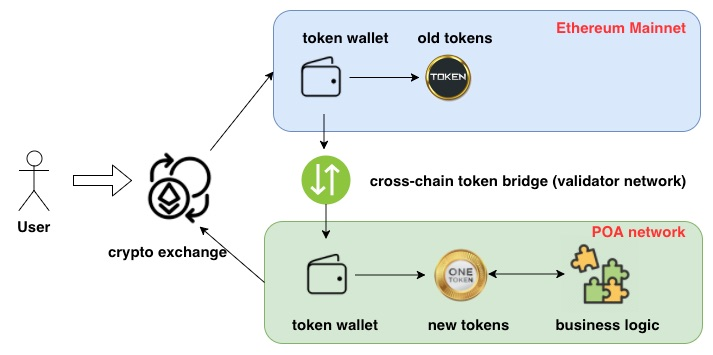-->

## 4. Token Contract Changes

To enable Mirror Copy, existing Ocean token contract need some extra functions:

* **list all token holder addresses to build a snapshot** - (need to add)
	* it can loop through all holders and return the list of all token holders;
	* it will render out-of-gas error when the size of token holders is huge (e.g., millions of holders);

* **pause the token transfer in the contract** - (need to add)
	* inherit the 'Pausable.sol' contract to enable the `whenNotPaused` modifier;

* **kill the contract to destroy all old tokens** - (already exists)
	* it should be invoked by the owner (e.g., multisig wallet) only.


An example of the modified token contract including new functions is shown in the below. The [source file](token-contract/contracts/OceanToken.sol) locates in `token-contract/contracts` directory. More unit/integrated testing are needed to verify the functionality and contract behavior.

```solidity
pragma solidity 0.5.3;

import 'openzeppelin-solidity/contracts/token/ERC20/ERC20Capped.sol';
import 'openzeppelin-solidity/contracts/token/ERC20/ERC20Detailed.sol';
import 'openzeppelin-solidity/contracts/token/ERC20/ERC20Pausable.sol';
import 'openzeppelin-solidity/contracts/ownership/Ownable.sol';


/**
 * @title Ocean Protocol ERC20 Token Contract
 * @author Ocean Protocol Team
 *
 * @dev Implementation of the Ocean Token.
 */
contract OceanToken is Ownable, ERC20Pausable, ERC20Detailed, ERC20Capped {

	using SafeMath for uint256;

	uint256 CAP = 1410000000;
	uint256 TOTALSUPPLY = CAP.mul(10 ** 18);

  	// maintain the list of token holders
  	mapping (address => bool) public accountExist;
  	address[] public accountList;

	/**
	* @dev OceanToken constructor
	*      Runs only on initial contract creation.
	* @param _owner refers to the owner of the contract
	*/
	constructor(
		address _owner
	)
		public
		ERC20Detailed('OceanToken', 'OCEAN', 18)
		ERC20Capped(TOTALSUPPLY)
		Ownable()
	{
		// add owner as minter
		addMinter(_owner);
		// renounce msg.sender as minter
		renounceMinter();
		// transfer the ownership to the owner
		transferOwnership(_owner);
    		// add owner to the account list
    		accountList.push(_owner);
    		accountExist[_owner] = true;
	}

    	// Pausable Transfer Functions
    	/**
     	* @dev Transfer tokens when not paused
     	**/
    	function transfer(address _to, uint256 _value) public whenNotPaused returns (bool) {
        	// add receiver into the account list if he/she is not in the list
        	if( accountExist[_to] == false ){
          		accountList.push(_to);
          		accountExist[_to] = true;
        	}
        	return super.transfer(_to, _value);
    	}

    	/**
     	* @dev transferFrom function to tansfer tokens when token is not paused
     	**/
    	function transferFrom(address _from, address _to, uint256 _value) public whenNotPaused returns (bool) {
        	// add receiver into the account list if he/she is not in the list
        	if( accountExist[_to] == false ){
         	 accountList.push(_to);
          	accountExist[_to] = true;
       		}
        	return super.transferFrom(_from, _to, _value);
    	}

    	// retrieve the list of token holders (each time retrieve partial from the list to avoid out-of-gas error)
    	function getAccountList(uint256 begin, uint256 end) public view onlyOwner returns (address[] memory) {
        	// check input parameters are in the range
        	require( (begin >= 0 && end < accountList.length), 'input parameter is not valide');
        	address[] memory v = new address[](end.sub(begin).add(1));
        	for (uint256 i = begin; i < end; i++) {
            		// skip accounts whose balance is zero
            		if(super.balanceOf(accountList[i]) > 0){
              			v[i] = accountList[i];
            		}
        	}
        	return v;
    	}

    	// kill the contract and destroy all tokens
  	function kill()
  		public
  		onlyOwner
  	{
  		selfdestruct(address(uint160(owner())));
  	}

  	function()
  		external payable
  	{
  		revert();
  	}
}
```

## License

```
Copyright 2018 Ocean Protocol Foundation

Licensed under the Apache License, Version 2.0 (the "License");
you may not use this file except in compliance with the License.
You may obtain a copy of the License at

   http://www.apache.org/licenses/LICENSE-2.0

Unless required by applicable law or agreed to in writing, software
distributed under the License is distributed on an "AS IS" BASIS,
WITHOUT WARRANTIES OR CONDITIONS OF ANY KIND, either express or implied.
See the License for the specific language governing permissions and
limitations under the License.
```

