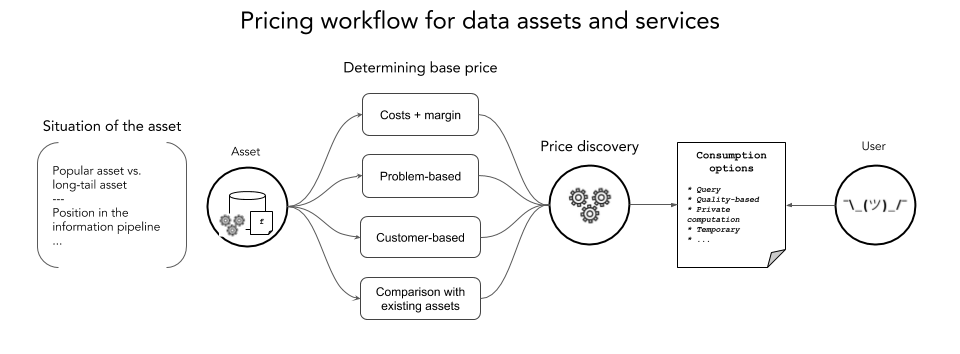

[](https://oceanprotocol.com)

# Data pricing and value flows within an efficient data market

```
name: development of a data pricing framework
type: research
status: initial draft
editor: Erwin Kuhn <erwin@oceanprotocol.com>
date: 04/10/2019
```
<!-- markdown-toc start - Don't edit this section. Run M-x markdown-toc-generate-toc again -->
**Table of Contents**

- [1. Introduction](#1-introduction)
- [2. Challenges of pricing information goods](#2-challenges-of-pricing-information-goods)
	- [2.1 Basic problem](#21-basic-problem)
	- [2.2 Additional challenges](#22-additional-challenges)
- [3. Enabling price discovery for information goods](#3-enabling-price-discovery-for-information-goods)
	- [3.1 License tokens](#31-license-tokens)
	- [3.2 Open design choices](#32-open-design-choices)
	- [3.3 Open problems](#33-open-problems)
- [4. Estimating an initial price](#4-estimating-an-initial-price)
- [5. Additional mechanisms](#5-additional-mechanisms)
	- [5.1 Query-based data pricing](#51-query-based-data-pricing)
	- [5.2 Quality-based pricing (Name Your Own Price)](#52-quality-based-pricing-name-your-own-price)
	- [5.3 Pricing personal data based on loss of privacy](#53-pricing-personal-data-based-on-loss-of-privacy)
	- [5.4 Utility-based and generally optimal models](#54-utility-based-and-generally-optimal-models)
	- [5.5 Auction models](#55-auction-models)

<!-- markdown-toc end -->


## 1. Introduction



Multiple mechanisms for data pricing have been introduced in the academic literature and existing data marketplaces, but none of them allows for scalable price discovery within a data market. Most papers also assume an initial price for a data asset from which flexible pricing options are derived.

This research issue aims to introduce a framework for determining the base price of a data asset or service as it is put on the market, as well as a token design that enables a free market for trading around information assets and services. This construction offers both price discovery for information goods through market forces and an easy way to express the pricing of different options related to an asset or service.

Pricing methods such as query- or quality-based pricing are included here as additional options for a buyer to consume an asset or service.

**Note:** the "price" of an asset here refers to the market price at which one can buy from the owner the right to access it for a given purpose. For example, the price of a license to issue queries or run some algorithm on a dataset for a period T. This is different from owning the asset, which gives one the right to issue licences and collect cash flows related to the asset. The value of the ownership of a data asset will be covered in a future document.


## 2. Challenges of pricing information goods

### 2.1 Basic problem

-   Information goods have different economic properties: **non-rival** and **non-excludable** in the case of data commons
-   **No real existing data market:** it's currently hard to estimate the actual value of most data assets
-   **We can't "let the market take care of it":** the Myerson-Satterthwaite theorem (which basically says "negotiation is hard") implies that the assymetric information bargaining problem cannot be solved efficiently by any mechanism, and will only get worse as the demand for a data asset increases. Simply put, since data is non-rival, you either end up negotiating with every single buyer or sell at often very inefficient prices.
-   Even worse: in the case of data markets, we generally have **experienced buyers** (organizations or individuals w/ data science skills) and **inexperienced sellers** (organizations with data they think is interesting but without any idea about the potential value)
-   **Current solutions in data marketplaces:**
    -   Put up your data asset for a fixed price and adapt according to market feedback. Same thing applies to subscriptions like "get access to datafeed X for T time".
    -   Problem-based pricing: put up a bounty to solve a problem or provide you with the best dataset that fulfills some criteria. This is interesting and we'll come back to it.
-   **In practice:** existing private data marketplaces suffer from **seller paralysis**, where many interested businesses simply don't engage because pricing their data requires too much effort.

### 2.2 Additional challenges

-   **Long-tail markets:** the real force of data markets will be their long tail of assets. Even if on average very few people use a given data asset, having the possibility to search through all of them and aggregate them is extremely interesting. This also means that there is a need to provide good price discovery and liquidity mechanisms to those long-tail assets.
-   **Incentivizing data commons:** ideally, we also want our pricing mechanisms to enable value to flow back to the data commons based on the value they create for the world
-   **Flexible pricing:** imagine you find the gigantic dataset of an air freight company, which details everything that is up travelling in the air at any given moment, its origin and destination. It's very likely that if you're interested in this information, you don't need all of it - only some part of it, like a specific type of good like jewellry. Being able to issue queries against this dataset and have them priced dynamically would enable much more flexibility in the market and likely lead to increased liquidity and demand.


## 3. Enabling price discovery for information goods

### 3.1 License tokens

*[Open to suggestions for a better name]*

The basic idea is that adding some friction to the trading of data assets can bring us right back in the scenario of a market for a private good, where price discovery can happen through the forces of supply and demand, arbitrage and speculation. In order for this to happen, to each data asset we associate a "license token" in which every service regarding that data asset will be priced. These license tokens are then private goods, individually both exclusive and rival, and we can let the market drive price discovery. 

Since we need both an **issuance mechanism** and a **market maker** to provide liquidity, especially in the case of long-tail assets, bonding curves are a natural candidate to fulfill both roles.

In that scenario, each asset D would have an **associated bonding curve** that issues license tokens AD, in which different services regarding that asset would be priced. These tokens are both **fungible** and **divisible**. For example, full access to a dataset could be 1 AD, a specific query 0.3 AD; access for 1 month 1 AD and access for 1 week 0.25 AD; running different computations on a dataset could be priced accordingly. Services around the dataset D are priced relatively to one another and price discovery only needs to happen on the license token AD for all of them to acquire a real-world value.

The construction aims to enable great flexibility through easier pricing of services related to the same asset and the possibility of bundling different license tokens together to sell as a curated package to an interested buyer. For example, a scientist interested in testing out a new model of evolution of a disease X could receive a bundle of license tokens from a curator service to train his model on data from a wide diversity of hospitals.

### 3.2 Open design choices

-   **Incentives for price discovery:** in the simplest design, the only incentive for traders to buy or sell some license token AD and participate in price discovery is a purely **speculative incentive**, hoping to sell at a higher price than one bought. Adding fees to transactions / the consumption of a service or a bid/ask spread into the bonding curve could serve to additionally **subsidize price discovery** by redistributing this value to the current holders of the license token, including the speculators.
-   **Consumption:** what does it mean to consume a license token to receive a service? The simplest version would be a transfer of a certain amount X of license tokens to the owner and let her sell those into the bonding curve to collect profits. Additional mechanisms could include: burning part of the X tokens, which would provide a floor to the bonding curve higher than the initial price and effectively redistributing value; the mechanisms mentioned above to subsidize price discovery.
-   **Choice of the bonding curve:** this is equivalent to determining what invariant is wanted. It should be based on some desired property of the mathematical function. Existing designs include a constant reserve ratio (Bancor model), sigmoid functions, rule-based functions (X% increase in price for an Y% increased in the outstanding supply), etc&#x2026;

**References for the choice of a bonding curve function:** 

-   [On Single Bonding Curves for Token Models](https://medium.com/thoughtchains/on-single-bonding-curves-for-continuous-token-models-a167f5ffef89) - Wilson Lau
-   [Bonding Curves In Depth: Intuition & Parametrization](https://blog.relevant.community/bonding-curves-in-depth-intuition-parametrization-d3905a681e0a) - Slava Balasanov
-   [How to Make Bonding Curves for Continuous Token Models](https://blog.relevant.community/how-to-make-bonding-curves-for-continuous-token-models-3784653f8b17) - Slava Balasonov [includes an example of a dynamic bonding curve based on inflation]

### 3.3 Open problems

**Short-selling on bonding curves** 

*see [Fang's series of blog posts](https://blog.oceanprotocol.com/enabling-short-selling-in-bonding-curves-part-1-af871ad75d40).*
*see [Short Selling without Counterparty using Bonding Curve](https://medium.com/bandprotocol/short-selling-without-counterparty-using-bonding-curve-c499e35c3dc2) by Sorawit Suriyakarn*

The design is still unfinished, as it is currently open to attacks of triggering liquidations through downsliding and problems of overcrowded markets, but having this additional mechanism in the bonding curves toolbox would enable more efficient markets around them. Especially by creating additional sell pressure aside from holders wanting to collect profits, it is likely to enable much mor efficient price discovery for the construction detailed above.

[TODO: See if these problems still apply in the no-counterparty design linked above]

**Rigidity of price evolution and other market makers** 

One of the main concerns with bonding curves is the rigidity it imposes on price evolution, since it must follow a pre-defined function. Other market makers are possible, including the Uniswap design or an [equilibrium bonding market](https://blog.oceanprotocol.com/introducing-the-equilibrium-bonding-market-e7db528e0eff) (EBM). 

The Uniswap design is problematic in our case since for the issuance of any license token, a corresponding amount of OCN tokens would have to be locked in. Ideally, we want to distinguish the lock-up of capital and the issuance of these license tokens used for trading and price discovery.

The EBM design is especially interesting in the flexibility of price evolution it offers, akin to a regular market with bid/ask orders. However, in the original EBM design, the supply is determined at the beginning and all the tokens are sold in an initial fixed-price stage. Supply stays constant after that. Although it could be possible to inject further supply through ongoing auctions selling X tokens every day, the issuance schedule is always predetermined.

On the other hand, bonding curves always offer the same price for a given outstanding supply, but tokens can be created anytime they're needed, as long as a buyer is willing to pay the price. This is helpful for both long-tail assets that see very little liquidity, and for assets that suddenly see a surge in popularity.

More generally, it seems likely that any market-making design relevant here will see a tradeoff: predetermined issuance schedule vs. predetermined price evolution relative to oustanding supply. **Flexibility of issuance vs. flexibility of price evolution.**

One last point to consider is the mental load imposed by the use of a given mechanism. An EBM requires its participants to keep track of the market to set an appropriate sell price for their tokens. Conversely, the rigidity of a bonding curve might actually become an advantage, especially in these early days of data markets, by **lowering mental costs around how the price of assets should evolve.**


## 4. Estimating an initial price

Even if we have a good price discovery mechanism, we need to set a reasonable initial price. Markets are not completely efficient, and having a decent idea of what the price might be at the beginning would ensure much faster convergence on the optimal price.

This is especially important when relying on a bonding curve mechanism. If someone puts up a dataset that could be worth $10,000 for $10, you'd need to invest a lot in the bonding curve to bridge the gap. The likely result is that the price will go up, but not enough, and the owner will not get the full compensation she could strive for. In addition to that, if the initial price is set too high, neither a bonding curve market maker or an equilibrium bonding market can go below it. The owner will have to instantiate a new contract to lower the price.

Here are some possible solutions for deriving a reasonable initial price for a given data asset:

-   **Cost + margin:** the most simple way is to estimate the cost of the work needed to produce the asset, add a margin on top and set this as the price. This is well-suited to assets that were purposefully produced, and likely harder to apply to assets obtained as a side product of another activity. Can be expressed as `production_cost * 1/k * m` with `k` the expected number of sales and `m > 1` the margin factor **[Should be a good approach to establish an initial price]**
-   **Endpoint pricing:** it's much easier to determine how much a solution to a problem is worth to a buyer than to price raw data that will go through multiples transformations down the road. This can take the form of a direct evaluation (**customer-based**) or bounties / prizes (**problem-based**)
-   **Existing valuation frameworks:** for some types of data, it should already possible to rely on previous transactions between companies or established valuation frameworks (for consulting companies or acquisitions & mergers) to derive a price. **[Need more insight into this part]**


## 5. Additional mechanisms [WIP]

### 5.1 Query-based data pricing

**References:**

- [Query-Based Data Pricing](papers/QueryPricing_Koutris15.pdf) - Koutris et al., 2015
- [Pricing Aggregate Queries in a Data Marketplace](papers/PricingAggregateQueries_LiMiklau2012.pdf) - Li, Miklau 2012

### 5.2 Quality-based pricing (Name Your Own Price)

Can be on one criteria or multiple ones, with an adjustable distribution of discounts (solvable as a kind of multiple-choice knapsack problem)

**References**

- [Fair Knapsack Pricing for Data Marketplaces](papers/KnapsackPricingData_Stahl2016.pdf) - Stahl et al., 2016 (relational data)
- [A Framework for Sampling-Based XML Data Pricing](papers/XMLDataPricing_Tang2016.pdf) - Tang et al., 2016 (tree-structured data, like in XML)

For ML models:
- [Model-based Pricing for Machine Learning in a Data Marketplace](papers/MLpricing_Koutris2018.pdf) - Koutris et al., 2018

### 5.3 Pricing personal data based on loss of privacy

**References:**

- [How to Balance Privacy and Money through Pricing Mechanism in Personal Data Market](papers/PersonalDataPricing_NgetCao2018.pdf) - Nget, Cao et al., 2018
  (quantifying both privacy and quality loss)
- [A Theory of Pricing Private Data](papers/PricingPrivateData_LiMiklau2012.pdf) - Li, Miklau et al., 2012

### 5.4 Utility-based and generally optimal models
- [Market Model and Optimal Pricing Scheme of BigData and Internet of Things (IoT)](papers/UtilityOptimalDataPricing_Niyato2016.pdf) - Niyato et al., 2016
- [Pricing for Data Markets](PricingDataMarkets_Kushal2012.pdf) - Kushal et al., 2012

### 5.5 Auction models

[WIP] 


