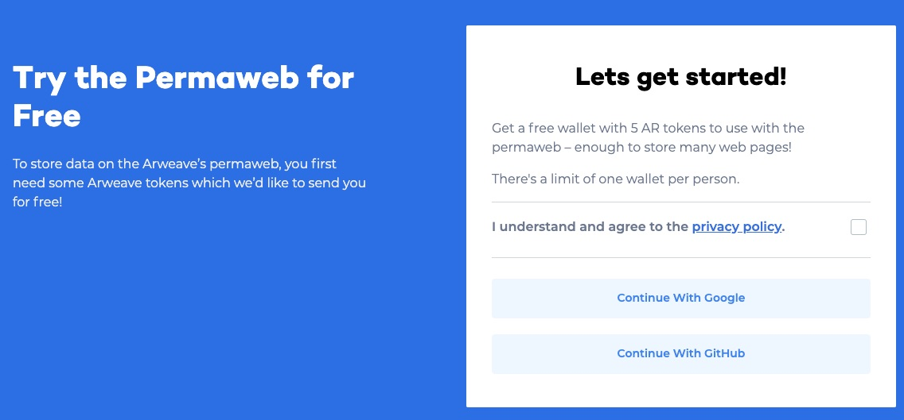
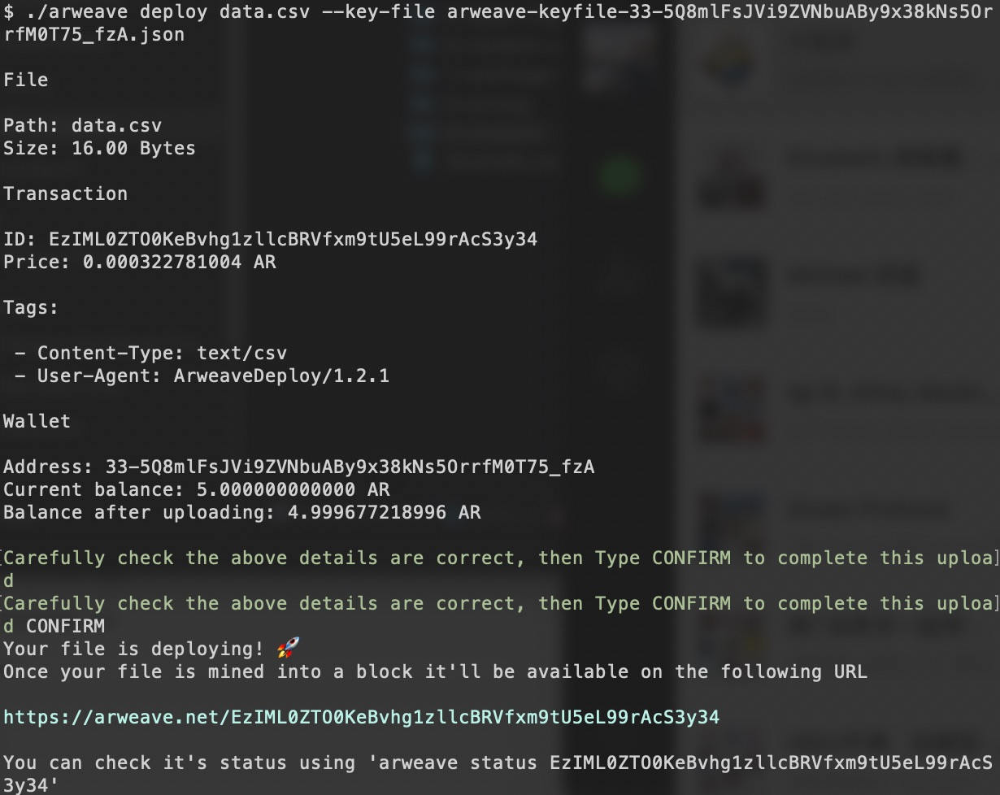
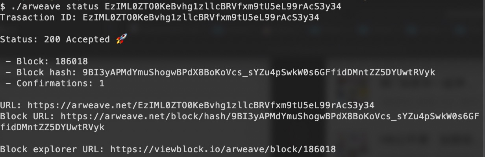
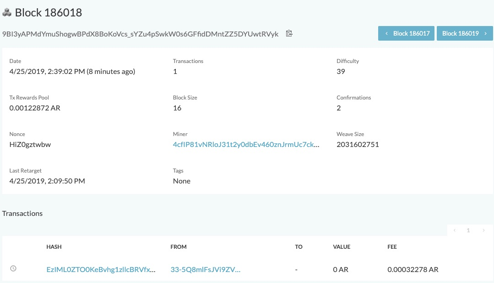
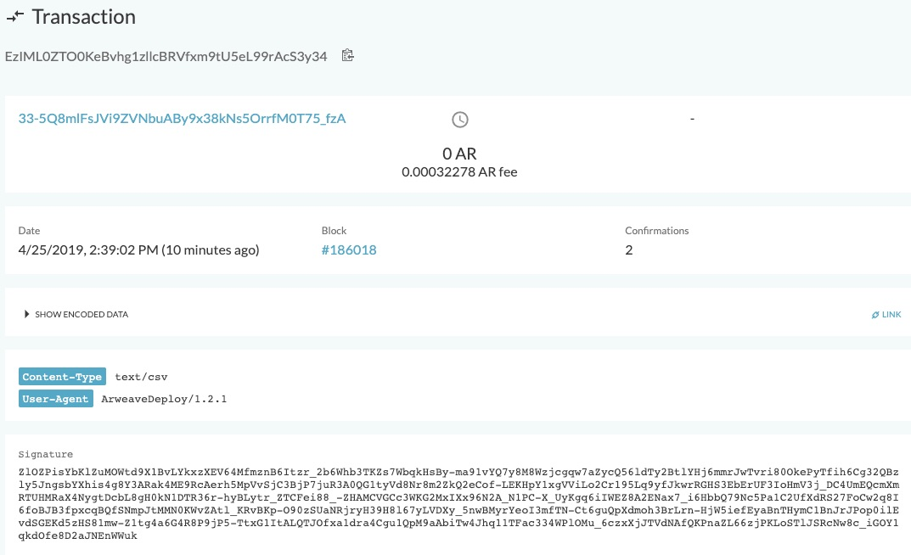
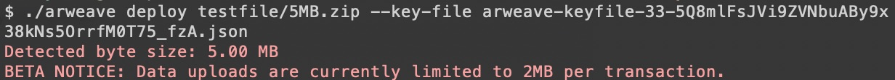
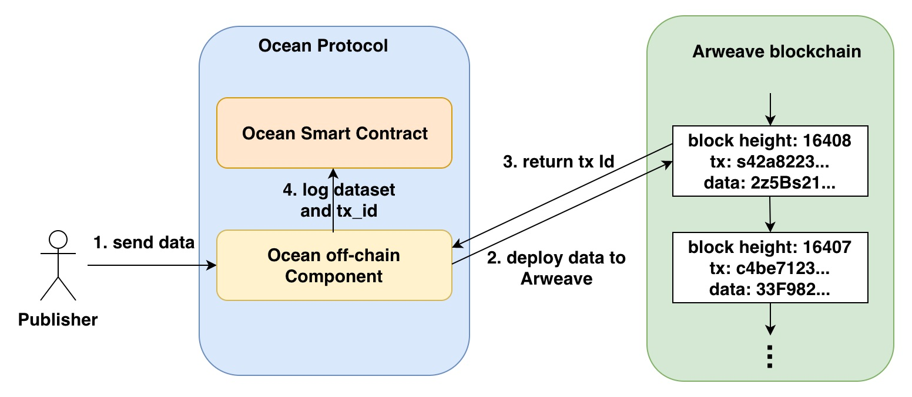
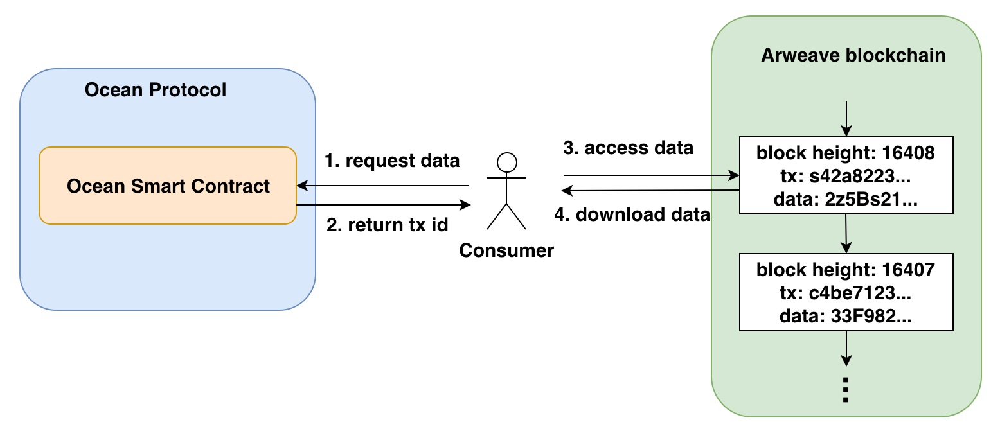

[](https://oceanprotocol.com)

#  ARWeave Investigation

```
name: research on ARWeave.
type: research
status: initial draft
editor: Fang Gong <fang@oceanprotocol.com>
date: 04/25/2019
```

# 1. Introduction

[Arweave](https://www.arweave.org/) is a new blockchain network that provides scalable on-chain storage in a cost-efficient way. We investigate Arweave in this research to explore whether it can be leveraged to store dataset and provide data availability proof. 

**Observation Highlights about Arweave**:

* Arweave mines raw data into a new block to provide on-chain storage, which takes **~5 minutes** or longer;
* Arweave has a **2MB limit** on the size of data that can be stored in a single block;
* Deploying data into Arweave blocks needs to pay AR tokens as the fee;

In general, Arweave is designed to host web apps & pages permanently (i.e., ["permaweb"](https://www.arweave.org/)) and accomplish serverless web hosting. It works better with small-size data that needs to be stored on-chain for permanent access. 

Therefore, Arweave is suitable for **data commons marketplace with small-size dataset** (i.e., web pages, numerical data, metadata, small AI problem that is smaller than the limit set by Arweave). Since Arweave stores data effectively on-chain, it solves the data availability immediately and allows us to build a small but useful product. 

The initial Ocean product would be:

* super trustworthy data availability, but less scale (arweave)
* less trustworthy data availability, but better scale (azure, aws)

The research on web2 cloud provider is complementary to the solution using Arweave.

# 2. Deploy Data File to Arweave

## 2.1 install arweave deploy toolkit

The recommended approach is to use `npm` with Node v10.12.0:

```
$ npm install -g arweave-deploy
```

Alternatively, the pre-compiled binary files are available for downloaded:

* [linux](https://github.com/ArweaveTeam/arweave-deploy/raw/latest/dist/linux/arweave)
* [macos](https://github.com/ArweaveTeam/arweave-deploy/raw/latest/dist/macos/arweave)

The file `arweave` in current directory is the MacOS version used in this research.

## 2.2 create an account

To access arweave network, an account funded with AR tokens is required. Note that AR token is the native token circulated in Arweave network.

Try to create a new account from the [official page](https://tokens.arweave.org/#/wallet)



The Json file of the wallet account will be generated and downloaded. Example wallet file is `arweave-keyfile-33-5Q8mlFsJVi9ZVNbuABy9x38kNs5OrrfM0T75_fzA.json` shown in the current directory. It contains RSA key information as below:

```
{"kty":"RSA","ext":true,"e":"AQAB","n":"swxKGMjVn60I6A9bJMcw8viuDxgL80aj3hJ4lLosN1MDNNVF-2K1H32pM3mrfXJqTgKXy5A3gCQ_LoDg6h-QFydxVu7xAlYYe0PCWiXqagErWawEVmZREjQPXuiUXA5V57HCJShjzPiZVyeauJg_XmYyJo7Auh_gOvhv3f-yh5g-BacIGMgvJYTbLb2MUTTmVGbsLWCn4u-P0bM0d2J2HHUK0srkeoGl5iSt8k1zZ5lWjSPB0bL8KPTybDLpPmPcDKypODwXOmI6U0pE81F9YQRPEqB5aDTOVgPazJBStS19QXA0GjRolzsM05SPpL1GffogvI6qOw8WCDguw-a2MwDcf7c3YXrW0YD8al7bhV6g7LLxMmcPhutXdxIkkzBy9nEFCS_jGvzltIIHcXDuCa0bZ9Fg-rIhg2nkWuoMVfYco23nL7OqAXZq_-7apMhxs47b06ewmyxnntZ75KY0OIdxRbvWIyXnC8W_gJArZNlgEdaNn_Z_TXfVLNtuy2bBFl7OmSasyBFK83LmYaEgzufPXi-x8SkOqWv4BfNp2_PHpUXQ2HTJcmKK48lsDxGvkfBuVcNPbvqeyTyUeTJNibFDXN2OCD84fUPGD49fTII5FYEMcvxRzjETW5J3oBrMmdahzplsdEZBzz3R3dVwwznuLq6NvrbF5eduMmdGn4E","d":"PTgOfbrtj9MSIIZfm4uf6POuT-rg6yVUEjIumGuvgpsXlZD2hKWTWFkW6UrIn_Pm9RVd4XRGBcJe9_-I54QzODd8QUUhkrLtW_gnE7uzEtujft2Z_hCt15OFTeYoE_Gy3a2hvCK7PPIjO_GGrWchA53dt-FHdFxBxuf7F-S9ni8nxbb-xbpspF9wsYsF1x5HQsSOLFXIEYfnnMOxRMCdsc0zDi_hPyHlH3ObJiXlN57uQQPg2VphbX-TA_vEVFjAfHTsxxWEu6mqV6AlQyyxueJHRw8nc8Haav6WaStPnDMZiK5cojkZKdw-3nkFREaTO6-yUcZV3iuiVN0g4EqaMPNAaAsB83Vp8E3b-e0qfXMTo26wdTdYNDsYfnvG0YnjV0NDjqI2LYmHBfN1DumgouH0eFTxgaRqNSn3J6Vj4JnFNGwcf1bGe1J2p4amKJzL3_b7ks4f5n9qsthGrYF__nu1SrlXYAUcDS3vt62wPR8wZb-o2i0vUKcgTzM8j1srLcbP7GTZOco5JiQq05cr6vmwDo7nt0p8hkS77UvFnHR6puhUI14_APsGsxq4-uIGfVPPMWjE2RKJ_g__NzWrqV7ZyrUT4o1iAIjXsgKLEOLwy9QDj5ehqC5pCPJ5kn26XRa-yglz4BbPXV9fWP24j4-oyXlUTfghcb2uGH8lbgE","p":"6UjvSUTFkQdhpnzqlXTBNi4WZlwkwspUIN8FSWjunWHdkxjqwKoSBCY_3o1EuEoRu06yx9sDTri_vnyYXmxeEFKVN101D-ZSWQHh0DORBuAYZIhkcgUrs3K7trN6lgU6SM1E_VbmAMCYQfbIL9TB4V-OQ8vu8ark9n3rA3cK0iU7TFZBdbnMmgz3EeoB9l_uuw799nOKm16d0cuAJubLN9gBkgYVBYVCt9oKVsyng7JbI1szsABgtDW7f2PZSGQJhdMAWqX7kqbrdOHfmts9AnG0BYaQRnxBZ5GhK7fP9YgT12ZciADHKmAoRe8E1ZxtnkgigPda30WdAlhZO39veQ","q":"xHtl5DD1Za54FNnkZo1OMZNkHnloN6FI3vsH_X_PKCtQiv53wPeZMqQK9OBrbxJqKOs1ERaSJTdNFNOuHLirD32rTr-WzEcWYakp2Wamx0aEAm_Wjx2JQQI0hiEAlxzOODMll6E4-ycn_8Cc_LfCJCyxdBBFYHuYmOj2IJWnoex0xwDZ96AaC0UcToNG4DnEmcCOTIxKYNwuUX0zupCuRt48TKmix2-zEieYFVonXEEJiKiwSbWUubeOT3RbrTFB5n2BLI2pxOtYGta4M23-tH68LwgVZggArSj9ciUdSq8933k4ZPr3qEWXcgdPe2EGF02nnk3UZBMi-b4hCisGSQ","dp":"fJFgjNw3LvklEJS1YrckkLzNYz0iuAz4HVFZblikyc8_VNPCTrzBwAt4oWsH3exXSZB9cLCnNHr8kEfRyOHO3KJsYVLZCbNwF20k2lsevvActloKYMQYEMtcJvPxqngCJmvNwgWL7azp4JdZUAkouiKfQd58qfkaJ_EW9BO16H7PCjUo4SckdMIlkCBHifqx7JrVy6rowYwlc6hZtuwYaapjNEkhIoCFHs1EJhNEA9PSTK_fisS43qGujBiSJtCcMSR5lO36xtVw90nBb9xP2KVEforbMXgaKKafzEtrtW1DQwq6sDjSIPOVrboy96l-8z0Lh5gNoxl1_JGWnGmw6Q","dq":"gogEShQog5PkHN4g-ex4fUERK5m2nfadZd3aEhSd-G7GRIEH5__WHCmVSdfqJ9FRC7wu9hpLn0PdBrAWpOgeZN01OMzZjv7PJLRwpAipVgxH2SKZpVyW-cRQRqeYL8woSHfaSqEGLPx3e1ZoNRCTftreTWAd5xpVZ4ilM0KZKl7fufGb3QHVK5WPV62pIX_fV9Hv93TgWPcOIn8OJazGyzgLUVcFWH-htLbvN4g8S_K9Nbfz3hQvKS6D8c84tJfb0xegAIxgs_0x_CqYFzrFEv57YLd7F9zLLj7kGbgEfMBtV5C94YBFldod4dhvemUb2dFyQR4tswpvmwEwDARHWQ","qi":"vMF_oaqte6A-mw_bHSRPXeffPOlzsh-CAGpD3s_aHsXkaeZRzhOzWbtt__AZhCTF4YXsRvVzii-0nE4tvJoO2GZSbm7eydOfrH7HI7K9ClNEiklQHuhgEewEo0b_FQrOpoPQNMIlB1Te8RnzxCp--E2DBDmPeaulPiga4M-2aVmZwTVb7reqsvO6e3axnrQ8fvXfs07742KGxyFGFC0hAtu4nq2-0evj8FcwesuYQuMlX7ffy_-BH8nqQ1cr7bIOKA8dTDbNbbn-UfyK93X8W1l-tz8hbOUFu2AcQGDui460TKVdtfaaJpTxsrzF-nBRv5tS2IWZ0GLdwQXHszky8w"}
```

## 2.3 deploy dataset file into Arweave network

As an experiment, a simple dataset file is created as `data.csv`. 

Now we will store the dataset file `data.csv` into the Arweave network:

```
$ arweave deploy data.csv --key-file arweave-keyfile-33-5Q8mlFsJVi9ZVNbuABy9x38kNs5OrrfM0T75_fzA.json
```

Add the `--package` flag to the deploy command if the file has references to external files.

```
$ arweave deploy index.html --package
```

In our experiment, the output shall be similar to this:



The most important information is the `tx ID` that is `EzIML0ZTO0KeBvhg1zllcBRVfxm9tU5eL99rAcS3y34`

The tx status can be checked with command `$ arweave status` as:



In my test, it takes **5 minutes** to mine the data file into a block. The block information can be reviewed with [https://viewblock.io/arweave/block/186018](https://viewblock.io/arweave/block/186018)



This block only contains one transaction from my test as:



Since now on, the data file can be accessed with URL:

```
https://arweave.net/EzIML0ZTO0KeBvhg1zllcBRVfxm9tU5eL99rAcS3y34
```

## 2.4 Size Limit on Data

I experimented to upload large-size dataset files such as 5MB, 10MB, ... and found Arweave currently enforce a 2MB limit to data file per transaction:



# 3. Access Data via HTTP

When data is mined into blocks, ARweave network provides HTTP API to access those data. Requests and queries can be sent to any Arweave node directly using their IP address, for example [http://159.65.213.43:1984/info](http://159.65.213.43:1984/info).

The complete API list can be found in the official page [http-api](https://docs.arweave.org/developers/server/http-api). 

## 3.1 get transaction by ID

```
$ curl --request GET --url 'http://159.65.213.43:1984/tx/EzIML0ZTO0KeBvhg1zllcBRVfxm9tU5eL99rAcS3y34' 
{"id":"EzIML0ZTO0KeBvhg1zllcBRVfxm9tU5eL99rAcS3y34","last_tx":"","owner":"swxKGMjVn60I6A9bJMcw8viuDxgL80aj3hJ4lLosN1MDNNVF-2K1H32pM3mrfXJqTgKXy5A3gCQ_LoDg6h-QFydxVu7xAlYYe0PCWiXqagErWawEVmZREjQPXuiUXA5V57HCJShjzPiZVyeauJg_XmYyJo7Auh_gOvhv3f-yh5g-BacIGMgvJYTbLb2MUTTmVGbsLWCn4u-P0bM0d2J2HHUK0srkeoGl5iSt8k1zZ5lWjSPB0bL8KPTybDLpPmPcDKypODwXOmI6U0pE81F9YQRPEqB5aDTOVgPazJBStS19QXA0GjRolzsM05SPpL1GffogvI6qOw8WCDguw-a2MwDcf7c3YXrW0YD8al7bhV6g7LLxMmcPhutXdxIkkzBy9nEFCS_jGvzltIIHcXDuCa0bZ9Fg-rIhg2nkWuoMVfYco23nL7OqAXZq_-7apMhxs47b06ewmyxnntZ75KY0OIdxRbvWIyXnC8W_gJArZNlgEdaNn_Z_TXfVLNtuy2bBFl7OmSasyBFK83LmYaEgzufPXi-x8SkOqWv4BfNp2_PHpUXQ2HTJcmKK48lsDxGvkfBuVcNPbvqeyTyUeTJNibFDXN2OCD84fUPGD49fTII5FYEMcvxRzjETW5J3oBrMmdahzplsdEZBzz3R3dVwwznuLq6NvrbF5eduMmdGn4E","tags":[{"name":"Q29udGVudC1UeXBl","value":"dGV4dC9jc3Y"},{"name":"VXNlci1BZ2VudA","value":"QXJ3ZWF2ZURlcGxveS8xLjIuMQ"}],"target":"","quantity":"0","data":"cGFyaXMsYmVybGluLHNmCg","reward":"322781004","signature":"ZlOZPisYbKlZuMOWtd9X1BvLYkxzXEV64MfmznB6Itzr_2b6Whb3TKZs7WbqkHsBy-ma91vYQ7y8M8Wzjcgqw7aZycQ56ldTy2BtlYHj6mmrJwTvri80OkePyTfih6Cg32QBzly5JngsbYXhis4g8Y3ARak4ME9RcAerh5MpVvSjC3BjP7juR3A0QG1tyVd8Nr8m2ZkQ2eCof-LEKHpY1xgVViLo2Cr195Lq9yfJkwrRGHS3EbErUF3IoHmV3j_DC4UmEQcmXmRTUHMRaX4NygtDcbL8gH0kN1DTR36r-hyBLytr_ZTCFei88_-ZHAMCVGCc3WKG2MxIXx96N2A_N1PC-X_UyKgq6iIWEZ8A2ENax7_i6HbbQ79Nc5Pa1C2UfXdRS27FoCw2q8I6foBJB3fpxcqBQfSNmpJtMMN0KWvZAtl_KRvBKp-O90zSUaNRjryH39H8l67yLVDXy_5nwBMyrYeoI3mfTN-Ct6guQpXdmoh3BrLrn-HjW5iefEyaBnTHymC1BnJrJPop0ilEvdSGEKd5zHS81mw-Z1tg4a6G4R8P9jP5-TtxG1ItALQTJOfxa1dra4Cgu1QpM9aAbiTw4Jhq11TFac334WPlOMu_6czxXjJTVdNAfQKPnaZL66zjPKLoSTlJSRcNw8c_iGOY1qkdOfe8D2aJNEnWWuk"}
```

## 3.2 get data in the transaction

We can use HTTP API to access the raw base64 decoded data deployed in one tx:

```
$ curl --request GET --url 'http://159.65.213.43:1984/tx/EzIML0ZTO0KeBvhg1zllcBRVfxm9tU5eL99rAcS3y34/data.csv' 
paris,berlin,sf
```

Here, the strings `paris,berlin,sf` is the data in the file `data.csv`.

# 4. Workflow Design

## 4.1 Publish Dataset 

* **Step 1: (Submit Data)** When user publishes new open dataset, he can send data to the off-chain component of Ocean network, which will ensure the size of dataset is smaller than the limit. 

* **Step 2: (Pay for Storage)** User may need to pay Ocean tokens to Keeper contract so that the Ocean off-chain component can pay AR tokens to Arweave blockchain for the storage. Note that AR token is the native tokens to Arweave blockchain and is not compatible with Ethereum. Ocean off-chain component will hold the AR token wallet and pay for the Arweave transactions. 

* **Step 3: (Store Data to Arweave)** The off-chain component initiates the deploy transaction to store the dataset into a new block of Arweave blockchain. When the tx is successfully finished, it returns the transaction Id, which can uniquely identify the data in that transaction. 

* **Step 4: (Log Tx Id in Ocean Keeper)** The unique transaction Id will be logged in smart contract inside Ocean keeper contract for future data access.




## 4.2 Request Dataset

* **Step 1: (Request Tx Id)** When user requests the dataset, he can send a request to Ocean smart contract to retrieve the Arweave transaction Id that stores the dataset to Arweave. 

* **Step 2: (Download Dataset from Arweave)** Ocean smart contract will lookup the dataset record and return the tx Id. As such, the raw dataset can be downloaded through HTTP (i.e., https://arweave.net/{tx_id}).

Since the dataset is stored on-chain in Arweave blockchain, its availability is guaranteed and can be independently verified, which helps Ocean network distribute token rewards to data providers properly and reduces the chance of fraudulence.



# 5. Conclusion

Arweave provides an on-chain storage solution for permanent web hosting, which aims to accomplish serverless web. The raw data is encoded with base64 method and mined into the blocks. It has 2MB limit on data size per transaction. So it is more suitable to deploy small-size web pages or apps into the Arweave blockchain network.

Ocean can store small-size dataset into blocks of Arweave blockchain, which guarantees the data availability and provides permanent storage. In particular, this solution works for data commons marketplace with small-size datasets. 

Moreover,  we can extend the solution to more scalable scenarios: publisher can upload larger size dataset to Ocean, where Ocean splits it into small pieces (each piece has size < 2MB). As such, Ocean can deploy these pieces to Arweave blocks in different transactions. When user request the data, they download all these piece from different blocks in ARweave and recover the original raw dataset. 


# 6. Reference

* [arweave website](https://www.arweave.org/)
* [arweave deploy user guide](https://docs.arweave.org/developers/tools/arweave-deploy)
* [arweave light paper](https://www.arweave.org/files/arweave-lightpaper.pdf)